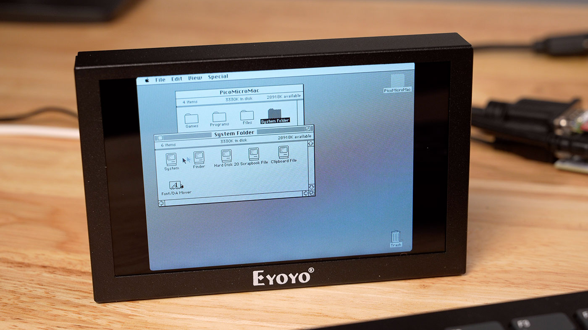
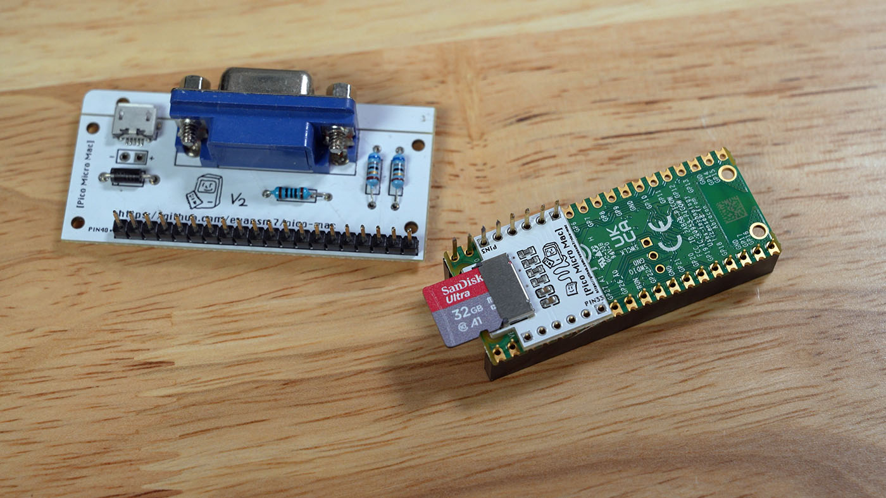
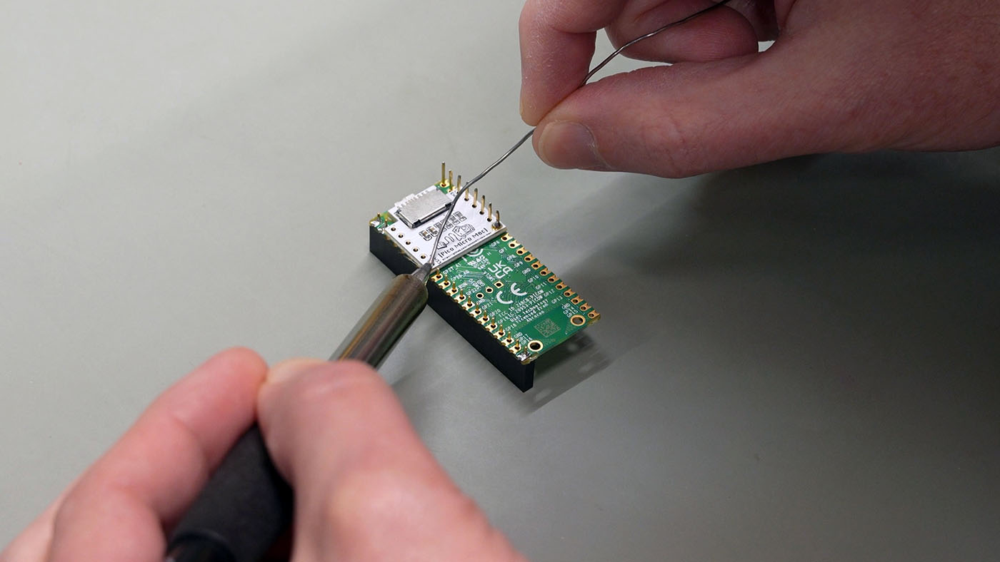
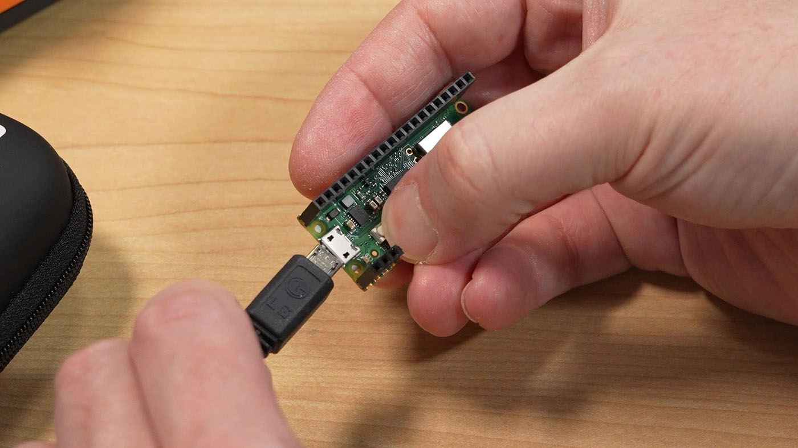
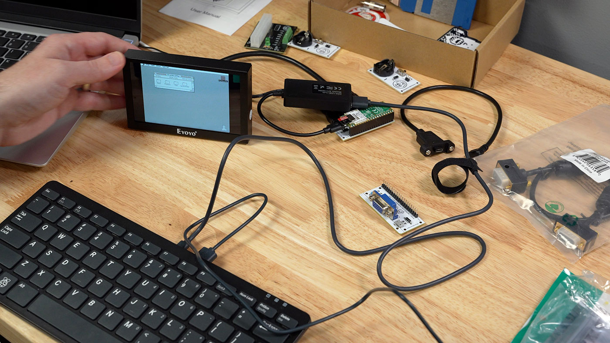
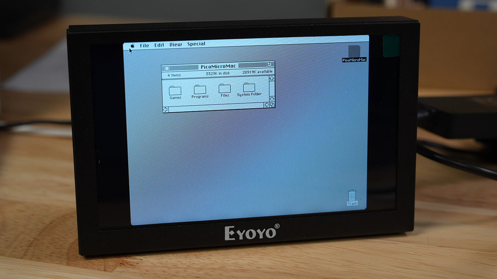

# 迷你 Macintosh：用 Raspberry Pi Pico 打造的微型电脑

> **原文**：[I built a pint-sized Macintosh](https://www.jeffgeerling.com/blog/2026/pint-sized-macintosh-pico-micro-mac/)  
> **作者**：Jeff Geerling  
> **翻译**：OpenClaw Assistant  
> **日期**：2026 年 3 月 4 日

---

为了拉开 [MARCHintosh](https://marchintosh.com) 的序幕，我用 Raspberry Pi Pico 打造了这台袖珍 Macintosh：

这并非我的原创设计——我只是组装了零件，运行 Matt Evans 开发的 [Pico Micro Mac](https://github.com/evansm7/pico-mac) 固件到 Raspberry Pi Pico（搭载 RP2040 芯片）上。

我搭建的版本输出 640x480 分辨率的 VGA 显示，刷新率 60 Hz，并支持插入 USB 键盘和鼠标。

由于原版 Pico 的 RAM 相当有限，这个配置最多提供 208 KB 内存——比原版 1984 年发布的 Macintosh '128K' 多了 63%！

## 硬件清单

受到 [Ron's Computer Videos](https://www.youtube.com/watch?v=G3bW4f5Gn4o) 和 [Action Retro](https://www.youtube.com/watch?v=jYOTAGBqoW0) 的启发，我大约两年前就购买了所有零件：

- [JCM - PicoMicroMac (v3) 硬件](https://jcm-1.com/product/picomicromac/)（我买的是已停产的 v2 版）
- PicoMicroMac microSD 卡适配器（已停产）
- [Eyoyo 5 英寸 VGA 显示器](https://amzn.to/4cOULz9)
- [1 英尺 VGA 线缆](https://amzn.to/4bdaaIq)
- [Micro USB 转 USB OTG 转接线](https://amzn.to/3OGeXt9)

和大多数项目一样，这些零件在盒子里躺了足够久，以至于现在有了让搭建更简单的新版本！Ron（Ron's Computer Videos 的作者）设计了 [V3 版本](https://jcm-1.com/product/picomicromac/) 的 Pico Micro Mac 适配器，让设置变得更容易：

- 将 microSD 卡适配器直接集成到主板上（不再需要 precarious 地焊在排针顶部的微型 SD 卡 HAT）
- 有两排母头排针，可以直接购买 [Pico WH](https://www.adafruit.com/product/5525)（带排针版本）插上去——无需焊接！

由于我几年前买的是 V2 版本，在刷入 Macintosh ROM 和 OS 镜像之前需要做些焊接工作：

如果你想查看完整设置，以及我在 System 5.3（"Mac OS"命名之前！）上尝试游戏和应用的一些视频，可以观看下面的视频：

<video src="https://www.jeffgeerling.com/blog/2026/pint-sized-macintosh-pico-micro-mac/pico-mac-demo.mp4" controls></video>

如果你只想了解如何完成 Pico Micro Mac 的设置（任何版本，包括 v3），请继续阅读！

## Pico 设置（在 Pi Pico 上运行 Mac OS）

你可以在组装所有硬件之前或之后设置 Pico，只需用 micro USB 线缆将其插入电脑即可。

首先，你需要一个 .uf2 文件来刷写 Pico。这是基于 [pico-mac](https://github.com/evansm7/pico-mac) 的固件，可以运行早期版本的 Mac OS，并包含所有必要的系统文件来启动和显示 VGA。

在我这种情况下，由于我使用 microSD Card HAT，我直接从 [PicoMicroMac UF2 Creator](https://picomac.bluescsi.com) 页面下载了 [适用于带 SD Card Hat 的 Pico 固件（208K + VGA 分辨率）](https://retro.bluescsi.com/pico-umac-208k-sd-vga.uf2)。

将 UF2 刷入 Pico 的步骤：

1. 按住 Pico 上的 'BOOT' 按钮，同时通过 micro USB 接口将其插入电脑
2. 驱动器挂载后，将下载的 .uf2 文件直接复制到驱动器的根目录
3. 复制完成后，Raspberry Pi Pico 会自动重启并从电脑卸载。现在可以安全断开连接了。

如果像我一样，你也使用 microSD Card HAT，还需要从 [PicoMicroMac UF2 Creator](https://picomac.bluescsi.com) 页面的 "PicoMicroMac with SD Hat" 部分复制 umac0.img 文件。

将 microSD 卡格式化为 FAT32（我用 Raspberry Pi Imager 完成），然后将 umac0.img 文件直接复制到驱动器的根目录。Pico Micro Mac 固件会在启动期间挂载这个磁盘。

## 连接所有部件

启动 Pico Mac：

1. 将 VGA 显示器插入 VGA 端口
2. 将 micro USB 转 USB-A 适配器或集线器插入 Pico 的 micro USB 端口，然后将键盘（最好是带内置集线器的键盘）和鼠标插入适配器
3. 将 micro USB 电源线插入 PicoMicroMac 板的 micro USB 端口

假设你正确组装了一切并且 Pico 已刷写，它应该会启动，显示 "Welcome to Macintosh" 欢迎屏幕，然后进入 Mac OS 桌面。

## 使用说明

这个配置最大的限制可能是 Pico 的 SRAM，只允许最多 208 KB 的 RAM 分配给 Mac OS。

Matt Evans（GitHub 上的 evansm7）已经在 RP2350 上做了一些工作，[实现了更多内存——在一次运行 System 7.5.5 的测试中达到 4MB！](https://github.com/evansm7/pico-mac/issues/7)。但该功能仍处于实验阶段，目前只有少数人在 RP2350 上测试。

如果你使用 UF2 Creator 页面提供的示例镜像，提供的应用都应该在 208 KB 可用 RAM 内运行。

但如果你想运行更大的应用，或者专为后期 Mac（如 512K 或 Mac Plus）构建的游戏，它们很可能会报内存不足。

Action Retro 尝试运行 [2 In a Mac](https://archive.org/details/2InaMac)，但也抱怨没有足够的 RAM 来模拟 Apple II。

声音功能也不工作——参见 [这个问题](https://github.com/evansm7/pico-mac/issues/23)，我们短期内可能看不到 AppleTalk、SCSI 和打印机支持等更专业的功能。

## 总结

早期的 Macintosh 电脑功能非常有限——尽管售价高达 2,495 美元（考虑通货膨胀，今天几乎是 8,000 美元）。

Pico Micro Mac 更加有限……但考虑到这个配置只花了我大约 20 美元（相当于 1984 年的 5 美元左右！），你还能期待什么呢？

实际上，这个设置主要用于学习和新奇体验。

---

## 相关链接

- [Pico Micro Mac 项目](https://github.com/evansm7/pico-mac)
- [PicoMicroMac UF2 Creator](https://picomac.bluescsi.com)
- [JCM PicoMicroMac v3](https://jcm-1.com/product/picomicromac/)
- [MARCHintosh](https://marchintosh.com)
- [原文：I built a pint-sized Macintosh - Jeff Geerling](https://www.jeffgeerling.com/blog/2026/pint-sized-macintosh-pico-micro-mac/)

---

**标签**：#RaspberryPi #Pico #Macintosh #复古计算 #DIY #嵌入式系统
