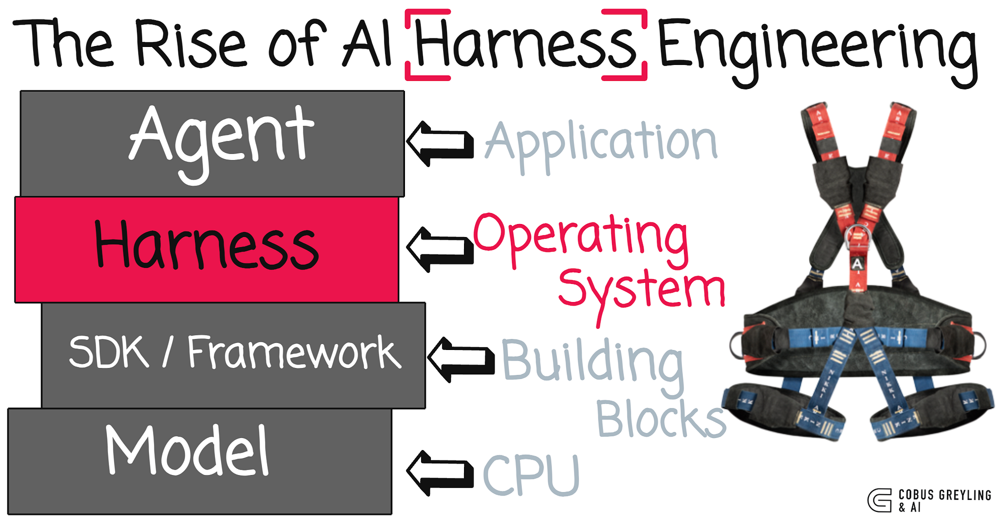
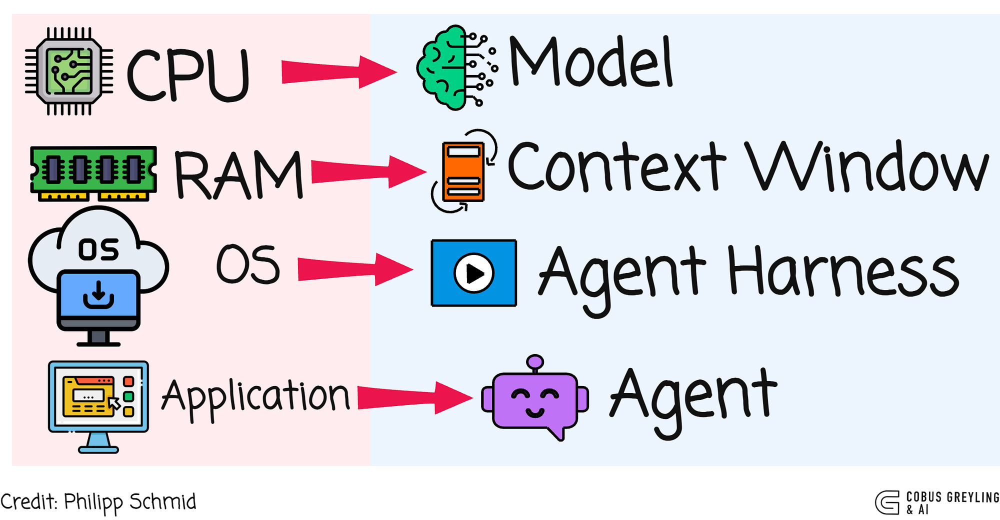
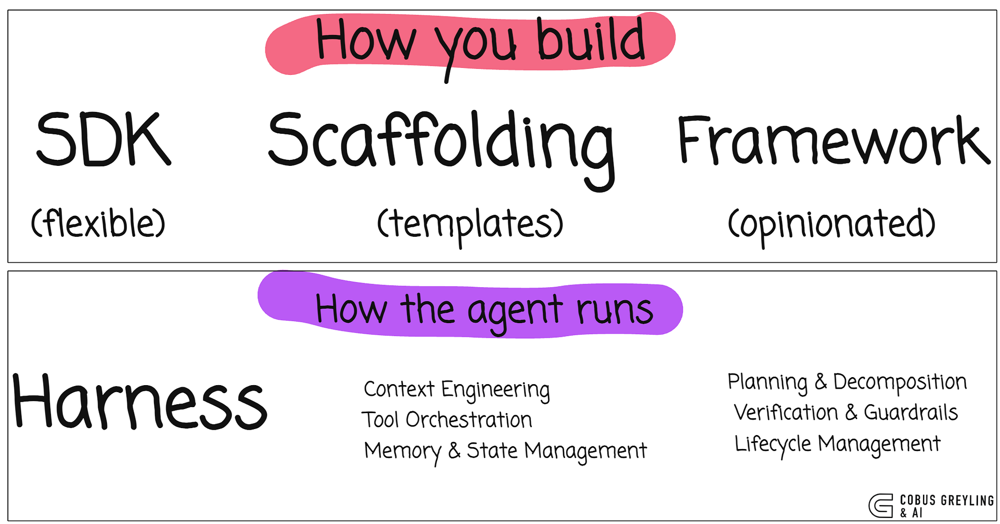
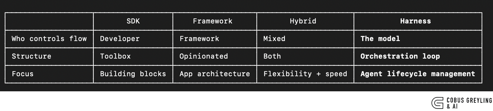
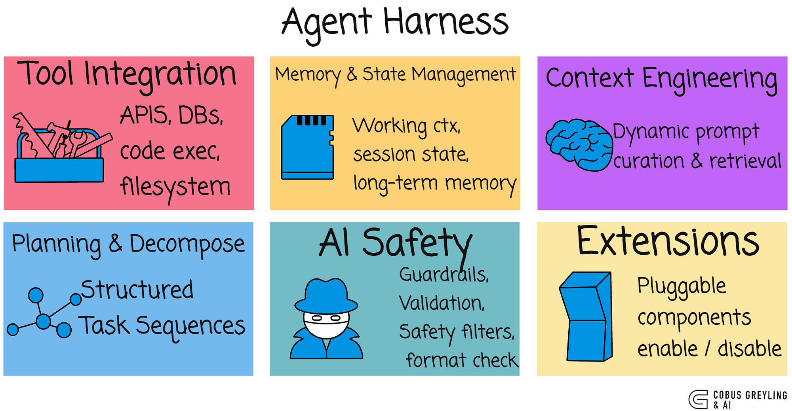
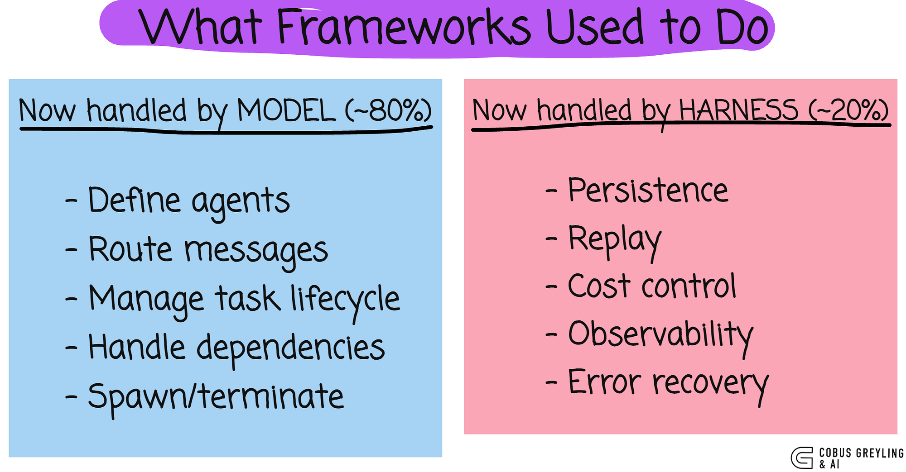
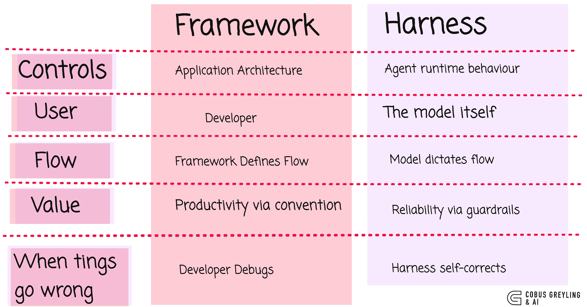

# AI Harness Engineering 的崛起

**原文**：[The Rise of AI Harness Engineering](https://cobusgreyling.substack.com/p/the-rise-of-ai-harness-engineering) by Cobus Greyling  
**翻译**：AI Agent 助手  
**日期**：2026 年 3 月 29 日

---

我曾写过关于构建 AI Agents 的三种架构方法：[SDKs、Frameworks 和 Scaffolding](https://cobusgreyling.substack.com/p/architecting-agentic-ai-how-sdks)。  
每一种都位于 [灵活性与结构性](https://cobusgreyling.substack.com/p/architecting-agentic-ai-sdks-vs-frameworks) 光谱的不同位置。

2026 年出现了一种凌驾于这三者之上的第四种模式。它被称为 **Harness**。

[OpenAI](https://openai.com/index/harness-engineering/) 和 [Anthropic](https://www.anthropic.com/engineering/effective-harnesses-for-long-running-agents) 现在都在正式使用这个术语。  
[Martin Fowler](https://martinfowler.com/articles/exploring-gen-ai/harness-engineering.html) 已经撰文讨论过它。一篇 [arXiv 论文](https://arxiv.org/abs/2603.05344) 将其形式化。

这不是一个流行词，而是决定 AI Agents 是否能在生产环境中真正运行的缺失架构层。

**Harness Engineering 是决定 AI Agents 是否能在生产环境中真正运行的缺失架构层。**

Harness 不是 Agent 本身。  
它是管理 Agent 如何运行的软件系统。  
它管理整个生命周期……工具、记忆、重试、人工审批、上下文工程、子 Agent……让模型可以专注于推理。

[Philipp Schmid](https://www.philschmid.de/agent-harness-2026) 用计算机类比做出了最好的解释……

- **模型** 是原始处理能力
- **上下文窗口** 是有限的工作内存
- **Harness** 是操作系统……管理上下文、初始化序列和标准工具驱动
- **Agent** 是在其上运行的应用程序

我之前介绍过构建 AI Agents 的 [三种架构方法](https://cobusgreyling.substack.com/p/architecting-agentic-ai-how-sdks)。  
以下是 Harness 与每种方法的关系。

SDK、Scaffolding 和 Framework 回答的问题是"如何构建 AI Agent"。  
Harness 回答的是一个完全不同的问题："Agent 如何运行"。

你可以使用三种方法中的任何一种来构建 Harness。Harness 不是它们的替代品，而是一个更上层的架构。

[parallel.ai](https://parallel.ai/articles/what-is-an-agent-harness) 团队识别出六个核心组件……

这与 [OpenAI](https://openai.com/index/harness-engineering/) 和 [Anthropic](https://www.anthropic.com/engineering/effective-harnesses-for-long-running-agents) 发布的内容一致。

| 组件 | 说明 |
|------|------|
| **Tool Integration** | 通过定义的协议将模型连接到外部 API、数据库、代码执行环境和自定义工具 |
| **Memory Management** | 多层记忆（工作上下文、会话状态、长期记忆），持久化超越单个上下文窗口。 [Anthropic 的方法](https://www.anthropic.com/engineering/effective-harnesses-for-long-running-agents) 使用 progress files 和 git history 来桥接会话 |
| **Context Engineering** | 动态策划每次模型调用中出现的信息。 不是静态的 prompt 模板，而是基于当前任务状态的主动上下文选择 |
| **Task Decomposition** | 通过结构化任务序列引导模型，而不是试图在一次传递中完成所有事情 |
| **Guardrails & Validation** | 验证检查、格式验证、安全过滤器。自纠正循环。 当 Agent 遇到困难时，Harness 将其视为识别缺失内容的信号 |
| **Modular Architecture** | 可独立启用、禁用或替换的可插拔组件 |

---

## 实际案例

**Claude Code 是一个 Harness。**  
它读取整个代码库，管理文件系统访问，生成子 Agent，处理工具编排，维护跨会话记忆，并实现防护栏。  
开发者专注于任务，Harness 管理其他一切。

**[OpenAI Codex](https://openai.com/index/harness-engineering)** 使用 Harness Engineering。  
他们的团队构建了超过 100 万行代码库，完全没有手动编写代码，将 Harness 作为主要接口。  
当 Agent 遇到困难时，他们将改进反馈回仓库。上下文工程、架构约束和定期清理 Agent 构成了核心。

**[OpenAI 的 CUA Sample App](https://github.com/openai/openai-cua-sample-app)** 是用于计算机使用的 Harness。  
Runner 管理 screenshot → actions → verify → repeat 循环。  
模型决定做什么，Harness 安全地执行它。

---

## 框架层的消失与分裂

在我最近关于 [框架层消失](https://cobusgreyling.substack.com/p/when-the-ai-framework-layer-disappears) 的文章中，我认为模型正在吸收传统上由多 Agent 框架处理的能力。

Agent 定义、消息路由、任务生命周期、依赖管理、生成 worker……开发者使用框架的约 80% 的功能，现在模型可以原生处理。

剩余的 20%：持久化、确定性重放、成本控制、可观测性、错误恢复——这正是 Harness 提供的。

框架层不仅仅在消失，它正在分裂。**智能进入模型，基础设施进入 Harness。**

| 维度 | Framework | Harness |
|------|-----------|---------|
| **目标** | 告诉开发者如何构建应用 | 告诉 Agent 如何安全运行 |
| **编排逻辑** | 开发者编写 | 模型制定计划，Harness 保持正轨 |
| **关注点** | 应用结构 | 安全操作 |

---

## 对当今团队的启示

对于今天构建 AI Agents 的团队来说，问题正在转变。  
不再是"我们应该使用哪个框架？"而是"我们的 Harness 是什么样子的？"

**Harness 决定 Agent 成功或失败。**

优秀的 Harness 管理人工审批、文件系统访问、工具编排、子 Agent、prompts 和生命周期——最小化干预但防止灾难性故障。

**从简单开始：**
1. 构建强大的原子工具
2. 让模型制定计划
3. 添加防护栏、重试和验证

这就是 Harness Engineering。

---

## 实现模式

**Markdown/Prompt Harness**（如 Anthropic 的 CLAUDE.md skills）将编排指令直接嵌入系统 prompt 或结构化 Markdown 文件中。  
LLM 本身成为循环控制器——它读取 Harness 规则并遵循它们。  
当 LLM 足够强大能够自我指导，并且你希望快速迭代而无需代码更改时，这是最佳选择。

---

**关于作者**  
Cobus Greyling 是 [Kore.ai](https://blog.kore.ai/cobus-greyling/) 的首席 AI 布道师，热衷于探索 AI 与语言的交叉领域。从 Language Models、AI Agents 到 Agentic Applications、开发框架和数据中心生产力工具，他分享关于这些技术如何塑造未来的见解和想法。

**原文链接**：https://cobusgreyling.substack.com/p/the-rise-of-ai-harness-engineering

---

*本文经授权翻译，保留所有原始链接和图片来源。*
