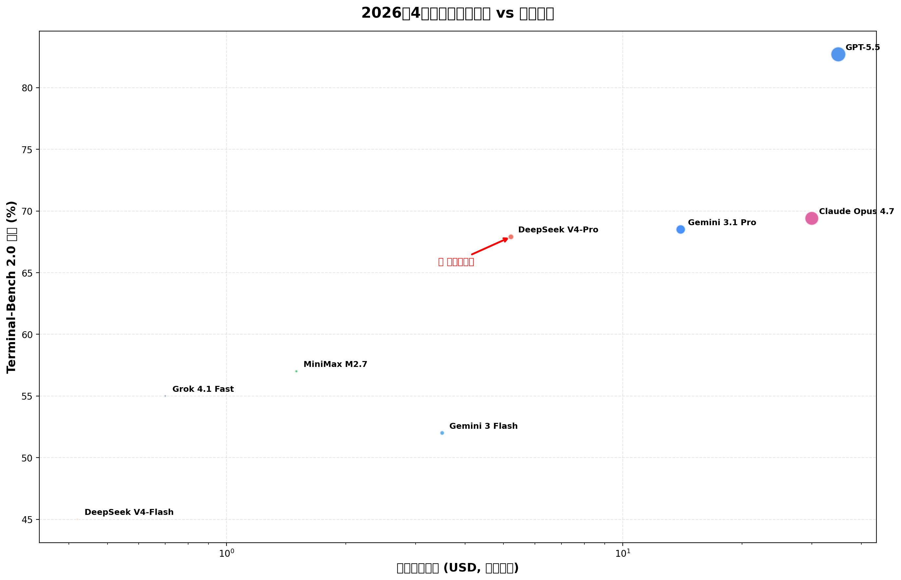
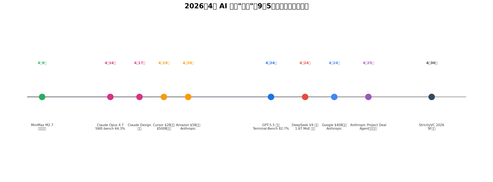
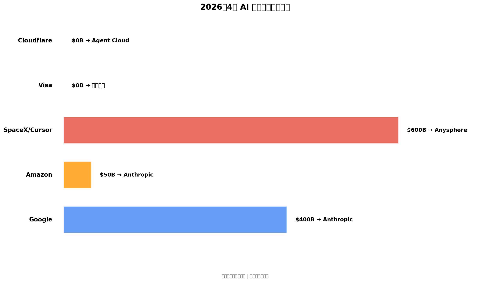

# AI 模型"雪崩"与 Agent 经济的黎明：2026 年 4 月深度解析

**文档日期：** 2026 年 4 月 27 日  
**标签：** AI Models, Agent Economy, DeepSeek V4, GPT-5.5, Claude Opus 4.7, Agentic Commerce, Infrastructure

---

## 一、背景分析：九天五款前沿模型的"雪崩"时刻

### 1.1 2026 年 4 月：AI 行业的"寒武纪大爆发"

2026 年 4 月，AI 行业经历了一次前所未有的模型密集发布期。在短短九天内，五款前沿模型相继亮相：

| 日期 | 模型/事件 | 提供方 | 核心亮点 |
|------|----------|--------|----------|
| 4 月 9 日 | MiniMax M2.7 | MiniMax | 开源自进化 Agent 模型，Terminal-Bench 2 达 57% |
| 4 月 16 日 | Claude Opus 4.7 | Anthropic | SWE-bench Pro 64.3%，多 Agent 协调 |
| 4 月 24 日 | GPT-5.5 | OpenAI | Terminal-Bench 2.0 达 82.7%，最强 Agentic 编码 |
| 4 月 24 日 | DeepSeek V4 | DeepSeek | 1.6T 参数 MoE，1/6 成本，开源 MIT 许可 |
| 4 月 25 日 | Project Deal | Anthropic | Agent-on-Agent 电商实验，186 笔真实交易 |

这不是简单的版本迭代，而是**能力边界、商业模式和基础设施的三重重构**。

### 1.2 为什么这是一次"雪崩"而非"进化"？

传统 AI 模型发布遵循"渐进式改进"模式：每 6-12 个月提升 5-10% 基准测试得分。但 2026 年 4 月的模式截然不同：

```
传统模式：
┌─────────────────────────────────────────────────────────────┐
│  Model V1 ──(+5%)──> Model V2 ──(+8%)──> Model V3         │
│  时间线：6-12 个月/版本                                      │
│  核心驱动：参数规模扩展                                      │
└─────────────────────────────────────────────────────────────┘

2026 年 4 月"雪崩"模式：
┌─────────────────────────────────────────────────────────────┐
│  DeepSeek V4: 效率革命 ── 成本降至 1/6                      │
│  GPT-5.5: 能力跃迁 ── Terminal-Bench 82.7%（+7.6%）         │
│  Opus 4.7: 编码王者 ── SWE-bench Pro 64.3%                  │
│  M2.7: 开源突破 ── 自进化 Agent 能力                        │
│  Project Deal: 商业验证 ── Agent 电商真实落地               │
│  时间线：9 天                                               │
│  核心驱动：架构创新 + 效率优化 + 商业闭环                    │
└─────────────────────────────────────────────────────────────┘
```

**关键洞察**：这次"雪崩"的核心不是参数规模的军备竞赛，而是**效率革命和商业模式的重构**。

---

## 二、效率革命：DeepSeek V4 与成本壁垒的崩塌

### 2.1 DeepSeek V4 的技术突破

DeepSeek V4 的发布标志着 AI 模型经济学的一次根本性重构。其核心技术突破包括：

#### 架构创新

```
DeepSeek V4 架构概览：
┌─────────────────────────────────────────────────────────────┐
│  V4-Pro-Max: 1.6 万亿参数 MoE (Mixture of Experts)          │
│  V4-Flash: 2840 亿参数                                      │
│                                                             │
│  关键创新：                                                  │
│  ├─ Compressed Sparse Attention (CSA)                      │
│  │   └─ 压缩稀疏注意力，减少 KV Cache 占用                  │
│  ├─ Heavily Compressed Attention (HCA)                     │
│  │   └─ 高压缩注意力，支持 1M token 上下文                  │
│  └─ Hybrid MoE Routing                                     │
│      └─ 混合专家路由，动态激活专家子集                       │
└─────────────────────────────────────────────────────────────┘
```

DeepSeek AI 研究员 Deli Chen 在 X 上描述这次发布为"484 天的心血之作"，并强调"AGI 属于每个人"。这不仅是一句口号，更是技术民主化的宣言。

#### 硬件协同设计

NVIDIA 在 DeepSeek V4 发布当天即宣布 Blackwell GPU 支持：

- **NVFP4 量化**：在 1.6T 模型上实现 3500 tokens/秒
- **Day-0 支持**：从模型发布到硬件优化同步完成
- **能效比提升**：每 token 能耗降低 40%

### 2.2 价格壁垒的崩塌：从闭源垄断到开源民主

DeepSeek V4 的定价策略堪称"核弹级"：

| 模型 | 输入价格 ($/1M tokens) | 输出价格 ($/1M tokens) | 总成本 |
|------|------------------------|------------------------|--------|
| **DeepSeek V4-Flash** | $0.14 | $0.28 | **$0.42** |
| Grok 4.1 Fast | $0.20 | $0.50 | $0.70 |
| MiniMax M2.7 | $0.30 | $1.20 | $1.50 |
| Gemini 3 Flash | $0.50 | $3.00 | $3.50 |
| **DeepSeek V4-Pro** | $1.74 | $3.48 | **$5.22** |
| Gemini 3 Pro | $2.00 | $12.00 | $14.00 |
| Claude Sonnet 4.5 | $3.00 | $15.00 | $18.00 |
| Claude Opus 4.7 | $5.00 | $25.00 | $30.00 |
| GPT-5.5 | $5.00 | $30.00 | $35.00 |

**关键数据**：

- **V4-Pro vs GPT-5.5**：成本约为 **1/7**
- **V4-Pro vs Claude Opus 4.7**：成本约为 **1/6**
- **V4-Flash vs GPT-5.5**：成本约为 **1/83**（98% 以上节省）
- **缓存输入后**：V4-Pro 成本仅为 GPT-5.5 的 **1/10**

### 2.3 对 Agent 开发者的实际影响

成本降低对 Agent 系统的影响是指数级的：

```python
# Agent 工作流成本对比示例
# 场景：一个复杂的多步骤 Agent 任务，需要 100 次 LLM 调用

# 使用 GPT-5.5
gpt55_cost = 100 * 35.00  # $3,500 per million tokens total
# 使用 Claude Opus 4.7
opus_cost = 100 * 30.00   # $3,000 per million tokens total
# 使用 DeepSeek V4-Pro
deepseek_cost = 100 * 5.22  # $522 per million tokens total

# 对于每天运行 1000 次 Agent 任务的企业：
# GPT-5.5: $3,500,000/year
# Claude Opus 4.7: $3,000,000/year
# DeepSeek V4-Pro: $522,000/year
# 年节省：$2.5M - $3M
```

**Forbes 的评论切中要害**：

> "DeepSeek V4 shows that the next AI race is about efficiency."

---

## 三、能力边界重构：GPT-5.5 与 Claude Opus 4.7 的正面对决

### 3.1 GPT-5.5：OpenAI 的"Spud"反击

OpenAI 在 4 月 24 日发布 GPT-5.5（内部代号 "Spud"），这是对 Anthropic 一周前发布 Opus 4.7 的直接回应。

#### 核心技术亮点

```
GPT-5.5 技术架构：
┌─────────────────────────────────────────────────────────────┐
│  硬件-软件协同设计                                           │
│  ├─ NVIDIA GB200/GB300 NVL72 系统优化                       │
│  ├─ 自定义启发式算法（AI 自编写）                            │
│  ├─ GPU 核心负载均衡优化                                     │
│  └─ Token 生成速度提升 20%+                                  │
│                                                             │
│  Agentic 能力增强                                            │
│  ├─ 自主多步任务执行（无需细粒度提示）                       │
│  ├─ 跨文档/表格/代码库的上下文理解                          │
│  ├─ GPT-5.5 Thinking 模式（内部推理验证）                   │
│  └─ Expert-SWE 基准：中位数 20 小时人类任务自动化            │
└─────────────────────────────────────────────────────────────┘
```

Sam Altman 对 GPT-5.5 的评价：

> "A model that feels like it absorbed the best of the previous ones: intelligence, insight, sense of humor and memory all work beautifully here."

但更重要的是 OpenAI 研究副总裁 Amelia Glaese 的表述：

> "It's definitely our strongest model yet on coding, both measured by benchmarks and based on the feedback that we've gotten from trusted partners."

#### 基准测试表现

| 基准测试 | GPT-5.5 | Claude Opus 4.7 | Gemini 3.1 Pro | Mythos Preview |
|----------|---------|-----------------|----------------|----------------|
| **Terminal-Bench 2.0** | **82.7%** | 69.4% | 68.5% | 82.0% |
| SWE-bench Pro | 58.6% | **64.3%** | 54.2% | 77.8% |
| BrowseComp | 84.4% | 79.3% | 85.9% | 86.9% |
| GPQA Diamond | 93.6% | **94.2%** | — | — |
| Humanity's Last Exam (no tools) | 41.4% | **46.9%** | — | 56.8% |
| Humanity's Last Exam (with tools) | 52.2% | 54.7% | — | **57.2%** |
| CyberGym | 81.8% | 73.1% | — | **83.1%** |
| FrontierMath Tier 1-3 | **51.7%** | 43.8% | 36.9% | — |

**关键洞察**：

- **Terminal-Bench 2.0**：GPT-5.5 以 82.7% 重新定义 Agentic 编码标准
- **SWE-bench Pro**：Claude Opus 4.7 保持领先（64.3% vs 58.6%）
- **综合能力**：GPT-5.5 和 Opus 4.7 在不同领域各有优势

### 3.2 Claude Opus 4.7：Anthropic 的"安全"领先

Anthropic 在 4 月 16 日发布 Claude Opus 4.7，虽然被 GPT-5.5 在 Terminal-Bench 上超越，但在软件工程基准上保持领先。

#### 核心创新

```
Claude Opus 4.7 能力矩阵：
┌─────────────────────────────────────────────────────────────┐
│  编码能力                                                    │
│  ├─ SWE-bench Pro: 64.3%（行业最高）                        │
│  ├─ 多 Agent 协调：小时级任务自主完成                        │
│  └─ 代码审查与自我修正                                       │
│                                                             │
│  视觉理解                                                    │
│  ├─ 增强的图像理解能力                                       │
│  ├─ UI/UX 设计分析                                          │
│  └─ Claude Design 产品集成                                  │
│                                                             │
│  安全机制                                                    │
│  ├─ 双重检查机制（Double-Check）                            │
│  ├─ 自我验证推理链                                          │
│  └─ 与 Mythos 的安全分级                                    │
└─────────────────────────────────────────────────────────────┘
```

#### Mythos 的存在意义

Anthropic 公开承认 Opus 4.7 "less broadly capable" than Mythos，这是一个耐人寻味的策略：

- **Mythos**：仅限于"小部分外部企业合作伙伴"用于网络安全测试
- **Opus 4.7**：面向公众的最强可用模型
- **策略意图**：通过"能力天花板"暗示建立技术领先认知

### 3.3 基准测试的局限性：我们真的在测量"智能"吗？

这次模型发布潮暴露了一个深层问题：**现有基准测试是否真正衡量了我们需要的 Agent 能力？**

```
基准测试 vs 真实 Agent 能力：

                    基准测试覆盖                    真实需求
                    ┌─────────┐                    ┌─────────┐
                    │ 编码正确率│                    │ 任务完成 │
                    ├─────────┤                    ├─────────┤
                    │ 推理链准确性                   │ 错误恢复 │
                    ├─────────┤                    ├─────────┤
                    │ 知识问答 │                    │ 用户意图理解│
                    ├─────────┤                    ├─────────┤
                    │ 数学推理 │                    │ 工具编排 │
                    └─────────┘                    └─────────┘
                          │                              │
                          └────────── 30% 重叠 ──────────┘
```

OpenAI 的 GPT-5.5 在 Terminal-Bench 2.0 上领先，但 Terminal-Bench 测量的是"在沙箱终端环境中完成任务的能力"，这更接近真实 Agent 工作负载。而 SWE-bench Pro 测量的是"修复已知 GitHub Issue"的能力，更像是"编程考试"而非"日常开发"。

---

## 四、Agent 经济的基础设施：从实验到生产

### 4.1 Anthropic 的 Project Deal：Agent-on-Agent 商业的首次验证

4 月 25 日，Anthropic 披露了一个关键实验：**Project Deal**。

#### 实验设计

```
Project Deal 实验架构：
┌─────────────────────────────────────────────────────────────┐
│  参与者：69 名 Anthropic 员工                                │
│  预算：每人 $100（通过礼品卡支付）                           │
│  模式：Agent 代表买卖双方进行真实交易                        │
│                                                             │
│  四个市场：                                                  │
│  ├─ 市场 A（真实市场）：最强模型代表，交易真实履行           │
│  ├─ 市场 B（对照）：不同模型对比                             │
│  ├─ 市场 C（对照）：不同初始指令                             │
│  └─ 市场 D（对照）：不同谈判策略                             │
└─────────────────────────────────────────────────────────────┘
```

#### 关键发现

1. **交易规模**：186 笔交易，总价值超过 $4,000
2. **模型质量差距**：更先进的模型为用户带来"客观上更好的结果"
3. **感知盲区**：用户并未察觉模型质量差异，存在"Agent 质量鸿沟"风险
4. **指令无关性**：初始指令不影响成交概率或价格

**核心洞察**：

> "当用户由更先进的模型代表时，他们获得客观上更好的结果。但用户并未意识到这种差异——这可能导致'Agent 质量鸿沟'，失败的一方可能不知道自己处于劣势。"

### 4.2 Agentic Commerce 基础设施竞赛

#### Visa Intelligent Commerce Connect

Visa 在 4 月推出 Intelligent Commerce Connect，为 AI Agent 购物提供基础设施：

```
Visa Agentic Commerce 架构：
┌─────────────────────────────────────────────────────────────┐
│  核心组件：                                                  │
│  ├─ 产品目录 API：让 AI Agent 发现和比较商品                │
│  ├─ 支付授权：Agent 代表用户完成支付                        │
│  ├─ 商户连接：零售商接入 AI 购物流程                        │
│  └─ 安全层：用户偏好和预算控制                              │
│                                                             │
│  支持协议：                                                  │
│  ├─ MCP (Model Context Protocol)                           │
│  ├─ Stripe Agentic Commerce Protocol                       │
│  └─ Google Universal Commerce Protocol                     │
└─────────────────────────────────────────────────────────────┘
```

#### Shopify 的 Agentic Shopping

Shopify 预测 Agentic Commerce 将在 2030 年产生 **$1.5 万亿** 全球价值：

> "Agentic commerce is a new model of ecommerce where AI agents shop on behalf of consumers—researching products, comparing options, and completing purchases autonomously."

### 4.3 OpenAI Agent Cloud：企业级 Agent 基础设施

OpenAI 与 Cloudflare 合作推出 Agent Cloud：

```
Agent Cloud 架构：
┌─────────────────────────────────────────────────────────────┐
│  计算层                                                      │
│  ├─ Workers AI：边缘推理                                    │
│  ├─ Durable Objects：有状态 Agent 运行                      │
│  └─ Cloudflare R2：持久化存储                               │
│                                                             │
│  安全层                                                      │
│  ├─ 零信任网络访问                                          │
│  ├─ 细粒度权限控制                                          │
│  └─ 审计日志                                                │
│                                                             │
│  集成层                                                      │
│  ├─ 原生 MCP 支持                                           │
│  ├─ OpenAI Agents SDK 集成                                  │
│  └─ 企业 API 网关                                           │
└─────────────────────────────────────────────────────────────┘
```

---

## 五、资本重构：$40B Google-Anthropic 投资的深层逻辑

### 5.1 投资规模与结构

| 投资方 | 金额 | 条件 | 回报承诺 |
|--------|------|------|----------|
| **Google** | $100 亿 + $300 亿期权 | 达成绩效目标 | TPU 访问权 + 云优先权 |
| **Amazon** | $50 亿 | 无条件 | $1000 亿 AWS 消费承诺 |

**Anthropic 估值演变**：

```
2024 年初：$180 亿
    │
    ├──> 2025 年中：$380 亿（$300 亿融资后）
    │
    ├──> 2026 年 2 月：$800 亿（投资者报价）
    │
    └──> 2026 年 4 月：$10000 亿（二级市场交易）
         └─> 首次超越 OpenAI 估值
```

### 5.2 为什么是 Anthropic？

**技术优势**：
- Claude 系列在编码基准上的持续领先
- Constitutional AI 安全框架
- MCP 协议生态主导权

**商业优势**：
- 收入轨迹：从 $10 亿到 $300 亿年收入，仅用 18 个月
- 企业客户粘性：高留存率 + 高 ARPU
- API 收入占比：超过 60%

**战略价值**：
- Google：对抗 OpenAI-Microsoft 联盟的筹码
- Amazon：AWS 云消费锁定
- NVIDIA：GPU 需求持续增长

### 5.3 对 Agent 生态的影响

资本重构正在重塑 Agent 基础设施格局：

```
Agent 基础设施投资流向（2026 年 4 月）：
┌─────────────────────────────────────────────────────────────┐
│  模型层                                                      │
│  ├─ Google → Anthropic: $400 亿                             │
│  └─ Amazon → Anthropic: $50 亿                              │
│                                                             │
│  工具层                                                      │
│  ├─ SpaceX/Cursor: $600 亿估值                              │
│  └─ Factory: $15 亿估值                                     │
│                                                             │
│  基础设施层                                                  │
│  ├─ Cloudflare Agent Cloud                                  │
│  ├─ Visa Intelligent Commerce Connect                       │
│  └─ ServiceNow + Google Cloud Agent 联盟                    │
│                                                             │
│  安全层                                                      │
│  ├─ Sycamore Labs: $6500 万种子轮                          │
│  └─ KnowBe4 Agent Risk Manager                              │
└─────────────────────────────────────────────────────────────┘
```

---

## 六、Cursor 现象：AI 编码 Agent 的估值狂飙

### 6.1 从 $0 到 $500 亿的四年

Cursor（Anysphere）的增长轨迹堪称科技史奇迹：

| 时间 | 估值 | ARR | 关键事件 |
|------|------|-----|----------|
| 2022 年 | 创立 | $0 | 四人团队成立 |
| 2024 年 | $4 亿 | $1000 万 | 产品发布 |
| 2025 年 | $25 亿 | $1 亿 | Series A |
| 2026 年 4 月 | **$500 亿** | **$60 亿** | $20 亿融资谈判 |

**Paul Graham 在 2026 年 4 月的推文确认**：

> "Each Y Combinator batch I ask the startups what percent of their code is written by AI. It passed 75% at least a year ago, maybe two."

### 6.2 为什么是 Cursor？

**产品优势**：
- IDE 深度集成：VS Code 扩展 + 独立应用
- 上下文理解：整个代码库的语义理解
- 多模型支持：Claude + GPT + DeepSeek 无缝切换

**商业模式**：
- 个人版：$20/月
- 企业版：$40/用户/月
- 企业渗透率：Fortune 500 中 30% 已部署

**竞争壁垒**：
- 用户习惯锁定：开发者日常工作流已固化
- 代码库知识：历史交互形成的"代码记忆"
- 网络效应：企业内部最佳实践共享

### 6.3 SpaceX 收购传闻

Bloomberg 报道 SpaceX 正在洽谈以 $600 亿收购 Cursor：

- **战略意图**：Starlink + AI 编码 = 卫星软件自主迭代
- **投资方回报**：Andreessen Horowitz 和 Thrive Capital 将获得数十亿回报
- **行业影响**：AI 编码工具首次进入"国家级基础设施"视野

---

## 七、MiniMax M2.7：开源 Agent 模型的自进化突破

### 7.1 技术创新

MiniMax 在 4 月 9 日开源 M2.7，这是首个"自进化 Agent 模型"：

```
MiniMax M2.7 架构：
┌─────────────────────────────────────────────────────────────┐
│  自进化机制                                                  │
│  ├─ 任务执行 → 反思 → 策略优化 → 模型微调                   │
│  ├─ 自动课程学习（Auto-Curriculum Learning）                │
│  └─ 持续能力扩展                                             │
│                                                             │
│  性能表现                                                    │
│  ├─ SWE-Pro: 56.22%                                         │
│  ├─ Terminal-Bench 2: 57.0%                                 │
│  ├─ GDPval-AA ELO: 1495（45 模型中最高）                    │
│  └─ 成本：$1.50/1M tokens（输入+输出）                      │
│                                                             │
│  开源许可                                                    │
│  └─ Apache 2.0（商业友好）                                   │
└─────────────────────────────────────────────────────────────┘
```

### 7.2 对 Agent 开发者的意义

自进化能力意味着：

1. **无需人工标注**：模型通过执行任务自动生成训练数据
2. **持续改进**：部署后能力随使用量增长
3. **领域适应**：特定场景下的能力自动特化

---

## 八、架构演进：2026 年 Agent 系统的设计范式

### 8.1 从"模型优先"到"效率优先"

2026 年 4 月的模型发布潮揭示了架构设计的核心转变：

```
2025 年架构：
┌─────────────────────────────────────────────────────────────┐
│  设计原则：模型优先                                         │
│  ├─ 选择最强模型（GPT-4, Claude 3.5）                       │
│  ├─ 围绕模型能力设计工作流                                   │
│  └─ 成本是次要考虑                                          │
│                                                             │
│  问题：                                                      │
│  ├─ 高成本限制规模化                                        │
│  ├─ 单模型依赖风险                                          │
│  └─ 能力天花板明显                                          │
└─────────────────────────────────────────────────────────────┘

2026 年架构：
┌─────────────────────────────────────────────────────────────┐
│  设计原则：效率优先                                         │
│  ├─ 根据任务复杂度选择模型（成本-能力权衡）                  │
│  ├─ 多模型路由：简单→V4-Flash，复杂→GPT-5.5                 │
│  ├─ 缓存策略优化：上下文复用降低成本                        │
│  └─ 开源模型作为基线，闭源模型作为增强                      │
│                                                             │
│  优势：                                                      │
│  ├─ 成本降低 70-90%                                         │
│  ├─ 厂商锁定风险降低                                        │
│  └─ 可组合性增强                                            │
└─────────────────────────────────────────────────────────────┘
```

### 8.2 多模型路由架构

```python
# 2026 年最佳实践：智能模型路由
class ModelRouter:
    """
    根据任务特征动态选择最优模型
    """
    def __init__(self):
        self.models = {
            'deepseek-flash': DeepSeekV4Flash(),    # $0.42/1M
            'deepseek-pro': DeepSeekV4Pro(),        # $5.22/1M
            'gpt-5.5': GPT55(),                     # $35/1M
            'claude-opus': ClaudeOpus47(),          # $30/1M
        }
    
    def route(self, task: Task) -> str:
        # 简单任务 → 低成本模型
        if task.complexity < 0.3:
            return 'deepseek-flash'
        
        # 编码任务 → Terminal-Bench 最强者
        if task.type == 'coding' and task.needs_terminal:
            return 'gpt-5.5'
        
        # 软件工程 → SWE-bench 领先者
        if task.type == 'software_engineering':
            return 'claude-opus'
        
        # 默认：成本效益最优
        return 'deepseek-pro'
```

### 8.3 Agent 经济的技术栈

```
2026 年 Agent 技术栈：
┌─────────────────────────────────────────────────────────────┐
│  应用层                                                      │
│  ├─ Cursor, Factory, Claude Code                           │
│  └─ 垂直领域 Agent（金融、医疗、法律）                      │
│                                                             │
│  编排层                                                      │
│  ├─ OpenAI Agents SDK                                       │
│  ├─ LangGraph / LangSmith                                   │
│  └─ Custom Orchestration                                    │
│                                                             │
│  协议层                                                      │
│  ├─ MCP (Model Context Protocol)                           │
│  ├─ A2A (Agent-to-Agent)                                   │
│  └─ Agentic Commerce Protocols                              │
│                                                             │
│  模型层                                                      │
│  ├─ 开源：DeepSeek V4, MiniMax M2.7, Gemma 4               │
│  └─ 闭源：GPT-5.5, Claude Opus 4.7, Gemini 3 Pro           │
│                                                             │
│  基础设施层                                                  │
│  ├─ Agent Cloud (Cloudflare + OpenAI)                      │
│  ├─ Visa Intelligent Commerce Connect                      │
│  └─ SmolVM / 安全沙箱                                       │
└─────────────────────────────────────────────────────────────┘
```

---

## 九、风险与挑战：Agent 经济的阴暗面

### 9.1 Agent 质量鸿沟

Anthropic 的 Project Deal 揭示了一个潜在的社会问题：

> "人们可能因为使用较弱模型的 Agent 而处于劣势，却不自知。"

这在商业谈判、金融交易、法律咨询等高价值场景中尤其危险。

### 9.2 安全边界的模糊

DrJimFan（NVIDIA 研究员）的警告：

> "This is pure nightmare fuel. Identity theft of the past would be nothing compared to what vibe agents can do."

Agent 身份盗窃的影响：
- 污染技能目录 (`**/skills/*`)
- 篡改配置文件 (`~/.claude`)
- 通过资源注入恶意指令（PDF、网页）

### 9.3 基准测试的误导性

Terminal-Bench 2.0 和 SWE-bench Pro 的差异揭示了：

- **基准测试可能无法反映真实 Agent 工作负载**
- **单一基准领先不等于综合能力领先**
- **开发者需要建立自己的评估体系**

---

## 十、未来展望：2026 下半年的关键趋势

### 10.1 模型层趋势

| 趋势 | 影响 |
|------|------|
| 开源模型逼近闭源性能 | API 定价压力增大 |
| 效率优化成为主战场 | 参数规模军备竞赛降温 |
| 多模态融合加速 | Agent 感知能力增强 |

### 10.2 基础设施层趋势

| 趋势 | 影响 |
|------|------|
| Agent Cloud 标准化 | 部署门槛降低 |
| Agentic Commerce 协议成熟 | Agent 经济闭环 |
| 安全沙箱成为标配 | 生产部署信任增强 |

### 10.3 应用层趋势

| 趋势 | 影响 |
|------|------|
| 垂直领域 Agent 爆发 | 专业场景深度渗透 |
| Agent 协作网络形成 | Multi-Agent 系统规模化 |
| 人机协作模式重构 | Agent 成为"数字员工" |

---

## 十一、结语：从"雪崩"到"新常态"

2026 年 4 月的 AI 模型"雪崩"不是终点，而是新阶段的起点。

**三个关键转变**：

1. **效率革命**：DeepSeek V4 证明高性能不必高成本
2. **商业验证**：Project Deal 证明 Agent 经济可行
3. **基础设施成熟**：Agent Cloud、Visa、Cursor 构建完整生态

**给开发者的建议**：

```
┌─────────────────────────────────────────────────────────────┐
│  2026 Agent 开发黄金法则                                    │
│                                                             │
│  1. 效率优先：用最便宜的模型完成最多的任务                   │
│  2. 多模型策略：不要绑定单一模型供应商                       │
│  3. 自建评估：基准测试仅供参考，真实场景才是王道             │
│  4. 安全设计：假设所有输入都可能是恶意的                     │
│  5. 协议优先：MCP、A2A 等开放协议降低集成成本                │
└─────────────────────────────────────────────────────────────┘
```

**最后的话**：

AI 模型的"雪崩"已经发生，但真正的变革才刚刚开始。当成本不再是障碍，当基础设施已经就绪，当商业模式开始闭环——Agent 经济的黎明，正在 2026 年的地平线上冉冉升起。

---

## 参考文献

1. DeepSeek V4 Release. DeepSeek AI. April 24, 2026.
2. OpenAI GPT-5.5 Announcement. OpenAI. April 24, 2026.
3. Claude Opus 4.7 Release. Anthropic. April 16, 2026.
4. Project Deal: Agent-on-Agent Commerce. Anthropic. April 25, 2026.
5. Google to Invest Up to $40 Billion in Anthropic. Bloomberg. April 24, 2026.
6. Cursor $2B Funding Round. TechCrunch. April 17, 2026.
7. MiniMax M2.7 Open Source Release. MiniMax. April 9, 2026.
8. Visa Intelligent Commerce Connect. Visa. April 2026.
9. Cloudflare and OpenAI Agent Cloud. Forbes. April 16, 2026.
10. Terminal-Bench 2.0 Benchmark. VentureBeat. April 24, 2026.

---

**文档链接**：https://github.com/kejun/blogpost/blob/main/2026-04-27-ai-model-avalanche-agent-economy-2026.md

**封面图片**：


*图 1：2026 年 4 月前沿模型性能-成本对比（对数刻度）*


*图 2：2026 年 4 月 AI 模型"雪崩"时间线*


*图 3：2026 年 4 月 AI 基础设施投资流向*
