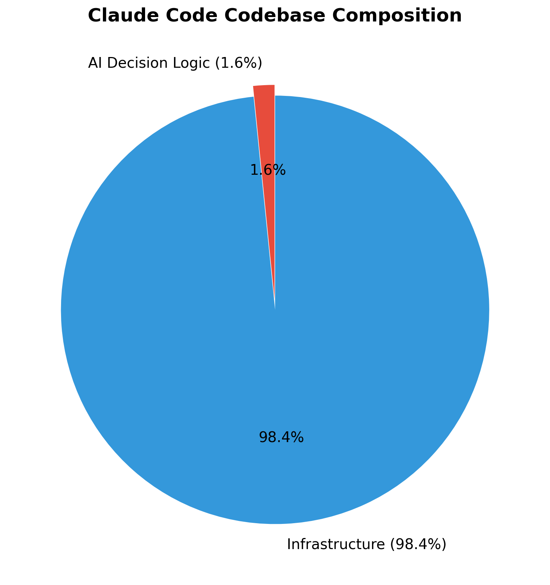
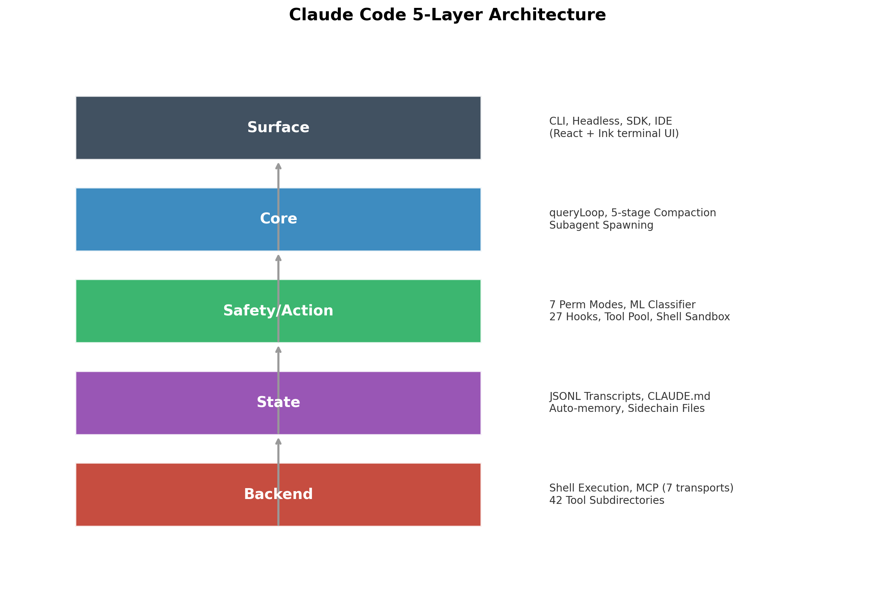
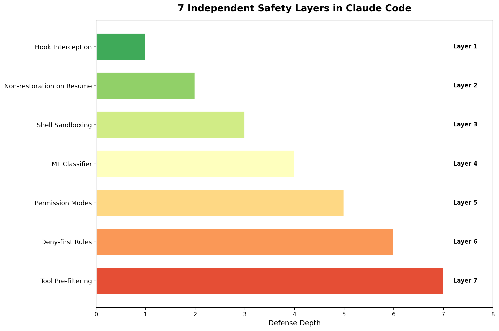
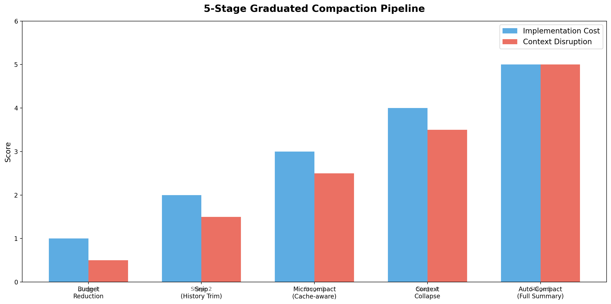
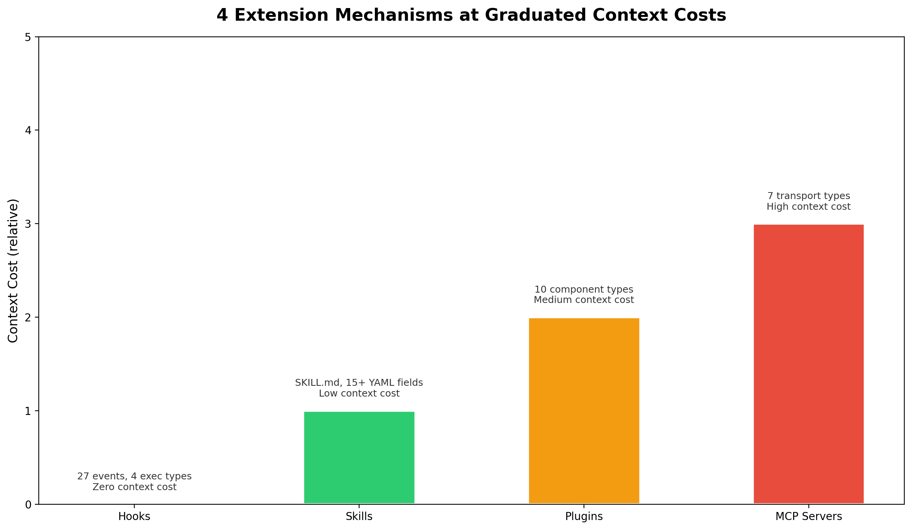

# Dive into Claude Code：一份源码级的 Agent 架构解剖报告

**文档日期：** 2026 年 4 月 27 日  
**标签：** Claude Code, Agent Architecture, Source-level Analysis, VILA-Lab, Safety Design, Context Engineering

---

## 一、背景：当学术界开始"解剖"Claude Code

### 1.1 项目简介

[VILA-Lab/Dive-into-Claude-Code](https://github.com/VILA-Lab/Dive-into-Claude-Code) 是佐治亚理工学院 VILA-Lab 团队发布的一项**系统性源码级架构分析**，对象是 Claude Code（v2.1.88，~1,900 个 TypeScript 文件，~512K 行代码）。

```
研究产出：
┌─────────────────────────────────────────────────────────────┐
│  📄 学术论文：arXiv 2604.14228                              │
│  🏗️ 架构文档：architecture.md（5 层架构、7 层安全）         │
│  🧭 设计指南：build-your-own-agent.md（6 大设计决策）       │
│  🌐 社区资源：15+ 逆向工程/重实现项目汇总                    │
│  🔬 跨系统对比：Claude Code vs OpenClaw                     │
└─────────────────────────────────────────────────────────────┘
```

### 1.2 为什么这项研究重要？

Claude Code 是 Anthropic 的旗舰 AI 编程代理，代表了当前**生产级 AI Agent 系统的最高工程标准**。VILA-Lab 的研究首次从学术界视角，以源码级精度揭示了：

1. **Agent 系统的真实复杂度分布**：98.4% 的代码是确定性基础设施，仅 1.6% 是 AI 决策逻辑
2. **安全设计的纵深防御体系**：7 层独立安全层，以及它们共享的失效模式
3. **上下文管理的渐进式压缩管线**：5 层压缩策略，从最廉价到最昂贵
4. **可扩展性的分层机制**：Hooks（零成本）→ Skills（低成本）→ Plugins（中成本）→ MCP（高成本）

---

## 二、核心发现：1.6% vs 98.4%

### 2.1 Agent 循环的本质

Claude Code 的核心 Agent 循环是一个**简单的 while 循环**：

```
queryLoop（query.ts）：
┌─────────────────────────────────────────────────────────────┐
│  while (true) {                                             │
│    context = assembleContext()                              │
│    context = apply5StageCompaction(context)                 │
│    response = callModel(context)                            │
│    tools = dispatchTools(response)                          │
│    for (tool in tools) {                                    │
│      permission = checkPermission(tool)                     │
│      if (permission == DENY) continue                       │
│      result = executeTool(tool)                             │
│      context.add(result)                                    │
│    }                                                        │
│    if (shouldStop(context)) break                           │
│  }                                                          │
└─────────────────────────────────────────────────────────────┘
```

**关键洞察**：Agent 循环本身只有几十行代码。真正的复杂度在于循环**周围**的系统——权限门控、上下文管理、工具路由、恢复逻辑。

### 2.2 代码库组成



| 类别 | 占比 | 说明 |
|------|------|------|
| **基础设施代码** | 98.4% | 权限门控、上下文管理、工具路由、恢复逻辑 |
| **AI 决策逻辑** | 1.6% | 模型调用、提示词组装、输出解析 |

**这对 Agent 开发者的启示**：

> "As frontier models converge in capability (top 3 within 1% on SWE-bench), the operational harness becomes the differentiator, not the model or the scaffolding."

当模型能力趋同时，**确定性基础设施**（上下文管理、安全、恢复）才是差异化所在。

---

## 三、架构设计：5 层架构与 4 个核心问题

### 3.1 5 层架构

Claude Code 的架构分为 5 层，每层有明确的职责边界：



| 层级 | 职责 | 关键组件 |
|------|------|----------|
| **Surface（表面层）** | 入口点与渲染 | CLI、Headless、SDK、IDE（React + Ink 终端 UI） |
| **Core（核心层）** | 上下文组装与 Agent 循环 | queryLoop、5 阶段压缩管线、Subagent 派生 |
| **Safety/Action（安全/动作层）** | 权限与工具 | 7 种权限模式、ML 分类器、27 个 Hook 事件、工具池、Shell 沙箱 |
| **State（状态层）** | 运行时状态与持久化 | JSONL 转录、CLAUDE.md 层级、自动记忆、Sidechain 文件 |
| **Backend（后端层）** | 执行环境 | Shell 执行、MCP 连接（7 种传输类型）、42 个工具子目录 |

**关键设计决策**：所有接口（交互式 CLI、Headless、SDK、IDE）共享同一个 `queryLoop`。这不是多个执行引擎，而是**一个引擎，多种表面**。

### 3.2 Claude Code 回答的 4 个核心设计问题

每个生产级 AI Agent 系统都必须回答这 4 个问题：

| 问题 | Claude Code 的答案 | 替代方案 |
|------|-------------------|----------|
| **推理在哪里？** | 模型推理；harness 执行。~1.6% AI，98.4% 基础设施 | LangGraph：显式状态图；Devin：多步规划器 |
| **多少执行引擎？** | 一个 queryLoop 服务于所有接口 | 每个表面一个独立引擎 |
| **默认安全姿态？** | Deny-first：deny > ask > allow。最严格的规则获胜 | 容器隔离（SWE-Agent）、git 回滚（Aider） |
| **绑定资源约束？** | ~200K（旧模型）/ 1M（Claude 4.6 系列）token 上下文窗口。每次模型调用前运行 5 层压缩 | 计算预算、显式 scratchpad |

---

## 四、安全设计：7 层纵深防御及其共享失效模式

### 4.1 7 层独立安全层

Claude Code 实现了 7 层安全机制，任何一层都可以阻止请求：



1. **工具预过滤（Tool Pre-filtering）**：被拒绝的工具从模型视图中完全移除
2. **Deny-first 规则评估**：Deny 始终覆盖 allow，即使 allow 更具体
3. **权限模式约束**：活动模式决定基线处理
4. **Auto-mode ML 分类器**：独立的 LLM 调用独立评估安全性
5. **Shell 沙箱**：Shell 命令的文件系统和网络隔离
6. **恢复时不恢复权限**：权限不跨会话边界持久化
7. **Hook 拦截**：PreToolUse Hook 可以修改或阻止动作

### 4.2 共享失效模式：纵深防御的陷阱

研究揭示了一个关键问题：**当安全层共享约束时，纵深防御会退化**。

```
共享失效模式示例：
┌─────────────────────────────────────────────────────────────┐
│  所有 7 层都受限于 token 预算                               │
│                                                             │
│  问题：超过 50 个子命令的命令会完全绕过安全分析              │
│  原因：防止 REPL 冻结（事件循环饥饿）                       │
│  结果：50+ 子命令 = 无安全分析                              │
└─────────────────────────────────────────────────────────────┘
```

**关键洞察**：

> "Defense-in-depth only works when safety layers have independent failure modes. Design your layers to fail independently."

### 4.3 审批疲劳：93% 的批准率

研究发现用户批准了 **93%** 的权限提示。这揭示了：

- 用户不会仔细阅读每个提示
- 更多的警告不是解决方案
- 需要**重构边界**——沙箱和分类器创建自主操作的安全区域

### 4.4 Pre-Trust 执行窗口：4 个 CVE 的根源

研究发现了 **4 个 CVE**（其中 2 个已修补），它们共享同一个根本原因：

```
Pre-Trust 漏洞：
┌─────────────────────────────────────────────────────────────┐
│  时间线：                                                    │
│  1. 扩展/MCP 服务器初始化                                   │
│  2. Hook 执行 ← 在信任对话框出现之前！                       │
│  3. 信任对话框出现                                          │
│  4. 用户批准                                               │
│                                                             │
│  问题：步骤 2 在步骤 3 之前执行                              │
│  影响：扩展可以在用户看到信任对话框之前执行代码              │
│  修复：已修补 2 个 CVE                                      │
└─────────────────────────────────────────────────────────────┘
```

---

## 五、上下文管理：5 阶段渐进式压缩管线

### 5.1 为什么上下文管理是核心？

Claude Code 的绑定资源约束是**上下文窗口**（~200K token 用于旧模型，~1M token 用于 Claude 4.6 系列）。每次模型调用前，必须运行 5 层压缩策略：



### 5.2 5 阶段压缩管线

| 阶段 | 策略 | 触发条件 | 成本 |
|------|------|----------|------|
| **1. Budget Reduction** | 每条消息大小上限 | 始终活跃 | 最低 |
| **2. Snip** | 修剪较旧的历史 | 功能门控（HISTORY_SNIP） | 低 |
| **3. Microcompact** | 缓存感知细粒度压缩 | 始终（基于时间），可选缓存感知路径 | 中 |
| **4. Context Collapse** | 读取时虚拟投影（非破坏性） | 功能门控（CONTEXT_COLLAPSE） | 中高 |
| **5. Auto-Compact** | 完整模型生成摘要（最后手段） | 当其他方法都失败时 | 最高 |

**关键设计原则**：

> "Apply the least disruptive compression first. Design for context scarcity from day one."

### 5.3 上下文组装：9 个有序来源

上下文按以下顺序构建：

```
上下文组装顺序（从确定性到概率性）：
┌─────────────────────────────────────────────────────────────┐
│  1. System prompt（确定性）                                 │
│  2. Environment info                                        │
│  3. CLAUDE.md 层级                                          │
│  4. Path-scoped rules                                       │
│  5. Auto-memory                                             │
│  6. Tool metadata                                           │
│  7. Conversation history                                    │
│  8. Tool results                                            │
│  9. Compact summaries                                       │
└─────────────────────────────────────────────────────────────┘
```

**关键设计决策**：CLAUDE.md 作为**用户上下文**（概率性合规）传递，**不是**系统提示（确定性）。权限规则提供确定性执行层。

### 5.4 记忆系统：无向量数据库

Claude Code 的记忆系统采用**纯文件方案**：

- **无嵌入（No embeddings）**
- **无向量数据库（No vector DB）**
- 使用 LLM 扫描记忆文件头，按需选择最多 5 个相关文件
- **完全可检查、可编辑、可版本控制**

---

## 六、可扩展性：分层机制与三个注入点

### 6.1 四种扩展机制

Claude Code 提供了四种扩展机制，按上下文成本递增：



| 机制 | 上下文成本 | 关键能力 |
|------|------------|----------|
| **Hooks** | 零 | 27 个事件，4 种执行类型（Shell、LLM、Webhook、Subagent 验证器） |
| **Skills** | 低 | SKILL.md 带 15+ YAML frontmatter 字段，通过 SkillTool 注入 |
| **Plugins** | 中 | 10 种组件类型（命令、Agent、Skills、Hooks、MCP、LSP、样式...） |
| **MCP Servers** | 高 | 外部工具，通过 7 种传输类型（stdio、SSE、HTTP、WebSocket、SDK、IDE） |

### 6.2 三个注入点

每个 Agent 循环都有三个扩展可以介入的位置：

```
Agent 循环的三个注入点：
┌─────────────────────────────────────────────────────────────┐
│                                                             │
│  assemble() ── 模型看到什么                                  │
│  │  CLAUDE.md、Skill 描述、MCP 资源、Hook 注入的上下文      │
│  │                                                           │
│  model() ── 模型能触及什么                                   │
│  │  内置工具、MCP 工具、SkillTool、AgentTool                │
│  │                                                           │
│  execute() ── 动作是否/如何运行                              │
│     权限规则、PreToolUse/PostToolUse Hook、Stop Hook        │
│                                                             │
└─────────────────────────────────────────────────────────────┘
```

### 6.3 工具池组装：5 步管线

```
工具池组装流程：
┌─────────────────────────────────────────────────────────────┐
│  1. Base enumeration（最多 54 个工具）                       │
│  2. Mode filtering（根据权限模式过滤）                       │
│  3. Deny pre-filtering（拒绝规则预过滤）                    │
│  4. MCP integration（MCP 工具集成）                         │
│  5. Deduplication（去重）                                   │
└─────────────────────────────────────────────────────────────┘
```

---

## 七、Subagent 设计：隔离 vs 共享

### 7.1 Subagent 类型

Claude Code 支持 6 种内置 Subagent 类型 + 自定义 Subagent：

| 类型 | 用途 |
|------|------|
| **Explore** | 代码库探索 |
| **Plan** | 任务规划 |
| **General-purpose** | 通用任务 |
| **Guide** | Claude Code 使用指南 |
| **Verification** | 任务验证 |
| **Statusline** | 状态行设置 |
| **Custom** | `.claude/agents/*.md` 自定义 |

### 7.2 隔离模式

| 模式 | 机制 | 默认 |
|------|------|------|
| **Worktree** | Git worktree（文件系统隔离） | 否 |
| **Remote** | 远程执行（内部） | 否 |
| **In-process** | 共享文件系统，隔离对话 | 是 |

### 7.3 Sidechain 转录：防止上下文爆炸

**关键设计**：每个 Subagent 写入自己的 `.jsonl` 文件。**只有摘要返回给父 Agent**——完整历史永远不会进入父上下文。

```
Subagent 上下文隔离：
┌─────────────────────────────────────────────────────────────┐
│  父 Agent 上下文窗口                                        │
│  ├─ 用户提示                                                │
│  ├─ 父 Agent 对话历史                                       │
│  └─ Subagent 摘要（仅摘要！）                               │
│                                                             │
│  Subagent 上下文窗口（独立）                                │
│  ├─ 父 Agent 传递的指令                                     │
│  ├─ Subagent 完整对话历史                                   │
│  └─ Subagent 工具调用结果                                   │
│                                                             │
│  成本影响：Subagent 会话成本约为标准会话的 ~7 倍             │
└─────────────────────────────────────────────────────────────┘
```

**关键洞察**：

> "Subagent sessions cost ~7× tokens of standard sessions. Only summaries return to the parent -- full history never enters the parent context. This is essential for context conservation."

---

## 八、会话持久化：Append-Only 设计

### 8.1 三个持久化通道

| 通道 | 格式 | 用途 |
|------|------|------|
| **Session transcripts** | Append-only JSONL | 完整对话，链修补压缩边界 |
| **Global prompt history** | history.jsonl | 跨会话提示回忆（上箭头） |
| **Subagent sidechains** | 每个 Subagent 独立 JSONL | 隔离的 Subagent 历史 |

### 8.2 关键设计原则

**恢复时不恢复权限**：信任始终在当前会话中重新建立。安全状态不应跨会话边界隐式持久化。

**Append-only JSONL 的优势**：

- **可审计**：每个事件都是人类可读的
- **可版本控制**：可以用 git 管理
- **可重建**：无需专门工具即可重建
- **透明**：用户可以看到所有数据

---

## 九、13 条设计原则

Claude Code 的架构可以追溯到 5 个核心价值观和 13 条设计原则：

### 9.1 5 个核心价值观

| 价值观 | 核心理念 |
|--------|----------|
| **人类决策权威** | 人类通过主从层次结构保留控制权 |
| **安全、安保、隐私** | 即使人类警惕性下降，系统也能保护 |
| **可靠执行** | 做该做的事。Gather-act-verify 循环。优雅恢复。 |
| **能力放大** | "一个 Unix 工具，而不是一个产品"。98.4% 是确定性基础设施。 |
| **上下文适应性** | CLAUDE.md 层级、渐进式可扩展性、随时间演变的信任轨迹。 |

### 9.2 13 条设计原则

| 原则 | 设计问题 |
|------|----------|
| **Deny-first 与人类升级** | 未知操作应该被允许、阻止还是升级？ |
| **渐进式信任谱** | 固定权限级别，还是用户随时间穿越的谱系？ |
| **纵深防御** | 单一安全边界，还是多个重叠边界？ |
| **外部化可编程策略** | 硬编码策略，还是带生命周期钩子的外部化配置？ |
| **上下文作为稀缺资源** | 单次截断，还是渐进式管线？ |
| **Append-only 持久化状态** | 可变状态、快照，还是 append-only 日志？ |
| **最小脚手架，最大 harness** | 投资脚手架还是操作基础设施？ |
| **价值观优于规则** | 僵化程序，还是带确定性护栏的上下文判断？ |
| **可组合的多机制可扩展性** | 一个 API，还是不同成本的分层机制？ |
| **可逆性加权风险评估** | 所有操作同等监督，还是可逆操作监督更轻？ |
| **透明文件配置和记忆** | 不透明数据库、嵌入，还是用户可见文件？ |
| **隔离 Subagent 边界** | 共享上下文/权限，还是隔离？ |
| **优雅恢复和弹性** | 硬失败，还是静默恢复？ |

---

## 十、对 Agent 开发者的启示

### 10.1 六大设计决策

基于 Claude Code 的分析，每个生产级 Agent 系统都必须回答这 6 个问题：

| 决策 | 问题 | 关键洞察 |
|------|------|----------|
| **1. 推理位置** | 模型 vs harness 各放多少逻辑？ | 模型越强大，需要的脚手架越少 |
| **2. 安全姿态** | 如何防止有害操作？ | 当层共享失效模式时，纵深防御会失败 |
| **3. 上下文管理** | 模型看到什么？ | 从第一天起就为上下文稀缺性设计。渐进式 > 单次截断 |
| **4. 可扩展性** | 扩展如何接入？ | 不是所有扩展都需要消耗上下文 token |
| **5. Subagent 架构** | 共享还是隔离上下文？ | Agent 团队在 plan 模式下成本约 ~7 倍 token |
| **6. 会话持久化** | 什么会保留下来？ | 恢复时永远不要恢复权限。可审计性 > 查询能力 |

### 10.2 三个反复出现的模式

| 模式 | 说明 |
|------|------|
| **渐进式分层优于单一机制** | 安全、上下文和可扩展性都使用堆叠的独立阶段，而非单一解决方案 |
| **Append-only 设计偏好可审计性** | 所有内容都可以重建；没有内容被破坏性编辑 |
| **模型判断在确定性 harness 内** | 模型自由决策；harness 执行边界。1.6%/98.4% 的比例不是偶然的 |

### 10.3 给 Agent 开发者的建议

```
┌─────────────────────────────────────────────────────────────┐
│  基于 Dive-into-Claude-Code 的 Agent 开发建议              │
│                                                             │
│  1. 投资基础设施 > 投资模型                                 │
│     当模型趋同时，harness 是差异化所在                      │
│                                                             │
│  2. 设计上下文稀缺性                                        │
│     从第一天起就为有限的上下文窗口设计                      │
│     渐进式压缩 > 单次截断                                   │
│                                                             │
│  3. 安全层必须独立失效                                      │
│     共享失效模式会破坏纵深防御                              │
│     审批疲劳是真实问题——重构边界，而非更多警告              │
│                                                             │
│  4. Subagent 必须隔离                                       │
│     只有摘要返回父 Agent                                    │
│     否则上下文会爆炸                                        │
│                                                             │
│  5. 记忆应该是文件，不是向量 DB                             │
│     完全可检查、可编辑、可版本控制                          │
│     用户应该能看到他们的数据                                │
│                                                             │
│  6. 权限不应该跨会话持久化                                  │
│     信任始终在当前会话中重新建立                            │
│     安全状态不应隐式持久化                                  │
└─────────────────────────────────────────────────────────────┘
```

---

## 十一、社区响应与衍生项目

### 11.1 社区项目

| 项目 | 说明 |
|------|------|
| [shareAI-lab/learn-claude-code](https://github.com/shareAI-lab/learn-claude-code) | "Bash is all you need." 从零开始构建 nano Claude Code |
| [ultraworkers/claw-code](https://github.com/ultraworkers/claw-code) | Rust 重新实现。将 512K 行 TypeScript 缩减为 ~20K 行 |
| [Yuyz0112/claude-code-reverse](https://github.com/Yuyz0112/claude-code-reverse) | 可视化 Claude Code 的 LLM 交互 |
| [Haseeb Qureshi 的架构比较](https://gist.github.com/Haseeb-Qureshi/2213cc0487ea71d62572a645d7582518) | Claude Code vs Codex vs Cline vs OpenCode |

### 11.2 相关开源项目

| 项目 | 方法 |
|------|------|
| [OpenHands](https://github.com/All-Hands-AI/OpenHands) | 容器隔离（ICLR 2025） |
| [SWE-Agent](https://github.com/SWE-agent/SWE-agent) | Docker 隔离（NeurIPS 2024） |
| [Aider](https://github.com/Aider-AI/aider) | Git 作为安全网 |

---

## 十二、结语：从逆向工程到设计智慧

VILA-Lab 的 Dive-into-Claude-Code 研究揭示了生产级 AI Agent 系统的一个核心真理：

**Agent 的复杂度不在 AI 本身，而在 AI 周围的基础设施。**

98.4% 的代码是确定性基础设施——权限门控、上下文管理、工具路由、恢复逻辑。1.6% 是 AI 决策逻辑。这个比例不是偶然的，而是**深思熟虑的设计选择**。

当模型能力趋同时（SWE-bench 上前 3 名差距不到 1%），**操作 harness 成为差异化所在**。投资确定性基础设施（上下文管理、安全、恢复）可能比添加规划约束带来更大的可靠性。

这项研究不仅是对 Claude Code 的"解剖报告"，更是**每个 Agent 开发者的设计指南**。它回答了"如何构建生产级 AI Agent"这个根本问题——不是通过提供代码，而是通过揭示设计空间和权衡。

---

## 参考文献

1. VILA-Lab. Dive into Claude Code. https://github.com/VILA-Lab/Dive-into-Claude-Code
2. VILA-Lab. Dive into Claude Code (arXiv). https://arxiv.org/abs/2604.14228
3. Anthropic. Claude Code Documentation. https://docs.anthropic.com/en/docs/agents-and-tools/claude-code/overview
4. shareAI-lab. learn-claude-code. https://github.com/shareAI-lab/learn-claude-code
5. ultraworkers. claw-code. https://github.com/ultraworkers/claw-code
6. Haseeb Qureshi. Architecture comparison. https://gist.github.com/Haseeb-Qureshi/2213cc0487ea71d62572a645d7582518

---

**文档链接**：https://github.com/kejun/blogpost/blob/main/2026-04-27-dive-into-claude-code-architectural-analysis.md

**配图**：


*图 1：Claude Code 代码库组成 - 98.4% 基础设施 vs 1.6% AI 逻辑*


*图 2：Claude Code 7 层独立安全机制*


*图 3：5 阶段渐进式压缩管线 - 从最廉价到最昂贵*


*图 4：Claude Code 5 层架构 - 从 Surface 到 Backend*


*图 5：4 种扩展机制 - 按上下文成本递增*
