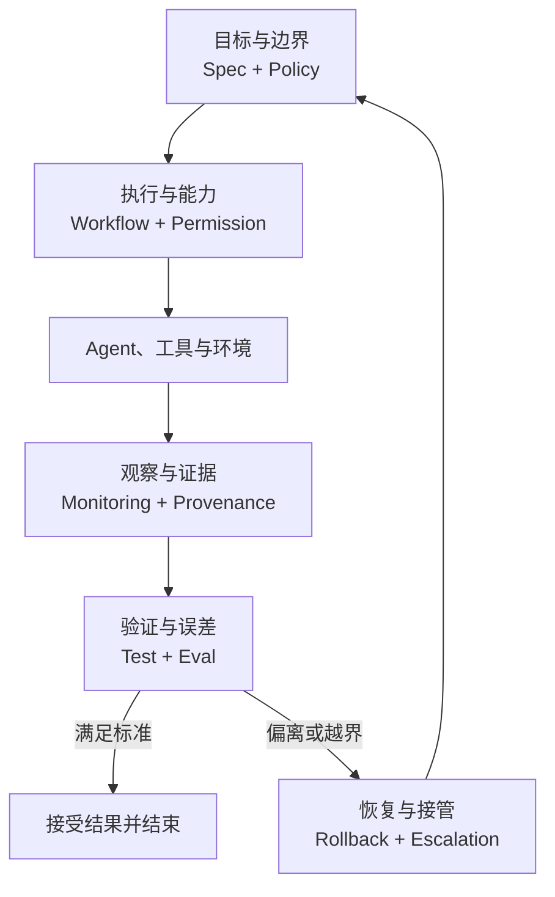

# 从 Coding 到 Control：Agent 时代真正的工程对象变了

> 当生产主体从人转向 Agent，工程的核心对象也会从 Implementation 转向 Control System。真正的问题不再只是“怎样让 Agent 更聪明”，而是：怎样让一个本质上不完全可靠、却能够真实行动的系统，持续产生可接受、可验证、可恢复的结果。

最近做 AI Coding，我越来越强烈地感到：人的注意力正在离开“怎样写出这段代码”，转向“怎样控制最终结果”。

这里的 Control 不是逐行指挥 Agent，也不是把一份 SOP 写得越来越长。它包括目标怎么定义、数据从哪里来、什么行为绝对不能发生、Agent 实际拥有什么权限、结果怎样验收、运行过程如何观察，以及失败之后如何撤销和接管。过去散落在产品、工程、安全、数据治理和 SRE 团队里的工作，正在 Agent 系统里汇合成同一个问题。

这个变化已经能从 2026 年的工程实践中看见。OpenAI 在一项“所有代码均由 Codex 生成”的内部产品实验中，把工程师的新职责概括为设计环境、表达意图和建立反馈回路；其经验并不是把实现过程管得更细，而是机械化地执行架构不变量，在边界内给 Agent 自由。Anthropic 对 Agent Eval 的总结，则把完整轨迹、工具调用、环境终态和多次试验纳入评估对象。Microsoft 和 AWS 的实践进一步把策略执行、身份、最小权限、审计与恢复机制放进 Agent 的运行路径，而不是只写在提示词里。

这些实践今天仍分散在 Harness Engineering、Spec-Driven Development、Policy-as-Code、Agent Evals、Observability、Provenance、Runtime Governance 等不同话题之下。但如果换一个视角，它们其实是同一个系统的不同部件：**Agent Control System**。

我把设计、实现和治理这套系统的工程范式称为：**Agent Control Engineering**。

---

## 一、为什么 Agent 工程正在变成控制工程

传统软件的基本链路是：

**Human → Code → Machine Execution**

人把决策写进程序，机器按照相对确定的逻辑执行。需求可能模糊，代码也可能有缺陷，但一旦进入运行期，系统行为主要由显式实现决定。因此，工程工作的中心长期是 Implementation：设计逻辑、编写代码、调试代码、审查代码。

Agent 系统的链路发生了变化：

**Human → Control System → Agent → Tools / Environment**

模型会根据目标、上下文和环境状态动态规划；同一个输入可能产生不同轨迹；工具调用会修改外部世界；中间结果又会反过来改变后续行动。此时，系统行为不再由某一份代码完整预先规定，而是由模型、上下文、工具、权限、数据源、运行时和反馈机制共同生成。

因此，工程师很难再通过“提前写完所有正确步骤”来保证结果。人的主要职责逐渐变成：

- 定义最后什么必须成立；
- 限定哪些状态不可接受；
- 决定 Agent 能调用哪些真实能力；
- 控制它据以判断的知识和数据；
- 建立能发现偏差的测量系统；
- 在偏差出现后纠正状态或转移控制权。

OpenAI 2026 年 2 月公布的 [Harness Engineering 实践](https://openai.com/index/harness-engineering/) 是一个很清楚的样本。一个小团队用 Codex 构建了约百万行规模的内部产品，人工没有直接编写代码；当 Agent 工作失败时，工程师首先追问的不是“怎样换一种提示再试一次”，而是系统缺少了什么工具、边界、文档或反馈。最终，他们把最困难的问题归结为环境、反馈回路和控制系统的设计。

这并不意味着代码消失了。恰恰相反，许多 Control 最终仍要以代码实现。改变的是代码的角色：它不再只承载产品功能，也开始承载目标检查、权限闸门、策略执行、上下文选择、轨迹记录、评估、恢复和治理。

换句话说，**代码仍是材料，但 Control System 正在成为作品本身。**

---

## 二、Control 控制的不是思考过程，而是可行解空间

“控制”很容易被误解为要求 Agent 严格照着人写好的步骤执行。那是 Micro-control：试图规定每一步搜索什么、调用哪个工具、以什么顺序思考。模型能力越强，这种控制往往越脆弱，因为它把人的旧解法固化成流程，也压缩了 Agent 寻找更优路径的空间。

Agent Control Engineering 关注的是 System-control。它不要求我们控制每一个 token，而是控制 Agent 可以抵达的状态、可以采取的动作、可以相信的证据，以及偏离目标后系统如何响应。

借用控制理论的语言，可以把 Agent 的运行抽象为：

$$x_{t+1}=F(x_t,u_t,d_t)$$

其中，$x_t$ 是当前环境状态，$u_t$ 是 Agent 选择的动作，$d_t$ 是系统无法完全预知的扰动，例如模型随机性、错误信息、API 故障、环境变化、恶意输入或并发冲突。Spec 给出期望状态 $r$，Eval 测量观察结果与 $r$ 之间的偏差，而 Policy 与 Permission 则约束 $x_t$ 和 $u_t$ 的合法范围。

这里使用控制理论是一种工程抽象，而不是声称现有 Agent 已经满足经典控制系统的全部数学假设。Agent 的状态通常不可完全观测，环境也未必平稳，很多质量指标甚至只能近似测量。正因为如此，我们更不能依靠一次提示或一次验收，而需要多种 Control 共同构成闭环。

这套闭环至少包含八类控制：

| Control | 主要控制变量 | 它必须回答的问题 | 缺失后的典型后果 |
|---|---|---|---|
| Spec | 目标状态 | 最后什么必须成立？ | 做了很多事，却没有完成真实目标 |
| Workflow | 状态转移 | 工作以什么阶段、依赖和检查点推进？ | 过程失序、循环失控、交接断裂 |
| Policy | 可接受状态空间 | 什么无论如何都不能发生？ | 局部成功破坏全局约束 |
| Permission | 可执行动作空间 | Agent 实际能够做什么？ | 软性规则挡不住真实越权 |
| Source / Provenance | 认知输入与证据链 | 它凭什么相信、结论从哪里来？ | 基于错误或过期事实高质量地犯错 |
| Test / Eval | 结果误差 | 实际结果距离目标有多远？ | 无法区分进步、退化与偶然波动 |
| Monitoring | 运行状态 | 此刻究竟发生了什么？ | 系统失控后仍不可见、不可诊断 |
| Rollback / Escalation | 异常处置 | 出错后怎样恢复，由谁继续决定？ | 错误扩散，或在不确定中盲目重试 |

它们不是八个可以随意勾选的功能。Spec 没有 Eval 就只是愿望，Eval 没有 Monitoring 就缺少运行证据，Policy 没有 Permission 就只是劝告，Rollback 没有 Provenance 就不知道该恢复什么，Escalation 没有 Identity 就不知道应把控制权交给谁。

真正的 Control 来自这些机制的咬合。



---

## 三、Spec Control：定义目标状态，而不是提前写完解法

很多所谓 Spec-Driven Development，只是把 Prompt 写得更长、更细。这样的文档经常把目标、方案、步骤和实现细节揉成一团，表面上信息充分，实际上无法判断 Agent 究竟有没有完成任务。

Spec 的核心职能不是描述“先做 A，再做 B”，而是把人的意图转化为一个尽可能可判定的目标状态：哪些行为必须出现，哪些现有行为不能改变，成功标准是什么，边界条件是什么，哪些结果明确不在本次范围内。

一个高质量 Spec 最重要的属性不是篇幅，而是**可判定性**。工作结束后，另一个 Agent、自动测试或人类审查者应该能在不依赖执行者自我陈述的情况下，判断 `satisfied` 或 `not satisfied`。如果“完成”的定义仍然只能由执行 Agent 自己解释，系统实际上没有建立目标控制。

2026 年 8 月发布的一篇 [Spec-Driven Development 预印本](https://arxiv.org/abs/2609.00252) 把 specification 描述为人和 Agent 之间的“contract substrate”，认为它重新建立了 accountability、verifiability 和 transferability。这个提法与 Agent Control 的方向高度一致，但需要保持证据边界：作者明确说明该研究主要基于灰色文献和概念分析，是迈向共识的第一步，而不是已经得到实证验证的理论。

所以更严谨的结论是：**Spec 作为契约层正在成为重要实践，但怎样写出稳定、完备、可机器判定的 Agent Spec，仍是开放问题。**

Spec 与 Workflow 的边界也必须清楚。Spec 控制“到哪里”，Workflow 控制“经过哪些阶段”。如果把路径写进目标，一旦 Agent 找到更好的方法，系统反而会把正确结果判成错误执行。

---

## 四、Workflow Control：控制状态转移，不要微观管理解法

传统 SOP 往往把人的经验编码成固定步骤。这在执行者能力不足、任务变化缓慢时有效；但在 Agent 系统里，过细的流程可能迅速退化为一条脆弱脚本。

AI Native Workflow 更适合从 Step-by-step Control 转向 State-transition Control。与其规定“先搜索三个页面，再调用某个工具，然后写五点摘要”，不如定义 `Research → Verify → Synthesize → Review` 四个状态，并为每个状态声明输入、输出、完成条件、可用工具、预算和失败路径。

Workflow 应重点控制：

- 阶段和依赖关系；
- 结构化输入与输出；
- checkpoint 与 handoff；
- 并行、重试和超时；
- 进入下一状态的条件；
- 停止、取消与恢复条件。

在这些边界内部，Agent 可以自主决定搜索策略、工具组合和迭代次数。这样既保留模型的局部智能，又让系统拥有可观察、可恢复的宏观结构。

由此可以推出一个重要趋势：

> **模型能力越强，Workflow 的微观约束可以越少；Policy、Permission、Eval 和 Monitoring 的系统约束必须越强。**

能力升级减少的是对“如何思考”的规定，不是对真实结果和风险的治理。

---

## 五、Policy 与 Permission：一个定义规则，一个控制能力

Policy 和 Permission 经常被混为一谈，但两者解决的是不同问题。

Policy 定义的是不变量：无论 Agent 正在完成什么任务，哪些条件都必须成立。例如，用户只能访问自己的租户数据，PII 不得发送给未经批准的服务，生产数据库的结构变更必须经过人工批准。

Permission 定义的则是事实能力：Agent 此刻拥有哪些凭据、工具、资源和操作范围。Policy 说“你不应该删除生产数据库”，Permission 则让 Agent 根本拿不到删除能力，或者要求删除请求依次经过策略判断、人工批准和短时凭据签发。

如果一个 Agent 持有生产环境 root credential，却只在 system prompt 中写着“不要执行危险操作”，那不是权限控制，只是行为期待。

[Open Policy Agent](https://www.openpolicyagent.org/docs) 的成熟经验是把策略决策与策略执行解耦：应用提交结构化输入，独立策略引擎根据 policy 和 data 返回决策。Agent 时代最值得继承的不是某一种具体语言，而是这条架构原则：

> **Model proposes. Control plane disposes.**

模型可以提议动作，但高风险动作是否真正执行，应由模型推理之外的确定性控制层决定。

这个方向在 2026 年已经明显加速。Microsoft 发布的 [Agent Governance Toolkit](https://opensource.microsoft.com/blog/2026/04/02/introducing-the-agent-governance-toolkit-open-source-runtime-security-for-ai-agents/) 将 policy engine 放在执行路径中，在动作发生前进行拦截；AWS 公布的 [Cedar 多 Agent 授权参考实现](https://aws.amazon.com/blogs/security/enforce-least-privilege-authorization-in-multi-agent-ai-chains-using-cedar/) 则在 Agent-to-Tool、Agent-to-Agent 和 Originating User 三层分别评估权限，并在任一层拒绝时停止。

AWS 的案例揭示了多 Agent 系统里一个容易忽视的问题：授权不能因为委派而静默扩大。下游 Agent 不应自动继承上游 Agent 的全部权力；每一跳都需要保留原始用户身份、委派范围和当前任务上下文，并重新计算允许动作。

因此，未来的 Permission 不只是静态 IAM，更接近动态 Capability Allocation：

$$AllowedActions_t=f(Task,Identity,Context,Risk,Resource,Time)$$

权限应尽量短时、按任务授予、可撤销，并与真实执行环境绑定。否则，再精致的 Policy 也可能停留在纸面。

---

## 六、Source 与 Provenance：控制 Agent 所认识的世界

一个 Agent 可能推理得非常好，却基于错误、过期或被污染的信息完成任务。模型越有说服力，这类错误越危险，因为输出在语言上看起来往往是完整而自信的。

Source Control 决定哪些信息可以进入 Agent 的认知环境：什么是权威来源，哪个版本有效，数据新鲜度要求是什么，来源冲突时谁优先，哪些数据只能读取而不能传播。

Provenance Control 记录证据链：某个结论来自哪个数据集、文档或 API，何时读取，使用了哪个版本，经过哪些转换，由哪个 Agent 或工具产生，后来又被谁引用。

这不仅是“给答案加几个链接”。链接只能证明页面存在，Provenance 要证明**该结果是怎样由这些证据生成的**。

软件供应链已经为此提供了可借鉴的结构。[SLSA v1.2](https://slsa.dev/spec/v1.2/provenance) 将 provenance 定义为能够把 artifact 沿复杂供应链追溯到来源的可验证信息，并记录它在何时、何地、以何种方式产生。把这个原则扩展到 Agent 系统，可以得到四种重要的可追溯对象：

- Answer Provenance：回答依据了哪些证据；
- Data Provenance：数据来自哪里、如何变化；
- Decision Provenance：某项判断由哪些规则与观察支持；
- Action Provenance：谁依据什么授权执行了哪项动作。

这是从软件供应链向 Agent 决策链的类比和扩展，目前还不是一套统一标准。但企业要真正信任 Agent，迟早不仅会问“答案是什么”，还会问“为什么可以相信它，以及出了问题怎样复现当时的判断”。

---

## 七、Test 与 Eval：不是收尾 QA，而是闭环中的传感器

如果 Spec 定义 Desired State，那么 Test / Eval 定义的就是 Measurement Function：系统如何测量实际结果与目标之间的距离。

传统 Test 适合确定性属性：API 是否返回正确状态码，schema 是否匹配，数据条数是否守恒，越权请求是否被拒绝，构建是否通过。Agent Eval 则需要覆盖随机性和语义属性：研究是否完整，回答是否 grounded，设计是否符合品牌，代码是否可维护，交互是否真正解决了用户问题。

两者不能互相替代。只做单元测试，可能验证“程序能运行”却漏掉“用户目标没有完成”；只用 LLM Judge，又可能把本可精确判断的问题交给一个有随机性的评分器。

Anthropic 在 [Agent Evals 实践](https://www.anthropic.com/engineering/demystifying-evals-for-ai-agents) 中强调，Agent 会跨多轮调用工具、修改环境并根据中间结果调整，所以评估不能只读最后一句回答。一次 trial 的 transcript 或 trajectory 应记录输出、工具调用、中间结果和交互，而 outcome 应检查环境里的真实终态。例如，Agent 声称“机票已经预订”并不等于成功；数据库里是否存在有效预订才是结果。

一套更完整的 Eval 至少应同时观察三个层面：

1. **Outcome**：最终环境状态是否满足 Spec；
2. **Trajectory**：是否使用了合规、有效且不过度昂贵的路径；
3. **Robustness**：在输入变化、工具故障和多次采样下是否仍能稳定完成。

Eval 还必须接受反向审查。指标可能不完整，LLM Judge 可能漂移，Agent 也可能找到“通过评测但没有完成目标”的捷径。因此，Eval 不是绝对真理，而是需要版本化、校准和持续扩展的控制器件。

---

## 八、Monitoring：让运行状态可见，而不是代替质量判断

Monitoring 与 Eval 有一个关键边界：

**Monitoring 回答 What is happening；Eval 回答 Is it good。**

一次 Agent 运行至少需要能够追踪：使用了哪些模型和工具，读取了哪些来源，获得了哪些授权，修改了什么外部状态，发生了多少次重试，消耗了多少时间与成本，在哪个 checkpoint 停止，以及各个子 Agent 之间如何交接。

这意味着 Agent Observability 的核心单位不应只是一次 HTTP request，而应是一条完整 trajectory：

**Goal → Context → Decision → Tool Call → Observation → State Change → Next Decision → Outcome**

但“记录得越多越好”也不是正确答案。轨迹中可能含有个人数据、商业秘密、凭据或模型内部信息。Monitoring 本身同样需要数据最小化、访问控制、保留期限和脱敏策略。可观察性是 Control 的前提，却也会创造新的风险面。

OpenAI 2026 年 5 月公布的 [Agent Improvement Loop](https://developers.openai.com/cookbook/examples/agents_sdk/agent_improvement_loop) 展示了反馈怎样闭环：真实 traces 产生人类与模型反馈，反馈被转化为可重复运行的 evals，再据此提出 harness 变更，并由下一轮验证确认是否真的改善。重要的不是其中某个工具，而是这条链路把运行事实、人的判断、质量标准和系统修改连接了起来。

没有 Monitoring，组织只能看到 Agent 说它做完了什么；有了 Monitoring，组织才能依据环境变化和工具结果知道它实际做了什么。

---

## 九、Rollback 与 Escalation：一个恢复状态，一个转移控制权

Rollback 和 Escalation 都属于 Failure Control，但两者不应混为一谈。

Rollback 改变系统状态：撤回 commit、取消事务、恢复快照、回滚部署、撤销配置。它解决的是“怎样回到一个已知安全状态”。

Escalation 改变 Controller：从当前 Agent 转交给 verifier agent、更强模型、领域专家、授权操作员或人类负责人。它解决的是“当前控制者已经不适合继续决定时，由谁接管”。

成熟系统不能等失败发生后才临时思考怎样恢复。每种动作在执行前就应被分类：

- 是否可逆；
- 是否幂等；
- 是否有补偿事务；
- 是否需要 checkpoint；
- 最大 blast radius 是什么；
- 达到什么阈值必须停止或升级。

对不可逆动作，所谓 rollback 可能根本不存在。发送邮件、公开发布、真实转账或泄露数据，无法靠“恢复快照”抹去。此时控制点必须前移到预览、审批、限额和分阶段提交。

Escalation 也不等于“遇到错误就问人”。更合理的是建立分级阶梯：自动重试、替代策略、独立验证、切换模型、人工批准、人工接管。只有当低成本机制无法安全消除不确定性时，才消耗稀缺的人类注意力。

OpenAI 的 Harness Engineering 案例中，Agent 已能自行验证、修复构建失败并响应反馈，只在需要判断时升级给人。这更接近 **Human-on-the-loop**：人设计并监督控制系统，而不是被迫批准每一个低风险步骤。

---

## 十、八类 Control 可以收敛为四个控制平面

把八类 Control 放回系统架构，可以进一步收敛为四个平面。

**第一层是 Intent Control：Spec + Policy。** Spec 定义我们要去哪里，Policy 定义哪些地方无论如何都不能去。一个控制目标，一个控制边界。

**第二层是 Execution Control：Workflow + Permission。** Workflow 规定任务怎样跨状态推进，Permission 决定每个状态下真实可用的能力。一个控制路径，一个控制动作空间。

**第三层是 Epistemic & Quality Control：Source / Provenance + Test / Eval。** 前者控制 Agent 根据什么事实行动，后者控制我们凭什么相信结果。一个约束认知输入，一个测量输出质量。

**第四层是 Runtime Control：Monitoring + Rollback / Escalation。** Monitoring 让当前状态可见，Rollback 和 Escalation 在系统偏离时恢复状态或转移权威。一个建立反馈，一个完成纠偏。

这四层共同构成 Agent Control Plane。模型、Agent、工具、浏览器、计算机、API 和数据库则属于 Execution Plane。

两者分开之后，一个长期混乱的问题会变得清楚：Harness 是 Control Plane 的技术载体之一，但不等于全部 Control。Spec 的形成、Policy 的责任归属、Eval 的质量标准和 Escalation 的组织授权，既有运行时机制，也有方法和治理问题。

因此，**Harness Engineering 更接近“怎样承载控制”，Agent Control Engineering 则研究“需要控制什么、这些控制怎样闭环，以及谁有权改变控制”。**

---

## 十一、最危险的不是 Control 缺失，而是 Control 彼此脱节

很多系统看似已经拥有所有组件，却仍然不可控，原因是每种 Control 各自存在、彼此没有形成约束关系。

一种常见错误是 Spec 和 Eval 分离。产品文档写着“回答必须完整可靠”，Eval 却只测响应速度；系统于是会稳定优化一个与真实目标无关的指标。

第二种错误是 Policy 和 Permission 分离。安全规则要求不得访问敏感数据，但 Agent 的工具仍持有全量数据库凭据；一次提示注入就可能把软约束击穿。

第三种错误是 Source 和 Provenance 分离。系统允许引用“权威来源”，却不记录读取时间、版本和转换过程；最终只能证明某份资料存在，无法证明结果确实由它产生。

第四种错误是 Monitoring 和 Recovery 分离。团队拥有漂亮的 trace dashboard，却没有 kill switch、checkpoint 或补偿动作；它能实时看见事故发生，却不能缩小事故。

第五种错误是 Rollback 与动作语义分离。系统对不可逆外部动作仍然承诺“失败自动回滚”，把技术上不存在的能力写成流程安慰剂。

第六种错误是 Workflow 与 Permission 分离。流程允许把任务交给子 Agent，但授权系统没有在委派时收窄能力，导致权限沿调用链不断放大。

所以，对 Control System 的评审不能只问“有没有这个组件”，还要问：**它读取谁的状态，约束谁的动作，产生的信号交给谁，以及失败后触发什么。**

---

## 十二、真正的治理难题：Control of Controls

在八类 Control 之外，企业级系统还需要三个 Meta-Control。

第一个是 **Identity / Ownership**。每次行动都必须回答：谁提出任务，哪个 Agent 执行，它代表谁的授权，谁拥有结果，出了问题由谁负责。没有稳定身份，Permission 无法计算，Provenance 无法成立，Escalation 也找不到接管者。

第二个是 **Budget / Resource Control**。Agent 不只可能做错，也可能无限循环、重复调用 API、启动过多子 Agent，或者以不成比例的成本完成一个低价值任务。因此时间、token、费用、工具调用次数、并发数和外部资源配额，都应该成为一等控制变量，而不是事后统计。

第三个，也是最关键的，是 **Control of Controls**：

谁可以修改 Spec？谁可以放宽 Policy？谁可以扩大 Permission？谁可以改变 Source 优先级？谁可以删除失败样本或降低 Eval 阈值？谁可以关闭 Monitoring？谁可以改变 Escalation 条件？

一个危险的 Agent 未必需要直接违反规则。它只要能够修改规则、评分器或证据源，就可能让原本不合格的行为变得“合格”。

因此，所有 Control Artifact 本身都必须被版本化、审查、测试、授权、追溯和审计。对它们的变更应拥有比普通业务代码更严格的保护级别。尤其不能让同一个执行主体同时拥有行动权、修改验收标准的权力和删除审计证据的权力。

这也是 Agent Control Engineering 最终进入组织治理的地方：人类真正需要掌握的，不再是每一个执行步骤，而是**谁能改变控制系统，以及控制系统是否仍忠实代表组织意图。**

---

## 十三、模型越强，Control 应该变少还是变多？

一个直觉是：模型越聪明，规则越少，系统越简单。这个判断只对了一半。

随着能力提升，Agent 确实更不需要人在局部规定每一步怎样做，Micro-control 应该减少。但更强的模型能够规划更长的任务、组合更多工具、操作更大范围的资源，也能以更快速度放大一个错误。

可以把这条链路写成：

**Capability ↑ → Autonomy ↑ → Action Surface ↑ → Blast Radius ↑**

所以正确的方向不是 Control 总量简单增加或减少，而是控制结构发生迁移：

- 更少规定它怎样思考；
- 更清楚地定义最终状态；
- 更严格地守住系统不变量；
- 更精确地分配真实能力；
- 更可靠地控制事实来源；
- 更连续地测量运行结果；
- 更完整地记录外部行动；
- 更早设计恢复与接管路径。

一句话概括就是：

> **模型越强，Micro-control 越少；System-control 越强。**

理想状态不是把 Agent 永久锁在最低权限里，而是让自主性可以根据证据逐步获得：通过更多任务、稳定满足 Eval、保持低事故率之后扩大能力；一旦异常率上升、来源失真或环境发生重大变化，又能自动收窄权限。这比“完全自治”或“每步审批”的二元选择更接近真实生产系统。

---

## 十四、怎样把这套框架真正落到工程里

最小可用的 Agent Control System 不需要一次建设成庞大平台，但应保证闭环完整。

第一步，为每类任务建立一份 Control Contract。把目标、边界、流程、能力、来源、验收、观察和失败处理分开声明，不让它们继续混在一个长 Prompt 里。

第二步，把硬约束编译进运行时。能够由 schema、policy engine、sandbox、credential scope、transaction 或 CI gate 执行的规则，不应只依赖模型“记得遵守”。

第三步，以 trajectory 为单位建立 trace，并把关键外部状态、证据版本和授权链写入 provenance。记录应足够复现决策，但遵循最小化和分级访问原则。

第四步，把 Test、Eval 和恢复动作接回运行循环。结果不合格时，系统应知道是继续迭代、切换策略、回滚状态，还是升级给更合适的控制者。

第五步，为 Control Artifact 自身建立变更治理。每次修改都要说明原因、影响范围、验证证据、批准者和回滚方案。

下面是一份非标准、仅用于说明边界的配置骨架：

```yaml
control_contract:
  spec:
    outcomes: []
    acceptance_criteria: []
    non_goals: []

  policy:
    invariants: []
    approval_rules: []

  workflow:
    states: []
    transitions: []
    checkpoints: []

  permissions:
    capabilities: []
    scope: task
    ttl: null

  knowledge:
    authoritative_sources: []
    freshness_rules: []
    provenance_required: true

  verification:
    deterministic_tests: []
    semantic_evals: []
    outcome_checks: []

  observability:
    trace_events: []
    retention: null
    redaction_rules: []

  failure:
    retry_policy: null
    rollback: null
    escalation: []

  governance:
    owner: null
    change_approvers: []
    version: null
```

这份结构的价值不在字段名，而在强迫团队回答每一种不同的控制问题。实现时，它们可以分布在多个文件、服务和组织角色中，但运行时必须能够把它们解析成一致的决策。

---

## 写在最后

AI Native Engineering 的核心，不是让 Agent 永远听话，也不是幻想一个足够强的模型从此不会犯错。真正成熟的目标是：**让系统在 Agent 不完全可靠的前提下仍然可控。**

这样的系统至少应具备六个性质：行为可约束，运行可观察，结果可验证，证据可追溯，错误尽量可恢复，超出能力时可升级。

这也是为什么“AI Coding 的重点正在从 Coding 转向 Control”不只是一次工作重心调整。它意味着工程对象本身发生了变化。

过去，人通过亲自实现每一步来保证结果。现在，人开始通过 Spec 定义目标，通过 Policy 定义边界，通过 Workflow 组织过程，通过 Permission 控制行动，通过 Source 与 Provenance 控制认知，通过 Test 与 Eval 控制质量，通过 Monitoring 建立反馈，再通过 Rollback 与 Escalation 处理失败。

未来，Agent 还会参与维护这些 Control：自动补测试、发现过期文档、更新来源、生成 Eval、监测异常、提出 Policy 变更、执行回滚。但人类必须保留更高一层的治理权：决定谁可以修改这些控制，以及它们是否仍代表我们的真实意图。

所以，Harness、Spec-Driven Development、Evals、Policy-as-Code、Agent Observability、Provenance 和 SRE 并不是几条互不相干的技术路线。它们正在汇聚成同一门工程学的不同部分：

**Agent Control Engineering。**

Harness 是它的运行载体，治理是它的外层约束，而 Control System 才是 Agent 时代真正需要被持续设计、编码和维护的核心产品。

---

## 参考资料

1. OpenAI, [Harness engineering: leveraging Codex in an agent-first world](https://openai.com/index/harness-engineering/), 2026-02-11.
2. OpenAI, [Build an Agent Improvement Loop with Traces, Evals, and Codex](https://developers.openai.com/cookbook/examples/agents_sdk/agent_improvement_loop), 2026-05-12.
3. Anthropic, [Demystifying evals for AI agents](https://www.anthropic.com/engineering/demystifying-evals-for-ai-agents), 2026-01-09.
4. Microsoft, [Introducing the Agent Governance Toolkit: Open-source runtime security for AI agents](https://opensource.microsoft.com/blog/2026/04/02/introducing-the-agent-governance-toolkit-open-source-runtime-security-for-ai-agents/), 2026-04-02.
5. AWS Security Blog, [Enforce least-privilege authorization in multi-agent AI chains using Cedar](https://aws.amazon.com/blogs/security/enforce-least-privilege-authorization-in-multi-agent-ai-chains-using-cedar/), 2026-07-06.
6. Open Policy Agent, [OPA Documentation](https://www.openpolicyagent.org/docs).
7. SLSA v1.2, [Provenance](https://slsa.dev/spec/v1.2/provenance).
8. Diaz, J., Gayoso, J., Cimminio, A., & Perez, J., [Spec-Driven Development for Agentic Software Engineering: Harnessing Human-Agent Teamwork](https://arxiv.org/abs/2609.00252), arXiv:2609.00252, 2026-08-31.（预印本；作者将其定位为概念研究，而非已验证理论。）

> 说明：本文提出的“八类 Control”“四个控制平面”与“Agent Control Engineering”是基于上述实践形成的分析框架，并非已经发布的行业标准。它的价值在于提供一套可讨论、可实现、也可被反驳和迭代的共同语言。
