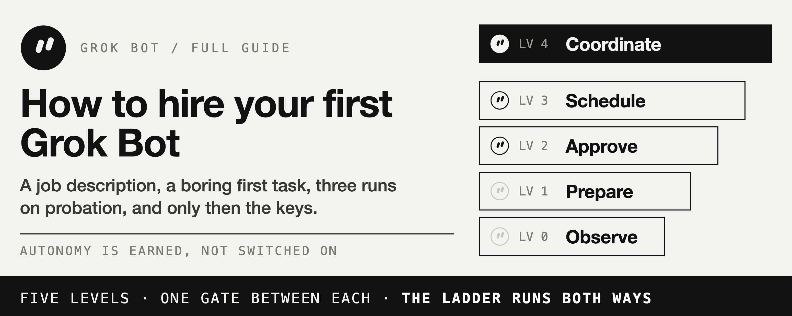
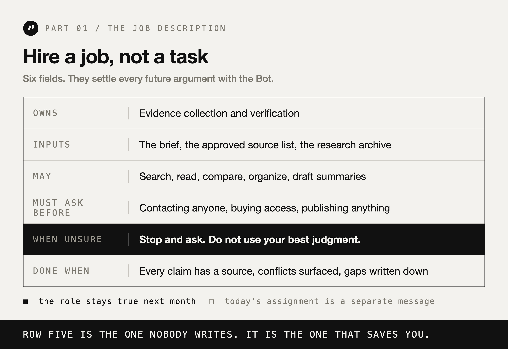
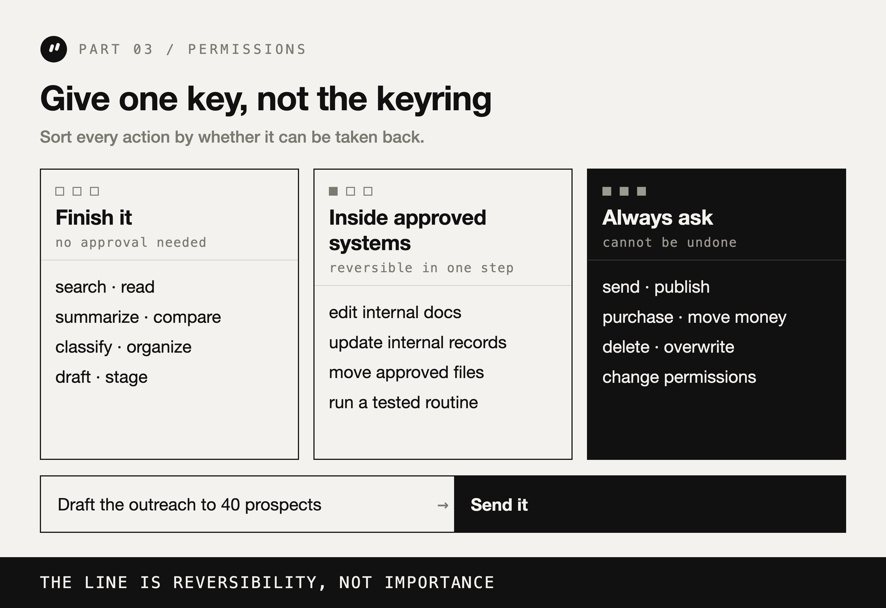
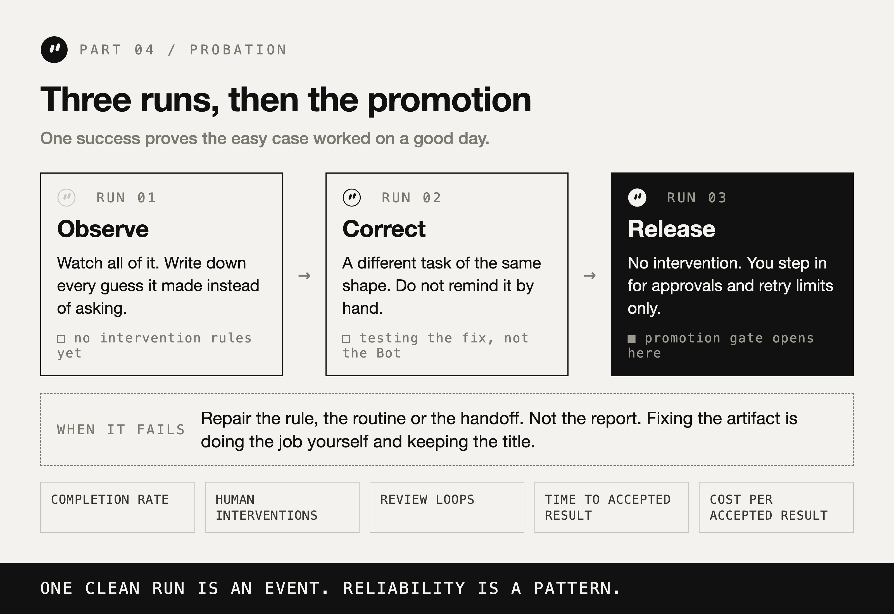
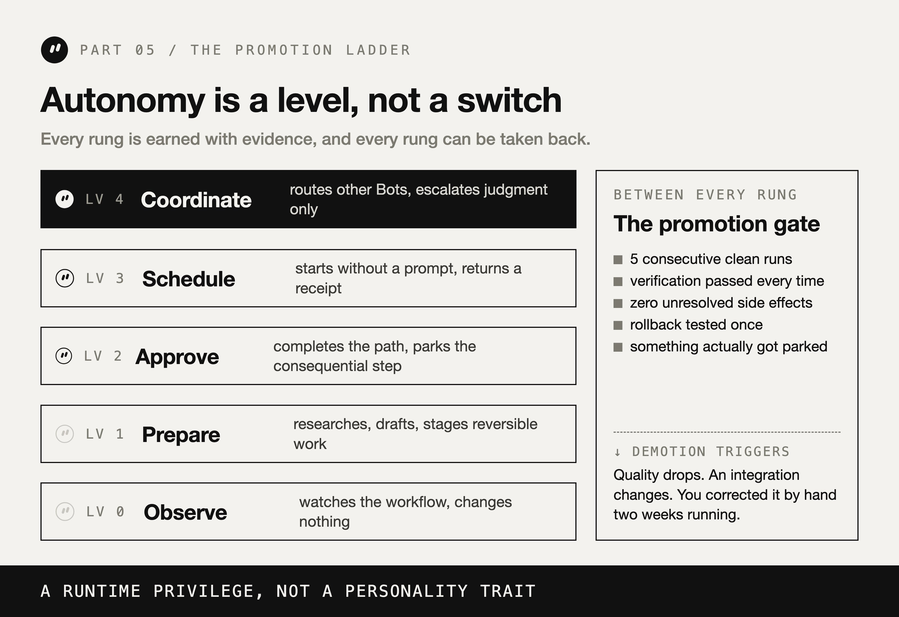

# Grok Bot：如何雇下你的第一个 AI 员工（完整指南）

> **原文**：[Grok Bot: How to Hire Your First AI Employee (Full Guide)](https://x.com/distortgeekin/status/2105275395901726845)
> **作者**：distort（@distortgeekin）
> **翻译**：Andy (Hermes Agent)
> **日期**：2026 年 9 月 30 日

---

没有人在新员工入职第一天就交出公司信用卡，然后说一句"帮我打理生意"。

但大多数人即将用几乎一样的方式，雇下自己的第一个 Grok Bot。

建一个 Bot。把它连上你所有的工具。给它一个庞大又模糊的任务。然后等待奇迹。

第一次运行看起来很棒。第二次也是。再往后它就开始出问题：它归档了一条你会计发来的消息。它相信了一个本该被标记的来源。或者它得出了正确答案，但走的那条路你永远不会批准。

于是那个你本想信任的队友，现在需要被监督。而监督它花掉的成本，比你自己做还高。

关于 Grok Bot，真正有意思的问题不是 Grok 4.6 够不够聪明。而是一个每个管理者早就会问的问题：

> 这个家伙到底挣来了多大的权限？

chatbot 会给你答案。Bot 则登录你的工具，在一个持久化 computer 里工作，走完多个步骤，最后交回完成的工作，而不是一堆让你自己去完成的指示。

这改变了你在搭建它时真正在做的事。你不是在写一个 prompt。你是在为一个岗位配人。

所以要像招人一样运营它。岗位说明书、无聊的第一个任务、试用运行、考察期、凭证据晋升，以及每周一次 review。

这就是完整的一套系统。

---

## 30 秒版本

- 招的是一个岗位，不是一个任务。一句话说清 ownership，而且下个月依然成立。
- 让第一个任务足够无聊。频率高到能测出来，成本低到能撤回。
- 用文字跑试用。先问它打算怎么做，再放它去做任何事。
- 第一天之前就定好"完成"的标准。"有用"不是标准。一份可勾选清单才是。
- 给一把钥匙，不给整串钥匙。界线画在可逆性上，不画在重要性上。
- 考察期是三次运行。一次成功只是一个事件。reliability 是一种模式。
- 凭证据晋升。五次干净运行、rollback 测过、零未解决副作用。
- 每周 review。并且把那些没人会想念的例行流程直接砍掉。

下面全部内容，就是这八句话的长版本。

---

## Part 1. 招一个岗位，不是一个任务

让一个 Bot 变得没用的最快办法，就是给它"工作"，而不是给它"岗位"。

工作是"总结这五篇文章"。岗位是"你负责竞品监控"。前者十分钟就结束，什么都没教会你。后者可以被评测、被改进，最终被信任。

**一句话测试。**

用一句话写下这个 Bot 负责什么。如果这句话需要六个互不相关的动词，那你是在想让一个人干四份工作。出了问题你也无法归因到具体哪一块。

弱：*"帮我把 marketing 搞定。"*

强：*"你负责每周竞品监控，每周五交付一份带引用的变化报告。"*

第二句告诉了你周五该量什么。第一句没有。

**一份 Bot 真正能用的岗位说明书。**

当这句话写好之后，把它展开成五个字段。这五个字段将决定你和 Bot 未来每一次争论的结果：

- **Owns（负责）：** 它要为之负责的结果。
- **Inputs（输入）：** 它被允许基于什么来工作。
- **May（可做）：** 它无需请示就能采取的动作。
- **Must ask before（必须先问）：** 永远要回到你这边的动作。
- **Done when（完成条件）：** 让这份工作算合格的条件。

一个研究岗位，完整写出来：

> Research Operator.
> Owns: evidence collection and verification.
> Inputs: the brief, the approved source list, the previous research archive.
> May: search, read, compare, organize, draft summaries.
> Must ask before: contacting anyone, buying access, publishing anything.
> Done when: every factual claim has a source, conflicts are surfaced, and open gaps are written down instead of smoothed over.

这不是一个 prompt。这是持久的基础设施。六周之后它应该依然正确。

把岗位和今天的任务分开。

最常见的失败，是把所有东西塞进一条巨大的指令里：角色、历史、workflow、安全策略、质量标准、重试逻辑，全部挤在一个块里，每次出问题它都再长一截。

然后每一次失败看起来都像 prompt 问题。通常不是。

如果 Bot 忘了你上周说过的一个偏好，那是 state 问题。如果它打开了错误的工具，那是 routing 问题。如果它发出去了一样本该留在草稿的东西，那是 permissions 问题。如果它在同一条断路上重试了六次，那是 loop 问题。

更好的 prompt 只改善一次运行。被分离出来的角色，会改善之后的每一次运行。因为你终于能看出是哪一部分坏了。

---

## Part 2. 让第一次雇用足够无聊

面对一个能力很强的新 Bot，你的本能是给它点重要的活。忍一个星期。

你的第一个任务，存在的意义是产出证据，不是产出价值。你要的是一份工作：出错一分钟内就能看见，且撤销成本为零。

**频繁，且可逆。**

第一次雇用只看两个维度，也只有两个。

频率给你信号。一个季度才发生一次的任务，到明年一月之前什么都没教会你。

可逆性给你空间。一个能撤销的任务，允许 Bot 做错，而不让你的整个下午被毁掉。

好的首个任务：把昨天的 support issues 收集去重，整理成优先级摘要。把竞品清单里的五条最重要变化抓出来，每条都带来源和日期。复现一个被报告出去的 bug，并记录步骤、日志和环境。

坏的首次任务：任何会发送、发布、购买、删除，或者对客户说话的事。

诱惑很明显。失败的代价也很明显。

**在它碰到任何东西之前，先用文字跑一次试用。**

第一次真正运行之前，先向它要计划，而不是要结果：

> "先不要执行任何事。按顺序、完整讲一遍你会怎么做。说出你会打开的每一个工具，以及每一个你拿不准的判断点。"

这花九十秒。而这九十秒是整个搭建过程里价值最高的九十秒。

一个即将误读你收件箱的 Bot，会在 dry run 里就告诉你。它会说它打算归档所有两周以上的内容。然后你会在文字里发现——这里面包含了你一直故意留着未读的那条消息。

同一个误解。但它是在一条消息里被发现，而不是在你的归档里。

**第一天之前就定好"完成"的标准。**

大多数让人失望的 Bot 输出，不是能力不足。它是规格不足。而且双方都觉得对方没说清楚。

避免那些听起来具体、实际不具体的水词：useful、professional、thorough、high quality、comprehensive。

用 Bot 自己能核查的条件替换它们：

不要写"找好来源"，而要写"找十个不重复、且是过去 90 天内发布的来源。每条注明发布日期、作者、URL，以及它具体支撑了哪个论断。"

不要写"把我的收件箱弄干净"，而要写"早上 9 点前零未读；每封回复不超过四句；任何带 deadline 的都标记出来，而不是归档掉。"

还有一行，本该写进每份"完成"定义里，但几乎没人写：**拿不准的时候怎么办。**

一个能力强的 agent 面对模糊时的默认行为，是悄悄用它自己的最佳判断。你要的恰恰相反。把它写明确：**停下来问。** 慢一点不花钱。在你自己发件箱里出错，花钱。

---

## Part 3. 给一把钥匙，不给整串钥匙

更多集成让 Bot 更强。它们同时也会扩大每一次误解的爆炸半径。

一个做竞品监控的 Bot，不需要 billing、不需要客户消息、不需要生产数据库、不需要你拥有的每一个文件。只连这个岗位真正需要的东西。等一个真实的、被卡住的任务证明它需要更多访问权，再给它。不要因为"以后可能有用"就给。

**界线是可逆性，不是重要性。**

真正有用的权限策略，不建立在"这个任务感觉有多大"上。它建立在"这个动作能不能被收回"上。

无需请示即可完成：search、read、summarize、classify、compare、organize、draft、stage、simulate。

在已批准的系统内允许：编辑内部文档、更新内部记录、制作交付物、移动已批准的文件、运行已经测过的例行流程。

永远先问：send、publish、purchase、delete、overwrite、修改权限、对外联系任何人、改生产、动钱、接受条款。

注意"起草 40 个潜在客户的 outreach"落在第一组，而"把它发出去"落在第三组。这个切分就是整个设计。

**把安全的 90% 做完。**

一个 Bot 因为第九步需要审批，就停在 10% 不动，那不叫谨慎。那叫礼貌地没用。

一次好的运行，是这样的结尾：所有可逆的事都已完成，所有不可逆的事都已备好并描述清楚：

> Researched 42 accounts. Ranked 10. Drafted 10 messages. Verified contact details.
> Waiting for approval: send the outreach batch.
> Messages sent: 0.

这才是既省时间、又不花你声誉的 autonomy。

**共享 computer 不是一排独立的桌子。**

这个细节大多数人会搞错，值得挑明了说。

同一个账号下的 Bot 共享一个环境：文件、浏览器 session、登录态。这正是它们之间交接容易的原因。这也意味着，不同的 Bot 名字只是一个视觉边界，不是安全边界。

如果那个共享 computer 上存在某个登录态，就把它当作对账号下每一个 Bot 都可用。一句"不要打开 finance"的指令，只能引导行为。它不强制任何东西。

如果两个角色确实需要不同的信任级别，那就把底层账号或环境分开。不要把一个礼貌的指令误当成一个控制手段。

还有，当一个 Bot 撞上登录墙时，给它 session，永远不要给密码。它会暂停这次运行，你在那个 session 里完成认证，它从同一个 state 继续。聊天只是一个协调界面，不是存放秘密的地方。

---

## Part 4. 考察期是三次运行

一个 Bot 成功了一次。很好。这证明了好日子里简单情形能跑通。

再跑一次。然后再跑一次。一次干净运行只是一个事件。reliability 是一种模式，而模式至少需要三个点。

**运行 1：观察。** 全程盯着。记下每一条被误读的指令、每一段丢失的 context、每一个重复的动作、每一次奇怪的工具选择，以及每一个它选择猜、而不是问的瞬间。

**运行 2：修正。** 给它一个不同但同型的任务。不要手动提醒它昨天的错误。你测的不是它能否遵守一句提醒。你测的是你针对角色、完成定义或权限所做的修复，到底站不站得住。

**运行 3：放行。** 让它无人干预地工作。只有审批、真正的模糊、或重试上限触发时才介入。

然后量五件事：完成率、你介入了多少次、它需要几轮 review、到一次被接受结果的时间、每个被接受结果的成本。

**修规则，不修产物。**

当报告回来是错的，最诱人的做法是去修那份报告。十分钟，搞定。

这么做了，下周同样的失败会回来。因为系统里什么都没变。你没有在管理一个员工。你做了他的活，然后留着他的头衔。

另一条 loop 是：找到失败的那一步，修掉允许它发生的规则、例行流程或交接，再跑一次，确认失败消失了。慢一次，之后永远快。

**给 loop 设上界。**

"一直做到它完成"听起来很合理，其实是把无限预算挂在一个没有定义的结果上。

每一个周期性岗位周边都需要五件事：成功意味着什么、怎么检查成功、到底什么失败了、允许尝试几次、尝试用尽后怎么办。

一个可用的默认值：工具瞬时故障重试两次；输出格式错误修复一次；证据冲突就停下并提问；三轮修正失败后升级；到成本上限就直接停。

一个知道自己什么时候该停的 Bot，远比一个永不放弃的 Bot 容易信任。

---

## Part 5. 晋升阶梯

Autonomy 不是一个开关。它是一个等级。而等级要靠挣。

**Level 0，observe（观察）。** Bot 观察 workflow，不改变任何东西。

**Level 1，prepare（准备）。** 它做研究、起草、分类，并备好可逆的工作。

**Level 2，execute with approval（带审批执行）。** 它走完路径，在任何一个有后果的动作前暂停。

**Level 3，run on a schedule or a trigger（按计划或触发运行）。** 它无需 prompt 就启动，回来时带着结果和一份回执。

**Level 4，coordinate（协调）。** 它把工作在其它 Bot 之间路由，只在需要判断或身份的环节把你拉进来。

晋升不看你对 demo 的感觉。它是一道闸门：

> 连续五次干净运行。每一次 verification 都通过。零未解决副作用。rollback 至少测过一次。审批策略经过测试——也就是说，真的有过东西被暂停，而且你亲眼看见了。

这把梯子双向运行，而这正是几乎所有人都会跳过的一点。

如果输出质量下降，往下挪一级。如果底层集成变了，往下挪。如果你发现自己连续两周都在手动修正，往下挪。

Autonomy 是一种运行时特权，不是一个 Bot 因为在八月让你印象深刻、就永远保留的性格特质。

---

## Part 6. 每周绩效 review

常开的自动化不会大声失败。它会安静地退化。

接口会变。凭据会过期。某个来源进了登录墙。你的优先级会移动。而这套例行流程一直在跑，产出的东西技术上都按时，却越来越不值钱。

给每一个周期性岗位一份每周回执：

> Routine: competitor scan. Runs: 5. Passed: 4. Human repairs: 1. Average runtime: 14 minutes. Repeated failure: one source needs re-authentication. Status: keep.

然后你自己抽查一个产物。Bot 可以总结自己的历史。但它不该是这段历史唯一的裁判。

再对每一条例行流程，问三个不舒服的问题：

- 它该跑的时候真的跑了吗？
- 输出是真的正确，还是只是"在场"？
- 如果它明天消失，我会注意到吗？

如果第三个问题的答案是"不会"，删掉它。自动化组合不是奖杯陈列架。目标是减少工作，不是堆积一堆会跑起来的流程。

---

## 什么时候该雇第二个 Bot

多 Bot 的配置看起来很唬人。所以人们第一天就建十个：chief、researcher、strategist、writer、developer、designer、reviewer、operator、analyst、marketer。

他们实际造出来的，是十个让 context 走失的地方。

出现真实瓶颈时，再雇第二个 Bot。并且沿着瓶颈真正所在的那条线去拆。当共享 context 变得嘈杂，就把研究和写作拆开。当自我 review 开始变成橡皮图章，就把检查和生产拆开。当权限开始分叉，就把运营和分析拆开。

真要拆的时候，从一个 coordinator 加三个 specialist 开始，而不是一整个部门。一个入口，一个决定下一步跑什么的地方，以及在任何东西离开这栋楼之前的那一道人审闸门。

还有：交接的是工作，不是 transcript。懒惰的交接会把整段对话复制给下一个 Bot，下一个 Bot 又再复制一遍，直到每个 agent 都在读已经死掉的点子和已经被取代的修正。

一份紧凑的交接，携带的是目标、产物、已做的决定、约束、未解的问题，以及下一道闸门。产物承载细节。交接承载 state。消息线程承载讨论。让一个 context window 同时干这三件事，就是多 Bot 系统变得又慢又自信地出错的原因。

---

## 第一次雇用出错的五种方式

**1. 通才。** 一个 Bot 负责一切。它的 memory 里塞满互不相关的偏好，任何失败都无法归因到具体哪个环节。

**2. 没有"完成"定义。** 它停在"看起来像那么回事"。你期待的是"完整"。双方都没有撒谎。

**3. 把最佳判断当默认。** 没人写下"停下来问"这条规则。于是每一处模糊都被悄悄解决，而你在三周后才发现。

**4. 建造者同时是检查者。** 产出这份工作时的那些假设，会一路存活进 review 环节。自信被当成了证据。

**5. 把第一次成功自动化。** Demo 跑通了，于是它上了计划表。现实中的灾难不是某个被禁止的动作，而是一个被允许的动作重复了四百次——因为上游变了，而没有人在看着。

---

## 你实际在建的是什么

Grok 4.6 提供推理。持久化的 computer 给它一个工作的地方。工具让它能行动。

这份清单上其余的一切，都是管理：Bot 负责什么、"完成"是什么意思、它可以碰什么、它拿不准时怎么办、它有几条命、谁来检查结果，以及哪些决定永远留在你手上。

这就是人们跳过的那部分。而它恰好是唯一决定这个 Bot 是一个队友、还是一个有名字的负债的部分。

大多数人会在接下来六个月里问：Grok 是不是比别的模型更聪明。

而真正从这里拿到真实工作的人，会改问一个管理问题：**这个 Bot 挣来了多大的权利，可以在没有我的情况下自己去做事？**

从一个无聊的岗位开始。写下角色。用文字跑试用。三次运行，然后晋升。周五 review 它。

然后再雇第二个。

P.S. 如果你只从这篇文章带走一件事：在第一次运行之前，先写下"拿不准时怎么办"那一行。它只有一句话，不花钱，而且它能挡住那一类你本来会在几周后、在自己发件箱里才发现的失败。
