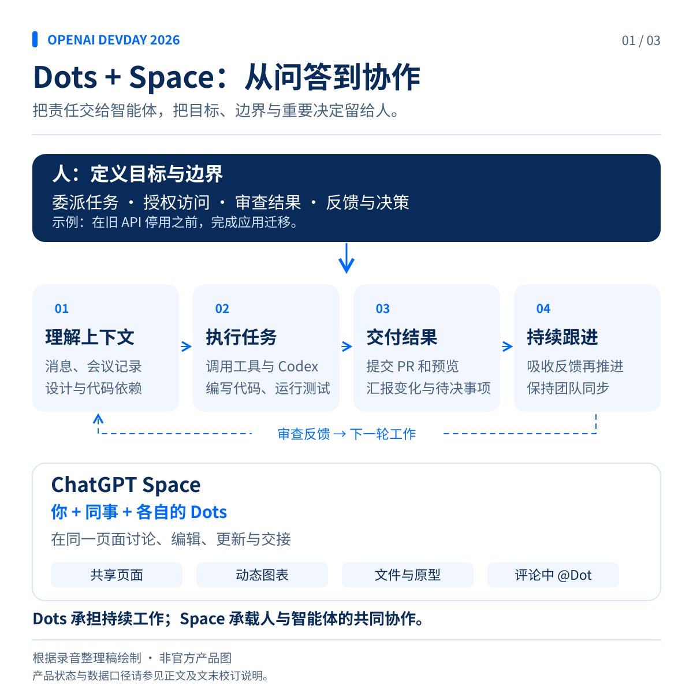
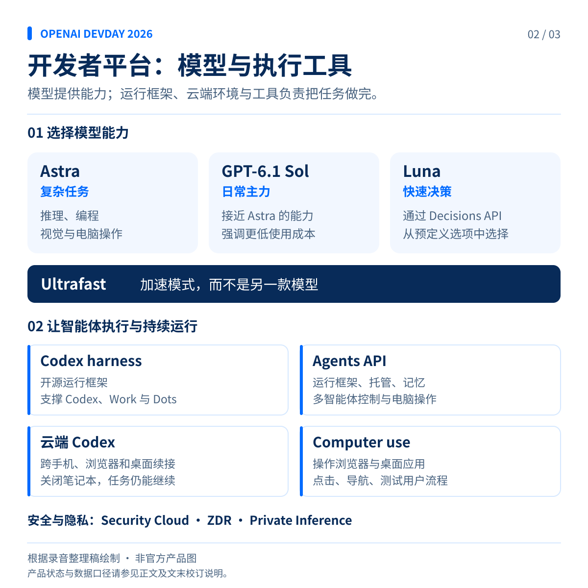
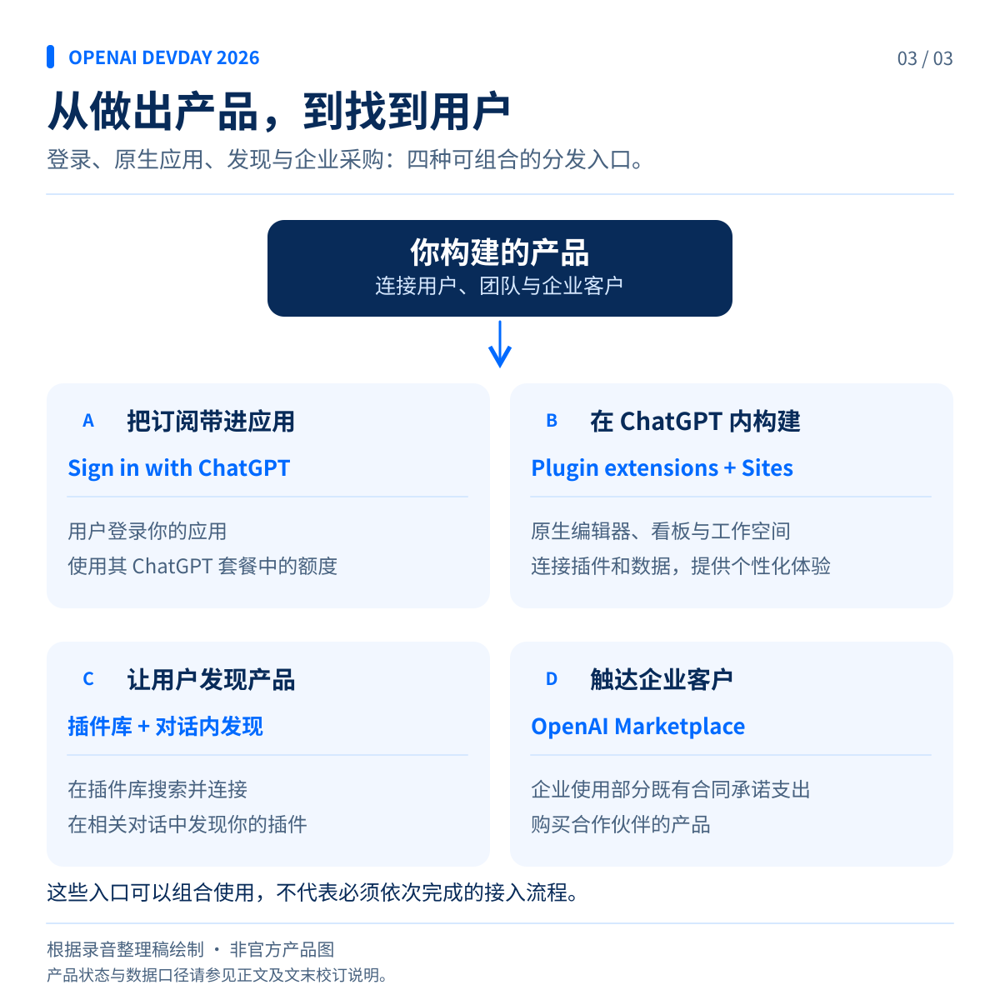

# OpenAI DevDay 2026：从对话助手到全天候 AI 协作伙伴

*主题演讲中文整理稿*

> 本文根据所附录音转写稿整理，保留不同演讲者的叙述视角。文中的“今天”、发布安排、性能数据和产品判断均对应原稿中的演讲口径；转写存疑及与官方资料不一致的部分，见文末校订说明。

## 一、开发者的反馈，正在推动产品改变

大家早上好，欢迎来到 DevDay。很高兴见到现场的各位，也欢迎在线收看的朋友。感谢大家参与。我相信，这会是我们迄今最好的一届 DevDay。

从上一届 DevDay 到现在，我们发布了很多新东西，而你们用这些工具做出了令人惊叹的产品。你们找到了许多连我们自己都没想到的模型用途，也帮助我们把产品做得更好。我们收到了数千条改进建议，其中大部分来自 Twitter。我们努力阅读每一条，并尽快付诸行动。

你们希望 Codex 支持 Linux，我们做到了；希望在同一个 Codex 项目中操作多个文件夹，现在也可以了；希望在手机上使用 Codex，我们同样把它带到了手机上。

能做出真正帮助你们的东西，让我们非常开心。接下来要介绍的，是大家呼声最高的产品之一，也是我们期待已久的东西。

## 二、Dots：把责任交给 AI，而不只是把问题交给 AI

我们首先发布一款产品。我们相信，它会带来一种全新的 AI 工作方式。这才是我们一直想象的 AI：一个始终在身边支持你的助手，就像我们从小在电影中看到的那些令人向往的 AI。

它能极大地增强你的能力，拓展你的潜力，全天候接手那些你不想做的事情，让你专注于更高层次的工作。

你可能已经在一些虚拟助手中见过这种形态的雏形：它们能帮你订餐厅、买机票。这些事情当然值得交给 AI，但与这项技术真正能做到的事情相比，它们还只是很小的一部分。

所以，我们希望更有雄心。想想你曾经想象过的未来 AI：它知道正在发生什么，知道什么对你重要，不需要你事无巨细地下指令。我们希望 AI 就是这样——许多事情，你还没有开口，它已经替你做好了。

今天，我们推出 **Dots**。

Dots 是能力出众、持续在线的智能体，旨在处理各种你能想到的任务。它们让 AI 以全新的形态参与工作，把时间和注意力还给你，让你去做真正关心的事。

### 一个会主动推进工作的助手

在介绍视频中，用户为自己的 Dot 起名叫 Alfred。

Alfred 告诉用户：“我会持续推动事情进展，重要事项需要你决定时，再来找你。”

它已经根据获批的设计，着手为网站正式上线做准备；看到 Teams 中更新的消费者体验数据后，开始修改董事会演示文稿；从 Google Meet 会议记录中发现应用迁移计划后，也已经梳理好需要调整的内容。

用户不必重新交代整个项目，只需要补充要求：“开始做吧。不过，在我审查之前，先把每一条流程与当前产品逐一核对。”

它也会处理生活中的事情。婚礼蛋糕供应商临时取消，Alfred 在通知用户的同时，已经找到了替代供应商。用户问什么时候可以试吃，它回答：“周六上午 11 点，你们两个人都有空。”

随后，Alfred 展示按秋季上新设计更新的网站。用户只需要说：“把第一张和第三张照片交换一下，然后就可以发布了。”它完成调整，网站随即上线。

董事会演示文稿也已准备好。Alfred 汇报：产品浏览量正在上升，营收同比增长 51%。用户看过后提出一个调整：“先讲消费者体验，再讲产品。”

应用重建的进度也在推进。Alfred 汇报，测试显示新版本运行更快，目前没有发现回归问题，预览和测试结果已经放进 PR。用户让它把结果发到 Slack，准备分阶段发布方案，等待自己批准。它会继续关注变化，并在有新情况时提醒。

与此同时，它还在孩子课外班开放报名后立即完成了预约。当第二天的财务评审被改到与女儿演出相同的时间时，它主动发现冲突，并提出协调改期。用户说：“请一定帮我调整。我不能错过那场演出。”安排妥当后，它继续准备会议笔记。

### 理解你的注意力应该放在哪里

对我来说，Dot 最不一样的地方，是它会逐渐了解我的工作习惯，以及我希望把注意力放在哪里。

例如，它可以检查夜间收到的信息，在我开始一天的工作之前，把紧急事项发给我。这种变化对生活的影响，甚至超出了我的预期。我感觉自己终于拿回了一部分注意力，不再像以前那样总是离不开手机。

这就是我一直想要的 AI 工作方式。

Dots 当然可以处理买机票、安排晚餐，或者推进你一直拖着没做的房屋装修。但因为它们由 Astra 驱动，并结合了我们围绕模型构建的各种能力，你也可以把更有挑战性的工作交给它们，就像把任务交给一位主动性很强的工程师，或与你共事的幕僚长。

你只需交给它一项责任：持续关注新提交的错误报告，测试修复方案并起草 PR；启动下一年度的预算编制，确保各个团队按计划推进；找出应用变慢的原因，完成修复，再用数据说明性能提升了多少。

Dots 会开始工作，并持续推进。

一个很好的例子是：“在这个旧 API 停用之前，让我们的应用彻底摆脱对它的依赖。”

这不是一个简单任务。旧 API 可能散落在整个代码库中，而你开始修改时，并不容易知道哪些地方会出问题。Dots 可以追踪依赖关系，找出所有需要调整的部分，编写代码、运行测试，再把 PR 交给团队审查。

想想过去完成这项工作需要多少人、花费多少时间，而这些人原本还可以做些什么。再想想，把所有类似的工作都交给 Dots，会发生什么。

### 自带工作环境，但控制权仍在你手中

Dots 在完成初始化后，就具备开始工作所需的条件。它们遵循你的访问权限，拥有自己的云端电脑和浏览器，可以按需编写和测试代码。

今天，你可以先从一个 Dot 开始。未来，你将能够与一整支 Dots 团队共同工作。

你也不必每次都打开 ChatGPT 才能联系自己的 Dot。即将推出的短信功能，会让你直接给它发短信，并收到回复。它也可以通过短信汇报进度、提醒变化，或者请你参与某个决定。你甚至可以给它打电话，直接交谈。

Dots 能与 ChatGPT 中的四千多个应用配合使用。初始化时，它可以使用你已经连接的插件，因此无论工作发生在哪个应用中，它都能跟进。

整个过程中，控制权始终在你手里。Dots 由我们对齐程度最高的模型 Astra 驱动，并内置保护机制与安全措施。你可以设定应用访问和电脑操作的边界，也可以针对它执行的各类操作设置自定义指令。

你可以根据自己的信任程度，决定交给 Dot 多少责任。

## 三、ChatGPT Space：让人和智能体在同一个空间协作

Dots 与你本人、你的上下文、工作流程，以及你想完成的事情紧密相连。但你还需要一个地方，与团队成员和他们各自的 Dots 一起工作。

问题是，几乎所有现有生产力软件，都不是为人和 AI 共同协作而设计的。

我们也希望改变这一点。因此，接下来发布的是 **ChatGPT Space**：一个让你、同事和智能体共同工作的空间。

Space 从一个页面开始。你可以在这里写计划、做研究、创建图像、生成数据，或者构建新东西。Dots 可以直接在页面中与你并肩工作。你可以请一个 Dot 像资深工程师那样追踪依赖关系，也可以在评论中提及它，让它立即参与任务。

页面和文件会集中保存在 Space 中，就像存放在云盘里一样。但 Space 不只是静态存储。你可以给页面设定具体指令，例如：“每天查看 API 平台的 Slack 频道，把发现的新情况更新到这里。”

我们还将推出一种直接在 Space 中制作演示文稿的新方式。你可以把演示文稿分享给团队，与自己的 Dot、同事的 Dots 一起，在 ChatGPT 内完成协作。这样的幻灯片会更容易被智能体读取和修改。

接下来，请产品团队的 Holly 展示这些功能如何配合使用。

<!-- infographic:01-dots-space:start -->

*图 1｜根据前文整理的协作流程示意。Dots 承担持续工作，Space 承载团队与智能体共同编辑的页面和产物。*
<!-- infographic:01-dots-space:end -->

## 四、现场演示：Dots 如何参与一次产品发布

*以下为 Holly 的演示。*

Dots 已经改变了我们的工作方式，甚至改变了我们开发 Dots 本身的方式。今天，我会借助一款虚构的音乐应用，展示 OpenAI 团队如何使用 Dots。

这款应用叫 **Blossom Music**，用于创建播放列表。我的 Dot 叫 **Dottie**。

Dots 可以使用你连接的各项服务。你可以把它们加入 Slack，它们也可以调度 Codex。Dottie 对我来说已经不可或缺：对于我授权它访问的一切，它既是帮我留意情况的另一双眼睛，也是能真正替我承担工作的另一双手。

### 上线前一天，主动汇集信息并推进设计实现

假设 Blossom Music 明天就要发布，眼下正是一片忙乱。但 Dottie 会替我照看事情。

今天早晨，它主动发现了几件需要我关注的事：发布评审提前了，它已经更新我的日历；昨晚我们向测试用户推出了一些新功能，它已经查看反馈；设计团队最后一刻调整了首页，它不仅注意到了，还直接把新设计发给我查看。

这些信息，平时都需要我自己从各处拼起来；更糟糕的情况是，我可能根本没注意到。但 Dottie 已经掌握了。

新设计看起来不错。不过，离上线这么近，我希望先把它做出来，亲自试一试。因为 Dottie 能访问这台笔记本电脑及其开发工具，我只需要告诉它：“把它实现出来。”稍后，我们再回来查看结果。

### 语音交流：不必重新解释背景

和 Dots 合作时，我个人最喜欢的是语音。

同事们经常开玩笑，说我总是躲在电话间里与 Dottie 聊天。但说话能帮助我思考。我喜欢边聊边探索、碰撞想法。Dottie 已经知道我是谁、我在做什么，以及为什么做，所以我可以直接进入主题，就像在和自己的第二个大脑交流。

例如，我正走进办公室，想了解昨晚 Alpha 测试的情况，就可以问：“帮我补一下昨晚用户测试的进展。”

现场演示中，Dottie 回答正在查看，但过了一会儿仍然没有给出结果。我追问进度，它依旧表示还在检查。看来，它今天早晨有点慢。

于是，我换了一项任务：“我稍后要和负责上市推广的同事评审。请把一份常见问题说明放到页面里。”它答应接手。

我喜欢和 Dottie 一对一交流，但我们也知道，最好的想法有时来自共同讨论。因此，我们在 ChatGPT 中加入了一个全新的团队协作空间：Space。

### 在 Space 中共同编辑动态内容

在页面里输入斜杠，就可以看到能够创建的内容：交互式图表、电子表格、可运行的原型，以及把想法变成现实所需的各种材料。团队成员和 Dots 都可以一起进入这里工作。

我可以提及 Rennie、Rib 这样的同事，也可以直接提及 Dottie：“请把这些内容转换成柱状图。”

这里的可视化内容是动态的。我可以按反馈类型筛选，也可以查看具体数据点。我的 Dot 还能每小时更新一次，让它始终保持最新状态。

刚才请 Dottie 整理的常见问题说明，现在也出现在页面里了。因为它拥有我的上下文，我可以直接把那些原本会拖慢我的工作交给它。

例如：“把我 Slack 私信里，那位工程师提到的新用户引导数据补进来。”Dottie 能找到那条信息。又比如：“再多吸收一些 Laura 的反馈。”我不必先把所有相关材料重新找齐。

Space 让团队和 Dots 可以一起讨论、一起创作，并保持同步。

### 在 Slack 中，把任务真正交出去

不过，Dots 对我们工作方式最大的改变，发生在 Slack 中。

我们每天都会被大量提及。有时候，一个看起来不起眼的请求，比如核对发布规格，最后会变成一个完整项目。现在，我可以把整段讨论转发给 Dottie，只说一句：“这件事你来接手，好吗？”

我的私信里已经有很多这样的任务交接。我可以自己决定，什么事情需要我的注意力，什么事情可以交给 Dot。

当 Dots 拥有独立身份后，它们就成了团队的延伸。OpenAI 内部出现了一种我们事先没想到的行为：大家开始把自己的 Dot 当作代理人，从群聊建立之初就让它们加入。

例如，在一个群聊中，Gabe 和 Patrick 分别把任务交给自己的 Dots。Dots 完成后直接在群里汇报，所有人都能了解进展。

工程师们又向前迈了一步：有人在反馈频道里贴出一个会话 ID 和用户报告的错误，Gabe 的 Dot 就会注意到，立即调查，并提交包含修复的 PR。

这是真实案例。我们的工程师已经通过这种方式，让 Dots 每天修复几十个错误。看到 Dots 的开发过程中有这么多工作也是由 Dots 完成的，确实令人惊叹。

### 从手机上的设计，到本地运行的应用

到这里，我已经向 Dot 分配了不少任务，也因此腾出时间思考、讨论，并与团队相处。

现在回到刚才的开发任务。由于这是现场演示，之前打开 Codex 会话时出现了一点错误，我再试一次。

这里展示的是，Dottie 可以在我的笔记本电脑上使用 Codex，构建应用，并在 iPhone 模拟器中启动它。

这个过程可能需要一些时间。但令人兴奋的是，我们可以从手机上的设计稿开始，经过本地执行，得到实际可运行的应用。接下来，我还可以让 Dottie 继续推进并提交 PR，而我仍然在这里和大家交流。

Dots 是我们的延伸。我们可以把自己的上下文和记忆交给它们，让它们替我们承担工作、过滤噪声。

这不仅是把同样的工作做得更快。我们在 OpenAI 已经亲身感受到：Dots 正在改变我们认为自己有能力承担的事情。当每个人都拥有这样的能力时，想象一下，我们可以一起创造什么。

## 五、从个人 Dot，到企业里的专业虚拟同事

*以下回到主讲人的发布内容。*

我个人已经等这款产品很多年了。我们迫不及待地想听到大家的反馈，了解你们会如何使用它。

按照今天演讲中的发布安排，Dots 和 Space 将向 ChatGPT Pro、Business Premium 和 Enterprise 用户开放。Dot 包含在订阅方案中，与它的对话不会消耗你的使用额度。你可以随时与自己的 Dot 协作，它全天候在线。

针对企业用户，我们今天还预览了 **specialist Dots，也就是专业型 Dots**。

它们就像由公司配置的虚拟同事，可以与整个团队一起工作，帮助扩大财务会计、市场营销、法务等高工作量业务的处理能力。

你可以向它们提供目标和上下文，审查产出，并通过反馈帮助它们改进。这些改进能够在整个公司中共享。

我们已经在 OpenAI 内部测试了这类 Dots。它们在许多不同岗位上都表现出了很高的实用价值。我们希望与企业客户一起配置这些专业型 Dots，确保它们真正适合业务需要。

我们也正在与微软合作，将专业型 Dots 集成到 **Agent 365** 中。这样，企业就可以用现有的微软工具来管理它们。

我们相信，Dots 和这些模型会赋予人们一整套新的能力，让人完成远超自己原先想象的事情。无论是扩大一家小企业的业务、改善无障碍体验，还是寻找对抗感染的方法，我们都希望人们发现：借助 AI，原本以为不可能的事情，正在变得可能。

## 六、开发者平台：模型、工具与分发

这就引出了今天的第二大主题：为大家提供一个强大的平台，让你们可以构建任何想得到的东西。

这件事包括三个方面。

首先是模型。我们希望大家能够以所需的速度和成本，获得最好的智能。

其次是更好的工具。我们希望把 OpenAI 内部使用的同一套工具交给开发者，让你们能够自由地在最适合自己的地方构建和运行产品。

最后是分发。我们希望帮助用户发现你们的作品，为你们带来新的客户。

先从模型讲起。几周前，我们发布了 Astra。我们认为，它是市场上能力最强、对齐程度最高的模型。但大家不断提出两个要求：更便宜，以及更快。

## 七、GPT-6.1 Sol：以更低成本，获得接近 Astra 的能力

今天，我们推出 **GPT-6.1 Sol**。

它在成本与能力之间取得了很好的平衡：以 Astra 五分之一的价格，提供非常接近 Astra 的智能水平，帮助你编写代码、构建产品。

它的运行成本很低。缓存输入的价格，比普通输入低 95%。这意味着，智能体可以以更低成本重复利用上下文、迭代解决方案，并持续处理更长的任务。

我们相信，你们会喜欢这个模型。它在某些方面甚至比 Astra 更聪明，也有望成为日常工作的主力。GPT-6.1 Sol 将于今天发布。

## 八、Ultrafast：让高水平智能以极高速度运行

有时，你需要的不只是低成本，而是让最强的智能以极快速度运行。

因此，今天我们在 API、ChatGPT 和 Codex 中推出 **Ultrafast**。

现有 Fast 模式的速度是标准模式的两倍，价格也是两倍。按照这份演讲转写稿中的说法，Ultrafast 以标准模式六倍的价格，提供十倍速度，达到每秒 300 个 token。我们相信，这样的速度值得付出相应成本。

现场用同一个任务进行了左右对比：让模型创建并发射一枚采用“W 配色”的火箭。左边使用 Ultrafast，右边使用标准模式。Ultrafast 生成的火箭已经开始升空，标准模式的版本还远未完成。

我们认为，目前市场上还没有同样的产品。现在，Astra 已经可以使用 Ultrafast；GPT-6.1 Sol 也将很快支持。

这些改进也会体现在 Pro 订阅中。我们推出 **Pro 500**，提供最高档的使用额度，并允许在 ChatGPT 和 Codex 中使用 Ultrafast。Pro 500 的额度是 Plus 的 25 倍。

原稿接着提到，“可以在 Pro、Pro 500 和 Pro 1000 中使用”，并宣布重新开放 Pro 1000 订阅；Pro 200 则继续提供所有前沿模型的访问权限。这一段存在重复转写和指代不清的问题，具体歧义见文末校订说明。

有了 GPT-6.1 Sol，你还将获得一个接近 Astra 水平、可以大量用于日常工作的模型。我们的目标，是在各个价格档位都提供最好的智能与能力组合。

## 九、Decisions API：在一瞬间完成选择

我们还有一项与速度有关的重要更新：今天预览新的 **Decisions API**。

它让模型能够在不到一秒的时间内回应，交互几乎像是即时发生的。现场展示了模型操作电脑的过程，它在各个步骤之间快速推进，画面没有经过加速。

它的工作方式，是向 **Luna** 模型提供一组预先定义的选项，让模型从中选择。例如，决定如何路由一个请求、对图像进行分类，或者选择智能体下一步应该采取的行动。

当模型专注于这样的选择时，我们就能把速度做得非常快，同时保留图像理解、多语言支持和安全保护等能力。

如今，OpenAI 在智能水平、价格、速度、语音和图像等各个方向，都提供了具有领先能力的模型。我们希望成为开发者构建产品的一站式平台。

我很为研究团队感到自豪。他们让这些模型拥有如此强的能力，能够以这样的规模运行、以这样的价格提供，并交到全球开发者手中。

那么，研究人员是如何做到这一切的？

## 十、AI 研究实习生：模型开始帮助我们研究更好的模型

去年这个时候，Jakub 和我在一次直播中做了一个有些大胆的预测：未来一年，我们会看到第一个 AI 研究实习生。当时，外界对这个预测的信心非常有限。

几周前，我们宣布已经实现这一目标。

我们现在有了一个 AI 研究实习生系统。它可以接手一项定义清楚、即使由熟练研究人员完成也需要投入大量时间和精力的研究任务。

接下来，请参与这些模型研发的研究人员 Tejal，介绍模型已经具备怎样的能力。

### 用模型改进电脑操作的运行框架

*以下为后训练研究负责人 Tejal 的分享。*

Astra 及相关模型擅长数学、编程和电脑操作，这些能力对研究工作都很重要。使用一个优秀模型辅助研究，可以帮助我们训练出更强、更符合人类意图的模型，再把更有用的能力带给大家。

我和同事们从事电脑操作能力的研究。模型帮助 Astra 在桌面和浏览器操作的速度、表现与安全性上，实现了显著进步。

现场展示的例子都没有加速：模型可以协助处理法律工作、设计电子游戏素材、制作数据看板，甚至填写报税资料。模型也参与了实现这些能力所需的训练改进。

其中一种方式，是让模型帮助优化我们用于电脑操作的 **harness，也就是智能体运行框架**。

图表横轴是延迟，我们希望它越低越好；纵轴是任务表现，我们希望它越高越好。我们让模型在一个持续循环中工作，不断寻找能够同时改善延迟与表现的运行框架优化方案。

随后，我们把有效改进合入实际生产环境中的运行框架，并在此基础上进行后训练。通过这些工作，我们已经把延迟降到了原来的一半以下，并将这项改进提供给用户。

### 用模型提升安全性与对齐程度

更重要、也让我很自豪的是，模型帮助我们让 Astra 的电脑操作更加安全。

它们参与改进监控机制和模型行为训练，使模型在不安全情境下更好地拒绝执行，并帮助我们在电脑操作压力测试中取得了行业领先的表现。

这意味着，模型在操作桌面或浏览器时更不容易犯错，也更有可能遵循用户的真实意图。这对大家使用 Dots 尤其重要。

### 从短任务，走向全天研究工作

模型对研究的帮助，并不限于电脑操作。

我们持续统计研究工作内部的 token 使用量。尤其从今年夏天开始，这一用量显著攀升，而我们也看到了相应回报。

我们会衡量模型完成研究任务的成功率。今年 1 月，对于耗时不到 15 分钟的短任务，模型已经有较好的成功率；但对于需要一天或更长时间的任务，绝大多数尝试仍会失败。

到了 7 月，借助模型的进步和 Ultrafast，我们已经能让模型在完全不需要人工干预的情况下，完成超过三分之一的全天级研究任务。

OpenAI 的使命，是确保通用人工智能造福全人类。我们希望模型帮助解决人类面临的一些最复杂的挑战。

Astra 等模型已经帮助解决了上百道数十年来悬而未决的数学问题。它们也在加速针对耐药感染的新抗生素研发，辅助古代语言和历史研究，推动更好的可再生能源与能源效率方案，并促进工业机器人和制造技术的发展。

我们相信，这些模型会帮助开发者和用户，在一些最重要、也最有挑战性的问题上取得实质进展。我们期待看到大家接下来会发现什么、创造什么。

## 十一、把 OpenAI 自己使用的工具，交给开发者

*以下回到主讲人的发布内容。*

支持开发者的第二个方面，是提供构建下一代产品所需的工具。我们希望大家能够使用与 OpenAI 相同的底层能力。

### 开源的 Codex harness

首先是 **Codex harness**。它支撑着 Codex、ChatGPT Work，以及现在的 Dots。

我们投入了大量精力提高这套运行框架的效率，希望尽可能以更少的 token、更快的速度，获得准确结果。它还是开源的，你们可以查看内部实现，也可以自己搭建。

为了支撑 ChatGPT 这样的产品，我们让这套框架能够大规模运行，服务数十亿用户。同样的规模能力，也会用于支持你们的产品。

### Codex 全面进入云端

接下来，我们把这些能力带到云端。Codex 现在可以完全在云端运行。

这意味着，你可以在手机上发起任务，然后在浏览器或桌面端从上次停下的位置继续，不必担心任务会话丢失，也不用因为任务还在执行，就一直让笔记本电脑保持打开。

无论你在哪里，智能体都可以继续工作。这样的云端运行框架会打开很多新的可能。

其中一个重要例子，是今天发布的 **Codex Security Cloud**。

我们希望给防御者更好的工具，帮助他们加固基础设施，因为我们看到了即将到来的安全挑战。Codex Security Cloud 在云环境中运行，持续发现漏洞，并准备经过验证的修复方案，交给你审查。

它也加入了大家呼声很高的功能，包括自动去重、定时扫描和全新界面，今天就可以开始使用。

### Agents API 与电脑操作能力

我们还推出新的 **Agents API**，把这些能力开放给开发者。

Agents API 包含运行框架、托管、记忆、多智能体控制等核心组件。这与驱动 Codex、Dots 和我们其他智能体的技术相同，现在进入公开测试阶段，开发者可以开始构建应用。

我们也把电脑操作能力带入 Agents API，让你构建的智能体能够做更多事情。

例如，你在开发一个测试网站的智能体。现在，它可以自己打开浏览器、点击页面，并实际测试用户流程。

我们还希望支持大家选择自己的基础设施。与 AWS 的合作发展得很快，我们共同推出了由 OpenAI 驱动的 **Bedrock Managed Agents**。

你可以直接在 AWS 中，紧邻现有应用和数据，构建 OpenAI 智能体。AWS 客户也能访问我们的前沿模型，并使用 Codex 和 ChatGPT Work。

### Private Intelligence：更强的数据控制

构建智能体时，安全和数据保护同样重要。

因此，今天我们预览 **OpenAI Private Intelligence**。它让你在使用最先进模型能力的同时，对数据拥有更强的控制。

结合私有安全处理的 **ZDR，即零数据保留**，可以在不把你的内容存储到我们服务器上的情况下，提供前沿模型所需的安全保障。

通过 **Private Inference，即私有推理**，我们甚至可以在推理发生时提供隐私保护。我们认为，两者结合，将为前沿 AI 的隐私保护树立新的标准。

我们与一些最大的客户密切合作，设计符合其最高要求的隐私和安全机制，让他们能够把这些智能能力应用于最敏感的工作。你们也可以使用这些能力。

### 在规模增长中，继续提升速度与可靠性

所有这些能力，以及大家正在构建的产品，都需要速度和可靠性作为基础。

过去一年，Responses API 的使用量增长到原来的 100 倍。在这样的增长下，我们仍然保持了超过 99% 的可靠性。

现在，首个 token 的等待时间已经缩短 45%，工具调用和工作流的运行速度提升超过 30%。我们还会继续改进。我们认为，这些工作已经让我们的 API 成为市场上性能与可靠性最出色的 API。

接下来，请 Romain 通过现场演示，展示如何把这些新工具组合起来使用。

<!-- infographic:02-models-tools:start -->

*图 2｜模型能力、加速模式与执行工具的分工概览。Ultrafast 是加速模式；图中不使用转写存疑的速度或套餐数字。*
<!-- infographic:02-models-tools:end -->

## 十二、现场演示：从实时构建，到电脑操作和机器人

*以下为 Romain 的演示。*

我刚刚还在海边拍照，现在就过来。Codex，能帮个忙吗？请先欢迎大家，再分享一个关于 Fort Mason 的趣闻。我会从左边的门进来，也请把演示准备好。

Codex 随后向现场与线上观众致意，并介绍：在 1915 年旧金山世界博览会上，人们就可以通过电话，听到远在纽约的声音。而今天，站在麦克风前的是 AI，台下是开发者，还有一批等待大家使用的新工具。

我很喜欢这种感觉：即使不在笔记本电脑前，也能继续用 Codex 构建东西，从任何地方发起任务。去年，我们甚至还没有 Codex 应用。如今，今天要发布的功能之多，连一半都没时间在这里演示。

### 用 Ultrafast 实时改造一个三维世界

过去几周，看到大家用 Astra 创造各种三维世界，令人兴奋。我也拍了几张会场的简单照片，想在这里重新构建出相同的空间。

我真正想尝试的，是和大家一起用 Ultrafast 实时修改这个世界。

现场语音启动时遇到了一些问题，重试后仍未顺利工作，所以我改用文字输入：“带我飞到舞台上。”

接下来，我继续操作这个三维会场。房间有些空，于是输入：“让 Dots 飞到各自的座位上。”很快，Dots 就出现在场景里。我们就这样一边操作，一边实时改变这个世界。

再试一件更大胆的事：把摄像头转向现场观众，然后告诉它：“把直播画面放到大屏幕上。”随后，直播就出现在三维会场的大屏幕中，现场观众也可以向线上观众挥手。

借助 Ultrafast，你可以构建并修改这样的世界，也可以构建其他东西，速度几乎能跟上你的思考。

### 新版 Codex CLI：双向语音与实时修改

现在，用 Codex 构建产品已经有很多种方式。我想介绍其中几个自己最喜欢的。

先切换到终端。我们全面更新了 **Codex CLI**，加入了很多大家一直希望拥有的改进。

这里有一个空的 React 项目。我原本想用语音发出指令，但现场语音仍然遇到问题。因此，我们继续使用 Ultrafast，只是这次通过命令行输入：

“构建一个应用，随机选出三位参会者。我想送他们明年的免费门票。”

使用语音，本来可以更快、更方便。我们已经把双向音频交互带入终端，它由 **GPT-Live** 驱动，与应用中的语音能力相同。这不只是听写：你可以与它实时交流，并根据进行中的工作随时作出回应。遗憾的是，这次现场没能正常展示出来。

几秒钟后，Ultrafast 已经把应用做好了。

再来改一改：“把人数改成六位。”很快，界面就完成了更新。

我们把应用全屏打开，点击抽取按钮，选出六位获得 DevDay 2027 免费门票的参会者。恭喜各位。我的 Dot 会接手后续工作，稍后通过邮件发送详细信息。

以上就是 Ultrafast 和 CLI 中的双向音频交互。大家今天晚些时候可以尝试。除此之外，我们还加入了很多其他新功能。

### Astra Adventures：从纸上草图，到能由 AI 自己试玩的游戏

回到应用。在展示下一个例子之前，我先启动项目，让它运行起来。

这个项目叫 **Astra Adventures**。想法很简单：用 Astra 制作一个三维太空飞行游戏。最初，我们只有纸上的一张草图。

经过几轮交互，游戏有了雏形，但画面还比较粗糙。拥有覆盖不同模态的优秀模型，就在这个时候体现出价值。

继续几轮之后，我们就从草图走到了纹理丰富、画面精美、可以真正用于游戏的视觉效果。之后再打磨游戏机制，游戏就基本准备好了。

这一次，我不自己玩，而是对模型说：“给我们看看你会怎样玩这个游戏。”

这里会建立一个浏览器操作连接。Astra 将自行探索游戏的控制方式，并实时学习如何游玩。它会尝试启动游戏，自己选择飞船。

屏幕左侧显示模型正在作出的决策，最右侧显示它按下了哪些键。我们可以看到，它在通过键盘操作摸索游戏玩法。

游戏本身很漂亮，但更有意思的是：它原本是为人设计的，而 Astra 正在自己弄清楚该怎么玩。

### App Shot：把应用上下文交给 Codex，自动检查不同屏幕尺寸

浏览器只是其中一种操作环境。Astra 同样擅长使用电脑上的其他应用。

我打开另一个项目，把它显示在手机屏幕上，再截取一张 **App Shot**，并口述要求：

“检查我的应用在不同屏幕尺寸下的表现，并在过程中截图。”

这是我为周末飞行课程制作的一个小项目，用来记录学习情况。我正在学飞行。

我很喜欢 App Shot，因为它可以把相关上下文带给 Codex。在这个例子中，这些上下文帮助 Codex 理解如何操作电脑，以及如何在应用中导航。

屏幕上可以看到，它开始点击模拟器、打开应用、了解不同功能、操作手机界面，并一边尝试一边截图。

看着这个过程实时发生很有意思。当然，你也可以去做其他事情，让它在后台继续执行。

### 把整个后端重写任务交给云端

现在，大家已经看到了 Codex 应用、CLI，以及远程使用 Codex 的方式。我也很期待重新设计后的云端 Codex。

它运行很快，支持笔记本电脑上 Codex 使用的同一套工具，包括插件和电脑操作。你可以把最有挑战性的任务发到云端，不必再一直开着笔记本电脑。过去一年，我们见过太多人为了让任务继续而这么做。

例如，我现在创建一个任务，不选择在本机运行，而是选择云端和相应的环境，然后输入：

“把整个后端重写为 Rust。”

这项工作显然需要更长时间，但这恰恰适合云端。我知道它会在那里执行，之后再查看进度就可以。途中有新的想法，我也可以从手机继续发送，实现无缝交接。

很多人一直希望有这个功能，我们终于在今天把它交付了。

### Microduck：把视觉、图像生成和语音接到机器人上

跳出 Codex 本身来看，我们现在已经拥有覆盖文本、音频、图像生成和视觉理解的强大模型。

令人兴奋的是，我们构建 Dots 和 Codex 时，使用的正是通过 API 提供给大家的同一套工具。因此，最后我想用一个例子，把这些模态结合起来。

Hugging Face 的朋友借给我们一台新型可编程机器人 **Microduck** 的早期版本。这一只叫 **Lavender**。昨晚，我请 Codex 把需要的功能全部连接起来。

现在试着和它交流：“看看现场观众，画一幅有意思的画。”在座的各位都会出现在这张图里。

只花几个小时，就能通过 Codex 做到这些，实在令人惊叹。我用 Astra 为它接入视觉理解，用 **GPT Image 2.5** 接入图像生成，再用 **GPT-Live-1** 加入语音智能，与这只小机器人实时互动。

我们已经给它接入了几十项能力，而且还可以继续添加。

我问它：“Lavender，听见的话就叫一声，好吗？”它发出鸭叫。我接着问：“来 DevDay 开不开心？”它回答说很兴奋。这时，刚才根据现场观众生成的图像也出来了。

这只小鸭子当然还可以走动，Astra 也可以教它更多新东西，只是现场没有时间全部展示。

需要强调的是，这还只是一个简单演示。我和一位从事机器人研究的朋友聊过，他对把我们的 API 与硬件结合感到非常兴奋。尤其是新的 Decisions API 可以处理视觉输入，让机器人根据自己看到的内容，近乎实时地快速采取行动。

稍后，大家也可以来看这只 Microduck 的实际演示。我们认为，这会打开一种在真实世界中与 AI 互动的新方式。

对构建者来说，这是一个令人激动的时代。你们可以以前所未有的速度，把出色的想法变成现实。我期待看到大家用这些新工具创造什么。

## 十三、让用户发现你的产品，并让它成为一门生意

*以下回到主讲人的发布内容。*

新模型与新工具让人能够构建出令人惊叹的东西。接下来，是支持开发者的第三个方面：帮助用户找到你的产品，并帮助你建立业务。

现在，每周约有 12 亿人使用 ChatGPT。它已经是一个很大的平台，我们希望你们能够借助它建立自己的生意。

坦率地说，我们过去尝试过一些做法，结果有好有坏。但这一次，我对我们的方向更有信心，因为我们提供给你们的，正是自己用来构建 ChatGPT 的工具。

### Sign in with ChatGPT：把订阅额度带到第三方产品

首先，我们让用户能够把自己的 ChatGPT 订阅带到你们构建的产品中。

通过 **Sign in with ChatGPT**，用户可以登录你的应用，并使用其 ChatGPT 套餐包含的 token。

这会降低体验新产品的门槛。用户已经在为 AI 订阅付费；他们开始使用你的产品时，你不必再替他们承担相应的 token 成本。

我们今天先与 16 家首发合作伙伴推出这项能力，并将很快扩大支持范围。

### Plugin extensions：在 ChatGPT 内构建完整应用

接下来，我们推出 **plugin extensions，也就是插件扩展**。

开发者现在可以构建更完整的插件：它们本质上可以是一整套应用，却拥有与 ChatGPT 原生功能相似的体验，并通过我们的平台进行分发。

你可以把编辑器、数据看板，甚至整个工作空间，直接构建到 ChatGPT 和 Codex 中。

例如，我们新的会议应用就是基于插件扩展构建的。你可以直接在 ChatGPT 中查看日历里即将开始的会议，点击“在 ChatGPT 中记笔记”。随后，这个页面可以成为新的 Space，让团队成员和 Dots 一起处理后续行动事项。

Figma 的例子展示了另一种方式：它把更多现有产品能力带进 ChatGPT。你可以打开设计、查看团队评论，并让 ChatGPT 修改设计。一边对话，一边处理设计工作。

Adobe 则展示了如何直接在 ChatGPT 中使用 Photoshop 中你喜欢的功能。

Adobe 和 Figma 都属于首批构建插件扩展的数十家合作伙伴。我们很期待大家接下来会做出什么。

### ChatGPT Sites：让同一个网站，为不同用户提供个性化体验

这些插件现在也可以进入 **ChatGPT Sites**。

Sites 上线仅几个月，就已经有人创建了数百万个不同类型的网站。现在，你的网站还可以接入已连接的插件与数据。

你可以把一个网站分享给团队，团队成员使用自己的凭证登录，并带上自己的智能体。这样，同一个网站就能根据不同用户，呈现不同的体验。

这让开发者能够更轻松地为访问者创建个性化软件。

### 在对话中发现插件，简化提交和审核

我们也希望让用户更容易发现你构建的东西。

除了以常见方式搜索插件库，用户现在还可以在对话过程中发现相关插件。当用户提出一个问题时，ChatGPT 会判断你的插件是否能提供帮助，并允许用户当场连接。

我们也收到了关于插件提交流程的反馈，因此会简化这一过程。

你可以跟踪审核进度，查看哪些地方需要修复，申请人工审核；更新插件工具时，也不需要从头重新走完整个提交流程。

### OpenAI Marketplace：让企业用已有采购承诺购买合作伙伴产品

最后，我们希望把这些能力结合起来，让开发者更容易向更多企业销售产品。

今天，我们推出 **OpenAI Marketplace**。首发合作伙伴超过 30 家，包括 CodeRabbit、Notion、Vercel 等。

企业客户现在可以把已有 OpenAI 合同承诺支出的一部分，用于购买你们的产品。这为开发者提供了另一条触达 OpenAI 现有客户的途径。

同样，如果你自己也有对 OpenAI 的合同承诺支出，也可以把其中一部分用于 Marketplace。

通过与 **Baseten** 的合作，大家从今天起，甚至可以在 Marketplace 中访问开源模型。

<!-- infographic:03-distribution:start -->

*图 3｜登录、原生应用、产品发现和企业采购的并列入口。各入口可以组合使用，并非必须依次接入的流程。*
<!-- infographic:03-distribution:end -->

## 十四、我们期待的，不只是效率提升，而是一场新的文艺复兴

今天上午，我们发布了很多东西：通过 Dots 和 Space 带来新的 AI 工作方式；推出 GPT-6.1 Sol 和 Ultrafast；预览 Decisions API；开放 Agents API；让 Codex 在云端运行；以及提供更多帮助大家建立业务、触达用户的新方式。

对我们来说，这是重要的一天。但我们想以真正让我们对 AI 下一阶段保持乐观的原因收尾：那就是你们。

每天，我们都会听到你们使用这些技术完成新事情的故事。有些事情，放在去年，还会让人觉得遥不可及：研究免疫系统，让教育更容易获得，制作帮助其他人创作的工具。

今天，一些这样的构建者也在 DevDay 现场。我们用一段视频向他们致意：

“向你们致敬，构建者，我们时代的新艺术家、创造者，推动世界前行的一代。

“你们不只是在编写代码，也在改写可能性的边界；拓展共同的创造力，让直觉引领方向。

“你们孕育新的事业，也让旧有业务焕发新生；你们打开学习的大门，解读免疫系统。

“你们创造的东西是鲜活的。它会变化，与我们共同前行。

“向你们致敬，构建者，我们时代的创造者。”

我们每天都能参与 AI 的建设，这本身很棒。但这份工作中最令人兴奋的事情之一，仍然是看到你们获得成功。你们做出的东西总让我们惊叹，而能够为你们提供这些工具，也让我们非常开心。

今天后续还有很多活动。Peter 将在主舞台分享我们如何继续投入开源社区，包括新的 **OpenClaw Enterprise Harness**。其他场次会深入介绍今天发布的产品。当天结束前，我还会与 Tibo 和 Tejal 一起回到这里，进行现场问答。

我们还安排了 **Codex Game Studio**，大家可以用 Codex 制作自己的复古游戏。我们知道，很多人可能已经尝试过类似项目，但这次希望提供一种特别的方式，让你真正玩到自己做的游戏。

因此，今天每一位现场参会者，都可以带走一台 DevDay 专属限量版 **Chromatic** 掌机。大家可以到周边商店领取，也可以参加游戏工作室活动。

有了这么多新工具，我们也希望大家尽情动手创造，所以还准备了一次额外的使用额度重置（banked reset）。我们做过太多次重置，以至于 Tibo 开玩笑说，干脆把公司改名叫“Reset Company”，似乎连周边都做出来了。

现场，我们请 Tibo 参与，一起按下重置按钮。这一次还特意说，要低调一点，不要彩纸礼炮之类的排场。大家倒数“三、二、一”，完成了这次重置。

这次重置面向全球用户，而不只是 DevDay 现场的参会者。

结束之前，我还想分享一个想法。

人们经常把 AI 称为一场新的工业革命。坦率地说，我不太喜欢这种说法。最好的 AI，不应该让人变成一台巨大机器里的齿轮，永远被催促着越转越快。

生活中有些事情，我们不能自动化，也不应该自动化。

我相信，如果我们把方向走对了，未来会更像一场新的文艺复兴，而不是另一场工业革命。

AI 应该让人更有能力掌控自己的生活，拥有更多工具去创作、学习、发现，并拓展人类的知识。

我们希望，今天发布的这一切，加上大家所拥有的创造精神，能够把我们带向那样的未来。这才是我们期待与各位一起建设的未来。

感谢你们所做的一切，感谢来到旧金山的各位，也感谢在线收看的朋友。祝大家享受接下来的 DevDay。

---

## 校订说明

**正文范围。** 原稿第 1—166 行属于 DevDay 主题演讲；第 167—181 行转入另一段有关 Factory 的访谈，并夹有 Mercury、Jira、Granola 的赞助广告，未纳入本篇。演讲中的重复句、口头停顿、掌声提示和部分舞台调侃作了合并，不影响发布内容、案例和结论。

**专名校订。** GPT-6.1 Soul 更正为 GPT-6.1 Sol；Loon 更正为 Luna；Astron 统一为 Astra；Base10 更正为 Baseten。上述产品和公司名称可由 OpenAI 的官方发布资料确认。Ramon、Romaine、Raman 统一为 Romain，Dotty 统一为 Dottie，参照现场记录中的姓名及界面文字。抽奖段落的“My daughter”按上下文整理为“我的 Dot”，属于语境校订，而非直接核听。

**速度数据。** 原稿写的是 Ultrafast“十倍速度、六倍价格、每秒 300 个 token”，正文保留这一转写口径。OpenAI 官方回顾则写为：Codex 的 token 生成速度最高提升至八倍，API 中最高提升至六倍。因此，原稿的“十倍”存在疑点，不能把两个口径视为已经相互印证。

**套餐信息。** 原稿第 66 行关于 Pro 500 的介绍重复出现，并混有 Pro、Pro 1000、Pro 200 等名称，部分代词缺乏明确指向。官方回顾确认新增 Pro 500，额度为 Plus 的 25 倍；现场观察记录写的是重新开放 Pro 200，而不是 Pro 1000。本文保留原稿中的套餐名称并标出歧义，尚不能仅凭这份转写确认“Pro 1000”究竟对应哪一处误听。

**其他待核之处。** “W colors”的具体所指不明，正文保留为“W 配色”。结尾的 Tebow、Tejpal 按上下文暂整理为 Tibo、Tejal；Tibo 是 Thibault Sottiaux 使用的名字，但这处对应关系仍宜用原音视频确认。Rennie、Rib 等缺乏充分线索的姓名按原稿保留。

**可用范围。** Dots 和 Space 的开放对象在正文中依原稿表述。官方资料另外列有适用市场、工作区管理员开通及不同产品各自的套餐条件，因此正文不应直接作为当前购买或开通指南。

校订参考：OpenAI《DevDay 2026 Recap》、OpenAI《Introducing GPT-6.1 Sol》、Simon Willison《OpenAI DevDay 2026 live blog》、The Pragmatic Engineer《Building Codex with Tibo Sottiaux》。这些资料用于核对专名和标注歧义；正文内容以用户提供的录音转写稿为基础。
