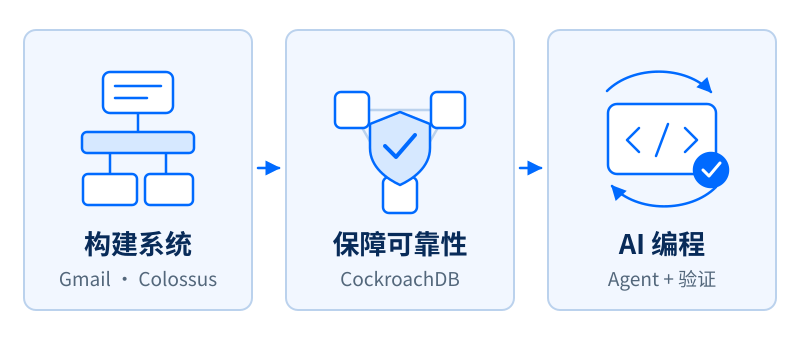
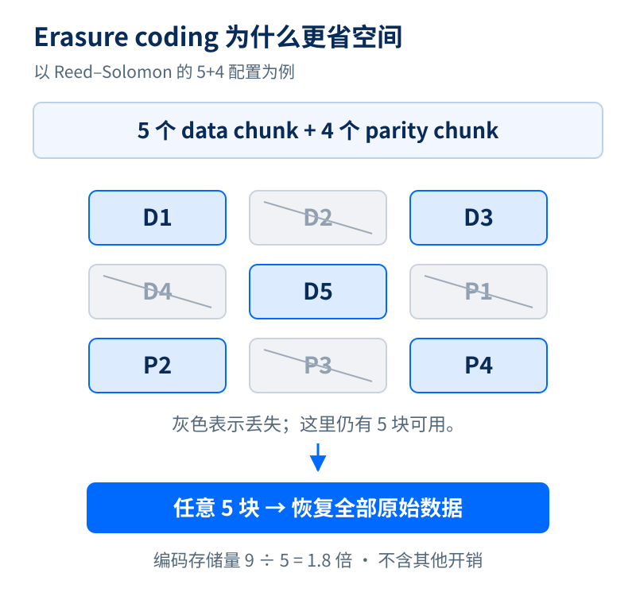
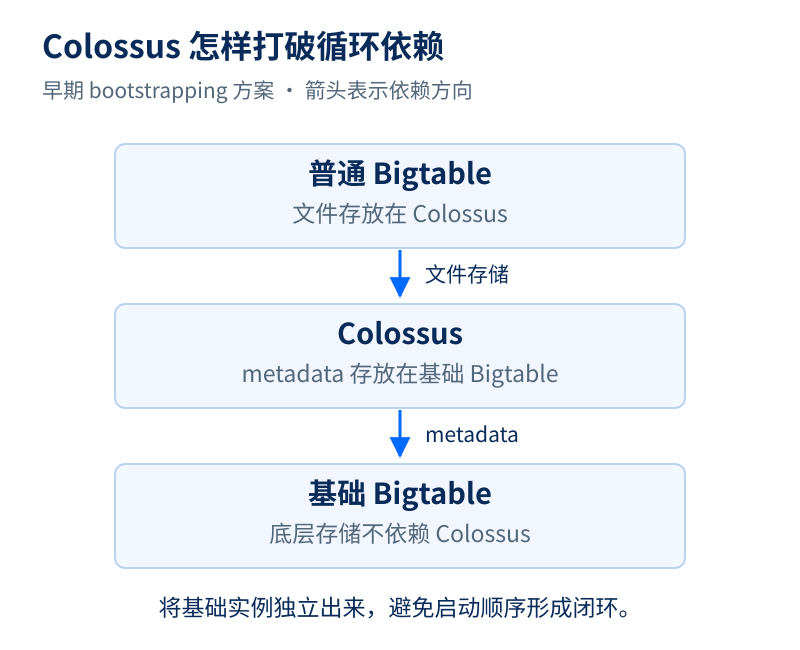
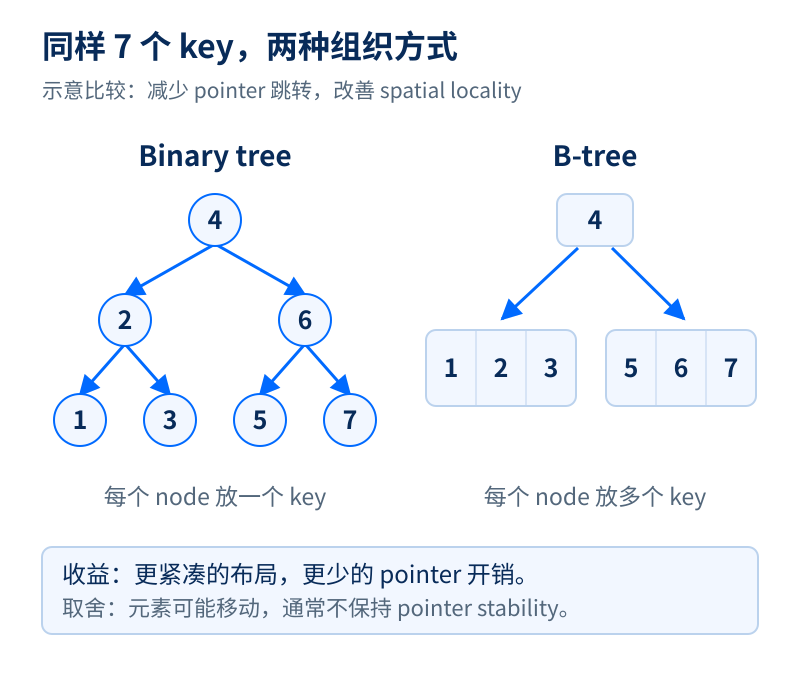
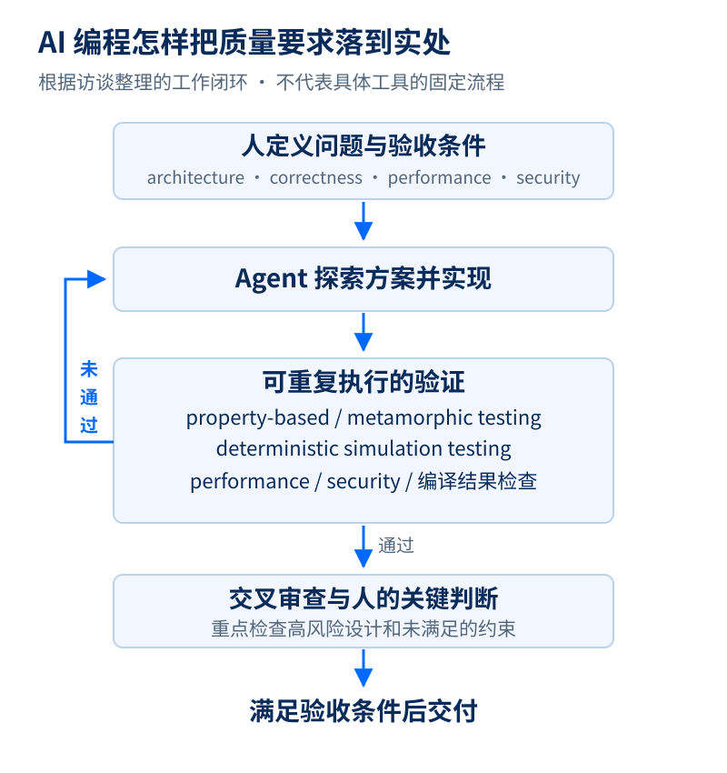

# 从 Gmail 到 CockroachDB：Peter Mattis 如何打造可靠系统，并用 AI 重返编程一线

来源：The Pragmatic Engineer  
访谈：Gergely Orosz × Peter Mattis  
原始视频：<https://www.youtube.com/watch?v=0GzwuYGvKA4>  
节目页面：<https://newsletter.pragmaticengineer.com/p/distributed-databases-with-peter>  
节目发布日期：2026 年 9 月 30 日；所提供录音稿标注日期：2026 年 10 月 1 日。

> 编者说明：已移除广告、重复片头和无信息的口头重复，保留访谈的观点、技术细节与例子，专业术语保留英文。原稿中的歧义和技术简化以校注说明。文中数字与 AI 使用效果为嘉宾自述；四幅解释图的适用范围另有标注。

## 导语

Peter Mattis 在大学期间与室友一起开发了 GIMP，设计过 Gmail 最初的存储系统，也参与构建了多个规模庞大、复杂且被广泛使用的基础系统。如今，他是 Cockroach Labs 的联合创始人兼 CTO。

过去三十年，他一直是一位高产的程序员。在 AI 出现之前，他最高一年能写约十万行代码。2022 至 2024 年间，他一度减少编程，把更多精力放在管理和公司事务上。如今，AI 又把他带回了编程一线，而且让他的产出发生了巨大变化。

他强调，这些不是随意 vibe coding 出来的低质量代码，而是满足数据库要求、兼顾性能和质量的生产代码。本次访谈从 GIMP、Gmail 和 Colossus 讲起，讨论为什么 B-tree 一再出现在他的职业生涯中，distributed database 如何兼顾性能与可靠性，以及他如何使用 coding agent、提高测试标准，并重新理解软件工程师的工作。

## 01 从机械工程转向计算机，和室友做出 GIMP

**Gergely：** 欢迎来到节目。你最早是怎样对技术产生兴趣的？什么时候发现计算机很有意思？

**Peter：** 大概是小学到中学那段时间。和很多软件工程师一样，游戏是我的入口。我妈妈曾在 IBM 做过编程，具体做什么我也不完全清楚，但家里一直有电脑，像 Apple II Plus、Apple II GS，我就是那个时代长大的。

我会去书店找 BASIC 的书或杂志，把上面的程序敲进去。当时并不理解它们在做什么，但就是上瘾：你向计算机输入一些东西，它就能给你一些有意思的结果。

不过，上大学时我并不知道计算机行业有什么赚钱的机会，也不了解这个行业，所以最初追随父亲的脚步，选了机械工程。现在看，这个决定挺傻的。我之前已经接触过一些计算机，但第一学期做机械工程作业时，一个问题就得写六页，实在痛苦。与此同时，我选了一门 CS 课，觉得非常容易，其他人却纷纷不及格。我意识到：“我选错专业了。”于是转了专业。

**Gergely：** 你在大学做的第一个让自己感到自豪、觉得已经是完整产品的软件是什么？

**Peter：** 最重要的就是我和室友一起做的那个项目。当时有一门课，可能是 compilers，我已经记不清了，毕竟是三十年前的事。我们觉得有点无聊，想在课外做点好玩的。我高中最后两年做过校报，接触过 computer graphics，所以想做一个类似 Adobe Photoshop 的程序。

我们就这样开始尝试，最后做出了很多人知道的 GIMP。我还写了 GTK 的很大一部分。此后它们都经历了巨大的演进。毕业后，我逐渐退出了这个项目，大概只继续参与了一年左右，但至今仍有人因此认识我，这段经历也给我的职业生涯带来了一些有趣的机会。

**Gergely：** 所以你们的起点就是：“做一个 Photoshop 能有多难？”这些也不是课堂直接教给你的，而是你们自己去研究 graphics engine、rendering、drawing、data structure，对吗？

**Peter：** 对，都是自己摸索。我记得我和室友都在查论文。开始这种项目，可能必须有一点天真。如果你事先真的知道它有多难，反而不会动手。对工作量了解得太透彻，你可能永远迈不出第一步。但一旦开始，项目就会像滚雪球一样不断向前，最后你会惊讶：“原来我们做出了这么棒的东西。”

还有一件很有意思的小事。我们准备发布 GIMP 的第一个版本时，大家还在 Usenet newsgroup 上交流，其中有一个 graphics 讨论组。就在发布前几周，有人发帖说他在做一个图形程序，GIMP 能做的，它全都能做，而且还不止这些。

我们当时想：“糟了。不过做这件事挺有意思，还是继续吧。”后来我们发布了 GIMP，却再也没听到那个人的消息。我不知道是我们抢了他的风头，还是出了什么别的事，也没有追查。但我从中得到一个教训：总会有人在做和你相同的事情，不要因为别人提前宣布，就打退堂鼓。很多提前宣布的东西最终并没有结果。

**Gergely：** 也就是说，如果你们当时看到那个公告，就觉得已经有人做了，转头去做别的，GIMP 可能根本不会出现。对今天的创业者来说，这也是一个提醒：至少先把自己的东西做出来、发布出去。

**Peter：** 我给人的建议就是：你可能觉得自己有一个独特的点子，但世界上大概有十几个人想过同样的东西，其中可能有几个人正在做，更多人连开始都没有。听到别人也在做，不必担心，那很可能本来就是事实。

我们公司现在在做一些很酷的东西，我敢保证竞争对手也在做类似的事。你要知道这是一场竞争，要享受竞争，而不是害怕它。

## 02 GIMP 带来的机会，以及一次对 Google 说“不”

**Gergely：** GIMP 后来给你带来了哪些有意思的事情？

**Peter：** 毕业后，我对 graphics 有点厌倦，所以转向了 storage system。我先后做过几份工作，其中包括早期的 search engine 公司 Inktomi，后来又去了另一家 startup。

在那段时间，我认识了 Google 的 Larry 和 Sergey。最早的 Google logo 就是用 GIMP 做的，至于是 Larry 还是 Sergey 做的，我记不清了。因为这件事，他们知道我们。其中一个人找到了我，邀请我去 Google 面试。

那是 2001 年，Google 才成立三年。我去面试了，却拒绝了 offer。

**Gergely：** 你居然拒绝了？

**Peter：** 对。当时 Google 在 Mountain View，我住在 San Francisco，不想花那么多时间通勤。所以我去了另一家 startup。工作一年后，我发现那家公司没什么前景。Google 又打电话来问我要不要再面试一次，我说可以。

他们提醒我，这次没法给上次那么多 stock option。我说没关系。我现在已经记不清第一次具体给了多少，但如果当时接受，可能会多赚很多钱。不过我后来也过得不错，没什么可抱怨的。回头看，GIMP 确实带来了很多好事。

Red Hat 上市时，曾给一些人提供 friends-and-family 配股，我们也拿到了。我因此赚了一点钱，不算很多，但对刚毕业的我来说已经很可观。

**Gergely：** 我当年也用过 GIMP。买不起 Photoshop 的时候，发现有一个免费的 GIMP，能满足需要，而且不用盗版，那种感觉很好。那时 free and open source software 远不像今天这么普及。你们一定帮助过很多人。

**Peter：** 至今仍有人听到这段经历后跟我说：“我用过它。”还有工程师说，他们是看着我的代码学会编程的。我总会想：天哪，那是我三十年前写的代码，当时我的工程水平可远不如现在。

## 03 Gmail 如何做到免费提供 1 GB，还能快速搜索

**Gergely：** 第二次你接受了 Google 的邀请，入职后做了什么？

**Peter：** 我在 2002 年 4 月 1 日入职，这个日期很特别。他们告诉我，要做 Google 的 email 服务。当时还不叫 Gmail，内部代号是 Caribou。

我负责 backend，主要包括 message threading、message storage 和 indexing system。前一年半投入非常大，总共大约做了三年，经历了产品发布。Gmail 正式上线的日期恰好也是 4 月 1 日，2004 年 4 月 1 日。

**Gergely：** 我记得，当时很多人以为这是 April Fools’ joke。你们宣布免费提供 1 GB 存储，而其他免费邮箱只有几 MB 或十来 MB，付费才能增加到几十甚至一百 MB，价格还不便宜。突然多了几十倍、上百倍，很难让人相信。

**Peter：** 我们内部也说，这有点像面向行业的“震撼行动”。我记得 Hotmail 或 Yahoo Mail 当时大概只有 4 MB。不仅容量大，我们的 indexing 还非常快，搜索几乎立刻就能返回结果。

> 校注：这里保留双方对当时邮箱容量的口述回忆，不将其视为各服务同一时间、同一套餐的精确对比。Gmail 发布时免费提供 1 GB 是这一段的核心事实。

**Gergely：** 当时还是 HDD 为主，硬盘昂贵，速度也有限。你们怎么判断能提供这么多空间，又能把搜索做快？

**Peter：** Google 内部已有一个大型 distributed file system，叫 GFS，也就是 Google File System。我们做了一些估算，觉得可以基于它构建邮件服务。Google 本来也积累了很多 search 和 retrieval 的经验。

最初的 prototype 使用了已有的 search、retrieval 系统，但后来彻底重写了。我加入时 prototype 已经存在，我参与的就是后面的重写。我主要做 threading，我们从一开始就决定支持 message threading，这在当时的邮件产品里并不常见。

**Gergely：** 把邮件组织成 thread，背后也需要 data structure、storage，以及对读负载的考虑吧？

**Peter：** 对，用到了 B-tree。那可能是我第二次实现 B-tree，现在加起来大概写过十几次了。

收到一封邮件，你得知道它属于哪个 thread。我们会使用 search index，通过 subject 或 message ID 去匹配 thread。B-tree 也负责其他信息，比如各个 thread 的 unread count。具体细节我已经记不太清了，那是 2004 年，现在都 2026 年了，二十二年过去了。但肯定用到了 B-tree 和 inverted index。后来这些代码也都重写过了。

**Gergely：** 免费提供 email 的成本怎么计算？总不能亏得太厉害。

**Peter：** 我们讨论过各种办法，其中一个就是投放广告。最初大家觉得不行，做不了。但参与这个项目的 Paul Buchheit 有一天晚上说：“我觉得可以把现有的一些广告功能拿过来，整合进去。”他真的做了，而且效果非常好，后来发展出了很大的业务。

Paul 后来参与了 FriendFeed、Facebook，也做过 Y Combinator 的 partner。当时我们的想法大致是：每位用户每年可能花几美元，这个成本怎么变现？我们不想向用户收费。后来 Google Workspace 等产品确实收费，但那时首先考虑的是能不能免费做，算下来似乎可行，最终还是需要一点信心。

**Gergely：** 发布时的 invitation 机制，是为了控制需求吗？你们提供的免费服务，之前往往要付费，需求应该会非常大。

**Peter：** 这是团队一起完成的，我没有直接负责这部分。我记得大家确实担心上线后的负载，于是有人提出 invitation 机制。它一方面限制增长速度，另一方面也制造了期待感。大家会问：“你能给我一个 Gmail invitation 吗？”当时我总能给人弄到。

## 04 从 Google 的 Makefile 到 BUILD file

**Gergely：** 之后你去了哪个项目？是不是 build system？

**Peter：** 做过 build system，不过在我的记忆里，这些工作有点交织。我做 Gmail 时，就兼着做一部分 build system。

Google 有一个大型 monorepo，最早是 Google One，那在我入职之前；我加入时是 Google Two。后来我们发现 Google Two 已经撑不住了。它基本就是一个巨大的、难以维护的 Makefile，可能也包含 sub-Makefile，但整体非常笨重。

有人来找我说，也许可以做点改善。我本来对 build system 就有兴趣，于是参与奠定了 Google Three 的基础，主要做早期工作。当然，还有很多人参与。

最初的想法是：Makefile 很难写，我们引入 BUILD file，用一个精简过的、类似 Python 的语言来描述，那个时候实际上仍然是 Python。一个叫 gconfig 的程序最后会生成巨大的 Makefile，但你不必再手工写它。

后来系统不断演进，Google 内部有了 Blaze，外部有了 Bazel。还有一些人去了 Facebook，觉得 Google 的方式很好，做出了 Buck。今天内部系统已经多复杂，我不清楚，好多年没有看过了。

**Gergely：** Make 的主要问题是性能，还是可维护性？

**Peter：** Make 在声明 dependency 方面并不是不能用，但有点像 assembly language。你不想用这么低层的方式去写全部 dependency。不够熟悉的话，很容易写错、漏掉 dependency。

BUILD file 的思路，是用更高层、更清晰的 semantics 表达 dependency，再把它“编译”成低层表示。后来大家意识到，甚至不必生成 Makefile，可以直接实现 dependency update engine，性能提升的空间也就打开了。

**Gergely：** 所以 Bazel、Buck 在大型 codebase 中受欢迎，是因为可以更好地控制 caching、cache 的生成和复用，以及整体 build performance。

**Peter：** 正是如此。

## 05 Colossus：让 Google 的存储规模再扩大一个数量级

**Gergely：** 之后你的主要工作是什么？

**Peter：** 我刚才提到 GFS。后来我们发现它有一些 scalability 限制。我做过 Gmail 的 storage system，也尝试过另一个 storage research 项目，虽然那个项目没有继续，但这段经历让我受邀加入 Colossus 的创始团队。Colossus 是 GFS 的后继者，也就是 Google 的第二代 distributed file system。据我所知它一直存在，当然经历过多轮演进。

**Gergely：** Colossus 是什么样的系统？

**Peter：** 如果从外部产品找类比，可以把它想成 S3 这样的 blob storage。它有一个相对扁平的 namespace，文件有名称，也有很有限的层级，但不是 POSIX file system，没有完整的 directory hierarchy，最初也没有完整的 permission system。这些能力很多是后来补上的。

文件不在你的本地机器上，而是放在一个由大量机器组成的 service 中，写入它们的 hard drive，后来也用 SSD。client 访问这个 service，数据有 replication，因此机器 crash 时不会轻易丢失数据。

我们在 Colossus 中实现了 erasure coding，这是一个重要突破。我不记得 S3 是什么时候加入这项能力的。我们使用的是 Reed–Solomon。

**Gergely：** 能解释一下 erasure coding 吗？

**Peter：** 你通常会想到复制多个完整 replica，但 hard disk 上的 RAID 已经说明，不一定非要保留完整副本。比如有 A、B 两块数据，可以对它们做 XOR，得到第三块数据。还有更复杂的方式。Reed–Solomon 是其中一种很有名的方法，也许现在已有其他更合适的 code。我们当时的任务，是探索如何把这项技术真正用到 distributed file system 里。

**Gergely：** 目标是降低 latency，还是提高存储效率？

**Peter：** 主要是提高存储效率。GFS 等系统通常做 triplication，也就是保留三份，占用原始数据三倍的空间。Reed–Solomon 可以把这个比例显著降下来。我不记得我们具体用了什么参数，印象里大概接近两倍，同时 redundancy 还可以更高。

**Gergely：** 简单做法是把同一份数据复制到三台机器，坏一台还有两份。而你说的方法，是用两倍左右、甚至更少的空间，把数据更巧妙地分散到不同机器上，坏了一部分仍能恢复。

**Peter：** 对。可以用一个高层的例子理解。我印象中 S3 曾公开谈过类似的九块配置，不过具体细节记不清了：把数据编码成九个 chunk，任意五个都能重建原始数据，那么丢失任意四个也不怕。前五个可以是原始 data chunk，另外四个是 parity chunk。具体细节我已经记不全，但大致就是这样。

> 校注：此处纠正原稿将 data chunk 称作“完整副本”的不严谨表达。这个 5+4 例子对应 9/5，即 1.8 倍的编码存储量，暂不计其他开销；它是原理示例，不代表对 S3 或 Colossus 实际参数的确认。嘉宾也明确说自己记不清具体参数。

*图 1　5+4 erasure coding 示例。D 表示 data chunk，P 表示 parity chunk；任意 5 块可恢复原始数据。*

**Gergely：** 这种算法可以用数学证明它的恢复性质。一旦证明正确，工程实现就有了明确的基础。虽然现在软件行业似乎不太爱谈数学和算法，但在这里非常关键。

**Peter：** 是的。背后涉及 finite field、GF(2) 及相关扩展。我从没有完整掌握其中的数学，一直后悔大学没有多学一些数学。不过工程师不必重新发明它，可以利用 Reed 和 Solomon 已经建立的结果，再完成让它在 storage system 中可靠工作的工程。

> 校注：原稿将 Reed–Solomon 的提出时间模糊记为 1970 年代，实际原始论文发表于 1960 年；相关运算通常在适当的 finite field，例如 GF(2^m)，上完成。

**Gergely：** 除了高效、可靠地存数据，Colossus 还要解决哪些问题？比如 sharding、resharding、metadata？

**Peter：** GFS 的规模有上限。我记得一个 cluster 大概能支撑一千台机器。对很多人来说很大，但 Google 需要扩展到一万台。

瓶颈之一是单节点 GFS master。我们需要用 distributed master 管理所有 object 的 metadata。当时 Google 已有 Bigtable，所以 Colossus 把 metadata 放进 Bigtable。

metadata 包括文件名、每个文件由哪些 chunk 组成，chunk 当时大概是 64 MB。master 还要定期扫描这些信息，进行 repair。当然不止这些，但核心可以这样理解。

这个设计有一点让我既自豪又有点不好意思：我们想用 Bigtable 存 Colossus 的 metadata，可 Bigtable 又是 GFS 最大的使用者之一，而且我们还希望 Bigtable 迁移到 Colossus 上。

**Gergely：** 这就产生了 circular dependency，得解决 bootstrapping：到底谁先启动？

**Peter：** 当时的办法是，有一个 foundational Bigtable，它不使用 Colossus。Colossus 依赖这套 Bigtable，普通 Bigtable 再运行在 Colossus 之上。这个结构实际运行了很多年，后来才被替换，具体什么时候换掉我不知道。

**Gergely：** 有些明知是权宜之计的设计，也能运行很久，而且能先让系统起步。

**Peter：** 对。如果一开始就自己重做那层 Bigtable 的能力，Colossus 的完成时间会被大大推迟。先利用已有系统把事情做起来，之后再逐步消除这个依赖，是当时有效的选择。

*图 2　Colossus 早期的 bootstrapping 依赖关系。根据访谈中的历史方案绘制，不代表当前完整架构。*

## 06 性能的起点，是理解硬件和“光速”

**Gergely：** Colossus 这样的 distributed file system 往往要提供 high throughput、high availability 和 low latency。但 replication 本身就会带来代价，怎样同时做到这些？

**Peter：** 首先，这类 distributed file system 的 latency 并没有低到极致，尤其当它们基于 hard disk 时。当年的 Colossus 就是这样，S3 也会让你感受到这个延迟。

S3 是高性能系统，Google 与它竞争的 GCS 建在 Colossus 之上，也有非常高的 throughput，但首次读取的 latency 可能是 20 到 30 milliseconds，受 hard disk 的限制。换成 SSD 后，会接近 SSD 的 latency，但还未必接近最先进 SSD 的硬件极限。

硬件的变化非常惊人。读取 hard drive 可能需要 5 到 10 milliseconds，而通过 NVMe 读取 SSD 可能只有 30 或 50 microseconds。一 millisecond 等于一千 microseconds，这是非常大的差距。

**Gergely：** 所以一些基础设施公司会增加 NVMe layer，提前或按需从其他存储层取数据。物理条件变了，上层系统也应该利用它。

**Peter：** 完全正确。不只是 disk，network 也快得惊人。Google、Amazon 的数据中心里，同一 zone 内的 network latency 非常低。我们当年做 Colossus 时，network round trip 可能还是 milliseconds 量级；现在同一 zone 内可以到大约一百 microseconds。具体旧数字我记不清，但硬件工程师确实做得太好了。

**Gergely：** 有时我觉得软件本该比现在更灵敏。我们是不是太习惯 abstractions，连最基本的 napkin math 都不做？turbopuffer 的 Simon Eskildsen 经常谈这个：先估算硬件理论上能做多快，比如 SSD 读取需要几十 microseconds，再设计尽量接近这个边界的系统，而不是觉得人察觉不到一百 milliseconds，就以此为目标。

**Peter：** 某些架构确实应该考虑人的感知。但做 storage system，就要按机器的尺度和速度思考。我认识 Simon，他们在做很棒的工作。人也许能容忍一百 milliseconds，游戏可能要求每四 milliseconds 一帧，但机器需要的速度还远不止这些。

Simon 把它叫 napkin math，我叫它“speed of light”。有时限制你的真的就是光速：跨 zone、跨 region 的 latency，受光在 fiber 中传播的速度约束。

有一件很有意思的事：远距离传送实时数据，理论上可以通过太空更快完成。因为光在真空中的传播速度比在 fiber 中更快。你可以设想把信号向上传给 Starlink，经由卫星之间的链路，再传到地球另一侧。

**Gergely：** 虽然路程变长，还要计算系统的处理、转发开销，但只要实现足够好，仍然可能快于 optical cable，因为光纤中的传播速度更低？

**Peter：** 对。所谓光速通常指真空中的光速，在其他介质中会更慢。

**Gergely：** 我研究 hedge fund 行业时，有人说他们使用 satellite、microwave，但不会透露细节。我怀疑他们找到了更快的通信方式。

**Peter：** New York 到 Chicago 的距离还不够远，未必值得绕到太空，high-frequency trading 会使用 microwave 链路。如果真想进一步逼近极限，也许要在两地之间建 vacuum tube 来传输信号。当然，我不知道有没有人真的这样做。

> 校注：这里讨论的是传播介质与路径带来的理论可能性，并不表示现实中的任意 satellite 链路都比 fiber 更快。实际 end-to-end latency 还取决于路径长度、转发、处理和网络条件。

**Peter：** 性能这个领域还有非常多层次。程序通常运行在 multi-threaded system 上，需要 synchronization。但获得最好性能的方式，往往是尽量避免 synchronization。部分可以通过 lock-free programming 实现，另一部分则是重新组织工作，让它根本不需要 lock。

你还必须关心 processor cache。从某种意义上说，register 也是一层 cache，下面还有 L1、L2、L3，再到 memory 和 disk。每一层都要考虑。认真处理，性能会好很多；如果不管 cache access，让数据访问到处乱跳，程序就会慢很多。

high-frequency trading 的工程师每天都在关心这些。其他很多地方却没人注意，硬件本来提供的性能，就这样被软件一点点消耗掉了。

## 07 为什么 B-tree 可以比 STL map 更快、更省内存

*图 3　B-tree 将多个 key 放进同一 node，减少 pointer 开销并改善 locality。这里仅比较组织方式，不是性能 benchmark。*

**Gergely：** 我们谈谈 data structure 和 programming language。你为 standard library 做过一些贡献？

**Peter：** 做过一些，不过不完全是 standard library。我一直觉得 data structure 和 algorithm 很迷人。比如 sorting algorithm，你可以解释 insertion sort，quicksort 要稍微难一些。看到某些算法时，你会意识到：这一定是非常聪明的人想出来的。

我在 Google 时，有位同事来找我，说我们到处都在用 STL map，也许可以做得更好。STL map 通常基于 balanced binary tree，我不记得当时具体是 red-black tree 还是别的 balancing algorithm，这些都是 CS 学生常常实现的东西。

这里存在 cache 问题：每往下走一个 node，就可能访问新的 cache line。他最初考虑 skip list，那也是很值得了解的 data structure。但我后来觉得，这更像一个适合 B-tree 的问题。

我之前实现过几次 B-tree，于是尝试做一个能覆盖 STL map 大多数 semantics 的版本，但做不到完全一致。原因是，向 B-tree node 插入元素时，需要移动其他元素，因此无法保证 pointer stability。这是这个设计本身的特点。如果你的场景不需要 pointer stability，就可以接受这个取舍。

理解 B-tree 可以从底往上看。假设只有八个元素，你希望有序地快速访问它们，最好的办法可能根本不是建一棵 tree，而是直接放在一个 sorted array 中。你可以 linear scan，也可以 binary search，数量很少时，linear scan 往往反而更快。

当元素多到一个 node 放不下，就把它拆成多个 node，再加一个 parent node 将它们连接起来。比如容量为八个元素的 node，加入第九个后，可以拆成分别包含四个和五个元素的两块，再由上层组织。不断递归应用这个思路，就是 B-tree 的直观结构。

> 校注：原稿此处出现“加入第十九个元素，拆成四个和五个”的数量矛盾，按上下文修正为“第九个”。这里是直观说明，实际 B-tree 与 B+ tree 在 separator key 和元素分配规则上有所区别，不应将这个简化例子当作完整算法。

**Peter：** 你可以试着实现它。不过现在也许不必每个人都手写，AI 已经可以帮你实现，并加入大量优化。B-tree 能做的优化非常多。

**Gergely：** 我过去总以为，库里的 data structure 已经由最聪明的人按照最先进的方式实现了，不可能再快。我甚至和人争论过：为什么还要自己写更快的 sorting，现有实现难道不是最快的吗？你们怎么会决定继续挑战它？

**Peter：** 我记得那位同事在做 Google 内部的 Gaia。它需要把登录身份、user ID、email 等映射到用户的 metadata，这些 mapping 当时大量存在 STL map 中。

内存使用量很大，在 profile 中也很明显。我们就想，能不能改善？他恰好在做这件事，也恰好和我共事，所以开始一起研究。今天 Google 大概有专门做内部基础库的团队，当时更像是大家各自做自己的系统，同时向共同使用的基础库贡献。

**Gergely：** 还是要一层层看下去，发现内存占用很大，就追问为什么，看看有没有办法改变。

**Peter：** 对。比如把一个 integer ID 映射到其他信息，如果用 red-black tree，每个 node 除了 value，还有 pointer。ID 也许只有四或八 bytes，但你还要存两个 pointer。这样一看，overhead 就很明显。

B-tree 的 spatial locality 更好，所以更快；需要的 pointer 更少，所以还更省内存。这不是只换来速度、牺牲空间，而是两方面一起改善。

## 08 一趟去 Bangalore 的航班，和 Go 的 Swiss Table

**Gergely：** 你后来也对 Go 做过贡献？

**Peter：** 对，那是很多年以后的事。我会关注新的 data structure 研究，尤其是 hash table。它是大学最早学到的 data structure 之一：当 key 的顺序不重要，只想建立 key 到 value 的映射，就会用它。

最基本的做法，是把 key，例如 string，交给 hash function，得到一个 integer，再映射到一组 bucket。如果多个 key 落到同一个 bucket，就通过 linked list 连接。这叫 chaining，我也实现过好几次。

后来出现了更好的方法，比如 open addressing：不使用 linked list，而是根据 probe 规则去找其他 slot，可以再次计算位置，也可以继续检查后面的 slot。

我读到过 Google 一些人提出的 Swiss Table。印象中来自 Google 的 Swiss office，名称可能也与此有关，不过我并不完全确定。

当时我已经写了很多年 Go。Go 内置 map 就是 hash table，而且 runtime 团队非常出色，原有实现优化得很好。有人尝试给 Go 做 Swiss Table，我测试了一些版本，觉得很有意思，但要超过原有 runtime 的性能非常难。

后来我去 India 的 Bangalore 出差，在长途航班上继续琢磨这个问题。终于，有几个 benchmark 跑得比原来更快。这对工程师就像猫薄荷一样：既然这里能快，能不能让其他地方也更快？

我继续探索，也从 runtime 团队那里得到了一些帮助。Go issue tracker 中已有关于采用 Swiss Table 的讨论，其他人也在尝试，里面提到一些难点和解决思路。我把这些想法结合起来，最终做出一个比较完整的实现，在大多数 benchmark 上更快，但并非全部。后来 Go 团队继续推进了这项工作。

**Gergely：** 你先证明一些 benchmark 可以更快，再和 Go 团队合作把它放进 runtime？

**Peter：** 不完全是。我先做了一个我们公司自己使用的实现，它适合我们的场景。但把它真正集成进 Go runtime，是另一个层级的工作。他们看到了这个实现，吸收了思路，并继续完成整合。Go 团队一直在寻找让 runtime 更快的方法。

**Gergely：** 那时你已经离开 Google 多年，是从外部贡献的。

**Peter：** 对。其他人也会从外部贡献。例如我们的另一位同事贡献过一种 CRC 实现，参考了 Intel 关于如何高速计算 CRC 的论文。CRC 是 cyclic redundancy check。类似的外部贡献一直都有，至于整体有多少，我没有完整统计。

> 校注：Go 官方文章确认，Go 1.24 的内置 map 改为基于 Swiss Table 的实现，并大量参考 Peter Mattis 的 github.com/cockroachdb/swiss。这里不能写成 Peter 独自完成了 Go runtime 的全部改造。原稿结尾的“Swift table”也应为“Swiss Table”。

## 09 离开 Google：一次没有实现最初愿景的创业

**Gergely：** 你在 Google 做 Colossus，可能参与了世界最大规模系统的早期建设，为什么还会考虑离开？

**Peter：** Colossus 之后，我短暂参与过 Google Goggles。那时一些相关设想可能走得太早了，技术还没有准备好，Android phone 的算力也不够。做 glasses 看来还要更难。

**Gergely：** 智能眼镜的想法一直在回来。Google 当时可能走得比较早。

> 校注：原稿在 Google Goggles 与 Google Glass 之间有口述混用。Google Goggles 是视觉搜索应用，Google Glass 是另一项智能眼镜产品；保留这段关于技术时机的讨论，但不把两者写成同一个项目。

**Peter：** 后来我有点想出去闯闯，觉得自己是不是在 Google 停滞了。这样说听起来奇怪，但确实有人会有类似感受。于是我又去创业，不过没有成功，最后被 Square 收购了。

**Gergely：** 那家公司叫什么？

**Peter：** Viewfinder，做 mobile photo sharing。听起来很熟悉吧，就是 Instagram、Snapchat 所在的那个领域。时间大约是 2012 年，它们正开始起飞，我们也在那个赛道，但没有找到合适的 go-to-market，没有解决吸引用户和 viral growth 的问题。

**Gergely：** 从外面看，故事像是“联合创办 startup，后来被 Square 收购”，似乎很成功。但你的目标原本更大，这只是一个还不错的结果，并非梦想中的结局？

**Peter：** 完全不是梦想中的结局。我会用 acquihire 这个词。有些收购看中的是 IP、product 或 business，有些看中的就是人。我们属于后者。Square 也买下了 IP，但我不觉得他们后来用它做了什么，这不是他们的业务方向。他们看中的是我们建立起来的技术团队。

我们融了不多的钱，最终基本让投资者拿回了本金。我记不清到底略有损失还是略有收益，但总体差不多。投资者当然知道投资可能亏损，也有能力承担，不过作为创始人，如果让他们损失很多，你还是会过意不去。至少把钱还回去，会感觉好一点。

## 10 distributed storage system 和 distributed database 有什么不同

**Gergely：** 到 Square 工作一段时间后，你们又想做新东西了？

**Peter：** 是。我们一直在做 distributed file system 和 storage system。Colossus 的一个姊妹项目就是 Spanner。

**Gergely：** 它们有什么不同？两者不都存数据吗？distributed database 底下总归也要有 storage system。

**Peter：** 对，但工程问题很不一样。Colossus 面向大型、append-only 的文件，不能随意原地更新，文件可能从 64 MB 到几 GB。

database 则处理大量细粒度数据。如果使用 SQL、relational data，你可能有数十亿行，row 又分成有类型的 column。这与大型文件的存储是不同的问题。通常 distributed database 会建在某种 distributed storage system 之上，Spanner 和 Colossus 就是这种关系。

Spanner 的一些设计，直接来自 Colossus 的 append-only 限制。既然不能原地更新文件，database 就需要采用 immutable file。这时 log-structured merge tree，也就是 LSM-tree，就派上用场了。

LSM-tree 不是 Google 发明的，但 Google 通过 LevelDB 大大推动了它的普及，背后有 Bigtable、Spanner 等系统的工作积累。后来又有了 RocksDB。我自己也重做过类似系统，也就是 Cockroach Labs 使用的 Pebble，所以对它内部很熟悉。这些系统都围绕 immutable file 来组织数据。

## 11 CockroachDB 的起点：让数据库自己承担分布式复杂性

**Gergely：** 你们怎样决定创办 Cockroach Labs？

**Peter：** 当时我们三个人都在 Square。Spencer Kimball 是我大学室友，也是一起做 GIMP 的伙伴，他也在 Google 工作过。Ben Darnell 同样来自 Google，后来加入 Viewfinder，再和我们一起到 Square。

其实在 Viewfinder 时，我们就想过 CockroachDB 的初步设计。为了做 Viewfinder，我们找过合适的 database，但对外面的选择不太满意。Google 内部有 Bigtable、Spanner，看起来比外面的选择更好。外面有 HBase、Riak 等系统，但我们觉得还缺点东西。

不过当时我说：“不行，我们是在做 mobile photo sharing，不是在做 distributed database。”于是把想法搁置了。我觉得当时这么做是对的。当然，回头看 Viewfinder 的结果，也许直接转向 database 也未尝不可。

到了 Square，我们又看到类似的数据存储问题。Spencer 很有说服力，他说服了一些管理者，让我们先兼职做这个项目，验证设计有没有生命力，再把 Ben 和我拉进来。

后来，项目开始受到外部关注，我们便讨论能不能独立成立公司，最终就是这样做的。

**Gergely：** 我以为你们最初没有拿 VC funding？

**Peter：** 那是 Viewfinder。Viewfinder 时我们刻意避开 VC，回头看，我不推荐这样做。我的经验是，好的 VC 非常聪明，能帮到你。

有些人觉得 VC 会强迫创始人往某些方向走，也许确实有不好的投资者，但我接触的那些，是我遇过最敏锐的人之一。他们像多了一位团队伙伴，给你 guidance、mentoring，以及对市场和方向的观察。这些往往是埋头做工程的 technical founder 不容易看见的。

所以 Cockroach Labs 很早就融资了。我们离开后，在 Bay Area 做了一轮 roadshow，很快就得到投资者的兴趣，也很快拿到了投资。

**Gergely：** 那名字是怎么来的？

**Peter：** 我们之前给 GIMP 取名字时，就是我参与定的。大学时《Pulp Fiction》上映，我们在想给这个 Image Manipulation Program 起什么名字，最后用了 GNU Image Manipulation Program，缩写 GIMP，很自然就留下来了。

做新 database 也得有个名字，总不能一直说“那个 distributed database”。于是有了 CockroachDB：cockroach 很难被杀死，我们希望这个 database 也是如此。就像大家常说，核灾难之后 cockroach 都能活下来。

想表达的就是：即使一批 node 故障，系统仍然可以运行。如今 CockroachDB 真正做到的一些事情，仍让我感到惊叹。

去年我们做过一轮展示 performance 和 redundancy 的活动，主要是把已有的能力证明给人看。运行 workload 时，可以关掉一个 node，在合适的配置下甚至停掉整个 region，系统继续工作。客户也告诉过我们，他们的 data center 发生火灾，其他数据系统停了，CockroachDB 还在运行。这真的很棒。

> 校注：故障容忍取决于 replica 数量、quorum 和跨地域部署方式；这段不应理解为任意数量的 node 或 region 故障都能无损继续服务。

## 12 为什么企业会从单节点走向 distributed database

**Gergely：** 什么样的公司会开始需要 CockroachDB？一家小 startup 通常会选 PostgreSQL：免费，大家熟悉，跑在一个 node 上就够了。到了哪个阶段，他们会觉得不够？是容易停机，还是规模变大？

**Peter：** 经常是灾难发生后，企业来找我们。例如 node 出问题、hard drive 损坏。我们当然不是专门追着事故跑，但看到一家公司的重大 outage，有时会联系他们；反过来，他们也会主动来找我们。

有一家很大的 bank，现在已经是我们的客户，我不确定能不能直接说名字，但外面有公开报道。它因 weather event 遇到严重 outage，我记得是整个 region 的大范围断电。之后 CEO 直接下达要求：“我们必须能承受这种事情。”这个要求一路传到技术团队。

另一个早期客户在 AWS 上运行，已经用到了 Aurora instance 能提供的最大规格。再往上怎么办？通常只能 shard database，把单节点分成十个、二十个，甚至一百个 shard。Google 也曾在一段时间里这样做。

但这给 application developer 带来很大负担。我们的说法是：这时 application developer 被迫变成 database developer，而且往往做得不够好。他们得自己处理 distributed transaction、index 等问题。我们认为，这些复杂性应该由 database developer 承担。

## 13 从 manual sharding 到自动管理 key range

**Gergely：** 能从 manual sharding 讲起，再解释 automatic sharding 怎么把这些工作接过去吗？

**Peter：** 最简单的 sharding 很像 hash table。假设固定有一百个 shard，数据按 user 组织，就把 user 通过 hash function 映射到其中一个 shard，希望数据分布足够均匀。

问题是，迟早有一个 shard 会满，你就需要 reshard，而这非常麻烦。要拆分、迁移数据，重新建立映射，更新记录“数据在哪里”的 metadata。具体取决于 user ID 或其他 shard key 的映射方式，有时可能要重新映射所有数据。

这就像扩容 hash table：简单办法是建立一个两倍大的新 table，把旧数据全部复制过去。你可以在这个基础上增加更复杂的机制，例如 consistent hashing。这样增加一个 node 时，只需迁移一部分数据，而不是全部重做。它有多种实现方式，Cassandra 就属于使用这类思路的系统。

CockroachDB 更接近 Bigtable、Spanner、HBase 的做法：不先把 key hash 到固定 bucket，而是把整个系统的 key 看作一个连续、有序的 key space，再把它分成一个个连续的 range，在这些 range 上方建立 index，知道某一段数据位于哪个 node。

仔细想想，这有点像 B-tree。平时不会有人把这个分布式 index 直接叫 B-tree，但我看这些结构时，总觉得很多东西最后不是 B-tree，就是 hash table。

**Gergely：** 我以前读 B-tree 的介绍，看到它“常用于 database”，没有特别在意。现在聊下来，它却不断出现。

**Peter：** database 里另一个常见场景就是 index。比如 table 有 email address 的 index，你想按 email 顺序 scan，底层通常会用 B-tree 一类结构。也有 hash index，但很多 index 需要支持 sorted order，所以 B-tree 极其普遍。

有篇论文就叫《The Ubiquitous B-Tree》，我记得是八十年代的。直到今天，它仍然无处不在。它是很多 single-node database 的基础，我做过的几乎每一个数据系统，都在某个位置使用过 B-tree。

> 校注：该论文发表于 1979 年，原稿中的“八十年代”是口述记忆。这里说的是 database 中的普遍情况，不表示 CockroachDB 的每一层 index 都直接实现为 B-tree；前文已说明其 storage engine 使用 LSM-tree。

## 14 strong consistency 为什么能减轻应用开发的负担

**Gergely：** CockroachDB 提供 strong consistency。能解释 consistency model、它为什么重要，以及难点在哪里吗？

**Peter：** 可以先从 transaction 说起。transaction 让一组 mutation 以 atomic 的方式完成。database 常说 ACID：atomicity、consistency、isolation、durability。

durability 比较直观：写入必须可靠保存，系统 crash 后恢复，数据仍然存在。atomicity 则是，一组修改要么全部 commit，要么全部 abort，不能只做了一部分。这样 application 发起一组操作，如果出错，可以整体 rollback，开发模型会简单很多。

consistency 和 isolation 有时会混在一起说。isolation 关心 transaction 之间的关系：我们不只想运行一个 transaction，而是想尽量并发地运行很多个，同时使外部观察到的结果像是按某个 serial order 执行。

这里会涉及 linearizability 和 serializability。serializability 指 transaction 的执行结果可以对应某个 serial order，但底层仍尽可能并发。对 application programmer 而言，这提供了一个更简单的思考模型，能避免很多奇怪的错误。

经典例子是 bank account：先读余额，确认还有一百美元，再转出一百美元。如果 isolation 太弱，两个操作可能都认为有足够余额，最后把同一笔一百美元扣了两次。这当然不可接受。bank account、shopping cart，以及很多其他场景，都需要正确维护状态。做错会产生严重 bug。

> 校注：原稿把 linearizability 口语化地称为 isolation 的“最高标准”，又把 serializability 称为下一档，两者并非可以直接排列的同一维度。serializability 针对 transaction 是否等价于串行执行；linearizability 通常针对操作是否符合 real-time order。transaction 同时满足串行语义与 real-time order 时，通常称 strict serializability。正文保留访谈意图，但避免把这些术语混为一谈。

**Peter：** 另外一种常见区分是 strong consistency 与 eventual consistency。后者意味着，一次修改发生之后，读取未必立刻看到全部最新结果，可能要过一段时间，其他位置才显示更新。信用卡余额就是一个容易理解的例子。

这种方式往往有性能上的优势，但 application 需要处理更多情况。比如你写入 primary replica，随后从 secondary replica 读取，发现数据还没出现，这就是常见的 eventual consistency 现象。可以在 application 里绕过，但它增加了开发负担。

使用 CockroachDB 的 strong consistency，你写入成功后，再进行相应读取，就能看到已写入的数据。即使请求发给另一个 node，也不必由 application 自己解决 replica 之间尚未同步的问题。

**Gergely：** 代价是不是 latency？最朴素的办法似乎是向所有 replica 写入。你们内部怎么做？

**Peter：** 我们会把数据复制到各个 replica，关键是尽量快速、高效地完成。软件行业一直让我着迷的一点就是：我们不断用更复杂、更成熟的内部技术，给 application 提供更简单的开发方式，同时维持很高的性能。

我熟悉 database，但其他领域也一样。看看 graphics：我入行时还在一个 pixel 一个 pixel 地写，现在 GPU 每秒能处理海量 triangle。computer science 的每个方向都积累了令人惊叹的复杂技术。

> 校注：将数据复制到各 replica，不等于每次写入必须等所有 replica 确认。CockroachDB 的 Raft commit 以 voting replica 的 quorum 为关键条件，下面一节继续说明。

## 15 Raft consensus，以及跨地域部署绕不开的 latency

**Gergely：** Raft consensus 是什么？

**Peter：** Paxos 是最著名的早期 consensus protocol 之一，也以难实现著称。Raft 可以理解为另一种方案，与 Paxos 解决相近的问题，重点之一是让算法更容易理解和实现。

**Gergely：** 几台乃至更多 node，到底是在对什么达成一致？

**Peter：** 例如，确认一次 write 已经发生。你可能会想，把数据写入 primary，再写到 secondary，不就是 replication 吗？但只有两个 replica 时，遇到故障，你会面临困难：如果我是 secondary，怎么知道 primary 是否已经写入？如果我是 primary，又怎么知道 secondary 的状态？恢复时可能无法在继续服务和保证数据安全之间轻松作出决定。

典型设计使用三个或更多 replica。以三个为例，故障恢复时，需要能够从存活的多数派中确定此前已确认的状态。正常情况下，read 不一定需要每次访问多个 replica，往往只访问一个符合读取条件的 replica；写入、选举和恢复则由 consensus protocol 保证一致。

> 校注：原稿说“两个 replica 无法 consensus”“consensus 只在恢复时读取”等，是过度简化。两个 voting replica 也能形成要求两者同意的 quorum，但无法容忍其中一个故障后继续取得进展；三个 voting replica 才能在容忍一个故障的同时保有多数派。Raft 正常写入提交也需要 quorum，并非只在故障恢复时使用 consensus。这里按受访者要说明的容错含义整理。

**Gergely：** 你们通常选择几个 replica？

**Peter：** 通常是三个，一些 system table 可能用五个，客户也可以控制。database 可以配置五个、七个。如果特别重视 durability，可以使用更多 replica，但会增加存储占用，通常也会带来额外开销。

**Gergely：** 如果 replica 分布在不同 region，就更能应对 earthquake、power outage 等灾难，但会增加 latency，这是光速决定的。

**Peter：** 对，跨 region 可能是几十到几百 milliseconds，跨越全球甚至更高。所以设计 query 时要非常小心。

distributed database 有个普遍原则：尽量减少来回通信。能并行做的一组 read，尽量一起发出去，拿到结果后再 write。如果不断“读一行、写一行、再读一行、再写一行”，latency 就会一轮轮累加。

## 16 mission-critical 的含义，是用户不必担心它会失效

**Gergely：** 公司发展到今天是什么规模，主要服务什么场景？

**Peter：** 我们的核心是 mission-critical application。

**Gergely：** 这个词对行业外的人有点模糊。一个展示广告的 SaaS 算 mission-critical 吗？

**Peter：** 不一定。我想到的是 tier-zero application，也就是一家公司的核心系统。比如 trading system，一旦停止，对运营它的公司就是严重问题；banking system 也是。

我们也和 DoorDash 合作。有人可能觉得，给你送一份 burrito 算什么关键业务？但对 DoorDash 来说，这就是关键业务。还有 shopping cart，一旦停机，公司可能每小时损失几十万、几百万美元。

**Gergely：** 不仅是公司损失收入，客户也已经习惯它像自来水一样随时可用。断水、停电，你也许能撑过去，但这不是你对基础服务的预期。

**Peter：** 是。Gmail 不能随便停，大家依赖它；search 也不能停太久，不然用户会换别的服务。search 看起来未必那么 mission-critical，但每一次 search 背后都有广告收入，outage 会直接在收入曲线上体现。

更严重的是 reputation。bank 长时间不可用，会造成非常糟糕的声誉损害。我们有时会说，这甚至可能导致一位老奶奶没法付房租，面临被赶走的处境。你必须非常认真地承担这份责任。

**Gergely：** 今天来这里之前，我们还没交换电话号码，一直通过 email 沟通。你说到了，我回邮件，差不多三十秒就有回应。我从来没有想过它可能不可用，也没有准备第二条通信渠道。

**Peter：** 当用户对你有这种信任，你就得持续投入、维护它。而这种信任也给了用户自由：不用再操心它能不能工作，默认它会正常运行就好。

**Gergely：** 你们大约有多少工程师？

**Peter：** 精确数字我记不清，大概一百、一百一十名，整个 R&D 可能是一百五十人，里面还有工程师以外的角色。当然 engineering manager 也有工程背景。

公司一直稳步增长。构建 distributed database 需要很长时间，绝不是轻松的事。先花几年做到稳定，再提高质量、清理 bug，然后持续提升性能，增加 enterprise 所需的功能和集成。收入也在持续增长，我们现在能看到继续成功的路径。

## 17 从一年十万行代码，到一度退居管理岗位

**Gergely：** 刚创办公司那几年，你写了多少代码？

**Peter：** 很多。我一直是高产的程序员。Ben、Spencer 和我都是 technical co-founder，早期都写了大量代码。如果看 GitHub 的记录，高峰年份我可能一年写十万行。那还是 pre-AI，全靠自己手写。

我们最初使用 RocksDB，一个 LSM storage engine。大概在 2019 年，我们遇到一些限制，我决定重写。最初那一轮可能就写了四五万行，之后还有很多同事加入、继续完善，也就是 Pebble。

现在回头看，最让我惊讶的不是敲了那么多字，而是当时脑子里要装下多少东西。行业里有人会说，一个工程师每月三千行、每年三万六千行就不少了，我当时的工作量确实很大。

> 校注：代码行数在这里是 Peter 对个人工作规模的回忆，不是可用于跨项目比较生产力、质量或工程师能力的统一指标；“每月三千行”也不是本文验证过的行业平均值。

**Peter：** 人的脑子同时能装下的东西，终归有上限。相比我刚入行时，debugging、testing 和其他工具都进步很多，但复杂度仍然很高。

**Gergely：** 你一直是 co-founder 和 CTO，但大概在 2022 年开始减少亲自写代码？

**Peter：** 是。大家通常会给 engineering leader 这样的建议：你得管理团队。我们有 VP of Engineering，但我也开始想，我亲自 coding 的阶段是不是该结束了，应该更多从高层指导。

这个建议我听了很久，也抗拒过很久，最后接受了。我不是说建议错了，在当时可能是正确的。大约 2022 至 2024 年，我的代码产出下降了。Swiss Table 好像就是那时做的，但我对核心业务的直接编码少了。

如果一整天都在开会，很难再认真编程。这是根本性的冲突。你要做协调、客户沟通，还要承担 executive 的工作，同时戴这么多顶帽子非常难。

后来 AI 开始出现，我才又回到编程中。

## 18 AI 让代码在眼前“直接出现”

**Gergely：** 你什么时候开始用 AI，什么时候觉得它真正有用了？

**Peter：** 最早是那些高级 autocomplete 工具，我首先接触的是 GitHub Copilot，也试过早期 Cursor。你开始写一个 function，它能补全后面的部分，而且看起来居然对，这已经很惊人。我们也鼓励工程师使用。

后来有人提出一个很重要的观点，可能是我、联合创始人或其他人：要真正指导别人怎么用，你自己必须是使用者。这也是 engineering management 的普遍道理。如果你不理解怎样做一个好的工程师，就很难管理工程师，至少很难理解他们的处境。

一开始我觉得 AI 很有前景，只是不知道会发展多远、多快。试用时又不断觉得“还不够好”。但我因此重新开始编程，后来看到 Sonnet、Opus 等模型逐步进步，能力越来越明显。代码最初还不够好，可迭代的节奏一直在加快。

我也经历了很多人说的那个转折点：去年十一月，准确说是 Thanksgiving。我记得很清楚，假期里我不是在休息，而是在用 agent。

我一直想做一件事：对 CockroachDB 的各种配置做系统测试。比如 vertical scaling，一个 node 配多少 CPU、多少 store 和 disk，cluster 里有多少 node，把这些组合成一个巨大的测试矩阵。

这件事始终很难获得足够优先级，因为看起来不够紧急，但我总觉得里面藏着值得研究的东西。结果四天左右，借助当时的 Opus，整套代码就这样在眼前逐渐出现了。具体是 4.7 还是 4.5，我当时也记不清版本号。

> 校注：原稿对模型版本本身犹豫不定，本文保留这一点，不将其中任何一个版本号认定为已确认事实。

**Peter：** 我打字已经很快，但那种感觉完全不同。你提出要求，代码就出现了，我甚至逐渐不再习惯亲自敲代码。

**Gergely：** 以前电影里常出现一个程序员坐下来疯狂打字，屏幕上的代码飞快滚动，速度远超人类。工程师看到会笑，因为现实不是这样。我还记得《Swordfish》里的那种场景。但现在反而有点像了，而且代码真的能工作。

**Peter：** 现在甚至比电影还快。我们前面一直在谈 B-tree，我最近一个月又实现了一次 B-tree，大约三十分钟，产生了约一万行高度优化的 Rust。这个速度令人难以置信，人根本不可能打字打这么快。

**Gergely：** 这里说的是 vibe coding、prototype，还是达到 CockroachDB 要求的 production-ready code？

**Peter：** 最初是那个配置矩阵的 benchmark tool。作为 CTO，我有一个 Office of the CTO，职责就是推动创新。我在寻找值得创新的方向，其中之一是更好地实现 CockroachDB cluster 的 autoscaling。

一月左右，我在这个领域有了一个可以称作 research breakthrough 的进展。它来自持续尝试，也来自和模型一起探讨、理解问题。模型不只是擅长 coding，也很擅长帮助你探索 design idea。

所以你要摆脱“我已经完全知道要做什么，只让它实现”的思维，换成：“我们有这样一个问题，和我一起讨论，做我的思考伙伴。”它可以当 sparring partner。

以前遇到问题，别人会建议 rubber duck debugging：找只小黄鸭，把问题说给它听，哪怕它不会回应也有帮助。现在你面对的是会回应的 intelligence。它不总是对的，但知道得非常多，像一本百科全书，让你探索想法的速度大幅提升。

我觉得 Fable 很出色，Astra 也很出色，但它们仍会犯错。你指出：“这听起来不对。”它就说：“你说得完全正确。”我很讨厌这种 sycophancy。现在还有一种说法是：“你这样质疑是对的。”尽管如此，推进速度依然惊人。

> 校注：Fable、Astra、Sol 等名称按所提供稿件保留；原稿个别位置写作 Astros，结合后文统一为 Astra。未获得足以确认其正式产品名或型号的信息，不擅自改成其他模型名称。

**Peter：** 我们很快从一些外围工具，走向核心项目。自一月以来，过去八个月一直在为一个新发布做准备，大量工作由使用 agent 的工程师完成。如今公司几乎所有工程师都在不同程度地用 AI，也产生了很多我认为质量很高的代码。

但模型仍然不会充分测试，也不够关注 performance。你得把它们引导到正确方向上。

## 19 与其说管理 agent，不如说做 hands-on tech lead

**Peter：** 我觉得有 management 经验的人会有优势。你管理一个较大的团队，本来就不可能看每一行代码，但仍要参与 architecture、指导方向。在这方面，两者很相似。

**Gergely：** 这个类比我会稍微反对。我做过 engineering manager，管理里面有大量人的问题：冲突、performance review、会议，以及其他人际事务。和 agent 合作没有这些。

这里确实有 orchestration，但叫 management 容易让人以为是完整的人事管理。它们不会像人一样反驳你，你让它做，它就开始，虽然有时不可靠。更像 tech lead 带着一群实习生，却不用管他们的绩效和人事问题，工作关系干净得多。

**Peter：** 同意。我只是用 engineering manager 作简写，更准确地说，是做一个三四十人组织的 tech lead，或者 architect。不过我对 architect 这个词有点保留，我指的是实际参与工作的 hands-on architect。

你不需要处理那些 management 事务，这有利有弊。你可以随时启动 agent，发现错误，就不断纠正，直到它完成。带人也可以这么做，但 agent 让这一过程快得多。

对我而言，最终结论是：你应该提高对所有事情的要求。做更多、更高性能、更高质量、更安全的软件。我们的目标应该变得更有雄心。

## 20 软件数量会激增，非工程师也会拥有自己的应用

**Gergely：** 你们不仅在用 AI 开发，也在做与 AI 有关的产品？

**Peter：** 我们在做几件事。AI 已经来了，而且会长期存在。我们的一个判断是，将来几乎所有 application 都会由 AI 编写。

当然，像今天仍有人手写 assembly 一样，手工制作的软件仍会存在，但占比会逐渐减小，AI 生成的软件会逐步接近全部。人是否还要持续提供 agency、vision，这个阶段会持续多久，现在很难说，也许很多年。但 code 本身基本会由 AI 来写。

这会带来 application 数量的爆发，我们在 Cockroach Labs 内部已经看到了，其他公司也一样。今年早些时候，我们推出一个内部平台，让非工程师构建 mini application。短短几个月，就出现了五百个、一千个这样的应用，主要由非工程师完成。

HR 团队在做过去一直想要的小工具。CFO 和很多财务人员也在做以前做不出来的 dashboard。我觉得这非常赋能。

我妻子也需要软件，但她自己不会做，而我一直没有替她把需要的软件写出来，这是我的失职。但我能看到一个未来：每个人都能拥有为自己定制的软件，每家公司也都能构建更多、更好的 application 和 system。

## 21 Peter 的工具栈：最强模型、交叉审查和多会话并行

**Gergely：** 你现在具体用什么？harness、model、agent 数量、terminal，整个工作方式是怎样的？

**Peter：** 一直在变。最早是 GitHub Copilot。我做了二十多年的 Emacs 用户，后来被说服换到 VS Code，但现在又变了。

有段时间，我主要在 terminal 里使用 Claude Code。最近则混合使用不同工具，主要是在 Claude Desktop app 里用 Claude Code，体验很好，Anthropic 做得不错。我有时也用 Codex Desktop app，这样手上有另一种模型可选。

对于特别关键的工作，我会让一个模型先出 design，再让另一个模型做 adversarial review：“这是同事提出的方案，请尽量挑毛病。”常用的是当时最强的模型，最近用了 Fable，也会用 Astra 或其他模型。结果不完美，但对非常关键的任务有价值。

我们正赶一个发布节点，我告诉团队，尤其是最 senior 的工程师，现在应该用最好的模型，值得投入。我自己通常也是这样。

原因不完全是我确定它一定聪明多少，而是我不想承担每个任务都选一次模型的 cognitive overhead：这次用 Sonnet、Opus、Fable，还是 Sol、Astra？如果特别需要速度，我会单独考虑；但多数时候，我本来就在并行做事。

至于并行多少 agent，要看任务。我觉得五到十个同时进行的 session，差不多是自己 cognitive overhead 能承受的范围。但某个 session 下面可能还会启动许多 sub-agent，而且运行很久。

今天来这里的火车上，我启动过一个小研究任务，大概用了三个 sub-agent。有时会用二十个，Anthropic 有 dynamic workflow，Codex 也有类似的编排能力，具体叫什么我一时想不起来。它们能构建 agent graph 并执行。

某些时候，我可能总共在用一百个 sub-agent，另一些时候只有五个，也有时候一个都不运行，因为我在思考别的事。

**Gergely：** 你用了二十多年 Emacs，也熟悉 terminal，为什么后来改成 graphical interface？很多人仍然喜欢 terminal UI。

**Peter：** 从 Emacs 转到 VS Code 时，同事告诉我：“现在的 IDE 很好了，你得试试。”我还说：“Emacs 本来就是 IDE。”但换过去后，确实发现有些事情更顺畅。

Emacs 总在追赶，但感觉会慢半年到一年，而且每次升级，我的配置就可能坏掉，最后有点累了，就改用 VS Code。

之后，我在 VS Code 的 tab 里开许多 terminal，经常有八个。Claude Code 最初就在这些 terminal 里运行，后来 terminal 逐渐占据了整个工作界面。

大概六周前，同事又问：“你最近试过 Claude Desktop app 吗？真的很好。”我最初觉得自己已经很满意，但试着切换后，先是不太适应，后来突然发现非常好用。

session 都在侧边，像 tab 一样，很容易管理。Anthropic 在整体 integration 上做了很多，OpenAI 也一样。我并不是在否定 Cursor、Factory 或 Cognition，它们也都在推进类似方向。这些系统创新和演进的速度实在惊人。

## 22 AI 写得更多，测试、security 和 UX 的标准更应该提高

*图 4　把测试与审查变成可反复运行的反馈闭环。根据访谈归纳，并非对 AI 正确性的保证。*

**Gergely：** 今天的 good software engineering，与四年前、AI 出现前相比，发生变化了吗？

**Peter：** 应该更有雄心，quality 应该更高，security 也应该更高。

**Gergely：** 但我看到行业里一些产品的质量在下降。这未必全怪 AI，也可能是大家不断增加产出，却忽视小的 regression。你们做 database，有没有发现质量退化？通常产出越多、发布越频繁，bug 也会增多。

**Peter：** 如果每行代码有一定概率包含 defect，代码量增加，defect 理论上也会更多。但反过来，你可以更严格地要求 agent。

我希望模型提供商听到这一点：模型在 testing 上确实有点偷懒，需要明确而坚定的指导。不只是测试数量足够，还要确保使用各种合适的 testing technique。行业已经积累了很多这方面的知识。

agent 会偷懒，人也会。让人始终保持 testing discipline 也很难，我自己也会懒。即使平时很注意测试，做到某个阶段也会想：“差不多了，得发布了。”我反而觉得，让 agent 坚持执行测试纪律可能更容易，前提是你把要求和环境设好。

你应该明确告诉它：使用 property-based testing、metamorphic testing、deterministic simulation testing，以及其他适合的技术。我们有很多方法可以用，现在可以比过去更严格地执行。

security 和 performance 也是一样。行业本来就知道很多 secure coding practice。现在每一次 commit 的每一行代码，都有机会交给专门的 agent 做 adversarial security review，甚至让多个 agent 分别检查。

目前行业正在经历很多 hack 和 security leak，但我认为这些问题可以逐步改善。软件里可以发现和修复的 bug 终归是具体的，我对 security 和 quality 的改进都很乐观。

而且 quality 不只是有没有 bug，也包括细节，例如某个 UX element 做得不对。现在修复这些问题已经容易得多，不应该轻易放过它们。

我们也看到 designer 的工作发生变化。过去 designer 在 Figma 里设计，我觉得这种完全依赖交接的方式可以改变。我们的 designer 现在直接处理 HTML、CSS、JavaScript，有时直接向 production codebase 提交 PR。

她很喜欢，团队也很喜欢，不再有那种 waterfall handoff。这当然发生在她负责的 UX 部分，不是 database 的核心数据层，但她能够直接完成自己负责的工作。这种方式并非今天才有人做，可现在它变得更容易实现。

**Gergely：** 所以她直接提交生产代码的 PR，并且负责自己擅长的那部分。

**Peter：** 对，大家都很满意。

## 23 code review 会走向哪里：从逐行检查到建立 guardrail

**Gergely：** 你怎么看 code review？它会不会继续存在，现在开始有争论。Google 一直很重视 review，我理解还有业务专家与语言专家的不同审查。你经历过这些，现在怎么想？

**Peter：** 我曾是 Google 早期 C++ code review 团队的成员之一。AI 之前，code review 我认为相当重要。

现在我仍然会看 agent 产生的大多数代码，但 scrutiny 的程度正在变化。这其实一直存在：junior engineer，或者刚加入 codebase 的人提交 PR，你通常会比看最 senior 工程师的 PR 更仔细。任何 tech lead、engineering manager 或工程师，大概都会承认这种差别。

随着 agent 变好，有些地方需要的逐行 scrutiny 会减少。但另一些地方仍然要格外关注，例如 testing 是否完整、security 要求有没有遵循、是否引入 performance regression。

关键是给系统建立 constraint，让它不容易做错。

我猜，也许今年，也许明年，我们看 code 的方式会明显改变，像今天大多数人不再检查 compiler 生成的 assembly 一样。我们相信 compiler 能产生不错的 assembly。当然，对某些人，比如 game developer，检查 assembly 仍然很重要，但这样的人已经少了很多。

甚至在这些场景里，也可以让 AI 看 assembly。比如我现在做的一件事，希望某项能力在 test time 存在，production build 时能够编译掉，尽量达到 zero overhead。

Fable 帮我建立了一个小系统，会检查编译后的反汇编结果，验证只增加了极少的 instruction。过去我不会特意搭这种检查，现在却有了一个 guardrail：每次修改后都能验证有没有 regression。

我觉得这类做法会越来越多。你把边界和检查放好，模型就可以在其中工作，它似乎也很适应这种方式。

> 校注：这里是 Peter 对 code review 未来的判断，并不等于当前 AI 已经具备 compiler 那样的 correctness guarantee。“目标是 zero overhead”与“检查是否只多了少量 instruction”也应区分，后者不是零开销的证明。

## 24 新的心流：像教授同时带着一群 research assistant

**Gergely：** 过去二十多年，你写了大量生产代码，应该很熟悉进入心流、全神贯注输出的感觉。现在和 AI 一起工作，还会进入这种状态吗？

**Peter：** 当然会。感觉有一点不同，也许强度没那么集中，但在认知上同时处理的事情更多。

我会想到一个以前需要一周才能验证的 idea，同时想到好几个类似实验，然后把它们一起启动。等待它们完成时，我会想还能做什么。有时它们给我 progress update，我看了会说：“这个结果不太对。那一种情况呢？这里处理正确了吗？”或者发现它没有完全按 design 实现，就继续纠正。

我没当过 professor，但感觉有点像带着一大群 research assistant：他们各自去做事情，结果不断返回，而且非常快，不用等几周、几个月。你再根据结果迭代。某个实验失败也没关系，放下它，继续下一个。

这是我所做的软件的特点。另一些事情，例如快速做一个 website，不需要同样强度的 scrutiny，可以更快地完成。我用过很多比喻来描述现在这种体验。

## 25 从走路到驾驶赛车：AI 工具也需要学习

**Gergely：** 你有哪些比喻？

**Peter：** 去年年底到今年，我常说，过去我们写软件像走路。有时有人跑过去，步法更高效，但大家都靠自己的身体前进。

agentic coding tool 出现，就像一辆车停在你旁边。你坐进去，却不知道怎么开，不认识控制装置。你得先上车，摸索油门，然后车突然冲出去，撞到树上。

所以你必须学会驾驶。使用这些 coding tool 不是自然而然就能做好的，它是一项需要学习的技能。我们现在甚至有点像进入了 F1 driver 的阶段：熟练的人，可以把系统开得比新手快得多，也能发挥得更彻底。

真正的熟练用户知道它会在哪里出问题，知道怎样注意和处理；第一次打开 agentic coding tool 的人，与他们之间有很大的差距。

**Gergely：** 过去大家争论 10x engineer 是否存在，现在有人说 100x engineer。先不纠结这个词，你看到的那些像 F1 driver 一样的人是什么样？是原来就有很强的工程基础，又积极使用新工具的人吗？

**Peter：** 方向上是这样。原来工程师就有不同能力层次，这些工具像把整条分布拉开了。当然不是每个人受益程度都相同，但整体感觉是，你过去的能力被放大了。

**Gergely：** 这也解释了为什么一些工具的创造者原本就是非常强的工程师，比如 Boris Cherny，以及 OpenAI 的 Thibault。Boris 写过 O’Reilly 的 TypeScript 书，也构建过大型系统。这些人本来就很出色，现在又在工具上持续创新。

> 校注：原稿“Border’s Journey”按上下文纠正为 Boris Cherny；“Tibo”保留为可辨认的名字 Thibault，不在缺乏确认时补写姓氏，也不沿用原稿对“第一本 TypeScript 书”的绝对化说法。

**Peter：** 我还有另外两个比喻。一个是 pair programming：一个 keyboard、一个 monitor，两名工程师，一个敲代码，另一个在旁边观察、指导。

我还让 ChatGPT 画过一张图：机器人坐在电脑前输入，我站在旁边给指令。但这更像一年前的感觉，现在已经不太一样了。

## 26 领域专家被放大：知道该问什么，才能得到真正有用的结果

**Peter：** 最近我更常说，domain expert 的能力正在被大幅放大。你看到数学领域那些进展了吗？一些非常复杂的 proof，我看不懂全部，但能大致感受到它们的重要性。

我前面说自己数学不好，其实也不是完全不会，只是大学一年级之后没有继续深入。我仍然会关注这些进展。Terence Tao 可能是当今最著名的数学家之一，非常聪明。他曾公开一段与 AI 交流的 session，讨论一个近期进展。原稿里提到的名称是 Jacobian conjecture，我也说不清它具体是什么。我记得那是 ChatGPT。

你能看到，他像和同行一样与这个 intelligence 对话，它也会回应。对我来说，那些内容几乎像外语，但非常值得去看。他的领域知识在互动中被放大，学习和探索 idea 的速度非常快。当然，AI mathematics 周围也有很多争议。

> 校注：原稿对 conjecture 名称及所谓“breakthrough”缺乏清楚出处，本次未能核实具体所指；这里只保留 Peter 举例时的回忆，不据此宣称 Jacobian conjecture 已被证明，也不把未经核实的名称改为另一个猜想。

**Peter：** 所以我的另一个比喻是，domain expert 像不同领域的 wizard：有 earth wizard、water wizard。你知道正确的 incantation，知道哪些词该以什么顺序说，就能产生很神奇的结果。不知道的话，也许只能得到一些闪闪发光、里面却空空的东西。

如果你不懂 distributed database，只对 Fable 或 Astra 说：“给我做一个像 CockroachDB 的 distributed database。”它会交出东西，但里面可能是空的。

如果你是 database expert，知道要提醒它哪些问题：storage layer、networking layer、各种 data structure、内部 runtime，以及每一层的约束，你就能非常快地得到真正有用、甚至令人惊叹的结果。

## 27 给工程师的建议：把 AI 当成随时可追问的导师

**Gergely：** 对于正在摸索如何在 AI 时代成为强工程师的 mid-level、senior engineer，你有什么建议？

**Peter：** 首先，你手边有一位前所未有的 tutor。

以前我职业生涯中一直做的一件事，是阅读别人的代码。现在我不再完全用以前的方式做，原因很快就能看出来。

我在 Google 早期，会看 Jeff Dean 和 Sanjay Ghemawat 的代码。他们都是非常出色的程序员。我会看他们的 change，Google 不叫 PR，而叫 CL，当时是 P4 那套 version control system。

我会问自己：“他们是怎么做到的？”Sanjay 的代码总是很优雅，Jeff 的代码性能很好，为什么？他们怎样思考、怎样写？看得多了，就像潜移默化地吸收一样。

现在你不必只靠这种方式。比如 junior engineer 身边有一位 senior engineer，当然可以直接请教，但也可以让 AI 拆解对方的代码，用不同层次解释给你听：这段 code 做什么？为什么这样写？给我一张 diagram。

你可以要求它像对五岁、十岁的人那样解释，也可以要求换成 French，或者任何你需要的表达方式。从某个角度看，AI 是 translation tool：把某种语言、某种理解方式，转换成你能理解的形式。不断追问，直到真正提高自己的理解。

**Gergely：** 既然 domain expert 会被放大，一条路是提高软件工程能力，同时用工具加速学习。我自己不懂 distributed database，准备这次访谈时，就让 AI 解释了一些概念，确实比以前快得多。

但还有另一条路：了解你所在业务的领域。如果在 payments company 工作，就用 AI 学习 payments，这样你不仅能帮自己，也能更好地帮助业务和团队。

**Peter：** 对，你需要 curiosity。不要把自己限制在手头工作的范围里，应该向外探索。

我做 Gmail 时，也非常想知道 Google 主 search engine 怎样工作；即使不是直接做 Bigtable，我也对它的内部很好奇。去看、去研究。

现在更容易了，因为旁边有一个非常有耐心、能力很强的 intelligence，可以解释：“你觉得为什么这样设计？”等你成为专家，还可以继续追问：“我知道它现在这样做，如果改成另一种方式，会不会更好？”这时，你就从学习走向贡献。

每个人都要有 personal agency。如果只是坐着等别人教你，就会很难。因为别人来教你怎么使用 AI、怎么成为更好的工程师时，内容可能已经过时了。你必须自己持续使用、自己探索。

我感觉过去一年学到的东西，可能比之前五年加起来还多。

**Gergely：** 考虑到你的职业轨迹，以及你过去所在的环境，这个判断很惊人。

**Peter：** 我们在行业里做久了，当然会不断进步。十年前的我，已经比刚入行时更会写代码。每过十年回头看，都能看到成长。但过去这一年，我又明显感觉自己进步了很多。

## 28 更快地构建，更少地妥协，也难免疲惫

**Gergely：** 这也是我很期待与你交流的原因。我们最初交换消息时，我问最近怎么样，你说自己的 coding output 高得惊人，而且质量很高，达到了 database 的要求。

平时我常看到的是“代码写得更多了，但里面有很多 slop”。你的经历提醒人们，工具确实可以放大工程师，让产量和质量同时提升。你是其中一个例子，希望还有很多。

**Peter：** Cockroach Labs 里不只我一个人这样做，还有很多同事。现在确实有点累，但也非常让人兴奋。

我进入软件行业，是因为喜欢构建东西。现在可以做得更快，过去不得不接受的一些妥协，也可以不再接受。你能从 UX、web animation 这些表层看到进步，但变化远不止表面，它深入到系统的很底层。

**Gergely：** 谢谢你来节目，今天聊得非常棒。

**Peter：** 我也很开心，谢谢邀请。

## 29 主持人后记

我很期待采访 Peter，一个原因是，在 AI 出现之前，他就已经是一位非常高产、也很有影响力的工程师，参与构建了实际生产环境中极具 resilience 的 distributed system。

CockroachDB 以 resilience 著称：在符合其容错配置的情况下，即使部分 node 被摧毁，database 仍可以继续运行，而不丢失已确认的数据。这也是名字的由来——让它像 cockroach 一样难以被消灭。

这次谈话中，一个很有意思的部分是，Peter 和同事注意到现有基础库的性能问题，进而构建出更高效的 data structure。他们曾改进 C++ STL map 对应场景的实现，也参与推动 Go 的 Swiss Table 实现。

这些故事提醒我们：现有 library，甚至 programming language 的底层实现，都不是不可改善的。尤其当你测量到某个部分比较慢时，就值得追问原因。

另一个让我印象深刻的部分，是 Peter 仿佛绕了一圈又回到起点。他曾经一年写十万行代码，是极其高产的工程师和 CTO；在 2022 至 2024 年，他减少了编码，转而更多指导工程师。后来为了更好地指导团队使用 AI，他自己重新拿起工具，因为不用就很难教别人。

结果，他再次获得了极高的生产力，而且这一次，身边的团队也一起变得更高产。这里说的不是随意 vibe coding 出来的东西，而是满足 database 要求、已经生成并提交到生产环境中的高质量代码。

Peter 相信，AI 会放大已经存在的专业知识。这或许也是为什么，他觉得过去一年借助 AI 构建系统，学到的东西比前五年还多。对软件工程师来说，持续学习、建立深厚的专业能力，仍然非常有价值。

最后，我也很欣赏他坦白说，自己不仅兴奋，也觉得疲惫。需要学习的东西太多了，这本身就很耗精力。他不能免疫，我认识的其他人也一样。

如果你也因为 AI 领域不断发生的变化感到疲惫，要知道，你并不孤单。

节目说明中还列有 The Pragmatic Engineer 关于 Google engineering culture 和 distributed system 的更多深度内容。感谢收听，欢迎在 podcast player 中订阅并留下评分，我们下次见。

## 核校说明与参考资料

本文的翻译底本是用户提供的完整录音稿。外部资料仅用于核对名称与技术表述，没有拿其他报道替换访谈内容，也没有为断裂片头补写不存在的句子。

已移除：片头零散营销话术；turbopuffer 赞助段；Tripo 插播；Adobe Acrobat 日文广告；ClickHouse/Postgres 广告；Linear 与 WorkOS 赞助段；Groqbot 推广；中文数据账号营销片段；Build Club 推广；“Too many ideas…”等插播，以及末尾未完的 AI 订阅广告。保留了访谈中有实质技术内容的 turbopuffer、AI 工具及其他产品讨论。

已纠正或统一的名称包括：GIMP、GTK、Inktomi、Paul Buchheit、Colossus、erasure coding、Reed–Solomon、Simon Eskildsen、Viewfinder、Riak、Swiss Table、Swordfish、Boris Cherny，以及 sycophancy、rubber duck debugging 等术语。模型名称、conjecture 名称等无法确认的内容已就地标注。

参考资料：  
1. 原节目页面，核对节目名称、主持人及发布日期：<https://newsletter.pragmaticengineer.com/p/distributed-databases-with-peter>  
2. Go 官方博客，Faster Go maps with Swiss Tables，核对 Peter 与 Go runtime 实现的贡献关系：<https://go.dev/blog/swisstable>  
3. CockroachDB 官方文档，Replication Layer，核对 quorum 与 replica 的关系：<https://docs.cockroachlabs.com/docs/stable/architecture/replication-layer>  
4. Raft 原论文，In Search of an Understandable Consensus Algorithm：<https://raft.github.io/raft.pdf>  
5. Google Cloud，A peek behind Colossus，核对 Colossus 与 metadata 的总体关系：<https://cloud.google.com/blog/products/storage-data-transfer/a-peek-behind-colossus-googles-file-system>  
6. Reed 与 Solomon 原论文，Polynomial Codes Over Certain Finite Fields，1960：<https://doi.org/10.1137/0108018>  
7. MIT Lincoln Laboratory，Empowering Digital Communications，核对 Reed–Solomon 历史：<https://www.ll.mit.edu/impact/empowering-digital-communications>

8. ACM，The Ubiquitous B-Tree，核对论文年份：<https://www.sigmod.org/publications/dblp/db/journals/csur/Comer79.html>  
9. Google 官方博客，Google Goggles 产品说明：<https://googlemobile.blogspot.com/2009/12/mobile-search-for-new-era-voice.html>  
10. Cockroach Labs，Peter Mattis 早期经历访谈，核对 Inktomi 等名称：<https://www.cockroachlabs.com/big-ideas-podcast/peter-mattis-cockroach-labs/>
