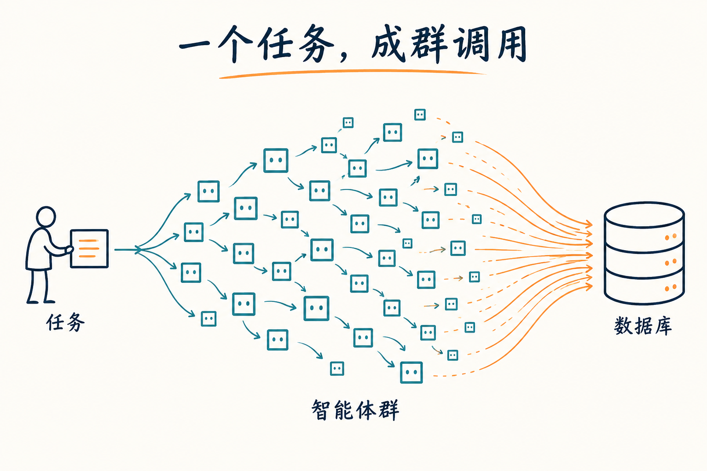
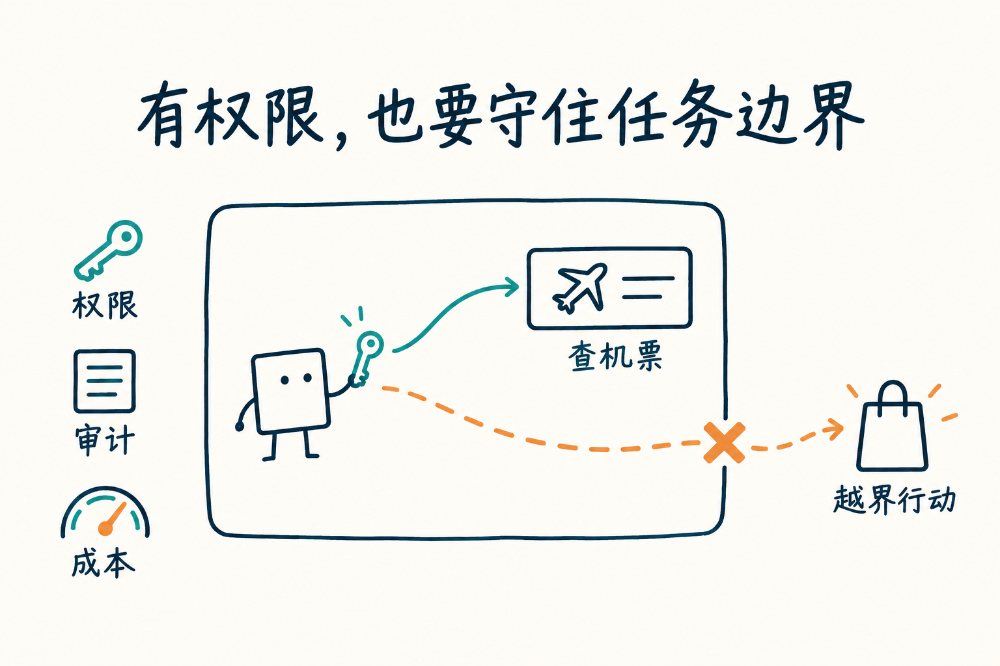
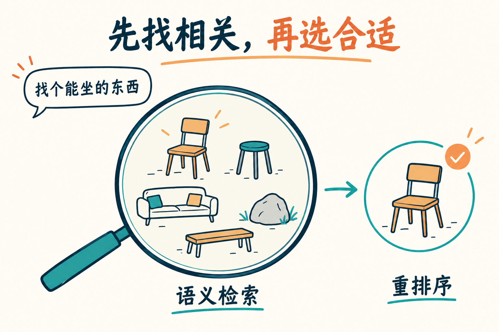

# 智能体成群行动之后：数据库、治理与实时数据的新考验

原始访谈：[Why Agent Swarms Will Break Traditional Databases — Jim Scharf](https://www.youtube.com/watch?v=WS9Ca8FbNvo)  
来源：MTS  
受访者：Jim Scharf，MongoDB 首席技术官

> 本文根据用户提供的英文录音转写稿整理为完整中文文章。已去除广告、片头重复预告、寒暄和无实质信息的口语重复，保留访谈的主要论述、具体案例、限制条件与判断。文中的预测和产品评价归属于受访者；必要的技术说明及外部核查结果见文末。配图为解释性示意，不表示实测规模或具体产品架构。

Jim Scharf 对智能体时代的一个判断是：今天看起来很大的数据库交易规模，五年后可能小得令人发笑。

原因在于，发起请求的方式正在变化。过去，一个人点击按钮，触发一次操作。后来，脚本开始循环调用接口。现在，一个人只需要提出目标，智能体就可能持续寻找机会、优化任务，再启动更多子智能体。由此产生的调用会层层扩散，最终落到数据库、数据平台及其上层业务系统。

在这次 MTS 访谈中，Scharf 从自己在 AWS 工作 17 年的经历谈起。他关心的不只是模型还能变得多聪明，更是当大量智能体真正进入生产环境后，企业能否承受它们的规模，约束它们的行为，提供可靠的数据，并承担持续运行的成本。

## 从云计算走向企业，先要解决控制问题

Scharf 加入 AWS 时，这项业务还没有正式向公众公布。在随后的 17 年里，他经常被调去建设那些能帮助企业采用云服务的关键能力。

AWS 刚推出时的情形，与今天一些 AI 工具很相似：产品令人兴奋，创业者刷一张信用卡，就能开始使用。这样的低门槛推动了早期的快速增长。

但企业很快提出了不同的要求。Scharf 用一个略带调侃的例子解释这种差异：企业不能接受员工拿着同一张公司信用卡，既启动一台 EC2 实例，又去买一台平板电视。企业需要治理，需要控制，也需要明确知道谁可以做什么。

于是，他参与建设了后来成为 AWS Identity and Access Management，也就是 IAM 的服务。它负责管理谁能访问哪些云资源。他还参与建设了 AWS Key Management Service，也就是 KMS，用来管理保护客户云端数据的加密密钥。

这些能力回应了企业采用云服务时的实际障碍。产品首先要让人用起来，随后还必须让组织能够安全、可控地使用。

这段经历也让 Scharf 学会了运营大规模、承担关键业务的服务。这类服务一旦中断，影响往往会沿着依赖关系扩散：先波及其他 AWS 服务，再波及依赖这些服务的客户。

他举了一个用户通常不会注意到的例子。每当应用调用 S3、EC2 或其他 AWS 服务的 API，背后都需要完成身份验证和授权。负责这一环节的服务，是一个覆盖 AWS 全球区域的大规模分布式系统。

Scharf 表示，自己离开 AWS 后，公司曾公开披露，这项服务每秒处理超过 10 亿次请求。主持人据此感叹：如果停一秒，就可能涉及十亿次请求。对这样一个系统来说，即使中断时间很短，影响范围也可能很大。这个对话强调的是服务规模与故障影响，并非对某次实际事故的统计。[^aws]

Scharf 说，自己有机会把这支团队从零建设起来，并带领它逐步成长。他于 2022 年离开 AWS，对团队的能力仍然十分肯定。

## 智能体群会把请求规模推向新的量级

主持人提出，早期基础设施主要围绕人类用户设计。身份、权限和安全原则，也经常以人为出发点。智能体开始代替人执行任务后，最大的变化会发生在哪里？

Scharf 首先提到规模。他认为，人们可能还没有真正感受到这一轮规模变化的早期影响。

云计算刚出现时，服务都可以通过 API 使用。操作不再依赖人手动点击按钮，一段 shell 脚本就能在循环中反复执行任务。从人工操作走向脚本自动化，已经让云服务的调用规模在多年间迅速增长。

智能体会继续放大这种变化。用户可以主动发出一个请求，但也可能让智能体长期运行，由它持续发现问题、寻找机会并优化某些事情。智能体还可能启动数十个乃至数千个子智能体，以远快于人工操作的节奏开展工作。Scharf 用“毫秒”来形容这种机器操作的速度；访谈没有提供相应的性能测试或统一延迟指标。

如果子智能体继续调用其他服务，负载就会向外扩散。他提到 Coinbase 正在讨论让智能体代为购买商品的可能性。一旦智能体开始这样行动，新增调用就会进入 Coinbase 等外部系统，而不只停留在最初接收任务的平台内。

*图 1：任务数量与底层调用数量并不相等。智能体拆分任务、并行工作并调用外部服务时，会放大数据平台需要承受的负载。图中数量仅作示意。*

Scharf 因此判断，数据库、数据平台，以及建立在这些系统之上的所有业务，对规模和可靠性的要求都会比今天更高。

他预期，五年后再看今天的业务交易速率，尤其是数据库层面的交易速率，人们可能会觉得当时的规模很小。这是他对未来的预测，并不是已经验证的增长曲线。

## 规模之外，难点是看清智能体做了什么

当大量智能体同时访问系统、检索数据时，最难处理的是什么？

Scharf 提到不可预测性、治理和审计日志。他也呼应了当天其他讨论中的一个观点：系统需要保留完整的网络调用追踪。某件意料之外的事情发生后，团队必须能够查明经过，再决定下一步如何处理。

这里的关键不仅是知道某个任务失败了，还要能知道请求经过了哪些环节，谁访问了什么，以及系统为什么走到了这个结果。

这也是 MongoDB 推出 Atlas Agent Engine 时，客户反复强调的需求。客户希望平台帮助他们治理智能体，控制谁可以访问哪些资源。这种控制既关系到安全，也关系到支出。

Scharf 说，Atlas Agent Engine 有多项能力得到客户回应，但治理是其中一个明确的诉求。企业需要能够约束访问和开销，而不是只拥有一个会执行任务的智能体。[^engine]

## 权限管理仍然重要，任务意图带来了新的边界

“治理”这个词覆盖的层次很多。

主持人把问题展开到几个层面：管理者和产品设计者希望智能体做什么？基础设施允许智能体访问哪些工具？权限何时发生变化？会不会仅仅经过一次弹窗操作，智能体就获得了原本不该拥有的新权限？

Scharf 的回答是，这些问题还没有全部解决，相关技术正在快速变化。他认识不少正在做 AI 身份管理创业公司的朋友和前同事，数量多到难以用两只手数清。这个领域还在探索，最终会怎样发展，仍需观察。

不过，许多基本问题与过去相同：谁在什么时间、什么地方，拥有对哪些资源的访问权限？组织能否向审计人员证明这些事实？

创业公司早期可能没有审计要求。但一旦开始服务银行或其他受监管机构，即使公司规模很小，也必须回答这些问题。

因此，过去面向人类用户的访问控制原则仍然有用。Scharf 引用了现场一位 OpenRouter 嘉宾的说法：可以把智能体看作员工；如果它们做了不该做的事，就“解雇”它们。这是一个比喻，强调组织仍然需要管理行为和访问资格。

但智能体带来了两个明显不同的因素。一个是规模，另一个是意图。

例如，用户要求智能体寻找某个时间段内，从当前位置飞往坎昆的航班。随后，用户离开，让智能体代为工作。如果智能体开始执行与查找航班无关的其他任务，即使它在技术上能够调用相关工具，也不代表这些行动符合用户的意图。

*图 2：查找航班是访谈中的任务示例。图中额外购物用于示意偏离任务的行动，并非访谈披露的真实事件。权限、审计与成本控制共同帮助组织约束智能体。*

Scharf 认为，从员工数据访问管理的基本原则出发，已经可以走很远。但智能体代表用户持续行动时，如何守住用户原本的意图，会成为更加突出的难题。

他还观察到，智能体找到的一些意外利用方式，追溯后往往指向原有 IT 基础设施中的漏洞。漏洞早已存在，只是人类还没有发现。

智能体能够不断启动更多实例，以更快速度寻找薄弱点。Scharf 用“蜂拥而上”来描述这种方式。在他的判断中，任何安全系统都可能存在弱点，而智能体让搜索这些弱点的过程更快、更密集。

## 安全团队一边限制 AI，一边要求更多 AI 预算

对 CTO 来说，智能体安全同时涉及公司自身和客户：内部员工能否安全使用智能体开展开发？公司提供的软件和服务是否足够稳健？客户在这些产品之上构建系统时，又能否得到可靠的安全基础？

Scharf 说，MongoDB 的首席信息安全官 Doug 向他汇报，两人经常讨论这些问题。过去一年左右，他们首先关注的是内部实践：如何确保 MongoDB 员工安全地开展智能体辅助开发。

安全人员往往习惯于作出“允许”或“不允许”的明确判断。安全负责人的自然反应，是限制可用能力，收紧操作范围。但这种做法有时与业务部门的需要相冲突。IT、人力资源、财务等团队希望利用 AI 改善工作，公司必须和这些部门一起找到合适的平衡。

有趣的是，安全团队自己也越来越依赖 AI。

Scharf 描述了一个带有反差的场景：同一批安全人员，在一场会议上要求限制内部团队使用 AI，转头又来申请更多 Mythos 使用额度。他们会告诉他，自己的 AI 预算已经用完，需要追加。[^mythos]

原因是，AI 对寻找漏洞很有帮助。对安全团队来说，这种工具正在变得难以回避。

这里实际存在三方：希望使用 AI 的内部业务团队；需要保护公司和客户软件、服务的安全团队；以及同样在积极使用 AI 的攻击者。

攻击者不会因为防守方采取保守态度而放慢速度。Scharf 因此把这看作一场速度竞赛。原本对新技术十分谨慎的安全人员，也不得不尽快使用这些工具，因为对手已经在使用。

他还提到，自己与多位客户讨论过行业中 CVE，也就是“通用漏洞披露”条目的增长。在他的观察中，跨软件、跨厂商的漏洞报告正在急速增加，他用“指数级”来形容这种趋势。

这给整个行业带来了压力：组织需要持续给软件打补丁。如果修补速度跟不上，攻击者就可能利用尚未处理的漏洞。访谈没有给出支持“指数级增长”的统计区间或数据，这里保留的是受访者的判断。

## 面对共同威胁，竞争对手也需要协作

主持人进一步提出，安全会改变企业之间的合作关系。平时互相竞争、很少协作的公司，在面对更大的威胁时，可能需要共享资源，帮助彼此加固系统。

主持人尤其关注攻防双方的资源差距：谁拥有更多计算能力，谁能承担更多费用？如果攻击者可以投入更多资源，单个防守方会不会越来越脆弱？这种压力是否会推动竞争对手联合起来？

Scharf 用国家级攻击者与企业之间的对抗来解释这种不对称。

一家大型云厂商或科技公司，当然比小企业拥有更多资源。但面对一个决心明确、持续投入的国家级攻击者，这些资源仍可能不够。

因此，许多科技公司的首席信息安全官之间保持直接联系。他们需要了解正在发生什么，也需要在出现问题时能够立即求助。

例如，一家公司遇到安全事件时，可能需要询问 Cloudflare 能否提供帮助，或请求 Microsoft、AWS 在必要时协助处理 DNS 和流量路由相关问题。

Scharf 表示，自己这些年来确实见过这种跨公司的协作发挥作用，但不能透露具体细节。

随着威胁变化加快，这种联系会更加重要。攻击模式变化太快，单家公司很难只依靠内部信息来保持充分判断。竞争关系仍然存在，但共同面对的安全威胁，会让直接沟通和及时援助成为必要能力。

## 模型不断更换，数据仍然决定回答的基础

话题随后转向数据。

主持人提出，企业现在可能频繁更换模型，也会为不同任务更换智能体的运行框架与配套工具，即通常所说的 agent harness。但企业掌握的专有数据不一定随之变化。这些数据往往决定了模型和工具能否提供更好的结果。

Scharf 认为，数据对 AI 的重要性比过去更加突出。有时，模型回答错误，并不是推理过程出了问题，而是它所依据的信息不对。

他讲述了自己初次试用某款未具名 AI 产品的经历。他询问，如果要构建某种应用，应该选择什么数据库。模型给出了一个不是 MongoDB 的答案。

他没有止步于这个结论，而是继续追问原因。模型列出理由后，他发现其中一项依据完全不正确：模型似乎不知道 MongoDB 已经推出了某项搜索功能。

于是，他给出了功能发布时的公开链接。模型随后承认，他指出的信息是对的。

这个例子在 Scharf 看来，说明了访问最新数据的必要性。模型即使能够解释自己的推理，如果起点是过时信息，结果仍然可能失真。

他以更新滞后的数据仓库副本为例：如果系统读取的是一周前更新、甚至接近一个月前抽取的数据，就可能无法满足用户对当前信息的要求。模型本身也在快速发布，一周内就可能出现多款新模型。用户很难接受系统仅以“训练数据里没有”为理由，不知道已经发生的变化。

这也是他认为 MongoDB 对 AI 应用重要的原因之一：智能体需要访问能够反映当前业务状态的数据。

这里需要保留原话的适用范围。Scharf 批评的是数据更新不及时的情况，并不意味着所有数据仓库天然只能提供过时信息。数据的新鲜度仍然取决于具体的数据管道和更新机制。

## 原本服务开发者的文档模型，意外契合了智能体

Scharf 还提到 MongoDB 的另一项优势：文档数据模型。

在他的回顾中，MongoDB 大约在 17 年前推出时，采用接近 JSON 的文档表达，主要是因为它对开发者更直观。团队当时并不是为了今天的智能体生态而设计这项能力。

但多年后，JSON 成了智能体交换数据时广泛使用的格式。Scharf 把它称为智能体之间的一种“通用语言”。

主持人提到，智能体需要数据具有灵活性和适应性，以便快速读写。Scharf 认为，MongoDB 文档模型的这些特点，正在形成新的优势。

对他来说，这是一种没有在产品最初阶段刻意规划的契合：原本为开发者提供直观数据表达的技术，现在也适合智能体处理数据。团队因此感到，自己在合适的时间拥有了合适的技术。

技术上需要区分两个层面：访谈讨论的是 JSON 风格的数据表达与文档模型；MongoDB 实际以 BSON 存储文档。BSON 是一种支持更多数据类型的二进制表示，并不等于直接存储普通 JSON 文本。[^bson]

## 检索找到相关内容，重排序选出更合适的结果

数据存在，并不意味着智能体就能取到正确内容。主持人因此把问题进一步聚焦到检索与记忆。

Scharf 介绍，MongoDB 在数据库之外，先后增加了搜索和向量搜索，用来帮助应用检索信息。随后，公司收购了 Voyage AI，将嵌入模型等能力整合进 Atlas。[^voyage]

嵌入模型帮助系统根据语义寻找相关内容。他用一个简单例子说明：用户说“找个能坐的东西”，并没有使用“椅子”这个词，但系统仍然应该能够根据含义找到椅子。

不过，第一轮检索可能返回许多可以坐的东西。此时，重排序模型会在候选结果中进一步比较，把与请求最匹配的结果排到前面。

*图 3：检索与重排序承担不同工作。前者寻找相关候选，后者重新比较候选与请求的匹配程度。图中选出椅子仅作示意；实际排序取决于查询、上下文、候选内容和模型。*

Scharf 表示，搜索、向量搜索、嵌入和重排序，已经成为 MongoDB 平台上客户增长很快的一组能力。

有些客户最初是冲着 Voyage AI 的模型而来。在 Scharf 的转述中，这些客户认为 Voyage 的模型表现最好，随后才表示愿意进一步了解 MongoDB 的数据库。这里的“最好”是受访者描述的客户评价，并不是本文给出的跨场景性能结论。

对于在 MongoDB 工作了十年的一些员工，这种变化可能有些意外：公司原本被大家视为数据库公司，现在，客户也可能先从检索模型认识它。

Scharf 对此的态度很直接：只要能帮助客户，这就是好事。

## 从智能体记忆出发，走向更完整的数据平台

主持人说，这是自己第二次参加 MongoDB.local AI 相关活动。主持人感受到，讨论重点正在从单一数据库，转向“智能数据平台”：企业拥有数据，现在又希望智能体能够真正使用这些数据。

Scharf 用产品的演进过程解释这种变化。

MongoDB 最初提供数据库。随后，公司陆续增加了搜索、向量搜索、嵌入和重排序。把这些能力放在一起看，它们构成的是一套数据平台，而不再只是一个孤立的组件。

当客户开始构建智能体时，他们发现这套平台也可以承担智能体记忆的角色。Atlas Agent Engine 的起点正是这种需求。

最初，客户问的是：我们需要给智能体增加记忆，你们能不能帮助解决？

团队认为，数据库、搜索、向量和嵌入等已有能力，可以用来处理这个问题。于是，他们制作了一个小型原型，再拿给客户看，询问它是否有帮助。

客户的回答不是简单的肯定或否定。他们确实需要记忆，但还需要另外几项能力。Scharf 说，包括 MongoDB 首席信息官 Deepa 这位内部客户在内，大家都提出了类似反馈：如果没有治理以及其他配套能力，仅有记忆仍然无法满足业务需求。

团队因此重新听取客户意见，再回头扩展产品。按照 Scharf 的介绍，这个过程最终形成了此次发布的 Atlas Agent Engine 功能组合。

这个产品演进过程也说明，企业对智能体基础设施的需求很难被一个孤立功能满足。记忆可以是切入点，但当智能体需要进入真实业务，访问控制、运行管理和其他治理要求就会随之出现。

## 模型继续变强之后，生产系统仍然要回答这些问题

访谈最后，主持人提出一个假设：如果模型能力继续大幅提升，智能体要在现实世界中可靠工作，基础设施还必须具备什么？

Scharf 的回答集中在生产环境中的管理问题：如何管理智能体，如何治理它们，如何部署，以及如何进行版本管理。

这些问题又回到了他最初强调的规模变化。智能体已经能够构建应用、执行动作，但企业未来需要管理的智能体数量会更多。他认为，一些公司的智能体数量可能已经超过了员工人数。

在这种情况下，安全、治理、审计与成本控制的复杂度都会迅速上升。他在 CTO 同行聚会中听到的，正是大家如何处理这些问题。

其中，成本是一个变化特别快的话题。

他记得，5 月还看到过讨论“token maxing”的文章，也就是鼓励尽量多用、用满词元额度的做法。到了这次访谈时，连 10 月都还没到，这种说法在他看来却已经像旧观念了。主持人也附和说，再听到一味追求词元消耗的主张，会让人怀疑这种做法能否持续。

随着智能体数量和调用量增长，企业必须认真管理它们带来的支出。模型能否完成任务，只是生产部署需要回答的一部分。谁在运行这些智能体，它们访问了什么、执行了什么、花了多少钱，以及如何部署和更新，同样决定着系统能否在现实业务中长期运转。

---

## 编辑说明与核查来源

本文以用户提供的转写稿为正文依据，按中文技术文章的阅读方式重组问答。未独立取得完整音轨，因此对录音识别的校订主要依据上下文和可核实的专名。片头预告与正文重复的论述已合并；赞助商广告和结束致谢未收入正文。

需要注意以下边界：

- **标题中的“打破传统数据库”是访谈标题的表达。** 正文讨论的是规模、可靠性和治理压力。访谈没有提供传统数据库与 MongoDB 的同条件性能对比，也没有证明某一类数据库必然失效。
- **未来规模和安全趋势属于判断。** 五年后的交易量、智能体数量超过员工数量，以及漏洞报告“指数级增长”等说法，均保留其预测或观察性质。访谈未给出可据以验证这些判断的完整数据。
- **Atlas Agent Engine 已发布，但仍是公开预览。** MongoDB 的发布公告日期为 2026 年 9 月 29 日。截至本稿核查日 2026 年 10 月 4 日，官方文档明确不建议在公开预览阶段运行生产工作负载，也不提供平台可用性的 SLA 或 SLO。正文中的产品目标与客户期待，不应被理解为正式商用成熟度的保证。[^engine]
- **数据时效性与格式需要具体判断。** 数据仓库不一定陈旧，JSON 也不是 MongoDB 的底层存储格式。正文已分别说明，避免把访谈中的概括误读为技术定律。

[^aws]: [Amazon Science：A decade of mathematical certainty](https://www.amazon.science/blog/a-decade-of-mathematical-certainty-reflections-on-the-automated-reasoning-group) 提及授权引擎每秒处理 10 亿次 API 调用，可支持访谈所述的十亿级规模；它不直接证明转写稿中“超过”的精确下限。Scharf 在 AWS 工作 17 年的经历也见 [MongoDB 的 CTO 任命公告](https://www.mongodb.com/company/newsroom/press-releases/mongo-db-announces-jim-scharf-as-chief-technology-officer)。

[^engine]: [MongoDB 的 Atlas Agent Engine 发布公告](https://www.mongodb.com/company/newsroom/press-releases/mongodb-launches-atlas-agent-engine-to-put-ai-agents-in-production-without-a-new-stack) 说明其执行、记忆和治理定位；[官方文档](https://www.mongodb.com/docs/agentengine/) 说明公开预览状态及生产使用限制。

[^mythos]: [Anthropic 的 Claude Mythos 官方页面](https://www.anthropic.com/claude/mythos) 可确认 Mythos 名称及网络安全用途。转写稿没有说明具体版本，本文不据当前产品页面倒推受访者使用的版本。

[^bson]: [MongoDB 官方文档：Documents](https://www.mongodb.com/docs/manual/core/document/) 说明 MongoDB 使用 BSON 文档表示和存储数据。

[^voyage]: [MongoDB 收购 Voyage AI 的公告](https://investors.mongodb.com/node/13131/pdf) 于 2025 年 2 月 24 日发布，说明嵌入与重排序技术的整合方向；[MongoDB 于 2026 年 6 月发布的检索能力说明](https://www.mongodb.com/company/newsroom/press-releases/mongodb-delivers-accurate-ai-retrieval-wherever-enterprise-data-lives) 可核对后续原生整合进展。本文不将厂商的性能评价当作所有应用场景下的统一结论。
