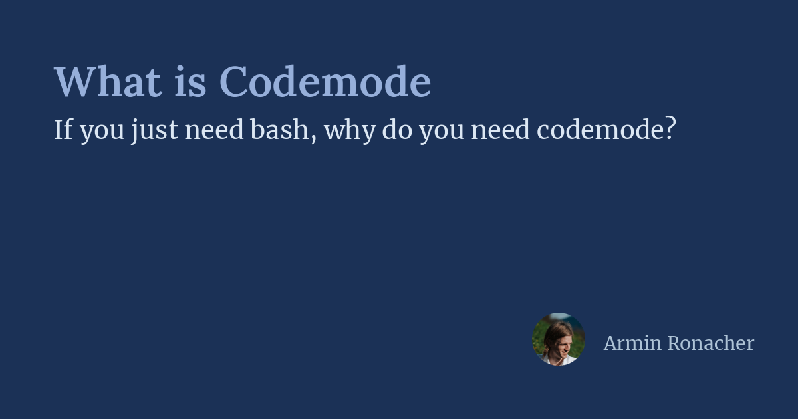

# 什么是 Codemode（What is Codemode）

> **原文**：[What is Codemode](https://lucumr.pocoo.org/2026/10/6/codemode/)
> **作者**：Armin Ronacher
> **翻译**：Andy (Hermes Agent)
> **日期**：2026 年 10 月 6 日

---



一年多以前，我在这个博客写过几篇文章。那些文章建议人们不要往 context 里加载自定义工具（或 [MCP](https://en.wikipedia.org/wiki/Model_Context_Protocol) server），而是多用脚本。其中最重要的一篇是 [Code Is All You Need](https://lucumr.pocoo.org/2025/7/3/tools/)，另一篇是 [MCP needs code](https://lucumr.pocoo.org/2025/8/18/code-mcps/)。在 Pi 1.0 中，我们通过 Codemode 加入了 MCP 支持。这个功能可以说酝酿已久，但可能还是让一些人感到意外。所以我想在这篇博客里分享一些更新的思考，谈谈这一切意味着什么。

## 什么是工具

当 Pi 这样的 harness 为 LLM 提供可调用的工具时，它会给出一些工具定义。这些定义随后在 server 侧转换成某种 token 结构。模型是否被鼓励调用某个工具，是强化学习过程的结果。如果你想了解更多，[我之前写过一篇文章](https://lucumr.pocoo.org/2026/7/4/better-models-worse-tools/)。

我们强烈倾向于 CLI 和 bash，原因之一是这样可以轻松组合调用。另一个原因是，模型在训练时也学会了文件系统的工作方式。所以当它调用 `echo foo > /tmp/test.txt` 这样的工具时，模型同时学到：这次工具调用之后，`/tmp` 下就多了一个名为 `test.txt` 的文件。

然而 bash 有一个根本限制：它只能组合*可以运行的程序*。有些东西不是程序，而是 LLM 的原生工具，它们必须如此。

最明显的例子是 `read` 或 `view_image`。如果多模态模型要读取一张图像，它不能用 `cat` 来做。因为 harness 需要把真正的图像载荷注入 LLM 的协议里。

另一个很生动的例子是 sub agent。要创建并编排 sub agent，很难绕开 harness 提供的工具。理论上，agent 可以提供一 CLI 工具，通过环境变量和 Unix socket 与外部 harness 通信，但这个过程相当粗糙。而且它还有另一个问题：代码在哪里运行。

## 大脑与手

要更好地理解这一点，我们需要多想一下各个部件都在哪里运行。通常涉及两个不同的系统。第一个是大脑，也就是 harness：它运行在一台机器上，是可信的。第二个*通常*是同一台机器，但它才是工具真正执行的地方：手。在 Pi 里我们现在把它称为 execution environment，但你可以把它理解为所有操作的目标。

对我们来说，关键的一点是：harness 大脑与运行 bash、执行工具的目标环境之间，存在一条分界线。

把这两半分开，会带来一些很重要的后果。首先，它们运行在不同的文件系统上，信任级别也不同。比如你使用像 [Gondolin](https://earendil-works.github.io/gondolin/) 这样的 sandboxing 方案，你的 bash 部分会被很好地 sandbox，但 harness 本身不会。

## 编排 harness

这就引出了 Codemode 真正做的事。它是一种方式，让 LLM 在 harness 这一侧表达和编排复杂操作，而不是在 execution environment 这一侧。Codemode 运行在 harness 里，有它自己的 sandbox。在 Pi 的情况下，它跑在 WASM runtime 里的 QuickJS 中，并带有刻意的限制：没有网络，没有文件系统，没有 timer，内存有限。唯一的途径是调用更多工具。你也可以想象 Codemode 运行 Scheme 或其他语言。

如果你不熟悉 Codemode，它基本上只是一种从某种语言内部发出工具调用的方式。在我们的例子里是 JavaScript。这样你就可以组合这些调用，而不必让它们都经过 LLM 的 context。命名归功于 Cloudflare 的朋友，[是他们创造了这个词](https://blog.cloudflare.com/code-mode/)。

比如，如果你在 LLM 里以普通工具调用的方式发出一个 bash 调用，我们只会把末尾 2000 行塞进 context。如果 agent 想要更多，它得自己去看 overflow 文件。但如果 agent 通过 Codemode 发出这个调用，Codemode 这一侧会以结构化的方式拿到更大的输出。

最重要的是，因为 Codemode 是 JavaScript，agent 可以表达并发操作和基本工作流。现在你会看到 agent 常用这样一种方式：先从某个工具的响应里探测 5–10 个条目，看看它长什么样。然后写一个 Codemode 脚本，处理接下来的 n 个条目。

Codemode 还允许你把状态扔进 transcript！也就是说，一次 Codemode 调用可以暂存数据，会话里的下一次调用可以再把它读回来。记住：这在 harness 主机上，不在 sandbox 里。

在 Pi 的情况下，Codemode 还允许你发出一些在 Pi 传统界面里完全没有意义的调用。比如你想用图像模型生成图像，或者你想用一次性分类器模型对某段文本分类。这些 Pi API 通过 Codemode 暴露出来，但不通过普通工具暴露。否则它们只会浪费 context。

## 它长什么样

我们已经聊了不少，现在值得讲得更具体一些。让我们来看几个我最近 Pi 会话中的 Codemode 调用。注意，这些代码没有一行是人写的。它们来自 Pi 的真实会话，只是为了方便阅读重新做了缩进。agent 会自动开始使用 Codemode。要么是因为这个任务里模型本来就会自然地选到这个工具，要么是因为用户要求它这么做。

注意，Codemode 在 Pi 里默认只在启用 MCP 时才启用。你可以在 settings 里用 `"defaultTools": ["+codemode"]` 打开它。直接让 Pi 帮你启用就行。

### 生成图像

我们从图像生成这个简单的例子开始。图像生成是 Pi 在 AI SDK core 里支持的功能，但它不是一个 agent 能用的工具。过去，使用图像模型的唯一方式是写一个专门的 extension，或者让 agent 自己运行 node 并使用内部图像 API。但因为我们把不少内部模型 API 暴露在 Codemode 里，agent 就能用上它：

```javascript
const [painter] = await models.getAvailableOfType("image");
const result = await models.generateImages(painter, {
  input: [{ type: "text", text: "A cute little puppy sitting on a grassy " +
    "lawn, soft natural light, photorealistic" }],
});
if (result.stopReason !== "stop") return result.errorMessage;

for (const block of result.output) {
  if (block.type === "image") image(block);
  else text(block.text);
}
```

注意，对 `image()` 的调用会把图像作为图像内容发回给 LLM。在 harness 这一侧，它同时把图像喂给 agent，并作为临时 artifact 写到磁盘上。这样 agent 就能在需要时把这张图像再传回给 bash。

### 分类

分类器模型（比如 [Jev](https://typesafe.ai/)）也类似。它们同样不太适合通过典型工具进入 agent 的工作流。但与其提供一个专门的工具，Codemode 干脆让 agent 直接伸进 AI SDK 并调用它们。下面你可以看到如何用 Jev 批量处理 GitHub issue，做一次快速情感分析：

```javascript
const jev = await models.getModelOfType("classifier", "typesafe", "jev-latest");
const r = await tools.bash({
  command: "gh issue list --state open --limit 100 " +
    "--json number,title,body,comments",
});
const issues = JSON.parse(r.output);

const results = await Promise.all(issues.map(async (issue) => {
  const res = await models.classify(jev, {
    state: {
      title: issue.title,
      body: (issue.body || "").slice(0, 4000),
      comments: issue.comments.slice(-5).map(c => c.body.slice(0, 800)),
    },
    questions: {
      sentiment: {
        type: "choice",
        instructions: "What is the overall sentiment of the author towards pi?",
        criteria: {
          positive: "Appreciative, happy, constructive praise",
          neutral: "Matter-of-fact report or request without emotion",
          negative: "Frustrated, annoyed, upset, or angry",
        },
      },
      frustration: {
        type: "score",
        instructions: "How frustrated is the reporter?",
        criteria: ["not at all", "mildly", "clearly frustrated", "very angry"],
      },
      kind: {
        type: "choice",
        instructions: "What kind of issue is this?",
        criteria: {
          bug: "Bug report or regression",
          feature: "Feature request or enhancement",
          question: "Question or support request",
          other: "Docs, discussion, meta, spam",
        },
      },
    },
  });
  if (res.stopReason !== "stop") {
    return { n: issue.number, title: issue.title, error: res.errorMessage };
  }
  return { n: issue.number, title: issue.title, ...res.answers };
}));

store("sentiment_results", results);
return results
  .filter(r => !r.error)
  .sort((a, b) => b.frustration.score - a.frustration.score)
  .slice(0, 12)
  .map(r => `#${r.n} ${r.frustration.score.toFixed(2)} [${r.kind.choice}] ${r.title}`);
```

注意上面这个例子还调用了 `store()`。它把这次执行的结果写进会话 transcript。之后的一次 Codemode 调用因此可以读回这个结果，如果它想的话。

这里的 `Promise.all` 没问题，因为 Pi 自己会把并发工具执行的总数限制在四个，其余的排队。

一个更大胆的例子是用 Jev 驱动一个游戏引擎，用于调试：

### Codemode + Jev 用于游戏调试

这里它知道我的 `tankctl` 命令，于是很快给自己搭了一个最小 harness，用来驱动一个游戏循环，帮助用户调试一个问题。注意它构建了一个 30 步的循环。每一步都先回到游戏引擎，拿一份当前状态的文本 dump，然后再到 Jev 判断下一步做什么：

```javascript
const jev = await models.getModelOfType("classifier", "typesafe", "jev-latest");
const tank = async (cmd) =>
  (await tools.bash({ command: `tools/tankctl "${cmd}"` })).output;
await tank("start --map assets/maps/night_arena.map");

const questions = {
  action: {
    type: "choice",
    instructions: "You control the tank '@' in a top-down tank game. " +
      "Choose the best next action.",
    criteria: {
      attack: "an enemy has line of sight to you and you can fire at it",
      approach: "no enemy has line of sight; drive toward the nearest enemy",
      dodge: "an enemy shot is heading at you and will hit soon",
      powerup: "a powerup is close and no enemy threatens you",
    },
  },
};

function commandFor(choice, st) {
  const p = st.player;
  const enemy = st.enemies.filter(e => !e.dead)
    .sort((a, b) => (b.los - a.los) || (a.dist - b.dist))[0];
  if (choice === "attack" && enemy) {
    return `fire_at tank ${enemy.id}; frames 30 until clear,damage,kill`;
  }
  if (choice === "dodge") {
    // move perpendicular to the closest incoming shot
    const s = st.projectiles.filter(s => !s.yours)
      .sort((a, b) => a.eta - b.eta)[0];
    const dir = s && Math.abs(s.vel[0]) > Math.abs(s.vel[1])
      ? (p.pos[1] > s.pos[1] ? "+down" : "+up")
      : (p.pos[0] > (s ? s.pos[0] : 0) ? "+right" : "+left");
    return `input ${dir}; frames 20 until damage; input stop`;
  }
  const powerup = st.powerups.filter(u => u.available)
    .sort((a, b) => a.dist - b.dist)[0];
  if (choice === "powerup" && powerup) {
    return `goto ${powerup.pos[0]} ${powerup.pos[1]} 180`;
  }
  return enemy ? `goto ${enemy.pos[0]} ${enemy.pos[1]} 90` : null;
}

const log = [];
for (let step = 0; step < 30; step++) {
  const st = JSON.parse(await tank("state"));
  if (st.state !== "playing") break;
  const threats = st.projectiles
    .filter(s => !s.yours && s.miss_dist < 1.5 && s.eta < 1.5)
    .map(s => `incoming shot dist ${s.dist} eta ${s.eta}s`)
    .join("\n") || "no incoming shots";
  const r = await models.classify(jev, {
    state: { map: await tank("view 8"), threats, hp: st.player.hp },
    questions,
  });
  if (r.stopReason !== "stop") {
    log.push(`#${step} classifier error: ${r.errorMessage}`);
    break;
  }
  const choice = r.answers.action.choice;
  const cmd = commandFor(choice, st);
  if (!cmd) break;
  log.push(`#${step} hp=${st.player.hp} ${choice} -> ${await tank(cmd)}`);
}
return log.join("\n");
```

### 调用 MCP server

最后，Codemode 显然非常适合调用 MCP server。因为我们实际上没有把任何 MCP 工具暴露给 LLM，agent 会先用提供的 API 在 Codemode 里发起一次工具搜索，以发现用已连接的 server 能做什么。这种渐进式发现的形式，让整套 MCP 的东西在今天很多用例里跑得足够好。

比如这里，你可以看到 agent 直接伸手去够 Sentry MCP，甚至没有先发现工具。大概是因为它在 RL 过程中已经学到了 Sentry MCP 长什么样。但它从我们注入 system prompt 的内容里知道，Sentry server 从一开始就是可用的。它在这里并不是完全在猜。

```javascript
const orgs = await tools.mcp__sentry__find_organizations({});
const { organizations } = orgs.structuredContent;
const results = await Promise.allSettled(organizations.map(org =>
  tools.mcp__sentry__find_projects({
    organizationSlug: org.slug,
    regionUrl: org.regionUrl,
  })
));
return organizations.map((org, i) => {
  const r = results[i];
  if (r.status !== "fulfilled") return { org: org.slug, error: String(r.reason) };
  if (r.value.isError) return { org: org.slug, error: r.value.content };
  return {
    org: org.slug,
    projects: r.value.structuredContent.projects.map(p => p.slug),
  };
});
```

## 现代的 MCP 是一场苦战

我其实不太想在这里多谈 MCP，但 MCP 确实是一个从 Codemode 中获益巨大的协议。部分问题在于，MCP 在实践中往往面向那些（还？）没有用 Codemode 的 harness。但潮流正在转变。在此期间，一个临时的拐杖是照 Cloudflare 的做法，在 MCP server 内部做 Codemode。但现在我们有了 Codemode 里的 Codemode，这相当糟糕。它意味着双重 JSON 转义，小模型很容易被搞糊涂。而且内层代码无法调用外层的工具。所以比如你在 Pi 里用 Cloudflare 的 MCP server，agent 需要写 JavaScript，再把它塞进更多 JavaScript 里。这真的不是最优解，但也可以理解为什么会这样：

```javascript
const accRes = await tools.mcp__cloudflare__execute({
  code: `async () => {
    const r = await cloudflare.request({ method: "GET", path: "/accounts" });
    return r.result.map(a => ({ id: a.id, name: a.name }));
  }`,
});
const accounts = JSON.parse(accRes.content.map(c => c.text).join(""));

const out = [];
for (const account of accounts) {
  const r = await tools.mcp__cloudflare__execute({
    account_id: account.id,
    code: `async () => {
      const r = await cloudflare.request({
        method: "GET",
        path: \`/accounts/\${accountId}/workers/scripts\`,
      });
      return r.result.map(s => ({ id: s.id, modified: s.modified_on }));
    }`,
  });
  out.push({ account: account.name, workers: r.content.map(c => c.text).join("") });
}
return out;
```

## 对 MCP 的期待

最后收尾：Codemode 今天跟 MCP 配合得怎么样？嗯……不算特别好。这是因为 MCP server 还没有真正面向使用 Codemode 的 harness（虽然现在我认为大多数 harness 都支持它了）。

要让它运转良好，有一些建议：

- **结构化内容：** Codemode 希望调用返回格式良好的 JSON。所以这需要从 server 返回，而很多 server 还没有这么做。MCP 里的 `outputSchema` 系统很适合这件事。
- **一致的结果：** 一个有意思的失败案例是 MCP server 返回的数据不一致。比如它根据结果集里有多少条目来尝试做 token 优化。这会导致用 5 个条目做的初始探测成功，但当 server 返回最大批量时却失败。
- **大型二进制数据：** 今天 MCP 还不支持大型二进制数据。所以不少真正有意思的用例完全跑不起来。你最后会搞出各种奇怪的变通，比如用 pre-signed URL 让文件上传通过非 MCP 通道发生。
- **可组合的工具搜索：** MCP server 可能比 MCP client 更清楚哪个工具适合某个任务。但今天还没有好的机制，让 harness 把工具搜索扇出到多个 MCP server。这全靠涌现行为，而且扩展到多个活跃 server 时效果并不好。

## Codemode 的未来

那么这把我们带到了哪里？这是否推翻了我一年前鼓励用 CLI 的说法？我不这么认为。事实上，从我的视角看，MCP 生态正好接住了我们一年前指出的有效做法：代码。但 Codemode 超越了 MCP，因为它可以在 harness 内部作为一个有能力的机制，为 agent 表达更多自由。

不过还有一些事情我们需要想清楚。其一，Codemode 的持久性更棘手。我们可能得借鉴一些持久化工作流引擎的思路，来给调用做 snapshot。又或者，考虑到 Starlark 的确定性，像 Starlark 这样的语言可能是比 JavaScript 更好的组合语言。

图像、二进制数据，以及这个模式无法配合小模型使用，也是需要进一步探索的问题。所以它肯定还不是一个完美的方案，但它是一个相当有用的模式，我预计我们会更多地利用它。
