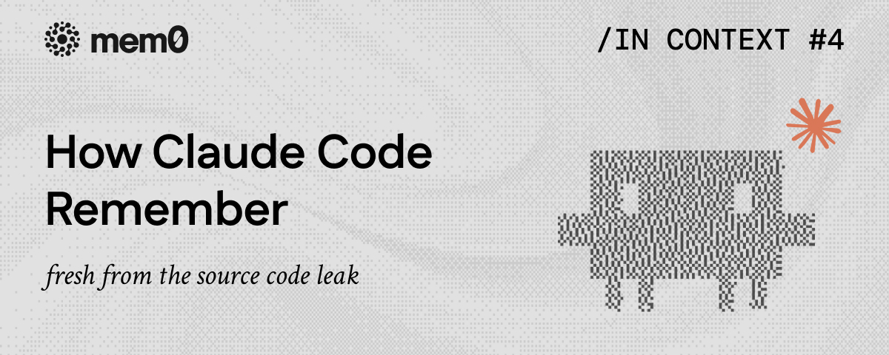
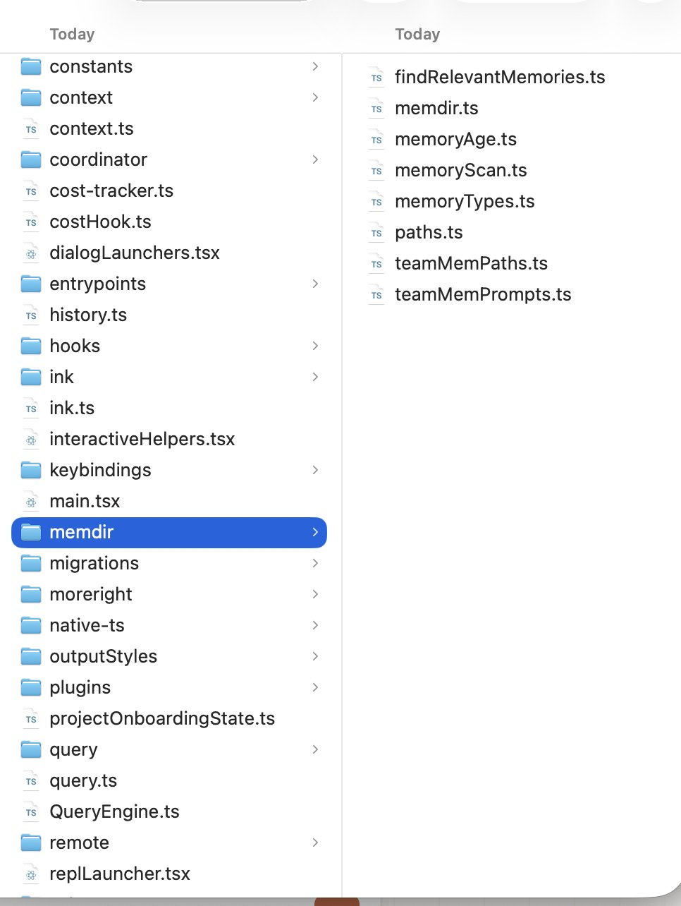
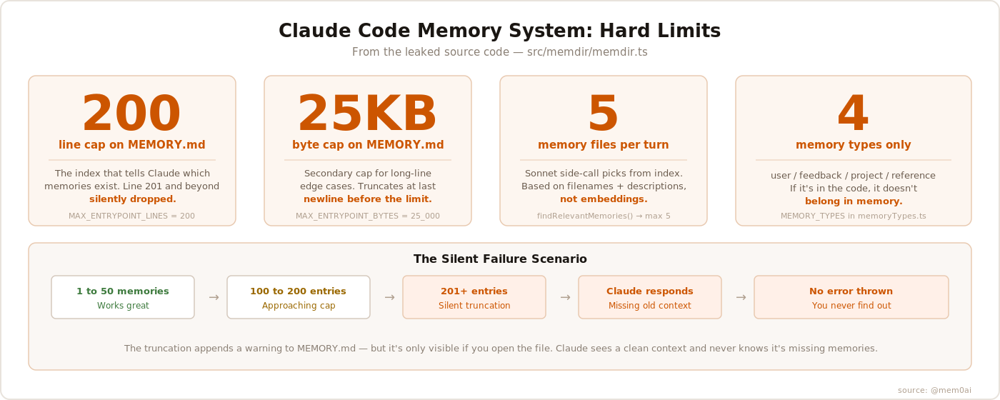
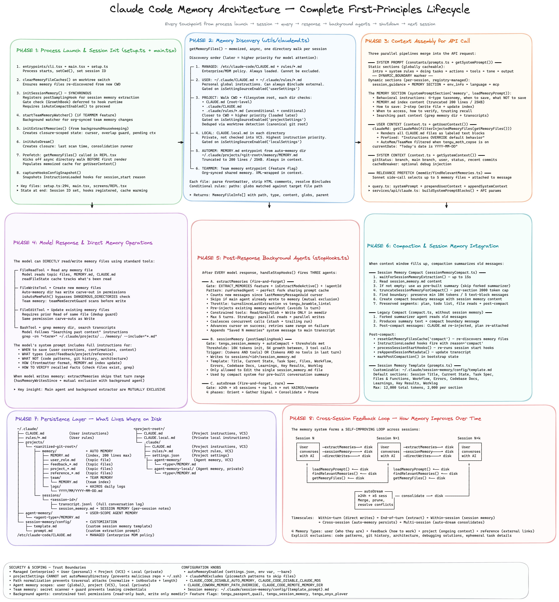
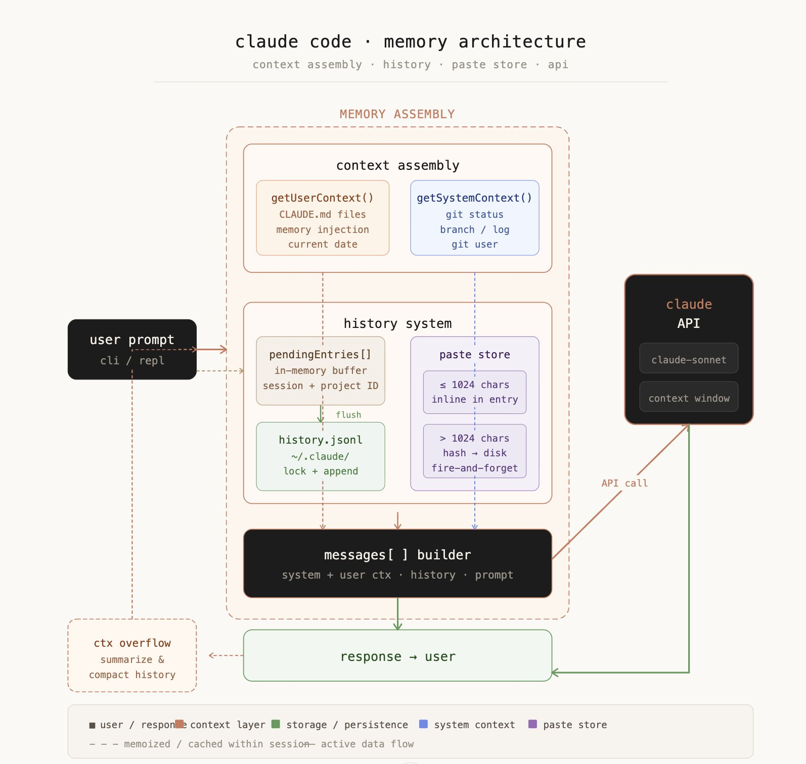
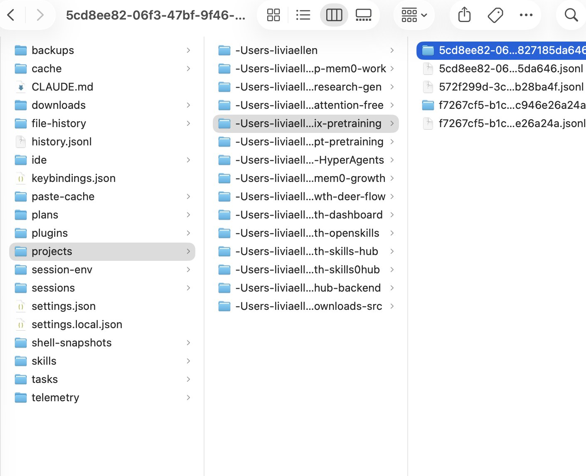

# 我阅读了 Claude Code 的内存源代码。这个限制会静默删除你代理的内存

**作者：** mem0  
**原文：** https://x.com/mem0ai/status/2039041449854124229  
**翻译时间：** 2026-04-01

---



我阅读了 Claude Code 的内存源代码。

200 行索引上限。每轮 5 个文件。没有嵌入向量。

以下是当 Claude 说它记得你时实际发生的情况，以及如何修复它。

## 内存泄漏

有人将完整的 Claude Code 源代码发布到了互联网上。

工程师们立即开始研究有趣的部分：提示词、工具定义、计费逻辑。


*Claude Code 内存目录*

我直接查看了 `src/memdir/`。

七个文件。整个内存架构。其中隐藏着一个 Anthropic 从未公开记录的硬性限制。

## 内存系统实际工作原理


*Claude Code memory*

Claude Code 将内存存储为磁盘上的纯 Markdown 文件。

**路径：** `~/.claude/projects/<你的仓库名称>/memory/`

每个项目都有自己的文件夹。每次对话都可以写入其中。文件在会话之间持久化。这就是整个持久化模型。

还有一个名为 `MEMORY.md` 的索引文件。它位于该文件夹的根目录。Claude 在每次会话开始时读取此索引以了解存在哪些内存。

这就是有趣的地方。

## 200 行上限

MEMORY.md 在源代码中有两个硬性限制。

**200 行最大值。** 如果你的索引超过这个限制，系统会静默截断它。它会在截断的内容后附加一个警告，但只有你去文件中查找时才能看到这个警告。Claude 看到的是干净的系统提示，完全不知道索引被截断了。

**25KB 最大值。** 针对每行异常长的边缘情况的单独字节上限。

失败模式是静默的。你达到 201 行。记忆从底部消失。Claude 停止知道它们的存在。它不会告诉你。不会报错。只是忘记。

## 四种内存类型

源代码将内存限制为 exactly 四种类型：

- **用户记忆** 跟踪你是谁。你的角色、专业知识、偏好、你喜欢如何沟通。仅私密。
- **反馈记忆** 跟踪你给出的指导。纠正、验证过的方法、需要停止的事情。
- **项目记忆** 跟踪代码库中发生的事情。截止日期、决策、代码本身无法推导出的架构上下文。
- **参考记忆** 存储指向外部系统的指针。在哪里跟踪 bug。要关注哪个 Slack 频道。

代码明确指出：如果信息可以通过 grep 或 git 从当前代码库中推导出来，则**不应**将其保存为内存。

## Sonnet 侧边调用

每轮，Claude Code 都会向 Claude Sonnet 发起单独的 API 调用。只是为了找出哪些内存文件与你的当前查询相关。

过程：扫描所有内存文件，提取它们的文件名和描述，将该清单发送给 Sonnet，要求它选择最相关的文件。最多返回 5 个文件。

这是一个语义相关性步骤，但它仅基于文件名和一行描述。不是嵌入向量。不是向量搜索。只是语言模型读取列表并做出判断。

## 内存新鲜度

源代码有一个 `memoryFreshnessText()` 函数，为超过一天的内存生成陈旧警告。

警告内容："此内存已有 X 天历史。内存是时间点观察，而非实时状态。关于代码行为的声明或 [file:line](file:line) 引用可能已过时。"

这会在 Claude 看到之前直接添加到内存内容中。Claude 知道旧记忆可能是错误的。但无法从外部知道哪些记忆触发了这个警告。

## 后台代理

有一个 `extract-memories` 代理在对话结束后运行。后台进程会审查发生的事情并自动提取记忆。

这意味着两种不同的东西在写入你的内存目录。会话期间的主代理。之后的后台提取器。

代码包含此功能的特性标志（EXTRACT_MEMORIES、tengu_passport_quail）。并非对所有人都开启。但架构已经存在。

## 团队内存

有一个用于团队范围内存的 TEAMMEM 特性标志。

启用时，某些记忆是私密的（只有你能看到），其他是团队范围的（所有贡献者共享）。项目约定进入团队记忆，个人偏好保持私密。

## Claude Code 实际如何忘记

以下是破坏性的场景。

你已经在一个实际项目上使用 Claude Code 三个月了。它已经学会了：

- 你的偏好和工作方式
- 一月份做出的架构决策
- 某个端点不稳定，测试中不应信任
- 你的团队对热修复跳过 PR 审查

然后你达到了第 201 条。

索引静默截断。最旧的记忆从底部消失。Claude 在下次会话加载一个全新的上下文，完全不知道这些记忆曾经存在。

接下来发生的事情：

- Claude 编写了一个命中不稳定端点的测试
- Claude 再次询问你的 PR 审查策略
- Claude 与你几个月前同意的架构相矛盾
- **它不是在幻觉。它没有坏掉。它只是忘记了。而且它无法告诉你。**

新鲜度警告让情况更糟——它们只针对已加载的记忆触发。如果记忆被截断出索引，它永远不会被加载。没有警告。没有信号。Claude 不知道它不知道什么。

## 限制 + 修复

默认系统设计良好的 v1 版本：扁平的 Markdown 文件、清晰的四类型分类、周到的新鲜度警告。对大多数项目来说是正确的起点。

但它有一个上限。200 行索引。每轮 5 个文件。没有嵌入向量。

mem0 完全替换了这一层。使用向量存储代替 Markdown 文件。使用嵌入相似性代替读取文件名的 Sonnet 侧边调用。没有索引上限，没有记忆悬崖，没有静默截断。

mem0 插件在 Claude Code 和 Cowork 中都有效。两条命令安装：

```
/plugin marketplace add mem0ai/mem0
/plugin install mem0@mem0-plugins
```

从那时起，你将获得语义搜索、跨会话召回和完整的内存管理：add_memory、search_memories、update_memory、delete_memory。

当你达到上限时，这正是你替换它的方式。


*Full Memory Architecture*

## mem0 的不同之处

mem0 是专门为生产 AI 代理构建的内存层。

mem0 使用向量存储代替扁平的 Markdown 文件。记忆被嵌入。检索是语义的。没有要截断的索引文件。

**Claude Code 的 mem0 插件用这个语义层替换了默认的基于文件的内存。** 它们不再只是进入 `~/.claude/projects/...`，而是进入 mem0 的存储。检索使用嵌入相似性，而不是语言模型读取文件名。

没有 200 行上限。没有 5 文件检索限制。没有静默截断。六个月前的记忆如果与你现在的工作相关，就会出现。

Anthropic 提供的默认系统设计良好的 v1 版本。它对大多数开发者来说是正确的起点。

但当你达到上限时，插件系统正是你修复这个限制的方式。


*Claude Code Memory Architecture（原文拼写为 Architetcure）*


*My personal memory in Claude*

你可以：

- *在此获取免费 API Key：* app.mem0.ai
- *或从我们的开源 GitHub 仓库自托管 mem0*

---

## In Context #4

*这篇博客是 **In Context** 的一部分，这是一个 mem0 博客系列，涵盖 AI 代理内存和上下文工程。*

*mem0 是一个智能的开源内存层，旨在为 LLM 和 AI 代理提供长期、个性化和上下文感知的跨会话交互。*

---

**原文链接：** https://x.com/mem0ai/status/2039041449854124229  
**翻译：** 由 Andy 翻译
