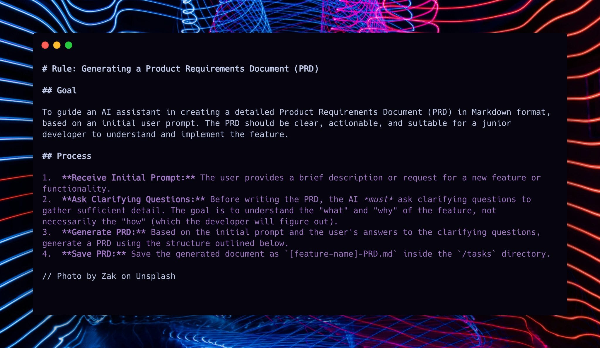

# Ryan Carson：3文件系统 —— 用AI轻松编写生产级应用

> **原文作者**: [Ryan Carson](https://x.com/ryancarson)  
> **原文链接**: [X Article](https://x.com/i/article/2023001790258573312)  
> **翻译日期**: 2026年2月17日

---

## 引言

今天，我想分享与 **Ryan Carson** 的一次深度访谈。

Ryan 是一位连续创业者，他开发了一套经过验证的 **3文件系统** 来使用 AI 编写生产级应用，该方法在 GitHub 上已获得 **5,000+ 星标**。在访谈中，他演示了如何使用 AI 模板创建规格文档、生成原子任务并运行自动化测试来构建新产品。我们还深入探讨了如何创办单人 AI 公司。

📺 **观看完整访谈**: [YouTube](https://youtu.be/C5USs51zYu8) | [Apple Podcasts](https://podcasts.apple.com/us/podcast/behind-the-craft/id1736359687) | [Spotify](https://open.spotify.com/episode/4d7fyYrjSLUHa6Xq8flVuc)

---

## 访谈精华时间戳

| 时间 | 内容主题 |
|------|---------|
| [00:00](https://www.youtube.com/watch?v=C5USs51zYu8) | 为什么3文件 AI 编码工作流程如此有效 |
| [03:22](https://www.youtube.com/watch?v=C5USs51zYu8&t=202s) | 详解每个文件：PRD、原子任务、测试驱动开发 |
| [08:02](https://www.youtube.com/watch?v=C5USs51zYu8&t=482s) | 现场演示：从零开始构建新功能 |
| [22:32](https://www.youtube.com/watch?v=C5USs51zYu8&t=1352s) | 如何实践测试驱动开发以避免 Bug |
| [34:18](https://www.youtube.com/watch?v=C5USs51zYu8&t=2058s) | 如何让 AI 成为你的导师，提升技术能力 |
| [42:03](https://www.youtube.com/watch?v=C5USs51zYu8&t=2523s) | 止痛药 vs 维生素：为什么离婚是一个绝佳的 AI 创业机会 |
| [45:23](https://www.youtube.com/watch?v=C5USs51zYu8&t=2723s) | 如何在 AI 的帮助下创办一人公司 |

---

## 核心内容

### 1. 单人 AI 公司的优势：掌控时间

Ryan 在经历过领导 100 名员工的风投支持创业公司后，选择了 solo 创业：

> **"成为风投支持的硅谷创始人太疯狂了。你有董事会和数百名员工。真正的财富是掌控你的时间并照顾你的家人。"**

**单人创始人 bootstrap 路径现在比以往任何时候都更可行。**

### 2. 3文件系统：告别挫败感的 Vibe Coding

Ryan 构建了 **3个独立的 Markdown 文件**，你可以在 Cursor 或其他 AI 编码应用中引用它们，大幅减少 Vibe Coding 时的 Bug 和错误：

#### 📄 文件 1: create-prd.md —— 生成详细需求文档
- 用于生成详细的产品需求文档 (PRD)
- 明确功能规格和实现细节
- 作为 AI 开发的基础蓝图

#### 📄 文件 2: generate-tasks.md —— 分解原子任务
- 将 PRD 分解为父任务和子任务
- 创建结构化的任务列表
- 便于跟踪开发进度

#### 📄 文件 3: process-task-list.md —— 执行与测试
- 逐个执行任务
- 为每个任务编写自动化测试
- 确保代码质量和可维护性

---

## AI 模板预览

*上图展示了 Ryan 的 create-prd.md AI 模板，用于生成详细的产品需求文档*

---

## 为什么 Vibe Coding 需要结构化？

传统的 Vibe Coding 工具往往创建**脆弱且容易出错的原型**，难以从原型过渡到生产级应用。Ryan 的 3文件系统提供了一个**结构化、可重复、高质量**的解决方案：

| 痛点 | 3文件系统解决方案 |
|------|------------------|
| 缺乏规划 | PRD 文档强制需求明确 |
| 任务混乱 | 原子任务分解清晰可执行 |
| Bug 频发 | 测试驱动开发确保质量 |
| 难以维护 | 标准化流程便于迭代 |

---

## 关于赞助

感谢 [Bolt](https://bolt.new/) 赞助本期通讯。

**Bolt v2** 现已支持直接在浏览器中使用 Claude Code 和 Codex 等 AI Agent。这意味着：
- 更少的错误
- 更智能的待办清单
- 通过 Bolt Cloud 获得生产级基础设施（数据库、认证、支付、托管）

[免费试用 Bolt v2](https://bolt.new/)

---

## Ryan Carson 的推广观点

> **"我认为越来越多的公司/创业公司会实施这样的代码工厂系统。
> 
> 只需将你的 Agent 指向这个 Agent，并提示：
> 
> *'阅读此文并创建一个 .md 计划，用于将我们的代码库迁移到代码工厂模型'*"**

这表明 Ryan 希望将自己的方法论推广到更多团队，实现 AI 辅助的标准化开发流程。

---

## 资源链接

- 📺 **YouTube 完整教程**: [观看视频](https://youtu.be/C5USs51zYu8)
- 🎧 **Apple Podcasts**: [收听播客](https://podcasts.apple.com/us/podcast/behind-the-craft/id1736359687)
- 🎵 **Spotify**: [收听播客](https://open.spotify.com/episode/4d7fyYrjSLUHa6Xq8flVuc)
- ⭐ **GitHub 仓库**: 下载全部3个文件模板（5,000+ Stars）

---

## 总结

Ryan Carson 的 3文件系统为 AI 辅助编程提供了一个**经过验证的蓝图**，帮助开发者从"原型玩具"转向"生产级应用"。通过将开发流程分解为需求规划、任务分解和执行测试三个阶段，开发者可以更好地利用 AI 工具，同时保持代码质量和项目可控性。

对于希望创办**一人 AI 公司**的开发者来说，这套系统提供了一条可行的路径——在掌控时间和自由的同时，构建高质量的软件产品。

---

*本翻译由 OpenClaw AI 自动生成*  
*原文版权归 Ryan Carson 及 Behind the Craft 所有*
