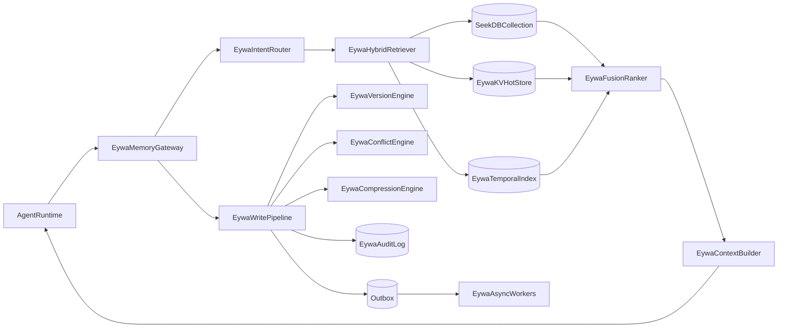

# Eywa-js Agent Memory 完整技术方案

- **版本**: v1.0
- **项目名称**: `eywa-js`
- **技术栈约束**: Node.js + TypeScript、自定义 Embedding Function、单机自托管起步、关键路径强一致、100-1k QPS、检索 P95 < 400ms
- **适配目标**: LangGraph + 自研 Agent 双接入

---

## 1. 背景与目标

传统 Agent 记忆方案把全量历史上下文塞入 Prompt，导致三类问题：
- Token 成本过高；
- 响应时延上升；
- 无关信息稀释模型注意力，降低回答质量。

本方案目标是构建一套 **可演进的 EywaCore 记忆服务**：先达到 MVP 可上线，再平滑扩展到完整能力，覆盖：
- 核心能力：写入/检索/更新/删除、短期-长期记忆、多租户；
- 进阶能力：版本控制、冲突检测与解决、时间检索、压缩与遗忘；
- 治理能力：关键路径一致性、审计回放、观测评估、运维治理。

---

## 2. 能力矩阵与 seekdb-js 映射

> 说明：seekdb-js 负责向量存储与语义检索，部分能力（事务、版本、冲突、压缩、审计）应在服务层编排实现。

| 能力域 | 子能力 | 实现归属 | seekdb-js API 映射 | 备注 |
|---|---|---|---|---|
| 核心写入 | 创建记忆 | EywaCore + SeekDB | `collection.add()` | 支持单条/批量 `ids/documents/metadatas/embeddings` |
| 核心读 | 语义检索 | SeekDB | `collection.query()` | `queryTexts + nResults + where` |
| 核心读 | 精确查询/分页 | SeekDB | `collection.get()` | `ids/where/whereDocument/limit/offset/include` |
| 核心更新 | 记忆更新 | EywaCore + SeekDB | `collection.update()` | 文本更新可触发重嵌入 |
| 核心更新 | 幂等写入 | EywaCore + SeekDB | `collection.upsert()` | 事件重放与同步场景优先 |
| 核心删除 | 软删/硬删 | EywaCore + SeekDB | `collection.delete()` + 软删标记 | 软删用于审计与回放 |
| 检索增强 | 混合检索 | Service 编排 | `query()` + `get()` | exact/semantic/temporal 融合排序 |
| 时序能力 | 时间窗口检索 | Service + SeekDB Filter | `where: { createdAt: { $gte/$lte } }` | 同时维护 temporal 索引更稳 |
| 版本控制 | 历史版本追踪 | Service + OLTP 表 | N/A | 保存 `memory_versions` |
| 冲突检测 | 矛盾/过时/重复 | Service | N/A | 规则 + LLM 辅助 |
| 压缩遗忘 | 分级压缩与衰减 | Service | `update()` 回写摘要 | 保留关键点与可追溯性 |
| 一致性 | 关键路径强一致 | Service + DB 事务 | N/A | Outbox + 幂等键 |
| 观测治理 | 审计、指标、告警 | Service + 观测栈 | N/A | OpenTelemetry + Audit Log |

---

## 3. 目标架构



### 3.1 组件职责

- `EywaMemoryGateway`: 统一接入层，提供标准 Memory API，屏蔽 LangGraph/自研差异。
- `EywaIntentRouter`: 查询意图判定（fact/reasoning/contextual/preference/skill）。
- `EywaHybridRetriever`: 并行执行 exact/semantic/temporal 检索。
- `EywaFusionRanker`: 基于权重融合分数，输出最终结果。
- `EywaWritePipeline`: 负责写入、版本、冲突、审计与事件投递。
- `Outbox + EywaAsyncWorkers`: 做异步补偿（重嵌入、压缩、清理、指标聚合）。

---

## 4. 数据模型设计（TypeScript）

### 4.1 核心实体

```ts
export type MemoryCategory = "fact" | "preference" | "context" | "skill" | "relationship";

export interface MemoryRecord {
  id: string;
  tenantId: string;
  userId?: string;
  sessionId?: string;
  agentId?: string;
  content: string;
  summary?: string;
  metadata: {
    source: "conversation" | "user_input" | "system" | "inference";
    tags?: string[];
    confidence: number; // 0~1
    verified: boolean;
    category?: MemoryCategory;
    createdAt: number;
    updatedAt: number;
    expiresAt?: number;
    accessCount: number;
    lastAccessedAt?: number;
    deletedAt?: number;
    version: number;
    parentId?: string;
  };
}
```

### 4.2 检索与融合模型

```ts
export interface RetrievalOptions {
  strategy?: "auto" | "exact" | "semantic" | "temporal" | "hybrid";
  intent?: "fact" | "reasoning" | "contextual" | "preference" | "skill";
  limit?: number;
  offset?: number;
  filters?: {
    tenantIds?: string[];
    userIds?: string[];
    sessionIds?: string[];
    categories?: string[];
    tags?: string[];
    confidenceMin?: number;
    verifiedOnly?: boolean;
    timeRange?: { start: number; end: number };
  };
  hybridWeights?: {
    exact?: number;
    semantic?: number;
    temporal?: number;
    recency?: number;
  };
}
```

### 4.3 存储表建议

- SeekDB collection：`memory_chunks`（向量检索主索引）。
- 关系型表（建议同 OceanBase/MySQL 协议）：
  - `memory_records`（当前态）；
  - `memory_versions`（版本历史）；
  - `memory_conflicts`（冲突工单）；
  - `memory_audit_logs`（审计）；
  - `outbox_events`（事件一致性）。

---

## 5. seekdb-js 接入规范（最新 API 习惯）

> 建议固定 SDK 大版本并建立兼容性回归：`seekdb`、`@seekdb/*` 每次升级前先跑契约测试（见第 21 节）。

### 5.1 Collection 初始化

```ts
import { SeekdbClient } from "seekdb";

const client = new SeekdbClient({
  host: process.env.SEEKDB_HOST!,
  port: Number(process.env.SEEKDB_PORT || 2881),
  user: process.env.SEEKDB_USER || "root",
  password: process.env.SEEKDB_PASSWORD || "",
  database: process.env.SEEKDB_DATABASE || "memory",
});

const collection = await client.getOrCreateCollection({
  name: "memory_chunks",
  configuration: {
    dimension: 1024, // 必须与 embedding 维度一致
    distance: "cosine", // "l2" | "cosine" | "inner_product"
  },
  embeddingFunction: customEmbeddingFunction,
});
```

### 5.2 写入/更新/查询策略

- 写入：优先 `upsert()`，确保幂等。
- 更新：`update()` 用于内容/metadata 局部更新。
- 查询：
  - 语义检索：`query({ queryTexts, nResults, where })`
  - 精确过滤：`get({ where, limit, offset, include })`
- 删除：
  - 默认软删（`metadata.deletedAt`）；
  - 定时硬删（`delete()`）配合审计保留。

### 5.3 数据约束（必须固化在 SDK 封装层）

- `ids/documents/metadatas/embeddings` 的数量必须对齐；
- `metadata` 仅使用可序列化标量/对象，避免复杂嵌套；
- `dimension` 与 Embedding 模型严格一致，不一致直接拒绝写入；
- 多租户必须带 `tenantId`，所有 `where` 默认注入租户条件；
- 查询结果若返回 `distances`，统一转换为 `similarity = 1 - distance`（在 cosine 约定下）。
- 对筛选操作符建立白名单：`$gte/$lte/$in/$contains`，避免动态拼装条件带来注入与性能风险。

---

## 6. 检索与路由策略

### 6.1 意图驱动权重（默认）

| intent | exact | semantic | temporal | recency |
|---|---:|---:|---:|---:|
| fact | 0.45 | 0.30 | 0.15 | 0.10 |
| reasoning | 0.15 | 0.65 | 0.10 | 0.10 |
| contextual | 0.20 | 0.35 | 0.30 | 0.15 |
| preference | 0.30 | 0.45 | 0.10 | 0.15 |
| skill | 0.20 | 0.60 | 0.10 | 0.10 |

### 6.2 混合检索流程

1. 判定 intent；
2. 并行执行：
   - exact: `get(where...)`；
   - semantic: `query(...)`；
   - temporal: `get(where.createdAt...)`；
3. 去重（以 `id` 聚合）；
4. 分数融合 + 阈值过滤；
5. 输出 top-k 并记录检索 trace。

### 6.3 召回策略建议

- 默认 `hybrid`；
- 对个性化问答（“我喜欢什么”）优先 `userId + preference` 过滤；
- 对近期任务状态问答优先 `sessionId + contextual + temporal`；
- 对事实型查询优先 exact（可配 `whereDocument` 做关键短语约束）。

---

## 7. 写入一致性与事务设计（关键路径强一致）

### 7.1 一致性分级

- **强一致路径**（必须事务）：`create/update/delete` + `version` + `audit` + `outbox`；
- **最终一致路径**（异步补偿）：重嵌入、压缩、冲突重评估、统计聚合。

### 7.2 推荐模式：本地事务 + Outbox

1. 开启 DB 事务；
2. 写 `memory_records`；
3. 写 `memory_versions`；
4. 写 `memory_audit_logs`；
5. 写 `outbox_events`；
6. 提交事务；
7. Worker 消费 outbox，调用 seekdb-js `upsert()` 同步向量索引。

优势：即使 SeekDB 短时异常，也不会丢业务事实，可重放补偿。

### 7.3 幂等键与重放规则（必须实现）

- 每次写请求必须携带 `idempotencyKey`（建议 `<tenantId>:<agentId>:<requestId>`）。
- `outbox_events` 以 `eventId + aggregateId + version` 去重，消费者侧再做一次幂等校验。
- 重试策略：
  - 可重试错误：网络超时、5xx、连接池耗尽；
  - 不可重试错误：参数非法、维度不匹配、租户越权；
  - 指数退避：`1s/2s/4s/8s/16s`，最大 8 次，超过进入死信队列（DLQ）。

---

## 8. 版本控制、冲突检测、压缩遗忘

### 8.1 版本控制

- 每次更新生成 `versionNumber + diffSnapshot`；
- 支持 `compare(memoryId, vA, vB)`；
- 支持 `restore(memoryId, targetVersion)`（恢复生成新版本，不直接覆盖历史）。

### 8.2 冲突检测

- 类型：
  - `contradiction`（直接矛盾）；
  - `outdated`（过时）；
  - `inconsistent`（不一致）；
  - `duplicate`（重复）。
- 机制：
  - 规则引擎先筛；
  - 高风险冲突调用 LLM 二次判断；
  - 产出 `ConflictReport` 并进人工/自动处置流。

### 8.3 压缩与遗忘

- 基于类别与访问热度做分级压缩（none/light/medium/aggressive）；
- 使用衰减函数计算保留率；
- 压缩后保留：
  - 原始版本引用；
  - 关键点列表；
  - 压缩质量分（低于阈值可回滚）。

---

## 9. 统一 EywaMemory API 设计（面向双适配）

### 9.1 服务接口（REST/gRPC 均可）

```ts
interface EywaMemoryApi {
  createMemory(input: CreateMemoryInput): Promise<MemoryRecord>;
  upsertMemory(input: UpsertMemoryInput): Promise<MemoryRecord>;
  retrieve(input: RetrieveInput): Promise<RetrieveOutput>;
  updateMemory(input: UpdateMemoryInput): Promise<MemoryRecord>;
  deleteMemory(input: DeleteMemoryInput): Promise<void>;

  getHistory(input: { memoryId: string }): Promise<MemoryVersion[]>;
  compareVersions(input: { memoryId: string; a: number; b: number }): Promise<VersionDiff>;
  restoreVersion(input: { memoryId: string; version: number; reason?: string }): Promise<MemoryRecord>;

  detectConflicts(input: { memoryId: string; timeWindow?: string }): Promise<ConflictReport[]>;
  resolveConflict(input: ResolveConflictInput): Promise<ResolveConflictOutput>;

  beginTransaction(input?: { isolation?: "read_committed" | "repeatable_read" }): Promise<{ txId: string }>;
  commitTransaction(input: { txId: string }): Promise<void>;
  rollbackTransaction(input: { txId: string }): Promise<void>;
}
```

### 9.2 LangGraph 适配器

- 在 Graph 节点执行前调用 `retrieve()` 获取上下文；
- 节点执行后调用 `upsertMemory()` 写入；
- 工作流状态继续使用 LangGraph checkpoint，语义记忆由本服务提供。

### 9.3 自研 Agent 适配器

- 统一中间件 `memory.beforeLLM()` / `memory.afterLLM()`；
- 支持策略参数透传（`intent`, `filters`, `weights`, `limit`）；
- 提供熔断开关：检索失败时回落短上下文模式。

### 9.4 极简接入模式（默认推荐）

为保证与主流对话式框架接合自然，默认只暴露两个调用点：
- `beforeLLM(input)`：返回已拼接的上下文；
- `afterLLM(input, output)`：异步写入记忆。

高阶能力（时序推理、冲突策略、压缩、事务）全部收敛到服务端默认策略，不要求应用层显式配置。

```ts
interface EywaMemorySimple {
  beforeLLM(input: {
    tenantId: string;
    userId?: string;
    sessionId?: string;
    message: string;
  }): Promise<{ context: string; traceId: string }>;

  afterLLM(input: {
    tenantId: string;
    userId?: string;
    sessionId?: string;
    userMessage: string;
    assistantMessage: string;
    traceId?: string;
  }): Promise<void>;
}
```

### 9.5 API 错误码与可观测字段（建议标准化）

| 错误码 | 含义 | 是否可重试 | 备注 |
|---|---|---|---|
| `E_BAD_REQUEST` | 参数非法 | 否 | 包括 `limit` 超范围、filter 不合法 |
| `E_DIM_MISMATCH` | 向量维度不匹配 | 否 | embedding 配置与 collection 不一致 |
| `E_TENANT_FORBIDDEN` | 租户越权 | 否 | 强制审计 |
| `E_DEP_TIMEOUT` | 依赖超时 | 是 | SeekDB/DB/缓存超时 |
| `E_DEP_UNAVAILABLE` | 依赖不可用 | 是 | 触发降级策略 |
| `E_INTERNAL` | 服务内部错误 | 视情况 | 需带 `traceId` |

每个响应建议返回：
- `traceId`、`requestId`、`tenantId`、`latencyMs`、`degradeMode`、`retrievalTrace`。

---

## 10. 非功能方案（SLO、容量、运维）

### 10.1 SLO 指标

- 检索 P95 < 400ms；
- 写入 P95 < 200ms（不含异步补偿）；
- 写成功率 >= 99.9%；
- 向量同步延迟 P95 < 5s；
- 审计日志落库成功率 100%（关键路径）。

### 10.2 容量估算（100-1k QPS）

假设：
- 峰值 1k QPS；
- 写:读 = 2:8；
- 平均每条记忆 500 字符，metadata 1KB；
- 1024 维向量（float32）约 4KB/条。

粗略量级：
- 每百万条记忆向量约 4GB；
- 加上文档与索引，单机建议预留 3-5 倍存储空间；
- 内存优先保障检索热路径（过滤字段索引 + 热租户缓存）。

进一步估算（用于采购与压测门槛）：
- 峰值写入：`1000 * 20% = 200 QPS`；
- 峰值读取：`1000 * 80% = 800 QPS`；
- 若平均每次检索 top10、召回后上下文 2KB，则网关到 LLM 的上下文吞吐约 `1.6 MB/s`（不含系统提示）。

### 10.5 延迟预算拆分（P95 < 400ms）

| 阶段 | 预算 |
|---|---:|
| API 网关与鉴权 | 20ms |
| 意图判定 | 30ms |
| 检索并行执行（seekdb/get/filter） | 220ms |
| 融合排序 + 去重 + 构造上下文 | 60ms |
| 预留抖动预算 | 70ms |

说明：任何单阶段超过预算 20% 持续 10 分钟，触发自动降级（例如降低 `nResults`、关闭次要检索分支）。

### 10.3 监控与告警

- 指标：QPS、延迟分位、召回数、平均相似度、空召回率、向量同步积压；
- 业务质量：答案命中率、用户纠错率、冲突率；
- 告警：
  - P95 检索 > 400ms 持续 5 分钟；
  - outbox 积压 > 阈值；
  - 向量同步失败率 > 1%；
  - 审计写入失败（立即告警）。

### 10.4 安全与治理（基础审计）

- 审计字段：`who/when/what/before/after/reason/requestId`；
- 数据分级：敏感字段（PII）可选脱敏写入向量库；
- 删除权：软删立即生效，硬删按策略批处理，并保留最小审计记录。

---

## 11. 压测与评测方案

### 11.1 压测维度

- 查询模式：exact/semantic/hybrid；
- 过滤复杂度：租户、用户、时间窗口组合；
- 数据规模：10万 / 100万 / 1000万条；
- 并发：100 / 300 / 600 / 1000 QPS。

### 11.2 质量评测

- 离线集：构建 FAQ、偏好、跨会话事实、冲突样本；
- 指标：
  - Recall@k；
  - MRR；
  - 答案一致性；
  - Token 节省率。

### 11.3 A/B 策略

- A: 全量上下文；
- B: 混合检索上下文；
- 对比成本、时延、满意度、幻觉率。

### 11.4 压测执行模板（可直接落地）

- 预热阶段：10 分钟（避免冷启动误差）。
- 稳态阶段：30 分钟（记录 P50/P95/P99）。
- 峰值冲击：5 分钟 1k QPS。
- 故障注入：模拟 SeekDB 超时 5%、10%、20%，验证降级与恢复。

---

## 12. 分阶段实施路线（M0/M1/M2）

### M0（2-3 周，MVP 核心）
- 完成 `EywaMemoryGateway` 与 seekdb-js 封装；
- 打通 create/upsert/retrieve/update/delete；
- 多租户隔离与基础审计上线；
- 达到 P95 < 400ms（中等规模数据集）。

### M1（3-4 周，进阶能力）
- 上线版本控制与版本比较/回滚；
- 上线冲突检测（规则优先）；
- 上线时间检索与基础压缩策略；
- 引入 outbox 异步补偿与重试机制。

### M2（4-6 周，完整能力）
- 完成事务 API（关键路径强一致）；
- 上线冲突自动处置策略与人工审批流；
- 完成观测评估面板与回放工具；
- 完成灰度、回滚、故障演练流程。

---

## 13. 风险与回滚策略

### 13.1 主要风险
- Embedding 维度切换导致旧数据不兼容；
- 热租户查询放大导致尾延迟升高；
- 冲突检测误报引发错误覆盖；
- 异步补偿积压造成检索新鲜度下降。

### 13.2 回滚与降级
- 维度升级采用“双写双读 + 分批迁移”；
- 检索降级为 `limit-based` 或短上下文；
- 冲突自动处置可一键切换为人工审批；
- outbox Worker 异常时保底业务写入不中断。

---

## 14. 配置模板（示例）

```yaml
memory:
  retrieval:
    defaultStrategy: hybrid
    defaultLimit: 10
    threshold:
      semantic: 0.62
    weights:
      fact: { exact: 0.45, semantic: 0.30, temporal: 0.15, recency: 0.10 }
      reasoning: { exact: 0.15, semantic: 0.65, temporal: 0.10, recency: 0.10 }
  consistency:
    mode: strong_key_paths
    outboxEnabled: true
    outboxRetryMax: 8
  compression:
    enabled: true
    schedule: "0 */2 * * *"
  audit:
    enabled: true
    retentionDays: 180
seekdb:
  host: 127.0.0.1
  port: 2881
  database: memory
  collection: memory_chunks
  dimension: 1024
  distance: cosine
```

---

## 15. 验收清单（逐项可测）

- 功能：
  - [ ] 核心 CRUD + 检索策略齐备；
  - [ ] 版本历史、差异比较、版本恢复可用；
  - [ ] 冲突检测/解决链路闭环；
  - [ ] 压缩与遗忘任务可观测可回滚；
  - [ ] 事务接口在关键路径生效；
  - [ ] LangGraph + 自研 Agent 均可接入。
- 非功能：
  - [ ] 检索 P95 < 400ms；
  - [ ] 写入成功率 >= 99.9%；
  - [ ] 审计完整可追溯；
  - [ ] 灰度与回滚预案验证通过。

---

## 16. 建议的下一步实现顺序

1. 先实现 `EywaMemoryGateway + EywaCore Repository`（可最快产出业务价值）；
2. 再实现 `Version + Audit + Outbox`（保证可追溯和一致性）；
3. 然后推进 `Conflict + Compression`（提升稳定性与成本效率）；
4. 最后补齐 `Transaction API + 评测平台 + 治理面板`。

---

## 17. 可执行 DDL 草案（最小可用）

> 目标：让工程团队可以直接建表并开始开发。字段可按现网标准补齐。

```sql
CREATE TABLE memory_records (
  id            VARCHAR(64) PRIMARY KEY,
  tenant_id     VARCHAR(64) NOT NULL,
  user_id       VARCHAR(64) NULL,
  session_id    VARCHAR(64) NULL,
  agent_id      VARCHAR(64) NULL,
  content       TEXT NOT NULL,
  summary       TEXT NULL,
  category      VARCHAR(32) NULL,
  confidence    DECIMAL(4,3) NOT NULL DEFAULT 0.500,
  verified      TINYINT(1) NOT NULL DEFAULT 0,
  access_count  BIGINT NOT NULL DEFAULT 0,
  created_at    BIGINT NOT NULL,
  updated_at    BIGINT NOT NULL,
  deleted_at    BIGINT NULL,
  expires_at    BIGINT NULL,
  version       INT NOT NULL DEFAULT 1,
  KEY idx_tenant_user (tenant_id, user_id),
  KEY idx_tenant_session (tenant_id, session_id),
  KEY idx_tenant_time (tenant_id, created_at),
  KEY idx_tenant_deleted (tenant_id, deleted_at)
);

CREATE TABLE memory_versions (
  id              BIGINT PRIMARY KEY AUTO_INCREMENT,
  memory_id       VARCHAR(64) NOT NULL,
  tenant_id       VARCHAR(64) NOT NULL,
  version_number  INT NOT NULL,
  operation       VARCHAR(16) NOT NULL,
  content_snapshot TEXT NOT NULL,
  diff_snapshot   JSON NULL,
  operator        VARCHAR(64) NOT NULL,
  reason          VARCHAR(255) NULL,
  created_at      BIGINT NOT NULL,
  UNIQUE KEY uk_memory_ver (memory_id, version_number),
  KEY idx_tenant_memory (tenant_id, memory_id)
);

CREATE TABLE outbox_events (
  event_id        VARCHAR(64) PRIMARY KEY,
  tenant_id       VARCHAR(64) NOT NULL,
  aggregate_id    VARCHAR(64) NOT NULL,
  aggregate_ver   INT NOT NULL,
  event_type      VARCHAR(64) NOT NULL,
  payload         JSON NOT NULL,
  status          VARCHAR(16) NOT NULL DEFAULT 'pending',
  retry_count     INT NOT NULL DEFAULT 0,
  next_retry_at   BIGINT NULL,
  created_at      BIGINT NOT NULL,
  updated_at      BIGINT NOT NULL,
  KEY idx_status_retry (status, next_retry_at),
  UNIQUE KEY uk_agg_ver_evt (aggregate_id, aggregate_ver, event_type)
);
```

---

## 18. 状态机定义（避免实现分歧）

### 18.1 记忆记录状态

- `active`：可读可检索；
- `soft_deleted`：业务不可见，审计可见；
- `hard_deleted`：实体已清理，仅保留审计最小记录；
- `archived`：已压缩归档，检索权重降低。

### 18.2 Outbox 事件状态

- `pending` -> `processing` -> `done`；
- `processing` -> `pending`（重试）；
- `processing` -> `dead_letter`（超过重试上限）。

---

## 19. 失败场景处理矩阵（上线前必须演练）

| 场景 | 预期行为 | 用户侧表现 | 运维动作 |
|---|---|---|---|
| SeekDB 短时不可用 | 写主链成功，向量同步入重试队列 | 可继续写入，检索可能降级 | 观察 outbox 积压并扩容 worker |
| DB 主库抖动 | 请求快速失败，避免长时间阻塞 | 部分请求失败，可重试 | 切只读保护、限流、故障转移 |
| Embedding 服务超时 | 保留文本主记录，延后向量化 | 新记忆短时间不可语义检索 | 降低并发，开启备用 embedding |
| 热租户流量突增 | 启动租户级限流与缓存 | 大租户受限，小租户不受影响 | 打开租户熔断阈值 |
| 冲突检测误报升高 | 自动策略降级为人工审批 | 更新延迟上升但安全 | 回滚规则版本 |

---

## 20. 发布闸门（Go/No-Go）

满足以下条件才允许灰度：
- 功能用例通过率 >= 95%；
- 核心链路（写入、检索、审计）无 P1/P2 缺陷；
- 1k QPS 稳态 30 分钟内，检索 P95 < 400ms，错误率 < 0.5%；
- 故障注入演练完成并有回放记录；
- 审计样本抽查通过（至少 50 条随机操作）。

---

## 21. 测试分层与责任归属

### 21.1 测试分层

- 单元测试：路由策略、融合打分、压缩策略、冲突规则；
- 契约测试：`seekdb-js` SDK 升级回归、API 请求/响应契约；
- 集成测试：Outbox 重试、版本回滚、跨租户隔离；
- E2E：LangGraph 和自研 Agent 双路径。

### 21.2 责任归属（建议）

- 平台后端：`EywaCore`, `EywaMemoryGateway`, 数据一致性；
- 算法/应用：冲突规则、压缩策略、检索权重调参；
- SRE：压测、监控、告警、故障演练；
- QA：回归基线与发布闸门执行。

---

## 22. 两周冲刺落地模板（可直接执行）

### Week 1
- Day 1-2：建表、SDK 封装、租户注入中间件；
- Day 3-4：CRUD + 检索 + 审计打通；
- Day 5：Outbox worker + 幂等重试。

### Week 2
- Day 1-2：版本控制 + 回滚；
- Day 3：基础冲突检测与处理流；
- Day 4：压测与故障注入；
- Day 5：灰度发布与复盘。

---

## 23. FS + SeekDB 双层架构（原子事实 + 分层索引）

### 23.1 设计原则

- **FS 是真相源（Source of Truth）**：保留全部历史原文，不做信息丢失。
- **SeekDB 是派生索引（Derived Index）**：用于召回，不承载唯一事实。
- **索引可重建**：任何时候可从 FS 全量/增量重建 SeekDB。
- **所有召回必须可回源**：向量命中项必须带文件锚点，且可验证一致性。

### 23.2 为什么升级为“原子事实 + 分层索引”

仅存摘要会损失细节，影响事实类查询与引用准确性。建议采用三层索引：
- `L0` 热层：最近 N 天，存原文 chunk（高精度、低延迟）。
- `L1` 温层：中期，存**原子事实（Atomic Fact Unit, AFU）**与轻摘要（平衡成本与质量）。
- `L2` 冷层：长期，存章节/主题摘要（做粗召回，再回源）。

默认参数建议：
- `N_recent_days = 7`
- `l0_chunk_tokens = 200~400`
- `l1_summary_ratio = 0.35~0.55`
- `l1_atomic_fact_per_event = 1~5`
- `l2_summary_ratio = 0.10~0.25`

---

## 24. 字段级数据模型（FS 锚点 + SeekDB 索引）

### 24.1 FS 文件布局建议

```text
memory_fs/
  tenants/{tenantId}/
    users/{userId}/
      sessions/{sessionId}/
        2026-02-14.jsonl
      longterm/
        profile.md
        preferences.md
    audit/
      2026-02-14.log.jsonl
```

每条原始记录建议结构：

```json
{
  "eventId": "evt_01...",
  "tenantId": "t1",
  "userId": "u1",
  "sessionId": "s1",
  "messageRole": "user",
  "content": "....",
  "timestamp": 1739500000000,
  "contentHash": "sha256:...",
  "schemaVersion": 1
}
```

### 24.2 SeekDB 索引文档结构（关键）

```ts
interface EywaIndexDoc {
  id: string; // 全局唯一（建议: <eventId>#<chunkNo>|<summaryLevel>）
  tenantId: string;
  userId?: string;
  sessionId?: string;
  lane: "l0_recent_chunk" | "l1_atomic_fact" | "l1_fact_summary" | "l2_topic_summary";
  text: string; // 向量化文本（chunk/摘要）
  metadata: {
    createdAt: number;
    updatedAt: number;
    sourceType: "conversation" | "longterm" | "summary";
    tags?: string[];
    confidence?: number;
    // FS 锚点（回源必须）
    filePath: string;
    lineStart?: number;
    lineEnd?: number;
    byteStart?: number;
    byteEnd?: number;
    fsVersion: string; // 文件版本号或 git commit
    contentHash: string; // 原文哈希，读时校验
    // 原子事实字段（lane = l1_atomic_fact 时必填）
    atomicId?: string; // 原子事实 ID
    atomicType?: "fact" | "preference" | "constraint" | "plan" | "entity_relation";
    subject?: string;
    predicate?: string;
    object?: string;
    validityStartAt?: number;
    validityEndAt?: number;
    negated?: boolean;
    certainty?: number; // 0~1
  };
}
```

### 24.3 一致性不变量（必须满足）

- 任一 `EywaIndexDoc` 都必须包含 `filePath + fsVersion + contentHash`。
- 命中结果回源后若 `contentHash` 不一致，标记 `stale_index` 并触发增量重建。
- FS 删除后索引必须在 SLA 窗口内完成清理（建议 < 5 分钟）。
- 原子事实索引（`l1_atomic_fact`）必须可回溯到唯一 `atomicId` 与原文锚点，禁止“无来源事实”。

---

## 25. 增量同步协议（FS -> SeekDB）

### 25.1 事件驱动流程

1. `FSAppender` 写入原始事件到 FS（原子写）。
2. 同事务写入 `outbox_events`（事件类型 `INDEX_UPSERT`）。
3. `AtomicExtractor` 消费事件，读取 FS 对应段，生成 AFU（原子事实单元）。
4. `IndexWorker` 基于 AFU + 原文生成 L0/L1/L2 索引文本。
5. 调用 seekdb-js `upsert()` 写入索引。
6. 写回 `index_manifest`（记录索引版本、层级、最后同步时间）。

### 25.2 关键策略

- **双写顺序**：先 FS，再索引。禁止先索引后 FS。
- **增量粒度**：按事件/按文件段增量，不做整文件重算；AFU 优先增量更新。
- **重建机制**：每日低峰校验 `manifest` 与 FS 哈希，不一致则后台修复。
- **删除策略**：FS 软删立刻生效；硬删触发 `INDEX_DELETE` 事件，Worker 批量删除向量条目。
- **事实失效**：当新 AFU 与旧 AFU 冲突时，旧 AFU 状态置为 `superseded`，但保留历史可审计。

### 25.3 读路径协议

1. Query 进入 `EywaHybridRetriever`。
2. 并行召回 L0/L1/L2（L1 优先召回 `l1_atomic_fact`）。
3. 融合排序后，对 top-k 做 FS 回源（按锚点读取原文窗口）。
4. 校验 `contentHash`：
   - 一致：返回可引用上下文；
   - 不一致：降权或剔除，并异步触发 `INDEX_REPAIR`。
5. 原子融合：将命中的 AFU 按 `subject/predicate` 聚合，去重并处理冲突（最新版本优先）。

---

## 26. FS + SeekDB 专用状态机与补偿

### 26.1 索引生命周期状态

- `indexed_fresh`：索引与 FS 一致；
- `indexed_stale`：命中后校验不一致；
- `indexing_pending`：事件已入队未处理；
- `indexing_failed`：重试中；
- `index_dead_letter`：超过重试上限。
- `atomic_superseded`：事实已被新证据替代，默认不参与召回。

### 26.2 补偿动作

- `indexed_stale` -> `indexing_pending`：派发修复事件；
- `indexing_failed`：指数退避重试，最多 8 次；
- `index_dead_letter`：人工/自动修复任务介入；
- 修复完成后回到 `indexed_fresh`。
- AFU 冲突后：旧事实置 `atomic_superseded`，新事实置 `indexed_fresh`。

### 26.3 可用性降级策略（读路径）

- L0 故障：回退 L1（原子事实）+L2，扩大回源窗口；
- L1/L2 故障：优先 L0 热记录 + 会话短上下文；
- SeekDB 故障：启用 FS 关键词检索保底（BM25/简化倒排）；
- FS 回源故障：返回低风险上下文并标记 `citation_unverified=true`。

---

## 27. 验证 FS + SeekDB 思路是否成功的指标

- 检索质量：
  - `Recall@10` 不低于纯向量全量方案；
  - `CitationAccuracy`（可回源且哈希一致）>= 99.5%。
- 原子质量：
  - `AtomicPrecision`（原子事实正确率）>= 95%；
  - `AtomicConflictFalsePositiveRate` < 3%；
  - `AtomicTraceability`（可回溯到原文锚点）= 100%。
- 成本：
  - SeekDB 向量总量相对“全量原文入库”下降 >= 40%；
  - 索引重建窗口可控（全量重建 < 24h，增量分钟级）。
- 稳定性：
  - `stale_index_rate` < 0.5%；
  - `index_dlq_backlog` 在告警阈值内可清空。
- 体验：
  - 检索 P95 仍满足 < 400ms；
  - 关键查询（偏好/事实/近期上下文）准确率不退化。

---

## 28. 实施建议（在现有 eywa-js 方案上的最小改动）

1. 保留现有 `EywaCore` 与 `EywaMemoryGateway`，新增 `FSAppender`、`AtomicExtractor` 与 `IndexWorker`。
2. 在 `memory_records` 增加 `file_path/fs_version/content_hash` 字段，作为锚点主键。
3. 新增 `atomic_facts` 表，并在配置中新增 `indexLanes`（L0/L1/L2）与 `atomicExtraction` 参数。
4. 发布顺序：
   - 先启用 FS 真相源；
   - 再启用 L0 热索引；
   - 然后启用 L1 原子事实索引；
   - 稳定后再启用 L1/L2 摘要索引与自动修复。

---

## 29. 原子事实单元（AFU）规范

### 29.1 AFU 定义

AFU（Atomic Fact Unit）是“不可再分且可验证”的最小记忆语义单位，推荐采用三元组表示：
- `subject`（主语）
- `predicate`（谓词）
- `object`（宾语）

并附带时间有效性、置信度、否定性、来源锚点。

```ts
interface AtomicFactUnit {
  atomicId: string; // 建议: hash(tenantId + subject + predicate + object + sourceAnchor)
  tenantId: string;
  userId?: string;
  sessionId?: string;
  type: "fact" | "preference" | "constraint" | "plan" | "entity_relation";
  subject: string;
  predicate: string;
  object: string;
  negated: boolean;
  certainty: number; // 0~1
  sourceAnchor: {
    filePath: string;
    fsVersion: string;
    lineStart?: number;
    lineEnd?: number;
    contentHash: string;
  };
  status: "active" | "superseded" | "retracted";
  createdAt: number;
  updatedAt: number;
}
```

### 29.2 AFU 设计约束

- 一个 AFU 只能表达一个事实断言，禁止多事实拼接。
- `atomicId` 一旦生成不可变；内容变更需新建 AFU 并链路指向旧 AFU。
- `status=superseded` 的 AFU 默认不参与检索，但可用于审计/回放。

---

## 30. 原子抽取与归一化流水线

### 30.1 流水线步骤

1. `Segmentation`：按句子/语义边界分段；
2. `CandidateExtraction`：抽取候选三元组；
3. `Normalization`：实体归一化、同义谓词归一；
4. `Deduplication`：同租户内原子去重（`subject+predicate+object` 近似匹配）；
5. `ConflictCheck`：检测与历史 AFU 的矛盾/覆盖关系；
6. `Persist`：写 `atomic_facts` + 生成 `l1_atomic_fact` 向量索引。

### 30.2 归一化字典（建议）

- 人称归一：`我` -> `<user:{userId}>`
- 时间归一：`昨天` -> 绝对时间区间
- 偏好谓词归一：`喜欢/偏好/爱` -> `prefers`
- 否定归一：`不喜欢/讨厌` -> `prefers` + `negated=true`

---

## 31. 迁移与兼容策略（从当前方案升级）

### 31.1 增量迁移

- 阶段 A：保持现有检索，新增 AFU 抽取并旁路写入（不参与线上召回）。
- 阶段 B：灰度 10% 流量启用 `l1_atomic_fact` 召回分支。
- 阶段 C：默认启用 AFU 分支，摘要分支降为补充。

### 31.2 回滚策略

- 一键关闭 `atomicRetrievalEnabled`，回退到原 L0/L1-summary/L2；
- 保留 AFU 数据，不删除，待规则修复后再启用；
- 冲突误报上升时，仅降级冲突自动处理，保留抽取链路。

---

## 32. 最小时序推理规范（M1 建议上线）

### 32.1 AFU 时间字段扩展

在 `AtomicFactUnit` 基础上增加：
- `observedAt`: 事实被观察/记录的时间；
- `validityStartAt`: 事实生效时间；
- `validityEndAt`: 事实失效时间（空表示未知/持续）；
- `supersededBy`: 覆盖该事实的新 `atomicId`；
- `temporalScope`: `"current" | "historical" | "forecast"`（可选）。

最小语义约束：
- `observedAt` 必填；
- `validityStartAt` 默认等于 `observedAt`；
- `validityEndAt` 不得小于 `validityStartAt`。

### 32.2 查询时间意图分类

对查询增加时序意图：
- `current_state`: 询问当前状态（现在、目前、最新）；
- `history_trace`: 询问变化过程（之前、后来、什么时候变）；
- `time_slice`: 询问某一时间点/区间状态（上周、2026年1月）。

默认路由：
- `current_state`：只召回 `status=active` 且当前时刻有效的 AFU；
- `history_trace`：允许召回 `superseded/retracted` 并按时间排序；
- `time_slice`：过滤 `validityStartAt/validityEndAt` 与查询区间相交。

### 32.3 时序融合打分（最小可用）

```ts
finalScore =
  0.60 * semanticScore +
  0.20 * recencyScore +
  0.20 * validityScore;
```

说明：
- `semanticScore`: 向量相似度；
- `recencyScore`: 基于 `observedAt` 的时间衰减；
- `validityScore`: 对“当前无效”或“区间不相交”项进行惩罚。

---

## 33. 知识更新规范（M1 必须上线）

### 33.1 更新动作模型

每次新 AFU 进入系统时，执行以下决策：
- `append`: 新增事实，不影响旧事实；
- `supersede`: 新事实覆盖旧事实（旧事实 `status -> superseded`）；
- `retract`: 撤销旧事实（旧事实 `status -> retracted`）；
- `merge`: 事实兼容，合并标签/置信度后保留主事实。

### 33.2 覆盖规则（最小规则集）

- 同一 `tenantId + subject + predicate` 且 `object` 明显冲突时：
  - 若新证据时间更新且置信度不低于阈值，触发 `supersede`；
  - 否则保留并标记冲突待审核。
- 偏好类事实（`type=preference`）默认允许被更新覆盖；
- 约束类事实（`type=constraint`）默认保守处理，需更高置信度才覆盖。

### 33.3 更新审计要求

所有更新动作必须写审计：
- `actionType`: append/supersede/retract/merge
- `sourceAtomicId`
- `targetAtomicId`
- `reason`
- `operator`（system/rule/llm/human）
- `traceId`

---

## 34. 参考伪代码（时序 + 更新）

```ts
function resolveAtomicUpdate(newFact: AtomicFactUnit, candidates: AtomicFactUnit[]): UpdateDecision {
  for (const oldFact of candidates) {
    if (isSameSlot(newFact, oldFact) && isContradictory(newFact, oldFact)) {
      if (newFact.observedAt >= oldFact.observedAt && newFact.certainty >= 0.7) {
        return { action: "supersede", from: oldFact.atomicId, to: newFact.atomicId };
      }
      return { action: "append_conflict", from: oldFact.atomicId, to: newFact.atomicId };
    }
  }
  return { action: "append", to: newFact.atomicId };
}

function validityScore(fact: AtomicFactUnit, queryTime: number): number {
  if (fact.status === "retracted") return 0;
  if (fact.validityEndAt && queryTime > fact.validityEndAt) return 0.2;
  if (queryTime < fact.validityStartAt) return 0.2;
  return 1.0;
}
```

---

## 35. 验收指标补充（时序与更新）

- `CurrentAnswerFreshness`: 当前态问答中，命中 `active+valid` 事实占比 >= 98%；
- `SupersedePrecision`: 覆盖动作正确率 >= 95%；
- `StaleFactLeakRate`: 已失效事实误用于当前问答比例 < 1%；
- `HistoryTraceCompleteness`: 历史追踪问题可还原关键版本链比例 >= 95%；
- `UpdateAuditCompleteness`: 更新类操作审计完整率 = 100%。

---

## 36. 分阶段上线建议（最小风险）

### Phase A（1周）
- 仅新增时间字段与审计，不改线上召回逻辑；
- 离线评估 `supersede` 规则质量。

### Phase B（1周）
- 小流量启用 `current_state` 时间过滤；
- 启用 `supersede`，但保留人工回滚开关。

### Phase C（1周）
- 全量启用时序融合打分；
- 开启历史追踪查询能力（`history_trace/time_slice`）。

---

## 37. 范围收敛：MVP 必做清单

> 目标：先做“高价值 + 低风险 + 可验证”的最小闭环，确保 4~6 周内可稳定上线。

### 37.1 架构与数据（必做）

- [ ] FS 作为真相源（原始事件落盘 + 可追溯锚点）；
- [ ] SeekDB 作为派生索引（至少启用 `L0 + L1_atomic`）；
- [ ] `atomic_facts` 最小字段（`atomicId/subject/predicate/object/status/observedAt`）；
- [ ] 回源校验（`filePath/fsVersion/contentHash`）；
- [ ] Outbox + 重试 + DLQ。

### 37.2 检索与更新（必做）

- [ ] `current_state` 查询意图（当前态问答）；
- [ ] `append + supersede` 两类知识更新动作；
- [ ] 基础冲突检测（只做检测与标记，不自动解决）；
- [ ] 最小融合评分（semantic + recency + validity）；
- [ ] 失败降级（短上下文模式）。

### 37.3 工程与上线（必做）

- [ ] 核心审计字段全链路落库（100%）；
- [ ] 1k QPS 压测通过（P95 < 400ms）；
- [ ] 故障注入通过（SeekDB 超时/FS 回源异常）；
- [ ] 发布闸门满足（第 20 节）。

---

## 38. Post-MVP 延后清单（建议先不做）

> 原则：对当前准确率/稳定性提升有限，但显著增加复杂度的功能，统一后置。

### 38.1 延后项与触发条件

| 延后功能 | 先不做原因 | 触发条件（再启动） |
|---|---|---|
| `L2` 冷层主题摘要索引 | 早期数据量小，收益不明显 | 向量规模 > 500万条或检索成本明显上升 |
| 自动冲突解决（auto-resolve） | 误判风险高，可能破坏事实 | 冲突检测精度稳定 > 97%，且有人工回放闭环 |
| 中/深度 LLM 压缩 | 质量波动大，调参与评估成本高 | 存储成本或上下文成本连续 2 周超阈值 |
| 对外事务 API（begin/commit/rollback） | 使用门槛高，易误用 | 多系统写入编排需求明确且无法由内部事务覆盖 |
| 复杂历史切片推理（time-slice 全量） | 查询场景少，研发成本高 | 历史追踪类请求占比 > 15% |
| SeekDB 故障时 BM25 完整兜底 | 维护双检索栈复杂 | SeekDB 可用性未达标且短上下文降级无法满足 SLA |
| 平台化 A/B 实验系统 | 初期可用灰度与离线评测替代 | 版本迭代频繁且需要并行实验管理 |

### 38.2 必须避免的“伪 MVP”

- 同时做 L0/L1/L2 全层 + 自动冲突解决 + 深度压缩；
- 在没有高质量标注集前就上线自动知识合并；
- 为低频历史查询先投入复杂时序推理引擎。

---

## 39. 里程碑重排（收敛版）

### M0（2周）- 真相源与索引闭环
- FS 落盘、L0/L1_atomic、回源校验、Outbox 补偿；
- 完成 CRUD + retrieve + 审计。

### M1（2周）- 原子更新与当前态问答
- 上线 `append/supersede`；
- 上线 `current_state` + 最小时序评分；
- 小流量灰度与回放。

### M2（1-2周）- 稳定性加固
- 压测、故障注入、告警阈值调优；
- 根据指标决定是否进入 Post-MVP 功能。

---

## 40. 决策门（是否进入 Post-MVP）

连续两个迭代周期满足以下条件，才建议开启延后项：
- `CurrentAnswerFreshness >= 98%`
- `StaleFactLeakRate < 1%`
- `CitationAccuracy >= 99.5%`
- `P95 < 400ms` 且错误率 < 0.5%
- 运维侧无高优先级积压告警（outbox/dlq/stale_index）

---

## 41. 灾备与恢复（RPO/RTO + Runbook）

### 41.1 目标定义（生产基线）

- `RPO <= 5 分钟`：最多丢失 5 分钟内新增索引事件（FS 真相源不可丢）。
- `RTO <= 30 分钟`：核心检索链路在 30 分钟内恢复可用。
- 优先级顺序：FS 真相源 > 事务库 > SeekDB 派生索引。

### 41.2 备份策略

- FS：
  - 近实时增量同步到对象存储（建议每 1 分钟批次）。
  - 每日全量快照，保留 30 天；每周归档，保留 6 个月。
- 事务库（`memory_records`、`memory_versions`、`outbox_events`、`atomic_facts`）：
  - Binlog 持续归档；
  - 每日全量 + 每小时增量备份。
- SeekDB：
  - 视为可重建派生层，保留每日快照用于快速恢复；
  - 同时保留重建脚本，确保“快照不可用时可回源重建”。

### 41.3 恢复流程（Runbook 摘要）

1. 判定故障范围（FS/DB/SeekDB/网络）；
2. 恢复 FS 与事务库到最近一致点；
3. 校验 `outbox_events` 与 `index_manifest`；
4. 从未完成 outbox 与 FS 增量区间重放索引；
5. 启动只读模式验证（抽样校验 `CitationAccuracy`）；
6. 切回读写并持续观察 30 分钟。

### 41.4 灾备演练要求

- 每月至少一次全流程演练；
- 每次演练记录：
  - 实际 RPO/RTO；
  - 失败步骤；
  - 修复时长；
  - 后续改进项（带 owner 和截止时间）。

---

## 42. 安全授权模型（RBAC/ABAC + 跨租户隔离）

### 42.1 认证与服务间信任

- 外部请求：JWT/OIDC，必须包含 `tenantId`、`subjectId`、`roles`；
- 服务间通信：mTLS + 短期服务令牌；
- 所有写操作强制落审计（含调用方身份）。

### 42.2 授权模型

- RBAC 角色建议：
  - `tenant_admin`：租户级读写与治理；
  - `agent_runtime`：运行时读写（受 ABAC 约束）；
  - `auditor`：只读审计与回放；
  - `ops`：运维操作（无业务数据明文读取权限）。
- ABAC 条件建议：
  - `resource.tenantId == principal.tenantId`
  - `resource.userId in principal.allowedUsers`（如需细粒度）
  - `operation` 与 `lane/type` 匹配（如仅允许 runtime 写 L0/L1）

### 42.3 跨租户防护

- 查询层默认注入 `tenantId`，禁止由客户端覆盖；
- 所有 `where` 条件做白名单解析，拒绝动态注入；
- 审计告警：一旦发现跨租户访问尝试，立即告警并记录 `traceId`。

### 42.4 密钥与加密

- 静态加密：FS、DB、对象存储均启用加密；
- 传输加密：TLS1.2+；
- 密钥轮换：每 90 天轮换一次，紧急事件可即时轮换；
- 敏感字段（PII）默认脱敏或哈希后入索引。

---

## 43. `atomic_facts` DDL 与索引设计

> 目标：使“原子事实 + 分层索引”可直接实施。

```sql
CREATE TABLE atomic_facts (
  atomic_id         VARCHAR(96) PRIMARY KEY,
  tenant_id         VARCHAR(64) NOT NULL,
  user_id           VARCHAR(64) NULL,
  session_id        VARCHAR(64) NULL,
  type              VARCHAR(32) NOT NULL,      -- fact/preference/constraint/plan/entity_relation
  subject           VARCHAR(255) NOT NULL,
  predicate         VARCHAR(255) NOT NULL,
  object_text       TEXT NOT NULL,
  object_hash       VARCHAR(80) NOT NULL,      -- 便于去重
  negated           TINYINT(1) NOT NULL DEFAULT 0,
  certainty         DECIMAL(4,3) NOT NULL DEFAULT 0.500,
  status            VARCHAR(16) NOT NULL,      -- active/superseded/retracted
  superseded_by     VARCHAR(96) NULL,
  observed_at       BIGINT NOT NULL,
  validity_start_at BIGINT NOT NULL,
  validity_end_at   BIGINT NULL,
  source_file_path  VARCHAR(1024) NOT NULL,
  source_fs_version VARCHAR(128) NOT NULL,
  source_hash       VARCHAR(80) NOT NULL,
  created_at        BIGINT NOT NULL,
  updated_at        BIGINT NOT NULL,
  KEY idx_tenant_status_time (tenant_id, status, observed_at),
  KEY idx_tenant_sp (tenant_id, subject, predicate),
  KEY idx_tenant_validity (tenant_id, validity_start_at, validity_end_at),
  KEY idx_tenant_user (tenant_id, user_id),
  KEY idx_superseded_by (superseded_by),
  UNIQUE KEY uk_atomic_dedup (tenant_id, type, subject, predicate, object_hash, source_hash)
);
```

实现建议：
- `object_hash` 使用标准化后文本计算（归一化再哈希）；
- `superseded_by` 仅允许指向同租户事实；
- 对 `active` 状态建立热缓存，加速 `current_state` 查询。

---

## 44. AFU 评测基准与标注规范

### 44.1 评测数据集构成（最小可用）

- `fact_set`：事实问答样本（至少 500 条）；
- `preference_set`：偏好变化样本（至少 300 条）；
- `temporal_set`：时间切片/历史追踪样本（至少 300 条）；
- `conflict_set`：矛盾与覆盖样本（至少 200 条）。

### 44.2 标注规则

- 一条标注只包含一个 AFU（单事实原则）；
- 必标字段：`subject/predicate/object/negated/observedAt/status`；
- 变化类样本必须标明“旧事实 -> 新事实”关系；
- 冲突样本必须标明是否应 `supersede` 或 `append_conflict`。

### 44.3 评测指标与门槛

- 抽取质量：
  - `AtomicPrecision >= 95%`
  - `AtomicRecall >= 92%`
- 更新质量：
  - `SupersedePrecision >= 95%`
  - `ConflictFalsePositiveRate < 3%`
- 时序质量：
  - `CurrentAnswerFreshness >= 98%`
  - `HistoryTraceCompleteness >= 95%`
- 可追溯性：
  - `AtomicTraceability = 100%`

### 44.4 回归流程

1. 每次规则/模型变更后跑全量离线评测；
2. 指标不达标禁止进入灰度；
3. 线上灰度期间抽样人工复核（每日固定样本量）；
4. 复核结论回灌标注集，形成闭环迭代。

---

## 45. 主流对话式框架的“自然接入”规范（低配置优先）

### 45.1 设计目标

- 应用开发者默认只关心两件事：**拿上下文**、**写对话**；
- 不要求理解 AFU、分层索引、冲突状态机等内部细节；
- 默认配置可直接上线，小团队无需先做复杂调参。

### 45.2 配置分层（避免暴露复杂度）

- `Level 0（零配置）`：只需要连接信息与租户标识。
- `Level 1（常用配置）`：`topK`、是否仅当前态、是否返回引用。
- `Level 2（高级配置）`：权重、时序策略、冲突策略、压缩策略（默认隐藏）。

默认建议（Level 0）：
- `strategy = "auto"`
- `topK = 8`
- `currentStateOnly = true`
- `returnCitations = true`
- `writeMode = "async"`

### 45.3 统一 SDK 外观（Facade）

```ts
import { createEywaMemory } from "eywa-js";

const memory = createEywaMemory({
  endpoint: process.env.EYWA_ENDPOINT!,
  apiKey: process.env.EYWA_API_KEY!,
});

// 请求前：拿上下文
const { context } = await memory.beforeLLM({
  tenantId: "t1",
  userId: "u1",
  sessionId: "s1",
  message: userInput,
});

// 请求后：写记忆
await memory.afterLLM({
  tenantId: "t1",
  userId: "u1",
  sessionId: "s1",
  userMessage: userInput,
  assistantMessage: modelOutput,
});
```

### 45.4 框架接入模式

- **LangGraph**：在节点前调用 `beforeLLM`，节点后调用 `afterLLM`；checkpoint 继续由 LangGraph 承担流程状态。
- **自研对话引擎**：封装成中间件（request hook/response hook）。
- **通用 HTTP Chat 服务**：在 `/chat` handler 内插入两次调用，不改变原对话协议。

### 45.5 响应契约（面向产品开发）

`beforeLLM` 返回：
- `context`：可直接拼接到系统提示；
- `citations[]`：可选，用于可解释展示；
- `traceId`：追踪与审计关联。

`afterLLM` 返回：
- `accepted`（布尔）；
- `mode`（`sync|async`）；
- `traceId`。

### 45.6 开发者体验约束（强制）

- 禁止要求应用层传入检索权重、冲突阈值、压缩级别；
- 默认情况下不暴露 `L0/L1/L2` 概念给业务方；
- 高级能力仅通过服务端策略中心下发（灰度可控）。

### 45.7 版本与兼容策略（SDK 层）

- 采用“语义版本 + 能力探针”：
  - SDK 新版本先探测服务端能力，再启用对应字段；
  - 旧服务端不支持时自动降级，不影响核心 `beforeLLM/afterLLM`。
- 对外保持稳定 API：
  - 新能力只加字段，不改必填参数；
  - 默认行为变化必须可通过 feature flag 回滚。

