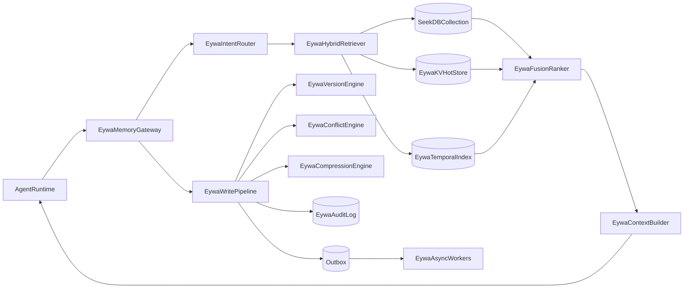

# Eywa-js Agent Memory 完整技术方案（MVP -> Full Capability）

**版本**: v1.0  
**目标读者**: 后端工程师、Agent 平台工程师、架构师、SRE  
**项目名称**: `eywa-js`  
**技术栈约束**: Node.js + TypeScript、自定义 Embedding Function、单机自托管起步、关键路径强一致、100-1k QPS、检索 P95 < 400ms  
**适配目标**: LangGraph + 自研 Agent 双接入

---

## 1. 背景与目标

传统 Agent 记忆方案把全量历史上下文塞入 Prompt，导致三类问题：
- Token 成本过高；
- 响应时延上升；
- 无关信息稀释模型注意力，降低回答质量。

本方案目标是构建一套 **可演进的 EywaCore 记忆服务**：先达到 MVP 可上线，再平滑扩展到完整能力，覆盖：
- 核心能力：写入/检索/更新/删除、短期-长期记忆、多租户；
- 进阶能力：版本控制、冲突检测与解决、时间检索、压缩与遗忘；
- 治理能力：关键路径一致性、审计回放、观测评估、运维治理。

---

## 2. 能力矩阵与 seekdb-js 映射

> 说明：seekdb-js 负责向量存储与语义检索，部分能力（事务、版本、冲突、压缩、审计）应在服务层编排实现。

| 能力域 | 子能力 | 实现归属 | seekdb-js API 映射 | 备注 |
|---|---|---|---|---|
| 核心写入 | 创建记忆 | EywaCore + SeekDB | `collection.add()` | 支持单条/批量 `ids/documents/metadatas/embeddings` |
| 核心读 | 语义检索 | SeekDB | `collection.query()` | `queryTexts + nResults + where` |
| 核心读 | 精确查询/分页 | SeekDB | `collection.get()` | `ids/where/whereDocument/limit/offset/include` |
| 核心更新 | 记忆更新 | EywaCore + SeekDB | `collection.update()` | 文本更新可触发重嵌入 |
| 核心更新 | 幂等写入 | EywaCore + SeekDB | `collection.upsert()` | 事件重放与同步场景优先 |
| 核心删除 | 软删/硬删 | EywaCore + SeekDB | `collection.delete()` + 软删标记 | 软删用于审计与回放 |
| 检索增强 | 混合检索 | Service 编排 | `query()` + `get()` | exact/semantic/temporal 融合排序 |
| 时序能力 | 时间窗口检索 | Service + SeekDB Filter | `where: { createdAt: { $gte/$lte } }` | 同时维护 temporal 索引更稳 |
| 版本控制 | 历史版本追踪 | Service + OLTP 表 | N/A | 保存 `memory_versions` |
| 冲突检测 | 矛盾/过时/重复 | Service | N/A | 规则 + LLM 辅助 |
| 压缩遗忘 | 分级压缩与衰减 | Service | `update()` 回写摘要 | 保留关键点与可追溯性 |
| 一致性 | 关键路径强一致 | Service + DB 事务 | N/A | Outbox + 幂等键 |
| 观测治理 | 审计、指标、告警 | Service + 观测栈 | N/A | OpenTelemetry + Audit Log |

---

## 3. 目标架构



### 3.1 组件职责

- `EywaMemoryGateway`: 统一接入层，提供标准 Memory API，屏蔽 LangGraph/自研差异。
- `EywaIntentRouter`: 查询意图判定（fact/reasoning/contextual/preference/skill）。
- `EywaHybridRetriever`: 并行执行 exact/semantic/temporal 检索。
- `EywaFusionRanker`: 基于权重融合分数，输出最终结果。
- `EywaWritePipeline`: 负责写入、版本、冲突、审计与事件投递。
- `Outbox + EywaAsyncWorkers`: 做异步补偿（重嵌入、压缩、清理、指标聚合）。

---

## 4. 数据模型设计（TypeScript）

### 4.1 核心实体

```ts
export type MemoryCategory = "fact" | "preference" | "context" | "skill" | "relationship";

export interface MemoryRecord {
  id: string;
  tenantId: string;
  userId?: string;
  sessionId?: string;
  agentId?: string;
  content: string;
  summary?: string;
  metadata: {
    source: "conversation" | "user_input" | "system" | "inference";
    tags?: string[];
    confidence: number; // 0~1
    verified: boolean;
    category?: MemoryCategory;
    createdAt: number;
    updatedAt: number;
    expiresAt?: number;
    accessCount: number;
    lastAccessedAt?: number;
    deletedAt?: number;
    version: number;
    parentId?: string;
  };
}
```

### 4.2 检索与融合模型

```ts
export interface RetrievalOptions {
  strategy?: "auto" | "exact" | "semantic" | "temporal" | "hybrid";
  intent?: "fact" | "reasoning" | "contextual" | "preference" | "skill";
  limit?: number;
  offset?: number;
  filters?: {
    tenantIds?: string[];
    userIds?: string[];
    sessionIds?: string[];
    categories?: string[];
    tags?: string[];
    confidenceMin?: number;
    verifiedOnly?: boolean;
    timeRange?: { start: number; end: number };
  };
  hybridWeights?: {
    exact?: number;
    semantic?: number;
    temporal?: number;
    recency?: number;
  };
}
```

### 4.3 存储表建议

- SeekDB collection：`memory_chunks`（向量检索主索引）。
- 关系型表（建议同 OceanBase/MySQL 协议）：
  - `memory_records`（当前态）；
  - `memory_versions`（版本历史）；
  - `memory_conflicts`（冲突工单）；
  - `memory_audit_logs`（审计）；
  - `outbox_events`（事件一致性）。

---

## 5. seekdb-js 接入规范（最新 API 习惯）

> 建议固定 SDK 大版本并建立兼容性回归：`seekdb`、`@seekdb/*` 每次升级前先跑契约测试（见第 21 节）。

### 5.1 Collection 初始化

```ts
import { SeekdbClient } from "seekdb";

const client = new SeekdbClient({
  host: process.env.SEEKDB_HOST!,
  port: Number(process.env.SEEKDB_PORT || 2881),
  user: process.env.SEEKDB_USER || "root",
  password: process.env.SEEKDB_PASSWORD || "",
  database: process.env.SEEKDB_DATABASE || "memory",
});

const collection = await client.getOrCreateCollection({
  name: "memory_chunks",
  configuration: {
    dimension: 1024, // 必须与 embedding 维度一致
    distance: "cosine", // "l2" | "cosine" | "inner_product"
  },
  embeddingFunction: customEmbeddingFunction,
});
```

### 5.2 写入/更新/查询策略

- 写入：优先 `upsert()`，确保幂等。
- 更新：`update()` 用于内容/metadata 局部更新。
- 查询：
  - 语义检索：`query({ queryTexts, nResults, where })`
  - 精确过滤：`get({ where, limit, offset, include })`
- 删除：
  - 默认软删（`metadata.deletedAt`）；
  - 定时硬删（`delete()`）配合审计保留。

### 5.3 数据约束（必须固化在 SDK 封装层）

- `ids/documents/metadatas/embeddings` 的数量必须对齐；
- `metadata` 仅使用可序列化标量/对象，避免复杂嵌套；
- `dimension` 与 Embedding 模型严格一致，不一致直接拒绝写入；
- 多租户必须带 `tenantId`，所有 `where` 默认注入租户条件；
- 查询结果若返回 `distances`，统一转换为 `similarity = 1 - distance`（在 cosine 约定下）。
- 对筛选操作符建立白名单：`$gte/$lte/$in/$contains`，避免动态拼装条件带来注入与性能风险。

---

## 6. 检索与路由策略

### 6.1 意图驱动权重（默认）

| intent | exact | semantic | temporal | recency |
|---|---:|---:|---:|---:|
| fact | 0.45 | 0.30 | 0.15 | 0.10 |
| reasoning | 0.15 | 0.65 | 0.10 | 0.10 |
| contextual | 0.20 | 0.35 | 0.30 | 0.15 |
| preference | 0.30 | 0.45 | 0.10 | 0.15 |
| skill | 0.20 | 0.60 | 0.10 | 0.10 |

### 6.2 混合检索流程

1. 判定 intent；
2. 并行执行：
   - exact: `get(where...)`；
   - semantic: `query(...)`；
   - temporal: `get(where.createdAt...)`；
3. 去重（以 `id` 聚合）；
4. 分数融合 + 阈值过滤；
5. 输出 top-k 并记录检索 trace。

### 6.3 召回策略建议

- 默认 `hybrid`；
- 对个性化问答（“我喜欢什么”）优先 `userId + preference` 过滤；
- 对近期任务状态问答优先 `sessionId + contextual + temporal`；
- 对事实型查询优先 exact（可配 `whereDocument` 做关键短语约束）。

---

## 7. 写入一致性与事务设计（关键路径强一致）

### 7.1 一致性分级

- **强一致路径**（必须事务）：`create/update/delete` + `version` + `audit` + `outbox`；
- **最终一致路径**（异步补偿）：重嵌入、压缩、冲突重评估、统计聚合。

### 7.2 推荐模式：本地事务 + Outbox

1. 开启 DB 事务；
2. 写 `memory_records`；
3. 写 `memory_versions`；
4. 写 `memory_audit_logs`；
5. 写 `outbox_events`；
6. 提交事务；
7. Worker 消费 outbox，调用 seekdb-js `upsert()` 同步向量索引。

优势：即使 SeekDB 短时异常，也不会丢业务事实，可重放补偿。

### 7.3 幂等键与重放规则（必须实现）

- 每次写请求必须携带 `idempotencyKey`（建议 `<tenantId>:<agentId>:<requestId>`）。
- `outbox_events` 以 `eventId + aggregateId + version` 去重，消费者侧再做一次幂等校验。
- 重试策略：
  - 可重试错误：网络超时、5xx、连接池耗尽；
  - 不可重试错误：参数非法、维度不匹配、租户越权；
  - 指数退避：`1s/2s/4s/8s/16s`，最大 8 次，超过进入死信队列（DLQ）。

---

## 8. 版本控制、冲突检测、压缩遗忘

### 8.1 版本控制

- 每次更新生成 `versionNumber + diffSnapshot`；
- 支持 `compare(memoryId, vA, vB)`；
- 支持 `restore(memoryId, targetVersion)`（恢复生成新版本，不直接覆盖历史）。

### 8.2 冲突检测

- 类型：
  - `contradiction`（直接矛盾）；
  - `outdated`（过时）；
  - `inconsistent`（不一致）；
  - `duplicate`（重复）。
- 机制：
  - 规则引擎先筛；
  - 高风险冲突调用 LLM 二次判断；
  - 产出 `ConflictReport` 并进人工/自动处置流。

### 8.3 压缩与遗忘

- 基于类别与访问热度做分级压缩（none/light/medium/aggressive）；
- 使用衰减函数计算保留率；
- 压缩后保留：
  - 原始版本引用；
  - 关键点列表；
  - 压缩质量分（低于阈值可回滚）。

---

## 9. 统一 EywaMemory API 设计（面向双适配）

### 9.1 服务接口（REST/gRPC 均可）

```ts
interface EywaMemoryApi {
  createMemory(input: CreateMemoryInput): Promise<MemoryRecord>;
  upsertMemory(input: UpsertMemoryInput): Promise<MemoryRecord>;
  retrieve(input: RetrieveInput): Promise<RetrieveOutput>;
  updateMemory(input: UpdateMemoryInput): Promise<MemoryRecord>;
  deleteMemory(input: DeleteMemoryInput): Promise<void>;

  getHistory(input: { memoryId: string }): Promise<MemoryVersion[]>;
  compareVersions(input: { memoryId: string; a: number; b: number }): Promise<VersionDiff>;
  restoreVersion(input: { memoryId: string; version: number; reason?: string }): Promise<MemoryRecord>;

  detectConflicts(input: { memoryId: string; timeWindow?: string }): Promise<ConflictReport[]>;
  resolveConflict(input: ResolveConflictInput): Promise<ResolveConflictOutput>;

  beginTransaction(input?: { isolation?: "read_committed" | "repeatable_read" }): Promise<{ txId: string }>;
  commitTransaction(input: { txId: string }): Promise<void>;
  rollbackTransaction(input: { txId: string }): Promise<void>;
}
```

### 9.2 LangGraph 适配器

- 在 Graph 节点执行前调用 `retrieve()` 获取上下文；
- 节点执行后调用 `upsertMemory()` 写入；
- 工作流状态继续使用 LangGraph checkpoint，语义记忆由本服务提供。

### 9.3 自研 Agent 适配器

- 统一中间件 `memory.beforeLLM()` / `memory.afterLLM()`；
- 支持策略参数透传（`intent`, `filters`, `weights`, `limit`）；
- 提供熔断开关：检索失败时回落短上下文模式。

### 9.4 API 错误码与可观测字段（建议标准化）

| 错误码 | 含义 | 是否可重试 | 备注 |
|---|---|---|---|
| `E_BAD_REQUEST` | 参数非法 | 否 | 包括 `limit` 超范围、filter 不合法 |
| `E_DIM_MISMATCH` | 向量维度不匹配 | 否 | embedding 配置与 collection 不一致 |
| `E_TENANT_FORBIDDEN` | 租户越权 | 否 | 强制审计 |
| `E_DEP_TIMEOUT` | 依赖超时 | 是 | SeekDB/DB/缓存超时 |
| `E_DEP_UNAVAILABLE` | 依赖不可用 | 是 | 触发降级策略 |
| `E_INTERNAL` | 服务内部错误 | 视情况 | 需带 `traceId` |

每个响应建议返回：
- `traceId`、`requestId`、`tenantId`、`latencyMs`、`degradeMode`、`retrievalTrace`。

---

## 10. 非功能方案（SLO、容量、运维）

### 10.1 SLO 指标

- 检索 P95 < 400ms；
- 写入 P95 < 200ms（不含异步补偿）；
- 写成功率 >= 99.9%；
- 向量同步延迟 P95 < 5s；
- 审计日志落库成功率 100%（关键路径）。

### 10.2 容量估算（100-1k QPS）

假设：
- 峰值 1k QPS；
- 写:读 = 2:8；
- 平均每条记忆 500 字符，metadata 1KB；
- 1024 维向量（float32）约 4KB/条。

粗略量级：
- 每百万条记忆向量约 4GB；
- 加上文档与索引，单机建议预留 3-5 倍存储空间；
- 内存优先保障检索热路径（过滤字段索引 + 热租户缓存）。

进一步估算（用于采购与压测门槛）：
- 峰值写入：`1000 * 20% = 200 QPS`；
- 峰值读取：`1000 * 80% = 800 QPS`；
- 若平均每次检索 top10、召回后上下文 2KB，则网关到 LLM 的上下文吞吐约 `1.6 MB/s`（不含系统提示）。

### 10.5 延迟预算拆分（P95 < 400ms）

| 阶段 | 预算 |
|---|---:|
| API 网关与鉴权 | 20ms |
| 意图判定 | 30ms |
| 检索并行执行（seekdb/get/filter） | 220ms |
| 融合排序 + 去重 + 构造上下文 | 60ms |
| 预留抖动预算 | 70ms |

说明：任何单阶段超过预算 20% 持续 10 分钟，触发自动降级（例如降低 `nResults`、关闭次要检索分支）。

### 10.3 监控与告警

- 指标：QPS、延迟分位、召回数、平均相似度、空召回率、向量同步积压；
- 业务质量：答案命中率、用户纠错率、冲突率；
- 告警：
  - P95 检索 > 400ms 持续 5 分钟；
  - outbox 积压 > 阈值；
  - 向量同步失败率 > 1%；
  - 审计写入失败（立即告警）。

### 10.4 安全与治理（基础审计）

- 审计字段：`who/when/what/before/after/reason/requestId`；
- 数据分级：敏感字段（PII）可选脱敏写入向量库；
- 删除权：软删立即生效，硬删按策略批处理，并保留最小审计记录。

---

## 11. 压测与评测方案

### 11.1 压测维度

- 查询模式：exact/semantic/hybrid；
- 过滤复杂度：租户、用户、时间窗口组合；
- 数据规模：10万 / 100万 / 1000万条；
- 并发：100 / 300 / 600 / 1000 QPS。

### 11.2 质量评测

- 离线集：构建 FAQ、偏好、跨会话事实、冲突样本；
- 指标：
  - Recall@k；
  - MRR；
  - 答案一致性；
  - Token 节省率。

### 11.3 A/B 策略

- A: 全量上下文；
- B: 混合检索上下文；
- 对比成本、时延、满意度、幻觉率。

### 11.4 压测执行模板（可直接落地）

- 预热阶段：10 分钟（避免冷启动误差）。
- 稳态阶段：30 分钟（记录 P50/P95/P99）。
- 峰值冲击：5 分钟 1k QPS。
- 故障注入：模拟 SeekDB 超时 5%、10%、20%，验证降级与恢复。

---

## 12. 分阶段实施路线（M0/M1/M2）

### M0（2-3 周，MVP 核心）
- 完成 `EywaMemoryGateway` 与 seekdb-js 封装；
- 打通 create/upsert/retrieve/update/delete；
- 多租户隔离与基础审计上线；
- 达到 P95 < 400ms（中等规模数据集）。

### M1（3-4 周，进阶能力）
- 上线版本控制与版本比较/回滚；
- 上线冲突检测（规则优先）；
- 上线时间检索与基础压缩策略；
- 引入 outbox 异步补偿与重试机制。

### M2（4-6 周，完整能力）
- 完成事务 API（关键路径强一致）；
- 上线冲突自动处置策略与人工审批流；
- 完成观测评估面板与回放工具；
- 完成灰度、回滚、故障演练流程。

---

## 13. 风险与回滚策略

### 13.1 主要风险
- Embedding 维度切换导致旧数据不兼容；
- 热租户查询放大导致尾延迟升高；
- 冲突检测误报引发错误覆盖；
- 异步补偿积压造成检索新鲜度下降。

### 13.2 回滚与降级
- 维度升级采用“双写双读 + 分批迁移”；
- 检索降级为 `limit-based` 或短上下文；
- 冲突自动处置可一键切换为人工审批；
- outbox Worker 异常时保底业务写入不中断。

---

## 14. 配置模板（示例）

```yaml
memory:
  retrieval:
    defaultStrategy: hybrid
    defaultLimit: 10
    threshold:
      semantic: 0.62
    weights:
      fact: { exact: 0.45, semantic: 0.30, temporal: 0.15, recency: 0.10 }
      reasoning: { exact: 0.15, semantic: 0.65, temporal: 0.10, recency: 0.10 }
  consistency:
    mode: strong_key_paths
    outboxEnabled: true
    outboxRetryMax: 8
  compression:
    enabled: true
    schedule: "0 */2 * * *"
  audit:
    enabled: true
    retentionDays: 180
seekdb:
  host: 127.0.0.1
  port: 2881
  database: memory
  collection: memory_chunks
  dimension: 1024
  distance: cosine
```

---

## 15. 验收清单（逐项可测）

- 功能：
  - [ ] 核心 CRUD + 检索策略齐备；
  - [ ] 版本历史、差异比较、版本恢复可用；
  - [ ] 冲突检测/解决链路闭环；
  - [ ] 压缩与遗忘任务可观测可回滚；
  - [ ] 事务接口在关键路径生效；
  - [ ] LangGraph + 自研 Agent 均可接入。
- 非功能：
  - [ ] 检索 P95 < 400ms；
  - [ ] 写入成功率 >= 99.9%；
  - [ ] 审计完整可追溯；
  - [ ] 灰度与回滚预案验证通过。

---

## 16. 建议的下一步实现顺序

1. 先实现 `EywaMemoryGateway + EywaCore Repository`（可最快产出业务价值）；  
2. 再实现 `Version + Audit + Outbox`（保证可追溯和一致性）；  
3. 然后推进 `Conflict + Compression`（提升稳定性与成本效率）；  
4. 最后补齐 `Transaction API + 评测平台 + 治理面板`。

---

## 17. 可执行 DDL 草案（最小可用）

> 目标：让工程团队可以直接建表并开始开发。字段可按现网标准补齐。

```sql
CREATE TABLE memory_records (
  id            VARCHAR(64) PRIMARY KEY,
  tenant_id     VARCHAR(64) NOT NULL,
  user_id       VARCHAR(64) NULL,
  session_id    VARCHAR(64) NULL,
  agent_id      VARCHAR(64) NULL,
  content       TEXT NOT NULL,
  summary       TEXT NULL,
  category      VARCHAR(32) NULL,
  confidence    DECIMAL(4,3) NOT NULL DEFAULT 0.500,
  verified      TINYINT(1) NOT NULL DEFAULT 0,
  access_count  BIGINT NOT NULL DEFAULT 0,
  created_at    BIGINT NOT NULL,
  updated_at    BIGINT NOT NULL,
  deleted_at    BIGINT NULL,
  expires_at    BIGINT NULL,
  version       INT NOT NULL DEFAULT 1,
  KEY idx_tenant_user (tenant_id, user_id),
  KEY idx_tenant_session (tenant_id, session_id),
  KEY idx_tenant_time (tenant_id, created_at),
  KEY idx_tenant_deleted (tenant_id, deleted_at)
);

CREATE TABLE memory_versions (
  id              BIGINT PRIMARY KEY AUTO_INCREMENT,
  memory_id       VARCHAR(64) NOT NULL,
  tenant_id       VARCHAR(64) NOT NULL,
  version_number  INT NOT NULL,
  operation       VARCHAR(16) NOT NULL,
  content_snapshot TEXT NOT NULL,
  diff_snapshot   JSON NULL,
  operator        VARCHAR(64) NOT NULL,
  reason          VARCHAR(255) NULL,
  created_at      BIGINT NOT NULL,
  UNIQUE KEY uk_memory_ver (memory_id, version_number),
  KEY idx_tenant_memory (tenant_id, memory_id)
);

CREATE TABLE outbox_events (
  event_id        VARCHAR(64) PRIMARY KEY,
  tenant_id       VARCHAR(64) NOT NULL,
  aggregate_id    VARCHAR(64) NOT NULL,
  aggregate_ver   INT NOT NULL,
  event_type      VARCHAR(64) NOT NULL,
  payload         JSON NOT NULL,
  status          VARCHAR(16) NOT NULL DEFAULT 'pending',
  retry_count     INT NOT NULL DEFAULT 0,
  next_retry_at   BIGINT NULL,
  created_at      BIGINT NOT NULL,
  updated_at      BIGINT NOT NULL,
  KEY idx_status_retry (status, next_retry_at),
  UNIQUE KEY uk_agg_ver_evt (aggregate_id, aggregate_ver, event_type)
);
```

---

## 18. 状态机定义（避免实现分歧）

### 18.1 记忆记录状态

- `active`：可读可检索；
- `soft_deleted`：业务不可见，审计可见；
- `hard_deleted`：实体已清理，仅保留审计最小记录；
- `archived`：已压缩归档，检索权重降低。

### 18.2 Outbox 事件状态

- `pending` -> `processing` -> `done`；
- `processing` -> `pending`（重试）；
- `processing` -> `dead_letter`（超过重试上限）。

---

## 19. 失败场景处理矩阵（上线前必须演练）

| 场景 | 预期行为 | 用户侧表现 | 运维动作 |
|---|---|---|---|
| SeekDB 短时不可用 | 写主链成功，向量同步入重试队列 | 可继续写入，检索可能降级 | 观察 outbox 积压并扩容 worker |
| DB 主库抖动 | 请求快速失败，避免长时间阻塞 | 部分请求失败，可重试 | 切只读保护、限流、故障转移 |
| Embedding 服务超时 | 保留文本主记录，延后向量化 | 新记忆短时间不可语义检索 | 降低并发，开启备用 embedding |
| 热租户流量突增 | 启动租户级限流与缓存 | 大租户受限，小租户不受影响 | 打开租户熔断阈值 |
| 冲突检测误报升高 | 自动策略降级为人工审批 | 更新延迟上升但安全 | 回滚规则版本 |

---

## 20. 发布闸门（Go/No-Go）

满足以下条件才允许灰度：
- 功能用例通过率 >= 95%；
- 核心链路（写入、检索、审计）无 P1/P2 缺陷；
- 1k QPS 稳态 30 分钟内，检索 P95 < 400ms，错误率 < 0.5%；
- 故障注入演练完成并有回放记录；
- 审计样本抽查通过（至少 50 条随机操作）。

---

## 21. 测试分层与责任归属

### 21.1 测试分层

- 单元测试：路由策略、融合打分、压缩策略、冲突规则；
- 契约测试：`seekdb-js` SDK 升级回归、API 请求/响应契约；
- 集成测试：Outbox 重试、版本回滚、跨租户隔离；
- E2E：LangGraph 和自研 Agent 双路径。

### 21.2 责任归属（建议）

- 平台后端：`EywaCore`, `EywaMemoryGateway`, 数据一致性；
- 算法/应用：冲突规则、压缩策略、检索权重调参；
- SRE：压测、监控、告警、故障演练；
- QA：回归基线与发布闸门执行。

---

## 22. 两周冲刺落地模板（可直接执行）

### Week 1
- Day 1-2：建表、SDK 封装、租户注入中间件；
- Day 3-4：CRUD + 检索 + 审计打通；
- Day 5：Outbox worker + 幂等重试。

### Week 2
- Day 1-2：版本控制 + 回滚；
- Day 3：基础冲突检测与处理流；
- Day 4：压测与故障注入；
- Day 5：灰度发布与复盘。

