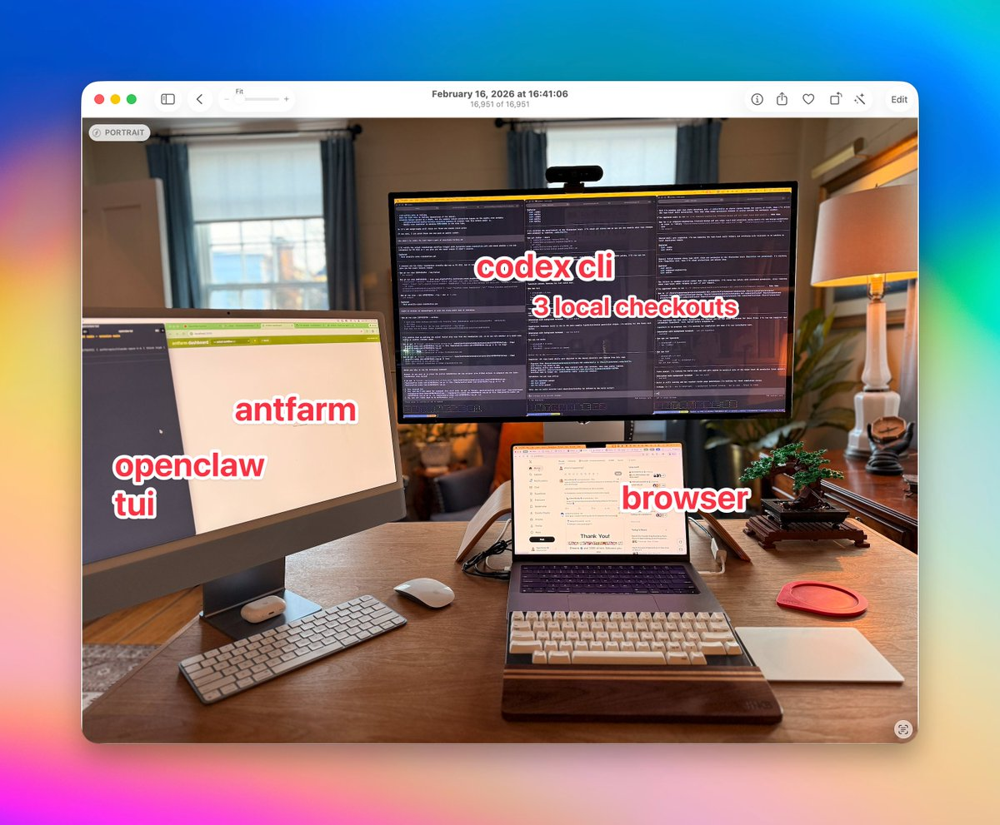

# Ryan Carson: 经过验证的3文件系统 —— 用AI轻松编写生产级应用

> 原文作者: [Ryan Carson](https://x.com/ryancarson)  
> 原文链接: [X Article](https://x.com/i/article/2023001790258573312)  
> 翻译时间: 2026年2月17日

---

## 核心观点

Ryan Carson 是一位连续创业者，他开发了一套经过验证的 **3文件系统** 来使用 AI 编写生产级应用，该方法在 GitHub 上已获得 **5,000+ 星标**。

---

## 3文件系统详解

这套系统的核心是使用 **3个 Markdown 文件** 来规范 AI 编码流程，大幅减少错误和挫折感：

### 文件 1: create-prd.md —— 生成详细需求文档
- 用于生成详细的产品需求文档 (PRD)
- 明确功能规格和实现细节
- 作为 AI 开发的基础蓝图

### 文件 2: generate-tasks.md —— 分解原子任务
- 将 PRD 分解为父任务和子任务
- 创建结构化的任务列表
- 便于跟踪开发进度

### 文件 3: process-task-list.md —— 执行与测试
- 逐个执行任务
- 为每个任务编写自动化测试
- 确保代码质量和可维护性

---

## 为什么选择单人AI公司？

Ryan Carson 在经历了领导100名员工的风投支持的硅谷创业公司后，选择了单人创业道路：

> **"成为风投支持的硅谷创始人太疯狂了。你有董事会和数百名员工。真正的财富是控制你的时间并照顾你的家人。"**

**单人创始人 bootstrap 路径现在比以往任何时候都更可行。**

---

## 实践要点

### Vibe Coding 的痛点
- 传统的 Vibe Coding 工具往往创建脆弱且容易出错的原型
- 缺乏结构化流程导致代码质量不稳定
- 难以从原型过渡到生产级应用

### 3文件系统的优势
1. **减少错误** — 通过详细的需求文档和任务分解
2. **提高效率** — 结构化的工作流程让开发更顺畅
3. **保证质量** — 测试驱动开发确保代码可靠性
4. **可重复** — 标准化的流程可以应用于任何项目

---

## 资源链接

- **GitHub 仓库**: 包含全部3个文件的模板（5,000+ Stars）
- **YouTube 教程**: [完整演示视频](https://youtu.be/C5USs51zYu8)
- **播客**: [Behind the Craft 访谈](https://creatoreconomy.so/p/full-tutorial-a-proven-3-file-system-to-vibe-code-production-apps-ryan)

---

## 时间戳要点

| 时间 | 内容 |
|------|------|
 00:00 | 为什么3文件AI编码工作流程如此有效 |
| 03:22 | 解释每个文件：PRD、原子任务、测试驱动开发 |
| 08:02 | 现场演示：从零开始构建新功能 |
| 22:32 | 如何练习测试驱动开发以避免错误 |
| 34:18 | 如何让AI成为你的导师，变得更技术化 |
| 42:03 | 痛点 vs 维生素：为什么离婚是一个伟大的AI业务 |
| 45:23 | 如何在AI的帮助下开始一人公司 |

---

## 讨论话题

**Ryan Carson 在 X 上的推广:**

> "我认为越来越多的公司/创业公司会实施这样的代码工厂系统。
> 
> 只需将你的 Agent 指向这个 Agent，并提示：
> 
> **'阅读此文并创建一个 .md 计划，用于将我们的代码库迁移到代码工厂模型'**"

这表明他希望将自己的方法论推广到更多团队，实现 AI 辅助的标准化开发流程。

---

## 图片

*Ryan Carson 的当前工作台设置*

---

## 总结

Ryan Carson 的3文件系统为 AI 辅助编程提供了一个**结构化、可重复、高质量**的解决方案。通过将开发流程分解为需求规划、任务分解和执行测试三个阶段，开发者可以更好地利用 AI 工具，同时保持代码质量和项目可控性。

对于希望从"原型玩具"转向"生产级应用"的 AI 开发者来说，这套系统提供了一个经过验证的蓝图。

---

*本翻译由 OpenClaw AI 自动生成*  
*原文版权归 Ryan Carson 所有*
