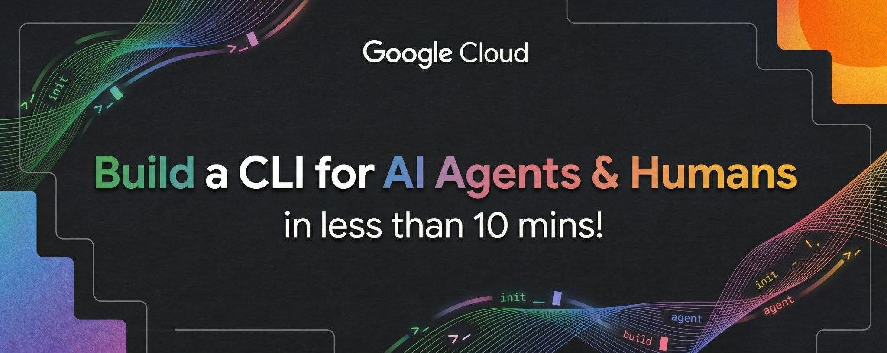
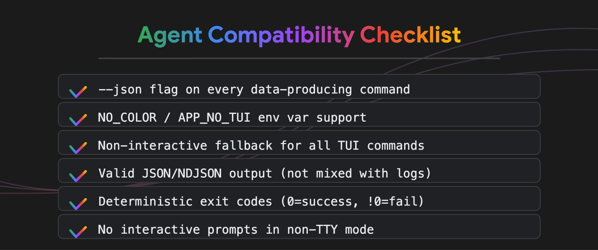
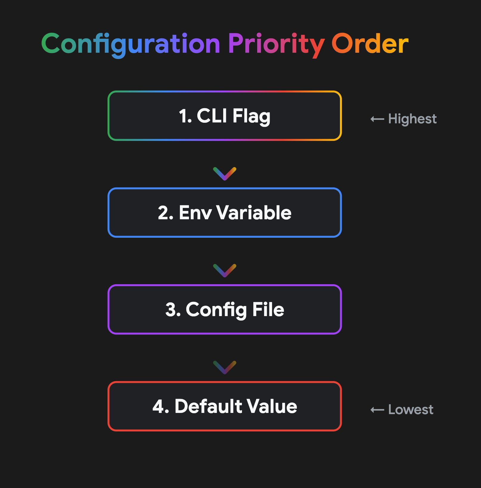
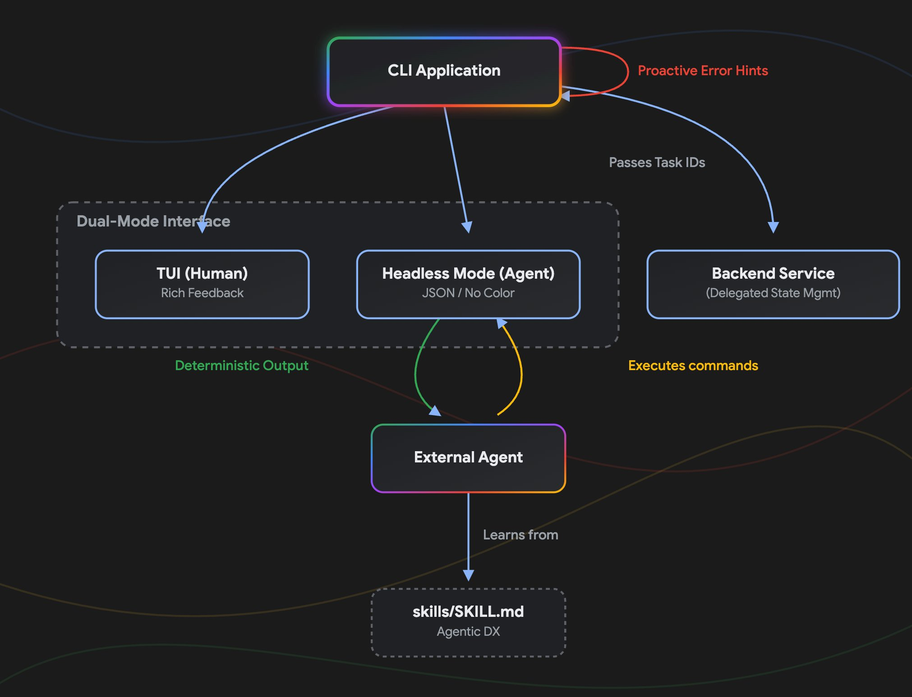
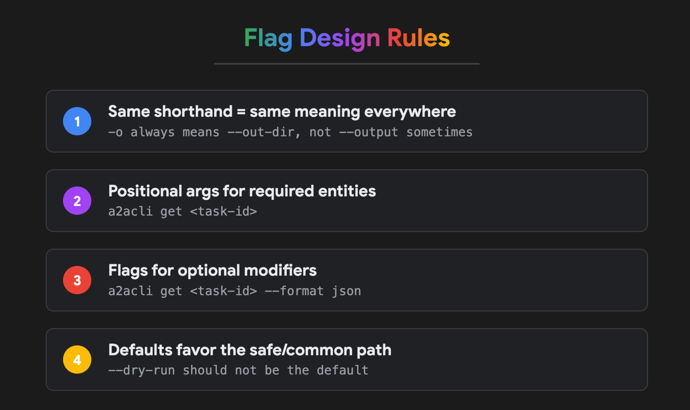
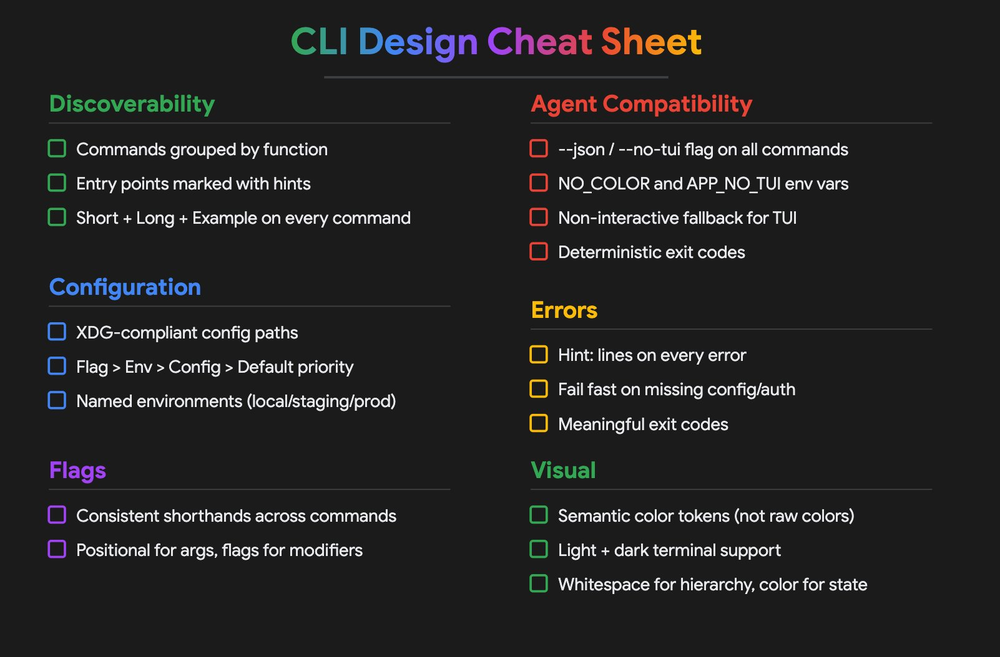

# 在 10 分钟内为 AI 代理和人类构建 CLI

> **原文**: [Build a CLI for AI agents & humans in less than 10 mins](https://x.com/googlecloudtech/status/2038778093104779537)  
> **作者**: Google Cloud Tech (@ghchinoy, @Saboo_Shubham_, Zack Akil)  
> **发布时间**: 2026 年 3 月 31 日  
> **翻译**: Andy (AI 助理)



---

## 核心观点

**今年发布的每一个 CLI 工具在某个时刻都会被 AI 代理调用。但大多数 CLI 还没有为此做好准备。**

那些已成为 CLI 设计标准假设的交互式提示、彩色输出和终端 UI，在自动化代理尝试解析结果的那一刻就会失效。但剥离这些功能又会让人类用户的 CLI 体验变差。

要解决这个问题，你不需要在两者之间做出选择。你可以将 CLI 设计为同时服务两者。



---

## 为人类和 AI 代理设计

核心哲学很简单：**将数据与展示分离**。

当代理或脚本调用你的 CLI 时，它需要原始的、结构化的数据（如 JSON）。当人类调用它时，他们需要将这些数据渲染成可读的、交互式的格式（如 TUI）。通过将 CLI 的内部逻辑视为一个发出数据的引擎——而终端 UI 只是其中一个可能的"客户端"——你可以无缝地服务两者。

同一个 `watch` 命令应该给人类提供实时更新的 TUI，给代理提供 NDJSON 事件流：

```bash
# 人类获得交互式 TUI
a2acli watch --task abc123

# 代理获得结构化 NDJSON
a2acli watch --task abc123 --no-tui
```

无需维护两个独立的代码库即可实现这种无缝的双受众体验。相反，采用以下精心设计模式，让你的 CLI 对机器可预测，同时让人类愉悦：

---

## 1. 结构化可发现性

CLI 的入口点应该清晰地映射其功能。代理和人类都从 `--help` 开始。

**按功能分组命令，而不是按字母顺序。** 像 `Task Management`、`Information`、`Configuration` 这样的类别可以防止根帮助输出中出现文字墙。

**明确标记入口点。** 在帮助描述中添加 `(start here)` 或 `(typical first step)` 等提示。代理使用这些提示来决定首先调用哪个命令。

**为每个命令填充三个字段：**
- **简短** (快速浏览): 一行摘要，5-10 个字，以动作动词开头
- **详细** (深入理解): 命令做什么、为什么使用、与类似命令的区别
- **示例** (立即可用): 3-5 个具体的可复制粘贴示例

**示例比描述更重要。** 开发者会在阅读之前复制粘贴。代理会解析示例来推断标志模式。

```
Task Management:
  send        Send a message to start or continue a task (start here)
  watch       Subscribe to live updates for a running task
  get         Retrieve the current state of a task

Discovery:
  describe    Inspect an agent's identity, skills, and capabilities
```



**外部化代理指令**

可发现性不仅限于 `--help`。不要假设 LLM 天生知道如何使用你的工具——明确地教它。

在仓库根目录提供 `AGENTS.md` 文件，定义参与规则、默认工作流和 AI 开发者的架构标准。对于复杂命令，包含 `skills/` 目录，其中包含外部代理可以直接使用的专用提示文件。

---

## 2. 代理优先的互操作性

要让代理可用，CLI 必须是可解析和可预测的。

### 所有命令都支持 `--json`

每个产生数据的命令都应该支持 `--json` 或 `--no-tui` 标志。输出应该是有效的 JSON 或 NDJSON。

**如果代理无法解析你的输出，你的 CLI 在代理世界中就不存在。**

### 自动检测受众

支持 `NO_COLOR` 和 `[APP]_NO_TUI` 环境变量。当这些被设置，或者 stdout 被管道时，完全跳过交互元素。没有提示、没有旋转器、没有颜色代码。

### 非交互式回退

使用 TUI（如 Bubble Tea）的命令应该有一个纯文本模式，向 stdout 发出标准文本或 JSON。TUI 是人类界面。JSON 输出是代理界面。同一个命令，两个渲染器。



### 保护上下文窗口

代理有严格的 token 限制。主动截断大量文本，并在默认输出中屏蔽敏感密钥，这样你就不会压倒代理的上下文窗口或将 API 密钥泄露到对话日志中。如果代理确实需要原始的、未过滤的有效负载，需要明确的标志如 `--full` 或 `--verbose`。

### 预处理和排序数据

代理不应该编写复杂的数据操作逻辑来查找重要内容。自动预排序 CLI 输出，使最关键、可操作的项目（例如严重漏洞、未受限制的密钥、待处理任务）始终出现在响应的最顶部。

### 委托状态管理

不要将代理困在 CLI 进程中的交互式状态循环中。通过使用引用标识符（如 `--task <ID>`）保持 CLI 完全无状态。让后端服务维护长期运行的 token 上下文和对话历史，而 CLI 仅作为快速传输机制。



---

## 3. 配置和上下文

CLI 应该理解其环境，而无需在每次调用时需要过多的标志。

配置文件放在 `~/.config/app/config.yaml`。不要在家目录中使用点文件。

### 环境变量作为默认值

每个配置选项都应该有环境变量覆盖。这使得代理能够在不修改文件的情况下注入上下文。

```bash
export A2A_DEFAULT_MODEL=claude-sonnet-4
a2acli send "Hello"  # 使用环境变量默认值
```

### 项目本地覆盖

支持本地 `.a2a/config.yaml` 用于特定于项目的设置。在多个项目之间工作的代理需要这种隔离。

---

## 4. 错误处理和退出码

### 机器可读的错误

每个错误都应该包括：
- 错误代码（用于程序化处理）
- 人类可读的消息
- 建议的修复或下一步
- 文档链接

```json
{
  "error": {
    "code": "TASK_NOT_FOUND",
    "message": "No task found with ID 'abc123'",
    "suggestion": "Run 'a2acli list' to see available tasks",
    "docs": "https://docs.example.com/errors/TASK_NOT_FOUND"
  }
}
```



### 一致的退出码

遵循 UNIX 约定：
- `0` = 成功
- `1` = 一般错误
- `2` = shell 内置命令误用
- `126` = 命令无法执行
- `127` = "command not found"

---

## 5. 针对代理的测试

### 包含代理集成测试

你的测试套件应该包括 LLM 代理调用你的 CLI 的场景。使用 LangChain 的测试框架等工具或模拟代理行为的自定义提示。

### 监控真实的代理使用情况

添加遥测（选择加入）以了解代理如何实际使用你的 CLI。哪些命令？哪些标志？在哪里失败？

---

## 快速开始：10 分钟重构

已有 CLI？以下是如何在 10 分钟内使其准备好代理：

| 步骤 | 时间 | 操作 |
|------|------|------|
| 1. 添加 `--json` 标志 | 2 分钟 | 包装输出格式化器以支持 JSON |
| 2. 添加 `--no-tui` 标志 | 2 分钟 | 设置时禁用交互元素 |
| 3. 检查管道输出 | 1 分钟 | `if not sys.stdout.isatty(): disable_colors()` |
| 4. 添加错误代码 | 3 分钟 | 枚举错误条件 |
| 5. 更新 `--help` | 2 分钟 | 添加示例并对命令分类 |

---

## 收益

从一开始就为代理设计，你将获得：

- **更好的自动化**: 代理可以真正使用你的工具
- **更好的人类用户体验**: 帮助代理的相同模式（清晰的结构、良好的默认值、一致的错误）也帮助人类
- **面向未来**: 随着 AI 使用的增长，你的 CLI 已准备就绪

**CLI 没有死。它正在进化。** 2026 年最好的 CLI 将是那些流利地说人类语言和机器语言的工具。

---

*本文由 Andy (AI 助理) 翻译整理 | 原文来自 Google Cloud Tech*
*作者：@ghchinoy, @Saboo_Shubham_, Zack Akil*

## 媒体资源

本文包含以下图片资源：

| 图片 | 描述 | 文件 |
|------|------|------|
| 封面图 | 文章标题图 | `article_cover.jpg` |
| 插图 1 | 设计哲学：数据与展示分离 | `illustration_1.jpg` |
| 插图 2 | 结构化可发现性示例 | `illustration_2.jpg` |
| 插图 3 | TUI 与 JSON 输出对比 | `illustration_3.jpg` |
| 插图 4 | 状态管理架构 | `illustration_4.jpg` |
| 插图 5 | 错误处理示例 | `illustration_5.jpg` |
